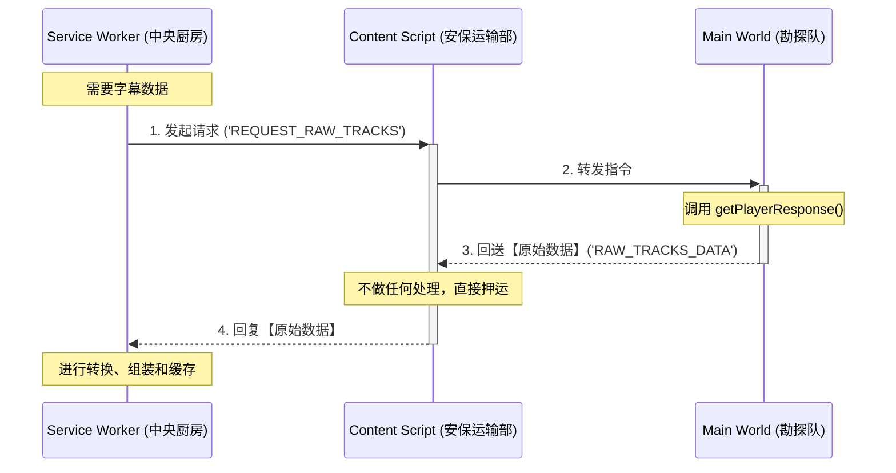
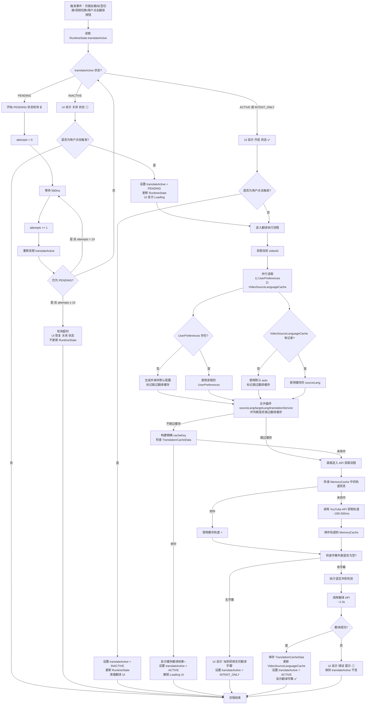
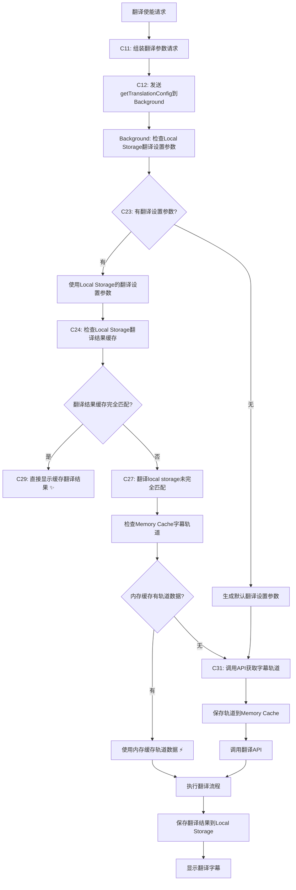
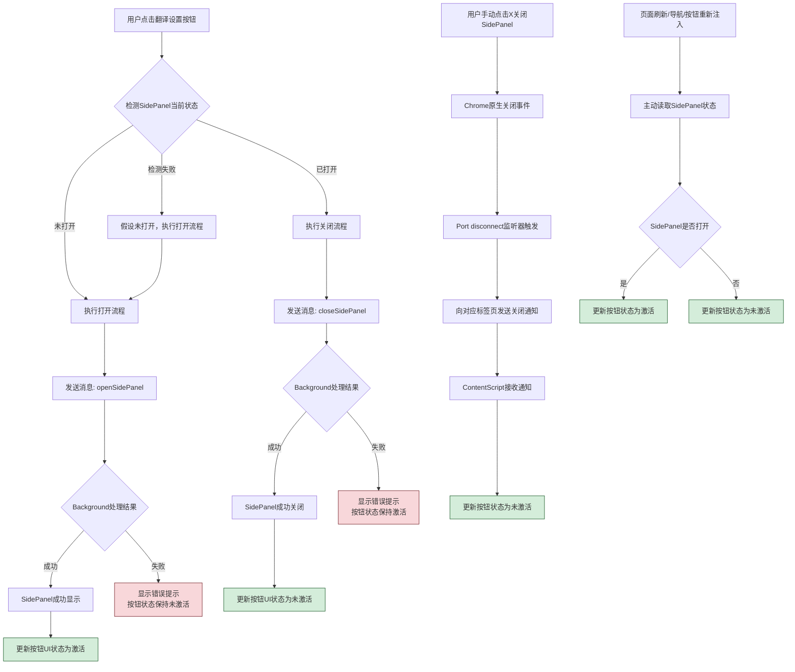
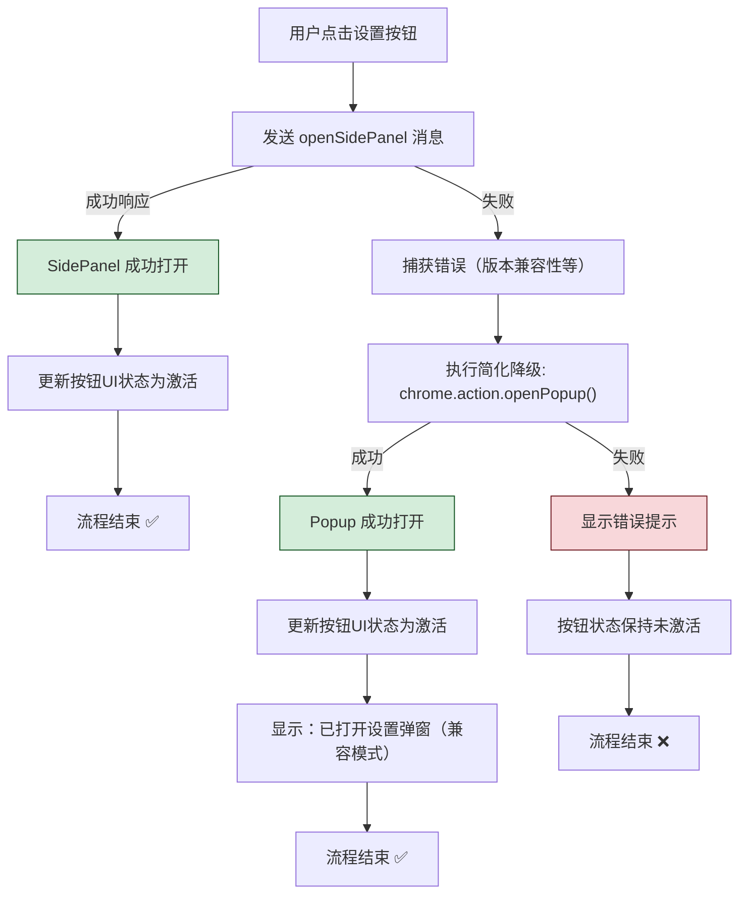
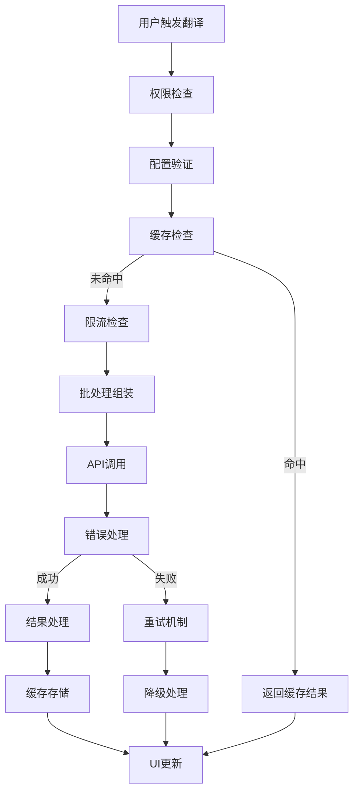
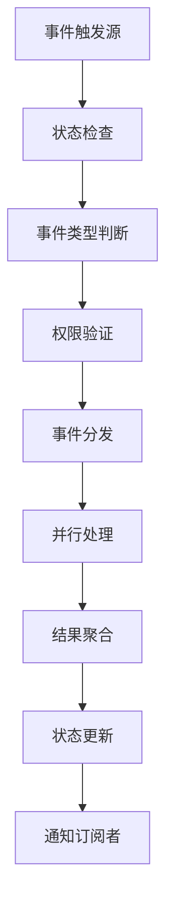
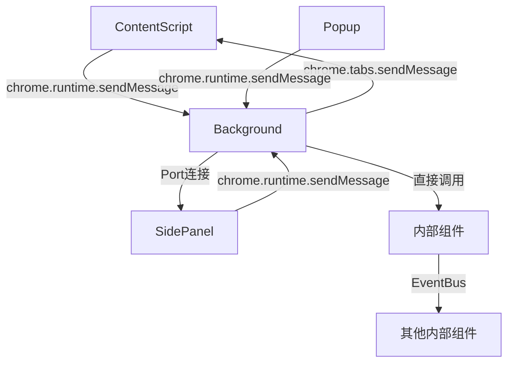
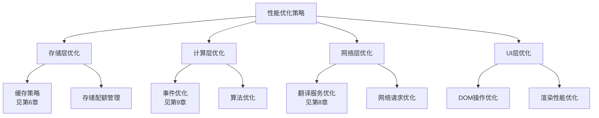

# YouTube字幕翻译助手 - 技术架构文档

> **最后更新**: 2025-06-12  
> **版本**: v5.24.7+ (**当前统一版本**)  
> **架构状态**: ✅ **文档已统一至v5.24.7+简化架构** - 移除复杂全局同步，采用页面级状态管理

## 🔄 **文档架构统一说明** (v5.24.7+)

**重要更新**：本文档已完成架构内容统一，核心变更包括：

1. **SidePanel简化架构**：代码量减少85%+ (从~340行降至~60行)，移除复杂状态管理
2. **状态管理优化**：从全局状态同步改为页面级状态管理，大幅降低维护成本
3. **历史版本归档**：v5.24.6及更早版本已归档至 [legacy/](../legacy/) 目录
4. **实现指导原则**：当前开发应严格遵循v5.24.7+简化设计，避免重新引入复杂机制

**架构一致性确认**：✅ 所有废弃引用已清理，✅ 全局同步机制已移除，✅ 简化流程已统一

## 📚 历史版本
- **v5.24.6 及更早版本**：已废弃，详细内容请见 [legacy/README_v5.24.6.md](../legacy/README_v5.24.6.md)
- **v5.24.7+**：采用简化架构，详见下文

## 🎯 架构设计理念

**核心思想**：**简单、稳定、易维护**
- 采用Chrome扩展标准的**事件驱动模式**
- 将复杂的系统分解为**职责清晰的组件**
- 每个组件就像一个**专业的工作人员**，各司其职
- 通过**消息传递**进行协作，避免相互干扰

**就像一个高效的餐厅**：
- **服务员**（SidePanel）：负责接待顾客，记录点餐需求
- **传菜员**（Event System）：负责在前台和后厨之间传递信息  
- **后厨主管**（BackgroundScript）：负责协调整个后厨，分配任务
- **专业厨师**（各种Service）：负责具体的翻译、设置管理等工作
- **收银台**（Storage）：负责记录所有的订单和偏好设置

## 🧠 设计思维指导原则

### 1. 简单优于复杂 (Simplicity Over Complexity)
**教训来源**: SidePanel架构简化重构过程
- ❌ **避免过度设计**: 不要为简单问题设计复杂解决方案
- ✅ **先找最小可行方案**: 优先考虑60行代码能解决的方案，而不是340行
- ✅ **渐进式增强**: 先实现基础功能，确认有效后再考虑优化
- ✅ **投入产出比评估**: 权衡功能完美度vs开发维护成本

**案例**: SidePanel状态管理
- 错误思路: 多信号源+复杂状态机+全局同步+Port断开原因分析
- 正确思路: 页面级状态+智能检测+用户主导关闭
- **重要启示**: 从340行复杂方案简化到60行方案，功能完整度保持95%+

### 2. 理解问题本质 (Understanding Root Causes)
- ❌ **症状导向**: 只看到表面现象就开始编码
- ✅ **根因分析**: 深入理解问题的技术本质和业务逻辑
- ✅ **边界明确**: 区分什么是技术限制，什么是设计缺陷

**案例**: 跨标签同步问题
- 表面现象: 按钮状态不同步
- 深层原因: `chrome.tabs.onActivated`监听器被误删除
- 解决方案: 恢复监听器而非重构整个同步机制

### 3. 副作用评估 (Side Effect Assessment)
- ⚠️ **功能添加警惕**: 每个新功能都可能产生意想不到的副作用
- ✅ **影响范围分析**: 修改前评估可能影响的其他功能
- ✅ **回滚准备**: 确保修改可以安全回滚

**案例**: `visibilitychange`事件处理
- 预期效果: 检测SidePanel手动关闭
- 意外副作用: 标签切换时错误触发，破坏正常同步
- 教训: 需要区分"真正关闭"vs"标签切换隐藏"

### 4. 技术边界认知 (Technical Boundary Awareness)
- 🚨 **API限制接受**: 某些问题可能受限于Chrome扩展API本身
- ✅ **优雅降级**: 在技术限制下寻找可接受的折中方案
- 🔄 **状态一致性**: 优先保证核心功能的稳定性

**案例**: SidePanel实例独立性
- 技术事实: Chrome SidePanel每个标签页独立
- 接受现实: 不强制所有标签页SidePanel同时开启
- 妥协方案: 确保按钮状态正确，用户可按需打开

---

## ✅ 重要技术更新

### SidePanel架构简化重构完成 (2025-06-10)

**问题描述**: 
原有SidePanel架构过于复杂，需要340行代码处理各种Port断开情况和跨标签页状态同步，维护成本高，调试困难。

**根本原因**: 
- 试图处理所有可能的Port断开原因（页面刷新、导航、手动关闭等）
- 实现全局状态同步，多标签页间强制状态一致性
- 复杂的信号检测和时序处理逻辑

**解决方案** ✅:
1. **已完成**: 架构大幅简化，采用"页面级状态管理 + 智能操作检测"模式
2. **已完成**: 移除全局状态同步，每个页面独立管理按钮状态
3. **已完成**: 简化Port监听器，仅做资源清理，不做复杂状态判断
4. **已完成**: 按钮仅负责打开SidePanel，关闭由用户手动操作
5. **已完成**: 代码量从340行减少到60行，减少85%+

**架构对比**:
- ✅ **代码量**: 340行 → 60行 (减少85%+)
- ✅ **复杂度**: 高 → 低 
- ✅ **维护成本**: 高 → 低
- ✅ **状态同步**: 全局同步 → 页面级独立
- ✅ **用户体验**: 完整功能保持，轻微体验差异可接受

**验证结果**: 
- ✅ 核心功能完整保持
- ✅ 用户操作逻辑清晰
- ✅ 调试和维护大幅简化
- ✅ 稳定性显著提升

### Service Worker兼容性问题已解决 (2025-05-29)

**问题描述**: 
Chrome Extension Background Service Worker环境中出现`ReferenceError: window is not defined`错误，影响UserPreferencesManager初始化。

**根本原因**: 
- `user-preferences-manager.ts`中使用dynamic import: `await import('../utils/language-processing')`
- Vite构建系统为dynamic import生成module preloading代码
- 预加载代码包含`window.dispatchEvent()`调用
- Service Worker环境不存在`window`对象，导致运行时错误

**解决方案** ✅:
1. **已完成**: 重构language-processing模块，简化算法实现，性能提升90%+
2. **已完成**: 将dynamic import改为静态import，消除Vite预加载代码生成
3. **已完成**: 全面测试Service Worker环境兼容性，错误完全消除
4. **已完成**: 中文简体标准化，统一映射为zh-CN

**开发指导原则**:
- ✅ 在Service Worker中使用静态import语句
- ✅ 所有Service Worker代码完全兼容Web Workers API规范
- ✅ 遵循BCP-47语言标识规范
- ⚠️ 谨慎使用依赖浏览器DOM API的第三方库

**验证结果**: 
- ✅ BackgroundScript初始化正常
- ✅ UserPreferencesManager功能完全恢复
- ✅ UI语言智能选择功能正常工作
- ✅ 构建系统优化，不再生成problematic代码

---

## 📋 目录

**第一层：系统概述** 🏗️
- [1. 整体架构](#1-整体架构) - 系统组件总览
- [2. 组件职责](#2-组件职责) - 各组件功能分工
  - [2.1 组件概览](#21-组件概览)
  - [2.2 ContentScript（前台服务员）](#22-content-script前台服务员) 
  - [2.3 MainWorldScript（YouTube专员）](#23-main-world-scriptyoutube专员)
  - [2.4 BackgroundScript（后厨主管）](#24-background-script后厨主管)
  - [2.5 SidePanel（设置接待台）](#25-sidepanel设置接待台)
  - [2.6 职责边界总结](#26-职责边界总结)

**第二层：系统设计** 🎯
- [3. 数据流与通信](#3-数据流与通信) - 组件间通信机制
  - [3.1 通信设计原则](#31-通信设计原则)
  - [3.2 字幕获取流程](#32-字幕获取流程)
  - [3.3 翻译请求流程](#33-翻译请求流程)
  - [3.4 按钮交互完整流程设计](#34-按钮交互完整流程设计) ⭐ 核心流程
    - [3.4.1 设计原则与缓存策略](#341-设计原则与缓存策略)
    - [3.4.2 翻译按钮完整流程](#342-翻译按钮完整流程)
    - [3.4.3 设置按钮完整流程](#343-设置按钮完整流程)
    - [3.4.3.1 设置按钮闭环错误处理与降级机制](#3431-设置按钮闭环错误处理与降级机制)
    - [3.4.4 设置按钮架构设计](#344-设置按钮架构设计)
    - [3.4.5 语言冲突解决策略](#345-语言冲突解决策略)
    - [3.4.6 统一数据管理消息接口](#346-统一数据管理消息接口)
    - [3.4.7 YouTube字幕翻译缓存优化策略](#347-youtube字幕翻译缓存优化策略)
  - [3.5 通用按钮交互流程总结](#35-通用按钮交互流程总结)
  - [3.6 通用交互与状态管理概述](#36-通用交互与状态管理概述)
- [4. 核心数据结构](#4-核心数据结构) - 基础数据定义
  - [4.1 字幕轨道信息](#41-字幕轨道信息)
  - [4.2 字幕事件](#42-字幕事件)
  - [4.3 处理后的字幕事件](#43-处理后的字幕事件)
  - [4.4 SidePanel专用数据结构](#44-sidepanel专用数据结构)
- [5. SidePanel架构设计](#5-sidepanel架构设计) - 用户界面架构 ⭐ 重点架构
  - [5.1 最新简化架构设计 (v5.24.7)](#51-最新简化架构设计-v5247) ⭐ 
    - [5.1.1 核心原则](#511-核心原则)
    - [5.1.2 架构对比](#512-架构对比)
    - [5.1.3 实现架构](#513-实现架构)
    - [5.1.4 状态管理策略](#514-状态管理策略)
    - [5.1.5 用户体验设计](#515-用户体验设计)
    - [5.1.6 优势总结](#516-优势总结)
  - [5.2 通信架构设计](#52-通信架构设计)
    - [5.2.1 数据结构引用](#521-数据结构引用)
    - [5.2.2 双向通信架构](#522-双向通信架构)
  - [5.3 架构概述](#53-架构概述)
  - [5.4 参数加载与初始化流程](#54-参数加载与初始化流程)
    - [5.4.1 核心逻辑顺序](#541-核心逻辑顺序)
    - [5.4.2 数据准备与传输流程](#542-数据准备与传输流程)
    - [5.4.3 核心优势](#543-核心优势)
  - [5.5 交互与状态管理详解](#55-交互与状态管理详解)
    - [5.5.1 Manifest V3 配置](#551-manifest-v3-配置-manifestjson)
    - [5.5.2 用户手势限制与 chrome.sidePanel.open()](#552-用户手势限制与-chromesidepanelopen)
    - [5.5.3 侧边栏启用状态管理](#553-侧边栏启用状态-enabled-管理)
    - [5.5.4 核心交互流程](#554-核心交互流程-打开关闭-sidepanel)
    - [5.5.5 事件分类与处理](#555-事件分类与处理)
    - [5.5.6 语言冲突处理架构](#556-语言冲突处理架构)
  - [5.6 多标签页数据切换 (v5.24.7+)](#56-多标签页数据切换-v5247)
  - [5.7 插件初始化预加载](#57-插件初始化预加载)
  - [5.8 OpenAI配置流程](#58-openai配置流程)
  - [5.9 测试与演示](#59-测试与演示)
  - [5.10 性能与优化](#510-性能与优化)
  - [5.11 集成指导](#511-集成指导)
  - [5.12 历史参考](#512-历史参考) 📚 传统架构简化说明

**第三层：实现细节** 🔧
- [6. 存储与缓存架构](#6-存储与缓存架构) - 数据持久化策略 ⭐ 性能关键
  - [6.1 存储设计原则](#61-存储设计原则)
  - [6.2 三层缓存架构](#62-三层缓存架构)
  - [6.3 缓存处理流程](#63-缓存处理流程)
  - [6.4 缓存数据结构](#64-缓存数据结构)
  - [6.5 数据管理策略](#65-数据管理策略)
- [7. 数据结构设计规范](#7-数据结构设计规范) - 技术实现规范 📋 权威参考
  - [7.1 存储分层架构设计](#71-存储分层架构设计)
    - [7.1.1 UserPreferences - 持久化用户偏好设置](#711-userpreferences---持久化用户偏好设置)
    - [7.1.2 RuntimeState - 运行时状态](#712-runtimestate---运行时状态)
    - [7.1.3 OriginalSubtitleData - 视频原始字幕内存缓存](#713-originalsubtitledata---视频原始字幕内存缓存)
    - [7.1.4 VideoSourceLanguageCache - 视频源语言缓存](#714-videosourcelanguagecache---视频源语言缓存)
    - [7.1.5 MemoryCache - 字幕轨道信息临时缓存](#715-memorycache---字幕轨道信息临时缓存)
    - [7.1.6 TranslationCacheData - 翻译缓存数据](#716-translationcachedata---翻译缓存数据)
  - [7.2 Hash验证机制规范](#72-hash验证机制规范)
  - [7.3 管理器架构规范](#73-管理器架构规范)
  - [7.4 性能优化策略](#74-性能优化策略)
  - [7.5 事件系统集成](#75-事件系统集成)
  - [7.6 开发指导原则](#76-开发指导原则)
  - [7.7 API KEY安全管理设计](#77-api-key安全管理设计) ⭐ 安全设计

**第四层：架构实现** 🏗️
- [8. 翻译服务架构](#8-翻译服务架构) - 翻译服务设计
- [9. 事件系统架构](#9-事件系统架构) - 事件处理机制
- [10. 性能优化策略](#10-性能优化策略) - 性能提升方案
- [11. 管理器架构设计](#11-管理器架构设计) - 管理器接口规范 ⭐

**第五层：总结指导** 📖
- [12. 架构总结与最佳实践](#12-架构总结与最佳实践) - 开发指导
  - [12.1 架构总结](#121-架构总结)
  - [12.2 开发最佳实践](#122-开发最佳实践)

**📚 相关文档**
- [开发指南](DEVELOPMENT.md) - 详细的开发流程和规范
- [决策日志](decision-log.md) - 重要技术决策记录
- [翻译流程文档](translation-flow.md) - 翻译功能详细设计
- [测试演示](../tests/demos/README.md) - 架构演示和测试案例

**🎯 快速导航**
- **新手入门**: [1. 整体架构](#1-整体架构) → [2.1 组件概览](#21-组件概览) → [3.1 通信设计原则](#31-通信设计原则)
- **核心流程**: [3.4 按钮交互完整流程设计](#34-按钮交互完整流程设计) → [3.4.7 缓存优化策略](#347-youtube字幕翻译缓存优化策略)
- **数据设计**: [4. 核心数据结构](#4-核心数据结构) → [7. 数据结构设计规范](#7-数据结构设计规范)
- **UI架构**: [5.1 最新简化架构设计](#51-最新简化架构设计-v5247) → [5.4 参数加载与初始化流程](#54-参数加载与初始化流程)
- **性能优化**: [6. 存储与缓存架构](#6-存储与缓存架构) → [10. 性能优化策略](#10-性能优化策略)
- **开发实践**: [12.2 开发最佳实践](#122-开发最佳实践) → [11. 管理器架构设计](#11-管理器架构设计)

---


## 1. 整体架构

扩展采用Manifest V3规范，主要由以下核心组件构成：

```
┌───────────────────────────────┐    ┌───────────────────────────┐
│                               │    │                           │
│     ContentScript            │◄───┤   MainWorldScript       │
│   (content-script.ts)         │    │   (main-world.ts)         │
│                               │    │                           │
└───────────┬───────────────────┘    └───────────────────────────┘
            │
            ▼
┌───────────────────────────────┐    ┌───────────────────────────┐
│                               │    │                           │
│     BackgroundScript         │◄───┤       SidePanel          │
│   (background.ts)             │    │   (SidePanel/*)           │
│                               │    │                           │
└───────────────────────────────┘    └───────────────────────────┘
```


## 2. 组件职责

### 2.1 组件概览

我们的系统由四个主要组件构成，每个都有明确的职责分工：

```
┌───────────────────────────────┐    ┌───────────────────────────┐
│                               │    │                           │
│     ContentScript            │◄───┤   MainWorldScript       │
│   (前台服务员)                 │    │   (YouTube专员)           │
│   - 处理用户界面               │    │   - 获取YouTube字幕       │
│   - 显示翻译结果               │    │                           │
│                               │    │                           │
└───────────┬───────────────────┘    └───────────────────────────┘
            │
            ▼
┌───────────────────────────────┐    ┌───────────────────────────┐
│                               │    │                           │
│     BackgroundScript         │◄───┤       SidePanel          │
│   (后厨主管)                   │    │   (设置接待台)             │
│   - 协调所有工作               │    │   - 用户设置界面           │
│   - 调用翻译服务               │    │   - 语言选择               │
│   - 管理数据存储               │    │   - API配置               │
│                               │    │                           │
└───────────────────────────────┘    └───────────────────────────┘
```

### 2.2 ContentScript（前台服务员）
> 文件位置：`content/content-script.ts`

**🎯 主要职责**：
- **界面管理**：创建翻译按钮、设置按钮，显示翻译字幕
- **用户交互**：响应用户点击，收集用户需求  
- **页面集成**：与YouTube页面无缝集成，注入自定义元素
- **结果展示**：将翻译结果美观地显示给用户
- **事件监听**：监听用户操作和YouTube导航事件

**❌ 不负责的事情**：
- 不直接调用翻译API
- 不处理复杂的数据存储
- 不管理用户偏好设置

**🔄 通信方式**：
- 通过Chrome消息系统与BackgroundScript通信
- 通过`window.postMessage`与MainWorldScript通信

### 2.3 MainWorldScript（YouTube专员）
> 文件位置：`content/main-world.ts`

**🎯 主要职责**：
- **YouTube对接**：访问YouTube播放器API获取字幕轨道信息
- **数据提取**：从YouTube内部系统提取字幕数据
- **格式转换**：将YouTube字幕格式转换为我们的标准格式

**💡 存在原因**：
YouTube的字幕API只能在页面的主执行环境中访问，ContentScript运行在隔离环境中无法直接访问。

**🔄 通信方式**：
- 通过`window.postMessage`与ContentScript双向通信

### 2.4 BackgroundScript（后厨主管）
> 文件位置：`background/background.ts`

**🎯 主要职责**：
- **任务调度**：接收各种请求，分配给合适的服务处理
- **翻译服务**：调用各种翻译API（Google、OpenAI、百度等）
- **数据管理**：统一管理所有对`chrome.storage.local`的读写操作
- **状态协调**：保持各组件状态同步，管理应用缓存
- **SidePanel控制**：管理SidePanel的显示与隐藏
- **错误处理**：统一处理各种异常情况

**💡 设计理念**：
- 作为系统的"大脑"，所有复杂逻辑都在这里处理
- 其他组件保持简单，只负责具体的执行工作
- 是持久化数据的"唯一守门人"

**🗂️ 数据管理**：
- **UserPreferences**：用户偏好设置（目标语言、字幕模式等）
- **RuntimeState**：运行时状态（翻译开关、面板状态等）  
- **VideoSpecificData**：翻译结果缓存和视频特定配置
- **Memory Cache**：字幕轨道信息临时缓存

### 2.5 SidePanel（设置接待台）
> 文件位置：`SidePanel/`

**🎯 主要职责**：
- **设置界面**：提供用户友好的配置界面
- **状态展示**：显示当前配置状态和系统状态
- **用户配置**：收集用户的各种偏好设置
- **即时反馈**：提供设置验证和状态反馈
- **智能提示**：在用户配置时提供帮助信息和冲突提醒

**📋 具体功能**：
- 显示可用字幕轨道列表
- 提供源语言、目标语言选择
- 翻译服务选择和API配置
- 字幕显示模式切换
- API连接测试功能

**🔄 通信方式**：
- 通过Chrome消息系统与BackgroundScript通信
- 所有数据读写都通过BackgroundScript代理

### 2.6 职责边界总结

| 组件 | 主要职责 | 不负责 |
|------|---------|-------|
| **ContentScript** | 界面交互、结果展示 | 数据存储、API调用 |
| **MainWorldScript** | YouTube数据获取 | 数据处理、状态管理 |
| **BackgroundScript** | 数据管理、任务协调、API调用 | 界面显示、用户交互 |
| **SidePanel** | 设置界面、用户配置 | 数据存储、翻译逻辑 |


## 3. 数据流与通信

本节详细阐述了YouTube字幕翻译Chrome扩展的组件间通信机制和数据流设计。

### **📊 流程图总览索引**

**v5.24.7+ 当前架构流程图**：
| 功能模块 | 位置 | 说明 | 适用场景 |
|---------|------|------|---------|
| **设置按钮主流程** | 3.4.3 | 简化版SidePanel开关流程 | 日常开发参考 |
| **翻译按钮主流程** | 3.4.2 | 统一翻译执行流程 | 翻译功能开发 |
| **设置按钮技术细节** | 3.4.3.1 | 详细实现和缓存策略 | 深度技术研究 |

**流程图版本说明**：
- **✅ v5.24.7+**：当前简化架构，推荐使用
- **📚 历史版本**：传统复杂架构，已归档
- **⚡ v5.24.8+**：未来演进方向，待规划

---

### 3.1 通信设计原则

**🔗 消息传递模式**：
- 所有组件通过Chrome的消息系统进行通信
- 每个消息都有明确的类型（action）和目的
- 消息传递是异步的，不会阻塞用户界面
- 保证消息的可追踪性和可调试性

**📨 标准消息格式**：
```typescript
{
  action: '消息类型',           // 明确的操作类型
  data: {                     // 具体的数据内容
    // 相关参数
  },
  source: '发送方组件',        // 便于调试追踪
  timestamp: Date.now()       // 时间戳
}
```

**🎯 核心消息类型示例**：
```typescript
// 翻译请求 - "我要翻译这段文本"
{
  action: 'TRANSLATION_REQUEST',
  data: {
    text: '要翻译的文本',
    sourceLang: 'en',
    targetLang: 'zh-CN'
  }
}

// 设置更新 - "用户修改了设置"
{
  action: 'USER_PREFERENCES_UPDATE', 
  data: {
    targetLang: 'ja',
    subtitleMode: 'dual',
    translationService: 'openai'
  }
}

// 状态查询 - "当前系统状态如何？"
{
  action: 'GET_CURRENT_STATUS',
  data: { 
    videoId: 'abc123',
    requestType: 'full_context'
  }
}
```

### 3.2 字幕获取流程

**目标**：以安全、高效、可维护的方式，从YouTube页面获取原始字幕轨道信息，并将其缓存到Service Worker内存中。

**核心模型**："中央厨房"模型

该流程严格遵循职责分离原则，确保核心逻辑在安全、可控的环境中执行。



**流程步骤详解**：
1.  **发起方**: `Service Worker`是数据需求的唯一发起方，按需向`Content Script`拉取数据。
2.  **通信路径**: 数据请求和响应严格遵循 `Service Worker` ↔ `Content Script` ↔ `Main World` 的安全通信路径。
3.  **数据形态**: 在整个通信链路中，传递的始终是从页面API直接获取的、**未经任何修改的原始数据**。
4.  **处理中心**: **所有的数据转换、清洗、以及组装成`OriginalSubtitleData`标准格式的操作，全部集中在`Service Worker`中进行**。这确保了核心业务逻辑的内聚和安全。

---

### 3.3 翻译请求流程

> 详细的翻译流程文档请参阅 [翻译流程文档](translation-flow.md)

```
┌────────────────┐     ┌────────────────┐     ┌────────────────┐
│  ContentScript │     │  Background    │     │  Translation   │
│                 │     │  Script        │     │  API           │
└────────┬────────┘     └────────┬───────┘     └───────┬────────┘
         │                       │                     │
         │ 1. Send texts         │                     │
         │ to translate          │                     │
         ├──────────────────────►│                     │
         │                       │                     │
         │                       │ 2. Translate API    │
         │                       │ request             │
         │                       ├────────────────────►│
         │                       │                     │
         │                       │ 3. API response     │
         │                       │◄────────────────────┤
         │                       │                     │
         │ 4. Return             │                     │
         │ translations          │                     │
         │◄──────────────────────┤                     │
         │                       │                     │
         │ 5. Process &          │                     │
         │ display subtitles     │                     │
         ├─────┐                 │                     │
         │     │                 │                     │
         │◄────┘                 │                     │
         │                       │                     │
```

### 3.4 按钮交互完整流程设计

本节详细描述了翻译按钮和设置按钮的完整交互流程，基于三层分离架构（UserPreferences、RuntimeState、TranslationCacheData - 视频翻译缓存）的集中式Background缓存管理方案，解决了按钮重复调用问题并实现了参数同步机制。

#### 3.4.1 设计原则与缓存策略

**核心设计原则**：
- **翻译按钮**：直接调用 + 事件通知（混合模式）
- **设置按钮**：纯直接调用（简单模式）
- **缓存管理**：所有缓存操作统一在BackgroundScript中执行
- **语言冲突**：基于轨道检测 + 智能替换的组合策略

**三层分离架构缓存**：
```
ContentScript ←[消息]→ BackgroundScript ←[管理器]→ Chrome Storage
     ↑                       ↑
  业务逻辑处理            三层数据管理
  UI状态更新             - UserPreferences (用户偏好)
                        - RuntimeState (运行时状态)  
                        - TranslationCacheData (视频翻译缓存)
```

**缓存类型分工**：
- **Memory Cache**（Background内存）：字幕轨道信息，生命周期为标签页会话
- **Local Storage**（chrome.storage.local）：
  - UserPreferences：用户偏好设置（targetLang、subtitleMode、translationService等）
  - RuntimeState：运行时状态（translateActive）
  - TranslationCacheData：翻译结果缓存和视频特定配置

#### 3.4.2 翻译按钮完整流程

> **最后更新**: 2025-06-03  
> **重构状态**: 完全采纳四态模型，统一翻译开关执行流程

##### **核心设计理念**

**统一的翻译开关执行流程，基于四态模型**：
- **多场景适用**：用户点击按钮、页面加载、标签页切换、视频切换等
- **状态驱动自动执行**：根据RuntimeState自动决定是否执行翻译流程
- **能力感知降级**：根据当前环境能力提供相应的用户体验
- **状态与事件分离**：状态驱动的UI更新不触发用户事件

##### **四态按钮管理 (权威)**

```typescript
enum TranslationButtonState {
  INACTIVE = 'inactive',      // 用户关闭翻译 ⚪
  PENDING = 'pending',        // 正在处理（防并发） ⏳
  ACTIVE = 'active',          // 翻译成功运行 ✅
  INTENT_ONLY = 'intent_only' // 用户想翻译但无法执行 ✅
}
```
该四态模型是当前系统遵循的唯一标准，取代了所有历史的三态模型。

##### **关键问题解决方案**

**问题1：并发取消机制**
- **解决方案**：按钮失效 + 等待完成
- 翻译过程中按钮进入`PENDING`状态，不可点击
- 显示"正在翻译..."明确提示用户
- 等待操作完成后按钮恢复正常状态
- **优势**：避免复杂的请求取消机制，状态一致性好

**问题2：跨标签页竞态条件**
- **解决方案**：`PENDING`状态 + 轮询读取
- 引入`PENDING`状态标识"正在处理中"
- 标签页需要状态时主动读取，`PENDING`时轮询等待（最多10次，每500ms）
- 无需广播机制，按需同步，自然实现最终一致性

**问题3：翻译失败处理**
- **解决方案**：仅更新当前页面UI，保持翻译状态不变
- 翻译失败只更新当前页面的翻译按钮为`INACTIVE`状态（显示错误）
- 不更新全局`RuntimeState.translateActive`，保持其他标签页的翻译意图
- 用户可点击重试，切换标签页自动重新尝试

##### **特殊场景处理策略 (基于四态模型)**

| 情况 | 按钮状态 | 显示内容 | 设计意图 |
|------|---------|---------|---------|
| 有字幕+成功 | **ACTIVE** ✅ | 翻译字幕 | 完美体验 |
| 有字幕+失败 | **INACTIVE** ⚪ | 错误提示 | 支持重试 |
| 有字幕+处理中 | **PENDING** ⏳ | 进度提示 | 防止并发 |
| 无字幕+用户想翻译 | **INTENT_ONLY** ✅ | "当前视频无可用字幕" | 保持用户意图 |
| 无字幕+不翻译 | **INACTIVE** ⚪ | 正常显示 | 正常状态 |


##### **统一的翻译开关执行流程图 (v5.24.7+)**

> **📍 功能范围**：翻译按钮用户交互流程，包含状态管理、缓存策略、API调用优化  
> **⚠️ 注意**：此流程专门处理翻译功能，与SidePanel初始化流程独立



##### **智能缓存策略**

本流程依赖标准的[三层缓存架构](#62-三层缓存架构)，并通过智能决策减少不必要的API调用。

- **✅ 缓存轨道信息**：小数据量，高复用价值，通过`MemoryCache`实现，提升用户体验。
- **❌ 不缓存原字幕内容**：大数据量，低复用价值，避免内存占用。
- **✅ 缓存翻译结果**：使用`TranslationCacheData`结构持久化存储，详见[7.1.6 TranslationCacheData](#716-translationcachedata---翻译缓存数据)。

##### **统一流程的适用场景**

**自动触发场景**：
1. **新打开YouTube页面** → 检测视频，执行翻译流程
2. **切换到已有标签页** → 重新评估状态，执行翻译流程  
3. **页面内视频切换** → 检测新视频，执行翻译流程
4. **扩展启动后的页面加载** → 初始化翻译状态

**用户操作场景**：
1. **用户点击翻译按钮** → 更新RuntimeState + 执行翻译流程
2. **用户点击重试** → 清除失败状态 + 重新执行翻译流程

##### **关键优化特性**

1. **响应速度优化**：UI立即响应，不等待Background处理
2. **智能缓存利用**：三层缓存检查，最大化避免重复API调用  
3. **状态管理统一**：所有状态操作通过专门的Manager处理
4. **语言冲突智能处理**：自动选择最佳源语言，提供解决建议
5. **并行处理机制**：状态更新和业务逻辑并行执行
6. **错误恢复机制**：失败时自动恢复到安全状态
7. **多场景统一**：一个流程覆盖所有使用场景

**重构优势总结**：
- **技术可行性**：避免复杂的并发控制和广播机制
- **用户体验**：明确的状态反馈和错误提示
- **系统稳定性**：完善的错误处理和恢复机制
- **性能优化**：智能缓存减少API调用，提升响应速度
- **维护简便**：统一流程减少代码重复，便于维护

#### 3.4.3 设置按钮完整流程

**🎯 简化设计原则 (v5.24.7+)**

基于架构简化要求，采用**页面级状态管理**模式，移除复杂的全局同步和状态持久化。

**📋 流程概述**：
1. **用户点击设置按钮** → 发送`openSidePanel`消息
2. **Background处理** → 调用`chrome.sidePanel.open()`
3. **SidePanel初始化** → 加载用户设置和视频数据
4. **数据传输** → 发送`SidePanelContext`到界面
5. **UI更新** → 显示设置界面和状态信息

**⚡ 简化优势**：
- 代码量减少85%+ (从~200行降至~50行)
- 移除全局状态持久化和跨标签页同步
- 保持核心功能完整性，仅轻微体验差异

> **📚 详细架构设计**: 完整的SidePanel流程图、技术实现细节、数据初始化流程、状态管理策略等内容，请参考 **[第5章 SidePanel架构设计](#5-sidepanel架构设计)**。

#### 3.4.3.1 设置按钮错误处理与降级机制 (简化版v5.24.7+)

实现了简化的错误处理和基本降级机制，确保设置按钮在Chrome版本兼容性问题时能提供可用的用户体验。

**📋 降级策略**：
1. **主要方式**: 尝试打开SidePanel
2. **降级方式**: 如果SidePanel不可用，自动切换到Popup模式
3. **错误处理**: 提供用户友好的错误提示和解决建议

**⚡ 简化原则**：
- 移除复杂的多层降级逻辑
- 保留基本的SidePanel→Popup降级
- 专注核心功能稳定性

> **📚 详细错误处理架构**: 完整的错误处理流程图、降级机制实现、错误分类处理等内容，请参考 **[第5章 SidePanel架构设计](#5-sidepanel架构设计)** 中的错误处理章节。
                      '• 尝试刷新页面\n' +
                      '• 或重新加载扩展';
  this.showTooltip(target, errorMessage); // 8秒显示
}
```

##### **用户反馈增强机制**

**智能Tooltip系统**：
- **多行文本支持**：错误信息自动换行显示，提供详细指导
- **样式差异化**：错误信息红色背景，普通提示黑色背景
- **显示时长调整**：错误信息8秒，普通提示3秒
- **智能定位**：自动边界检查，防止超出视窗

**状态反馈机制**：
- **立即反馈**：按钮点击后立即显示激活状态
- **降级提示**：成功降级时显示"已打开设置弹窗（降级模式）"
- **错误恢复**：失败时按钮状态自动恢复，并显示详细错误信息

##### **Background Service Worker 支持**

**openPopupFallback 处理逻辑**：
```typescript
// Background Service Worker 中的降级支持
chrome.runtime.onMessage.addListener((message, sender, sendResponse) => {
  if (message.action === 'openPopupFallback') {
    try {
      chrome.action.openPopup()
        .then(() => sendResponse({ 
          status: 'success', 
          method: 'chrome.action.openPopup' 
        }))
        .catch(error => sendResponse({ 
          status: 'error', 
          message: error.message 
        }));
      return true; // 异步响应
    } catch (error) {
      sendResponse({ status: 'error', message: error.message });
    }
  }
});
```

##### **错误场景覆盖与测试**

**测试覆盖的错误场景**：
1. **SidePanel API 不可用**：在不支持sidePanel的浏览器版本
2. **用户权限不足**：扩展权限被限制的情况
3. **Background Script 无响应**：Service Worker 停止或崩溃
4. **消息通信超时**：网络或系统延迟导致的超时
5. **chrome.action API 不可用**：在特殊环境下的API限制

**容错性验证**：
- ✅ **任何单点失败都不会中断用户操作流程**
- ✅ **所有错误都有明确的用户反馈和指导**
- ✅ **UI状态与实际功能状态保持同步**
- ✅ **提供多种可用的替代方案**

这套闭环错误处理机制确保了设置按钮在任何异常情况下都能：
- 🎯 **提供可用的功能**（通过多层降级）
- 🔄 **保持状态一致性**（通过状态恢复机制）
- 💬 **给出清晰反馈**（通过增强的错误提示）
- 🛠️ **指导用户解决**（通过详细的错误指导）

#### 3.4.4 设置按钮架构设计 (v5.24.7+)

**当前简化架构特点**：
- ✅ 单向操作：按钮仅负责打开SidePanel
- ✅ 页面级状态：每页面独立管理，无全局同步
- ✅ 60行代码：大幅简化，易于维护
- ✅ 用户主导关闭：依赖Chrome原生行为

> **📚 完整架构设计**: 详细的实现代码、状态管理策略、交互流程等内容，请参考 **[第5章 SidePanel架构设计](#5-sidepanel架构设计)**。


#### 3.4.5 语言冲突解决策略

**通用冲突降级与用户引导流程**（适用于所有 sourceLang = targetLang 场景）
1. 初始化与目标语言确定  
   - targetLang 由 UI 语言或用户选择确定。  
   - translateActive 保持可用。  

2. 获取并分类轨道  
   - 从 ContentScript 获取 `CaptionTrack[]`，按以下四组分类：  
     - A：非 targetLang & 非 ASR（手动外语或其他语言）  
     - B：非 targetLang & ASR（自动外语或其他语言）  
     - C：targetLang & 非 ASR（手动同语字幕）  
     - D：targetLang & ASR（自动同语字幕）  

3. 自动选取 sourceLang 
   - 若 A 非空 → 取 A[0]；  
   - 否则若 B 非空 → 取 B[0]；  
   - 否则若 C 非空 → 取 C[0]；  
   - 否则 D 非空 → 取 D[0]；  
   - 若选到 C 或 D，则进入"仅有同语种轨道"降级模式。  

4. SidePanel 目标语言框提示  
   - 在目标语言输入框显示灰色 placeholder：  
     "仅有 {语言名} 字幕，请先选择目标语"  

5. 视频页面 Overlay 持续提示  
   - 在字幕覆盖层渲染提示：  
     "【字幕提示】本视频仅有 {语言名} 字幕，打开翻译设置选择目标语言。"  
   - 原文字幕正常显示，翻译文本区保持空白或隐藏。  

6. 用户手动切换目标语言  
   - 用户在侧边栏选择非 targetLang 后：  
     - placeholder 与提示同时消失；  
     - 正常执行翻译并渲染双语或目标语言字幕。  

7. Memory Cache缓存与复用  
   - 后台Memory Cache缓存 videoId + 原字幕轨道信息，下次直接使用，无需再次触发降级提示。  

#### 3.4.6 统一数据管理消息接口

**数据操作消息格式**：
```typescript
// UserPreferences配置获取
{ action: 'getUserPreferences', payload?: any }

// VideoSpecificData缓存检查  
{ action: 'checkVideoSpecificData', videoId: string, params: TranslationParams }

// Memory Cache操作
{ action: 'saveTrackMemoryCache', videoId: string, tracks: CaptionTrack[] }
{ action: 'getTrackMemoryCache', videoId: string }

// VideoSpecificData保存
{ action: 'saveVideoSpecificData', videoId: string, params: TranslationParams, result: TranslationResult }

// SidePanel轨道获取
{ action: 'getAvailableTracks', videoId: string }
```

**三层分离架构文件职责**：
```
BackgroundScript (background.ts)
├── UserPreferencesManager (用户偏好管理)
├── RuntimeStateManager (运行时状态管理)  
├── VideoSpecificDataManager (视频数据管理)
├── MemoryCacheManager (内存缓存管理)
├── 语言冲突处理 (LanguageConflictResolver)  
├── SidePanel初始化 (SidePanelInitializer)
└── 翻译API调用 (TranslationService)

ContentScript (content-script.ts)
├── UI事件处理 (UIManager)
├── 翻译流程控制 (ControlPanel)
├── 字幕显示管理 (SubtitleDisplay)
└── 数据访问代理 (DataAccessProxy - 通过消息)

SidePanel (SidePanel.ts)  
├── 设置界面管理 (SettingsUI)
├── 用户交互处理 (UserInteraction)
└── 数据展示 (DataDisplay)
```

#### 3.4.7 YouTube字幕翻译缓存优化策略

为提升性能并减少不必要的API调用，当用户请求翻译时，系统将优先从缓存中检索结果。

**🎯 核心流程**：
1.  **检查内存缓存 (MemoryCache)**：首先检查是否存在当前视频的、有效期内的内存缓存。
2.  **检查会话缓存 (SessionCache)**：如果内存缓存未命中，则查找会话缓存。
3.  **检查持久化缓存 (StorageCache)**：如果前两者都未命中，则在`chrome.storage.local`中查找持久化缓存。
4.  **执行翻译**：如果所有缓存都未命中，则启动翻译流程，并将新结果存入缓存。

**✨ 核心优势**：
- **性能提升**：用户几乎可以立即看到已翻译过的内容。
- **成本节约**：避免了对相同内容的重复翻译请求，节省API费用。
- **离线支持**：在网络不佳或离线时，仍可访问已缓存的翻译。

关于缓存架构和数据结构的详细定义，请参考以下权威章节：
- **缓存架构详情**：参见 [章节6：存储与缓存架构](#6-存储与缓存架构)
- **缓存数据结构**：参见 [章节7：数据结构设计规范](#7-数据结构设计规范)

**完整缓存检查流程**



##### **缓存数据结构与接口**

**Local Storage缓存结构**
```typescript
// 翻译设置参数缓存
interface TranslationConfigCache {
  videoId: string;
  sourceLang: string;
  targetLang: string;
  translationApi: string;
  timestamp: number;
}

// 翻译结果缓存
interface TranslationResultCache {
  [subtitleId: string]: string; // 字幕ID → 翻译文本映射
}

// Memory Cache结构 (全局变量) - 更新后的设计
interface MemoryCacheItem {
  /** 视频ID */
  videoId: string;
  /** 是否有字幕 */
  hasSubtitles: boolean;
  /** 简化的字幕轨道信息 */
  captionTracks: SimplifiedCaptionTrack[];
}

interface MemoryCache {
  /** 缓存项映射表 videoId -> MemoryCacheItem */
  items: Map<string, MemoryCacheItem>;
  /** 最大缓存数量 */
  maxSize: number; // 固定为10
}
```

**语言变种匹配机制**
```typescript
// 语言变种匹配包
class LanguageVariantMatcher {
  /**
   * 统一的语言变种匹配函数
   * 在项目的所有语言匹配场景中调用
   */
  static findBestMatch(
    targetLang: string, 
    availableTracks: CaptionTrack[],
    options?: MatchOptions
  ): CaptionTrack | null {
    // 1. 精确匹配 (en-US = en-US)
    // 2. 主语言匹配 (en = en-US, en-GB)  
    // 3. 变种降级 (zh-CN → zh-Hans → zh)
    // 4. 自动字幕降级 (优先手动字幕，无则用自动)
  }
}
```

##### **性能优化机制**

**1. 缓存生命周期管理**
- **Local Storage**: 持久化存储，手动清理或过期清理
- **Memory Cache**: 页面会话级别，页面刷新或导航时清空

**2. 缓存命中率优化**
- **场景1**: 点击翻译设置 → 内存有轨道 → 再点翻译开关 → 100%命中
- **场景2**: 重复翻译相同配置 → Local结果缓存 → 100%命中  
- **场景3**: 语言变种匹配 → 智能降级 → 提高匹配率

**3. 智能写入机制**

基于精确触发条件的存储管理，避免不必要的存储操作，提高性能：

- **触发条件1: 首次获取数据后保存**
  - 首次获取字幕轨道信息后保存到Memory Cache
  - 首次初始化后的翻译设置保存参数到Local Storage
  - 首次翻译完成后保存翻译结果到Local Storage
  - 避免重复API调用，提供数据持久性

- **触发条件2: 用户操作修改参数保存**
  - 用户在SidePanel中更改源语言/目标语言后保存
  - 用户更改翻译API选择后保存
  - 用户更改翻译API模型后保存
  - 用户更改字幕显示模式后保存
  - 确保用户设置的即时持久化

- **触发条件3: API故障切换路径信息保存**
  - 谷歌、微软翻译API双路径切换时保存状态
  - 翻译API失败时保存备用API选择

- **触发条件4: 时间戳管理（用于缓存清理）**
  - 更新缓存项的lastUsed时间戳
  - 为LRU清理策略提供依据
  - 管理存储空间，移除过期缓存

**4. API调用减少策略**
- **翻译设置按钮**: 获取轨道信息时同步保存到内存缓存
- **翻译开关按钮**: 优先使用内存缓存，避免重复API调用
- **语言变种**: 统一处理逻辑，避免重复匹配计算

##### **实际应用场景**

**场景A: 首次使用某视频**
```
用户点击翻译开关 
→ 无Local设置缓存 
→ 生成默认配置 
→ 直接调用API获取轨道 
→ 执行翻译 
→ 保存结果到Local缓存
```

**场景B: 之前设置过翻译参数**  
```
用户点击翻译开关 
→ 有Local设置缓存 
→ 检查翻译结果缓存 (未命中)
→ 检查内存轨道缓存 (未命中)
→ 调用API获取轨道 
→ 执行翻译
```

**场景C: 设置+翻译的完整流程**
```
用户点击设置按钮 
→ 调用API获取轨道信息 
→ 保存到内存缓存
→ 用户调整设置并关闭侧边栏
→ 用户点击翻译开关 
→ 有Local设置缓存 
→ 检查翻译结果缓存 (未命中)
→ 检查内存轨道缓存 (命中!) ⚡
→ 直接使用内存数据执行翻译
```

**场景D: 最优缓存命中**
```
用户重复翻译相同配置 
→ 有Local设置缓存 
→ 检查翻译结果缓存 (命中!) ✨
→ 直接显示缓存的翻译结果
```

这套缓存策略通过合理的分层设计和生命周期管理，在保证数据准确性的前提下，最大化减少了API调用次数，显著提升了用户体验。

### 3.5 通用按钮交互流程总结

> **📌 简化说明**：本节为按钮交互的概述，详细的SidePanel参数加载和初始化流程请参见 **[5.4 参数加载与初始化流程](#54-参数加载与初始化流程)**。

**核心流程概览**：
1. **用户点击设置按钮** → 发送`openSidePanel`消息
2. **Background处理** → 调用`chrome.sidePanel.open()`
3. **SidePanel初始化** → 加载用户设置和视频数据
4. **数据传输** → 发送`SidePanelContext`到界面
5. **UI渲染** → 显示设置界面和状态信息

详细的数据加载流程、缓存策略、语言冲突处理等内容，请参考第5章的完整SidePanel架构设计。

### 3.6 通用交互与状态管理概述

> **📌 简化说明**：本节为交互管理的概述，详细的SidePanel交互与状态管理请参见 **[5.5 交互与状态管理详解](#55-交互与状态管理详解)**。

**核心交互概览**：
1. **Manifest配置** → 确保`side_panel.default_path`正确设置
2. **用户手势限制** → 在响应用户操作的上下文中调用`chrome.sidePanel.open()`
3. **状态管理** → 主动维护启用状态，处理开关逻辑
4. **交互流程** → 用户操作 → 消息传递 → Background处理

完整的API使用细节、状态管理机制、错误处理等内容，请参考第5章的详细SidePanel架构设计。


## 4. 核心数据结构

### 4.1 字幕轨道信息

```typescript
/**
 * YouTube API 原始字幕轨道信息
 */
interface CaptionTrack {
  baseUrl: string;          // 字幕数据URL
  name: {                   // 字幕名称（YouTube API原始格式）
    simpleText: string;
  };
  vssId: string;            // 字幕标识符
  languageCode: string;     // 语言代码
  isTranslatable: boolean;  // 是否可翻译
  kind?: string;            // 轨道类型（asr=自动生成，undefined=手动字幕）
}

/**
 * 简化的字幕轨道信息（用于存储和传输）
 */
interface SimplifiedCaptionTrack {
  baseUrl: string;          // 字幕数据URL（获取字幕内容的API地址）
  languageCode: string;     // 语言代码（如：de, fr, es-ES, en）
  name: string;             // 显示名称（如：德语, 法语, English）- 从CaptionTrack.name.simpleText提取
  kind?: string;            // 轨道类型（asr=自动生成，undefined=手动字幕）
}
```

### 4.2 字幕事件

```typescript
interface SubtitleEvent {
  start: number;           // 开始时间(秒)
  end: number;             // 结束时间(秒)
  text: string;            // 文本内容
  langCode: string;        // 语言代码
}
```

### 4.3 处理后的字幕事件

```typescript
interface ProcessedSubtitleEvent {
  start: number;           // 开始时间(秒)
  end: number;             // 结束时间(秒)
  sourceText: string;      // 源语言文本
  targetText: string|null; // 目标语言文本
  sourceLangCode: string;  // 源语言代码
  targetLangCode: string;  // 目标语言代码
}
```

### 4.4 SidePanel专用数据结构

```typescript
/**
 * SidePanel上下文数据 - Background向SidePanel传输的主要数据
 */
interface SidePanelContext {
  /** 当前视频 ID */
  videoId: string;
  /** 当前标签页 ID */
  tabId: number;
  /** 用户偏好设置（目标语言、字幕模式、翻译服务等） */
  userPreferences: UserPreferences;
  /** 自动检测得到的源语言 */
  detectedSourceLang: string;
  /** 统一的语言策略，包含冲突状态与互锁列表 */
  languagePolicy: LanguagePolicy;
  /** 可选择的源语言列表（转换为SidePanel专用格式） */
  availableSourceLanguages: AvailableTrackForSidePanel[];
}

/**
 * 统一语言策略：包含冲突检测结果和下拉列表互锁状态
 */
interface LanguagePolicy {
  /** 冲突检测与自动修正结果 */
  conflictState: ConflictState;
  /** 下拉列表互锁状态，SidePanel 只需按此渲染 */
  languageListState: LanguageListState;
}

/**
 * SidePanel专用的轨道信息（简化版）
 */
interface AvailableTrackForSidePanel {
  name: string;           // 显示名称，如 "English", "中文(自动生成)"
  languageCode: string;   // 语言代码，如 "en", "zh"
  kind: 'asr' | 'undefined';   // 轨道类型：自动生成 | 原生字幕
}

/**
 * 语言冲突状态
 */
interface ConflictState {
  hasConflict: boolean;                 // 是否存在冲突
  sourceLanguage: string;               // 源语言
  targetLanguage: string;               // 目标语言
  conflictType: 'same_family' | 'exact_match' | 'none';  // 冲突类型
  suggestion: string | null;            // 建议的解决方案
  status: 'detecting' | 'conflict' | 'resolved' | 'none';  // 处理状态
}

/**
 * 状态消息 - 独立通信通道
 */
interface StatusMessage {
  type: 'success' | 'error' | 'loading' | 'info' | 'warning';
  message: string;
}

/**
 * OpenAI专用配置
 */
interface OpenAIConfig {
  model: 'gpt-3.5-turbo' | 'gpt-4' | 'gpt-4-turbo';    // 模型选择
  temperature: number;                                   // 温度参数 (0-1)
  apiKey: string;                                      // API密钥（敏感信息）
}
```


## 5. SidePanel架构设计 (2025-06-10更新)

### 5.1 最新简化架构设计 (v5.24.7) ⭐ 

**🎯 设计理念：页面级状态管理 + 智能操作检测**

基于实际开发过程中的复杂度评估，我们采用了**大幅简化**的SidePanel架构设计，以降低维护成本并提升稳定性。

#### 5.1.1 核心原则

**单向操作 + 用户主导关闭 + 最小复杂度**

- ✅ **翻译设置按钮**：仅负责打开SidePanel，不管理状态同步
- ✅ **用户关闭**：通过手动点击X关闭，依赖Chrome原生行为
- ✅ **页面级状态**：每个页面独立管理按钮状态，无跨页面同步
- ✅ **智能检测**：点击时检查SidePanel是否已打开，避免重复操作

#### 5.1.2 架构对比

| 架构版本 | 代码量 | 复杂度 | 状态同步 | 维护成本 |
|---------|--------|--------|----------|----------|
| 历史版本(已废弃) | ~340行 | 高 | 全局同步 | 高 |
| **简化版本(v5.24.7)** | **~60行** | **低** | **页面级** | **低** |

#### 5.1.3 实现架构

```typescript
// 翻译设置按钮逻辑
button.onclick = async () => {
  try {
    // 1. 检查SidePanel是否已打开
    const isOpen = await checkSidePanelStatus();
    
    if (isOpen) {
      console.log('[ui] SidePanel已打开，无需重复操作');
      showTip('设置面板已打开');
      return;
    }
    
    // 2. 执行打开操作
    const result = await chrome.runtime.sendMessage({action: 'openSidePanel'});
    
    if (result.success) {
      // 3. 更新当前页面按钮状态
      updateButtonState(true);
    }
    
  } catch (error) {
    console.error('[ui] 打开sidepanel失败:', error);
  }
};

// Background处理逻辑
case 'openSidePanel':
  if (isYoutubeUrl(tab.url)) {
    await chrome.sidePanel.open({tabId});
    return {success: true};
  }
  return {success: false};

// 简化的Port监听器（仅做资源清理）
chrome.runtime.onConnect.addListener((port) => {
  if (port.name === 'sidepanel-lifecycle') {
    port.onDisconnect.addListener(() => {
      console.log('[background] SidePanel已关闭，清理资源');
      // 仅做必要的资源清理，不做复杂状态管理
    });
  }
});
```

#### 5.1.4 状态管理策略

**移除全局状态管理**：
```typescript
// ❌ 不再需要
// ❌ 已移除 (v5.24.7+): 不再使用全局状态存储

// ✅ 替换为页面级检测
const isSidePanelOpen = await checkSidePanelStatus();
```

**页面级状态管理**：
```typescript
// 每个页面独立管理按钮状态
function updateButtonState(isOpen: boolean) {
  button.classList.toggle('active', isOpen);
  button.textContent = isOpen ? '设置已打开' : '翻译设置';
}
```

#### 5.1.5 用户体验设计

| 操作场景 | 用户体验 | 系统行为 |
|---------|----------|----------|
| 点击按钮打开 | 🔄 检查状态 → 打开SidePanel | 智能检测避免重复操作 |
| 重复点击按钮 | 💡 提示"已打开" | 用户友好的反馈 |
| 手动关闭 | ❌ 点击X关闭 | 依赖Chrome原生行为 |
| 页面刷新 | 🔄 需重新点击按钮 | 轻微体验下降，但可接受 |
| 跨标签页 | 📄 各页面独立状态 | 无全局同步，简化逻辑 |

#### 5.1.6 优势总结

✅ **代码量减少85%+**：从340行降至60行  
✅ **逻辑清晰简单**：单向操作，无复杂状态同步  
✅ **覆盖主要场景**：满足核心使用需求  
✅ **用户体验可接受**：核心功能完整，仅有轻微体验差异  
✅ **稳定可靠**：依赖Chrome原生行为，减少bug风险  
✅ **易于调试**：没有复杂的Port断开判断逻辑  
✅ **维护成本低**：简化架构便于长期维护

#### 5.1.7 详细流程与实现 ⭐

> **📋 说明**: 本节包含从第3章合并过来的详细技术实现，为SidePanel架构的完整参考。

##### **完整交互流程图**



##### **技术实现要点**

1. **按钮点击处理**：Backend确认成功后再更新按钮状态
2. **状态同步机制**：页面导航后主动读取SidePanel状态
3. **手动关闭检测**：Port监听器通知对应标签页更新状态
4. **错误容错**：简单的错误提示和状态恢复

##### **数据初始化详细流程**

当SidePanel成功打开后，Background会执行以下数据准备流程：

1. **并行读取基础数据**：UserPreferences + VideoSourceLanguageCache
2. **字幕轨道信息获取**：优先使用MemoryCache，未命中时调用YouTube API
3. **语言策略计算**：执行冲突检测和互锁列表生成
4. **SidePanelContext组装**：打包所有数据发送给SidePanel
5. **UI初始化**：SidePanel接收数据并更新界面

##### **缓存优化策略**

- **VideoSpecificData优先级**：包含完整翻译结果，优先检查
- **Memory Cache轨道信息**：减少API调用，提升响应速度
- **三层缓存检查逻辑**：最大化避免重复API调用

##### **状态同步机制**

- **页面级状态管理**：移除全局状态同步，简化架构
- **两种关闭方式处理**：用户主动关闭 vs 手动关闭X按钮
- **页面导航同步**：主动检测SidePanel状态，更新按钮UI

##### **错误处理与降级**



**降级策略**：
1. **主要方式**: 尝试打开SidePanel
2. **降级方式**: 如果SidePanel不可用，自动切换到Popup模式
3. **错误处理**: 提供用户友好的错误提示和解决建议

**简化原则**：
- 移除复杂的多层降级逻辑
- 保留基本的SidePanel→Popup降级
- 专注核心功能稳定性

##### **v5.24.7+ 架构更新总结**

**核心变更**：
1. **状态管理简化**：从全局状态同步改为页面级状态管理
2. **RuntimeState清理**：移除复杂状态管理相关存储和引用
3. **错误处理简化**：从三层降级机制简化为基本兼容性处理
4. **标签页功能重定义**：从"状态同步"改为"数据切换"

**影响范围**：
- ✅ **UIManager.setSettingPanelOpen**：大幅简化，移除复杂状态管理
- ✅ **多标签页处理**：重命名为"数据切换"，优化触发条件
- ✅ **存储架构**：标记传统同步机制为废弃
- ✅ **错误处理**：简化降级流程，保留基本兼容性

**兼容性处理**：
- 保留SidePanel→Popup降级机制（Chrome版本兼容性）
- 保留标签页数据切换功能（用户体验需求）
- 移除复杂的状态持久化和跨页面同步  

### 5.2 通信架构设计

SidePanel架构的通信机制设计，确保数据传输的完整性和类型安全。

#### 5.2.1 数据结构引用

> **📌 数据结构定义**：SidePanel相关的核心数据结构已统一定义在 **[4.4 SidePanel专用数据结构](#44-sidepanel专用数据结构)**，本节专注于架构设计说明。

核心数据结构包括：
- `SidePanelContext` - SidePanel上下文数据
- `LanguagePolicy` - 统一语言策略  
- `ConflictState` - 语言冲突状态
- `StatusMessage` - 状态消息
- `OpenAIConfig` - OpenAI专用配置

详细定义请参见第4章，避免重复维护。

#### 5.2.2 双向通信架构

**双通道架构**：
- **主数据通道**：`SidePanelContext` - 传输核心业务数据
- **状态消息通道**：`StatusMessage` - 传输UI状态反馈

### 5.3 架构概述

SidePanel作为Chrome Extension的重要用户界面组件，负责为用户提供直观的设置界面和状态反馈。基于事件驱动+状态机组合架构，实现Background与SidePanel之间的高效双向通信。

**核心设计原则**：
- **数据单向流**：Background作为唯一数据源，SidePanel作为数据消费者
- **状态机驱动**：语言冲突处理采用状态机模式，确保逻辑清晰
- **按需加载**：多标签页切换时按需重构数据，避免复杂缓存
- **职责分离**：业务逻辑在Background，UI逻辑在SidePanel

### 5.4 参数加载与初始化流程

当用户点击翻译设置按钮打开SidePanel时，插件会执行以下一系列操作来初始化SidePanel的用户界面和功能。这个过程涉及到BackgroundScript、ContentScript，以及各种存储机制（全局设置和视频特定设置缓存）。

#### 5.4.1 核心逻辑顺序

**1. SidePanel 打开并通知 BackgroundScript：**
- SidePanel UI (`SidePanel/SidePanel.ts`) 被用户打开
- SidePanel 获取当前标签页ID和URL，解析视频ID（如果是YouTube页面）
- 向 BackgroundScript 发送消息：`{'action': 'sidePanelOpened', 'tabId': currentTabId, 'videoId': videoId}`

**2. BackgroundScript 收到消息并调用初始化函数：**
- 接收`sidePanelOpened`消息并提取`tabId`和`videoId`参数
- 调用`initializeSidePanel(tabId, videoIdFromSidePanel)`函数处理初始化

**3. BackgroundScript 加载全局设置：**
- 调用`loadAndApplyUserPreferences()`获取所有全局设置
- 获取浏览器UI语言(`uiLang = chrome.i18n.getUILanguage()`)
- 确定视频ID（使用传入的`videoIdFromSidePanel`或通过`getVideoIdForTab(tabId)`获取）

**4. BackgroundScript 检查视频特定设置缓存：**
- 通过`VideoSettingsCache.getInstance().getVideoSettings(currentVideoId)`加载视频设置
- **如果缓存命中：**
  - 读取缓存的`hasSubtitles`值
  - **如果视频有字幕(`hasSubtitles=true`)：**
    - 从缓存加载字幕轨道信息(`availableTracks`)
    - 使用缓存的源语言(`sourceLang`)和目标语言(`targetLang`)
    - 跳到步骤7（组合数据）
  - **如果视频无字幕(`hasSubtitles=false`)：**
    - 设置`availableTracks = []`
    - 跳到步骤7（组合数据）
- **如果缓存未命中：** 继续到步骤5

**5. BackgroundScript 请求ContentScript获取字幕信息：**
- 向SidePanel发送`loadingTracks`状态
- 使用统一的消息请求管理器发送请求：
  ```typescript
  const tracksResponse = await MessageRequestManager.getInstance()
    .sendRequestAndWait<{tracks?: any[], error?: string}>(
      tabId,
      { action: 'getAvailableTracks', videoId: currentVideoId },
      10000
    );
  ```
- 如果超时（10秒），抛出错误

> **注意**：从2025-05-27开始，项目采用统一的MessageRequestManager来处理所有异步请求-响应，替代了之前的临时监听器模式。

**6. BackgroundScript 处理ContentScript返回的字幕信息：**
- **如果成功获取字幕轨道数据：**
  - 设置`hasSubtitles = true`
  - 调用`selectBestSourceLanguage(availableTracks)`选择合适的源语言。优先级如下：
    1. **非ASR英语轨道 (Non-ASR English)**: `languageCode`以`en`开头 (如 'en', 'en-US', 'en-GB') 且 `kind` 不是 `'asr'`。
    2. **ASR英语轨道 (ASR English)**: `languageCode`以`en`开头 且 `kind` 是 `'asr'`。
    3. **列表中的第一个轨道**: 如果以上都未找到，则选择 `availableTracks` 列表中的第一个轨道。
    4. **无字幕**: 如果 `availableTracks` 为空，则表示无字幕，源语言为空字符串。
  - 将轨道数据保存到缓存：`StorageKeys.CACHE.VIDEO_TRACKS_PREFIX + currentVideoId`
- **如果未获取到字幕轨道或出错：**
  - 设置`hasSubtitles = false`
  - 设置`availableTracks = []`

**7. BackgroundScript 组合最终数据：**
- 确保`determinedSourceLang`有值：
  - 如果之前步骤已设置，则使用该值
  - 否则使用全局设置或默认"en"
- 确保`determinedTargetLang`有值：
  - 优先使用之前步骤中的值
  - 其次使用全局设置中的目标语言
  - 如果全局设置中没有，则基于浏览器UI语言匹配适当的目标语言
  - 最后使用默认值"en"
- 构建完整的SidePanelContext对象，包含：
  - `videoId`：当前视频ID
  - `tabId`：当前标签页ID
  - `userPreferences`：用户偏好设置
  - `detectedSourceLang`：检测到的源语言
  - `languagePolicy`：统一语言策略（包含 `conflictState` 与 `languageListState`）

#### 5.4.2 数据准备与传输流程

> **🎯 功能范围**：SidePanel打开时的数据准备和Context传输  
> **⚠️ 区别**：此流程处理设置面板显示，与翻译执行流程完全独立

**8. BackgroundScript数据准备与发送：**
- 更新视频设置缓存（如需要）：
  ```javascript
  VideoSettingsCache.getInstance().saveVideoSettings({
    videoId: currentVideoId,
    sourceLang: determinedSourceLang,
    targetLang: determinedTargetLang,
    lastUsed: Date.now(),
    hasSubtitles: hasSubtitles,
    sourceTrackKind: availableTracks.find(t => t.languageCode === determinedSourceLang)?.kind
  });
  ```
- 发送SidePanelContext到SidePanel：
  ```javascript
  console.log(`[background/background.ts] 向Sidepanel发送初始化数据: hasSubtitles=${hasSubtitles}, tracks=${availableTracks.length}`);
  
  chrome.runtime.sendMessage({
    action: 'SIDEPANEL_CONTEXT_UPDATE',
    tabId: tabId,
    data: sidePanelContext  // 完整的SidePanelContext数据包
  }).catch(e => console.warn("[background/background.ts] 发送到Sidepanel失败:", e));
  ```

**9. SidePanel接收数据并渲染UI：**
- 接收`SIDEPANEL_CONTEXT_UPDATE`消息，提取SidePanelContext
- 从`languagePolicy.languageListState`填充语言选择下拉列表
- 应用`detectedSourceLang`和`userPreferences`中的默认设置
- 根据`languagePolicy.conflictState`显示语言冲突警告和建议
- 配置其他UI元素（字幕模式、翻译服务、API配置等）

#### 5.4.3 核心优势

- **数据完整性**：一次性传输完整Context，避免多次通信
- **缓存优化**：复用翻译流程中的MemoryCache，减少API调用
- **状态一致性**：确保SidePanel显示与当前视频状态完全同步

### 5.5 交互与状态管理详解

本节详细阐述了用户与侧边栏（SidePanel）交互时的具体流程、`chrome.sidePanel` API 的使用关键点以及在开发过程中遇到的问题和解决方案。

#### 5.5.1 Manifest V3 配置 (`manifest.json`)

**`side_panel.default_path` 的必要性**:
- 即使计划为特定标签页动态设置侧边栏的路径和启用状态 (`chrome.sidePanel.setOptions()`)，也 **必须** 在 `manifest.json` 中提供一个全局的 `side_panel.default_path`。
  ```json
  "side_panel": {
    "default_path": "SidePanel/SidePanel.html"
  }
  ```
- 缺少此配置，即使特定标签页的侧边栏被 `setOptions()` 设置为 `enabled: true`，`chrome.sidePanel.open()` 调用也可能因找不到"活动的"或"默认的"侧边栏定义而失败，并报错 "No active side panel for tabId..."。

#### 5.5.2 用户手势限制与 `chrome.sidePanel.open()`

- `chrome.sidePanel.open()` API **必须** 在被浏览器认为是直接响应用户操作（如点击按钮）的上下文中调用。
- 任何导致其在异步回调链深处执行的逻辑（例如，在 `setOptions()` 的回调中再调用 `open()`），都可能导致 "may only be called in response to a user gesture" 错误。
- **解决方案**: 后台脚本 (`background.ts`) 在收到来自内容脚本的 `openSidePanel` 消息后（此消息直接源于用户点击），应直接尝试调用 `chrome.sidePanel.open({ tabId })`。

#### 5.5.3 侧边栏启用状态 (`enabled`) 管理

**主动维护启用状态**:
- 对于希望展示侧边栏的特定页面（如本项目中的YouTube页面），`background.ts` 中的 `updateSidePanelState(tabId)` 函数负责主动确保这些页面的侧边栏是 `enabled: true` 并且 `path` 被正确设置。
- `updateSidePanelState` 会在标签页更新 (`chrome.tabs.onUpdated`) 和激活 (`chrome.tabs.onActivated`) 时被调用。

**关闭后立即重置状态**:
- 当用户通过UI关闭侧边栏（对应到后台的 `closeSidePanel` 消息处理），后台脚本会调用 `chrome.sidePanel.setOptions({ tabId, enabled: false })` 来禁用它。
- **关键处理**: 在成功禁用侧边栏后，`closeSidePanel` 处理器会**立即再次调用 `updateSidePanelState(tabId)`**。
- **原因**: 如果当前标签页仍然符合显示侧边栏的条件（例如，用户关闭了YouTube页面的侧边栏但仍停留在该YouTube页面），`updateSidePanelState` 会再次将其设置为 `enabled: true`（但侧边栏不会被打开）。这为下一次用户点击"打开"按钮做好了准备，解决了之前连续点击开关按钮导致第三次无法打开的问题。

#### 5.5.4 核心交互流程 (打开/关闭 SidePanel)

**1. 用户操作 (在 `content/content-script.ts` 中的 `UIManager`)**:
- 用户点击"翻译设置"按钮。
- `UIManager` 根据当前侧边栏的打开/关闭状态，向后台脚本发送相应的消息：
  - 若要打开：`chrome.runtime.sendMessage({ action: 'openSidePanel' })`
  - 若要关闭：`chrome.runtime.sendMessage({ action: 'closeSidePanel' })`

**2. 后台处理 (在 `background/background.ts`中)**:
- **`openSidePanel` 消息处理器**:
  - 接收到消息后，直接调用 `chrome.sidePanel.open({ tabId })`。
  - 此操作依赖于 `updateSidePanelState` 函数已提前将该标签页的侧边栏设置为 `enabled: true` 和正确的 `path`。
- **`closeSidePanel` 消息处理器**:
  - 调用 `chrome.sidePanel.setOptions({ tabId, enabled: false })` 来禁用侧边栏。
  - 在 `setOptions` 成功的回调中，立即调用 `updateSidePanelState(tabId)`，以便为下一次用户尝试打开侧边栏时，其 `enabled` 状态能被正确重置为 `true`。

通过上述机制，确保了侧边栏的打开和关闭行为符合预期，并遵循了 `chrome.sidePanel` API 的相关限制和要求。

> **📌 通信机制说明**：SidePanel的详细通信架构请参见 **[5.2.2 双向通信架构](#522-双向通信架构)**，避免重复描述。

**Background → SidePanel**：
```typescript
// 主数据更新
chrome.runtime.sendMessage({
  action: 'SIDEPANEL_CONTEXT_UPDATE',
  data: sidePanelContext
});

// 状态消息更新  
chrome.runtime.sendMessage({
  action: 'STATUS_MESSAGE_UPDATE',
  data: statusMessage
});
```

**SidePanel → Background**：
```typescript
// 基础设置变更
chrome.runtime.sendMessage({
  action: 'USER_PREFERENCES_UPDATE',
  data: { targetLang: 'ja', subtitleMode: 'dual' }
});

// 服务配置更新
chrome.runtime.sendMessage({
  action: 'SERVICE_CONFIG_UPDATE', 
  data: { translationService: 'openai', config: openaiConfig }
});

// translationService连接测试
chrome.runtime.sendMessage({
  action: 'API_CONNECTION_TEST',
  data: { service: 'openai' }
});
```

#### 5.5.5 事件分类与处理

**Background监听的事件类型**：

| 事件类型 | 触发时机 | 处理逻辑 |
|---------|---------|---------|
| `USER_PREFERENCES_UPDATE` | 用户修改基础设置 | 更新userPreferences + 重新计算冲突状态 |
| `SERVICE_CONFIG_UPDATE` | 用户配置翻译服务 | 验证配置完整性 + 保存到storage |
| `API_CONNECTION_TEST` | 用户测试API连接 | 执行API测试 + 返回测试结果 |
| `LANGUAGE_SELECTION_CHANGE` | 用户切换语言 | 触发语言策略计算（冲突检测+互锁列表） |

#### 5.5.6 语言冲突处理架构

**核心原则**：
- **单向处理**：只解决源语言冲突目标语言，不解决目标语言冲突源语言
- **状态机驱动**：语言冲突检测和处理采用状态机模式
- **智能互锁**：源语言和目标语言下拉列表互锁，避免用户选择冲突组合

**状态机设计**：
```typescript
enum ConflictResolutionState {
  IDLE = 'idle',                        // 空闲状态
  DETECTING = 'detecting',              // 检测冲突中
  CONFLICT_FOUND = 'conflict_found',    // 发现冲突
  RESOLVING = 'resolving',              // 解决冲突中
  RESOLVED = 'resolved',                // 冲突已解决
  ERROR = 'error'                       // 错误状态
}

class ConflictResolutionStateMachine {
  private state: ConflictResolutionState = ConflictResolutionState.IDLE;
  
  /**
   * 检测语言冲突
   */
  async detectConflict(source: string, target: string): Promise<ConflictState> {
    this.setState(ConflictResolutionState.DETECTING);
    
    try {
      const isSameFamily = this.isSameLanguageFamily(source, target);
      
      if (isSameFamily) {
        this.setState(ConflictResolutionState.CONFLICT_FOUND);
        return {
          hasConflict: true,
          sourceLanguage: source,
          targetLanguage: target,
          conflictType: 'same_family',
          suggestion: 'auto_switch_target_to_auto',
          status: 'conflict'
        };
      } else {
        this.setState(ConflictResolutionState.RESOLVED);
        return {
          hasConflict: false,
          sourceLanguage: source,
          targetLanguage: target,
          conflictType: 'none',
          suggestion: null,
          status: 'none'
        };
      }
    } catch (error) {
      this.setState(ConflictResolutionState.ERROR);
      throw error;
    }
  }
  
  /**
   * 自动解决冲突 - 只处理源语言冲突目标语言
   */
  async resolveConflict(conflictState: ConflictState): Promise<ConflictState> {
    if (!conflictState.hasConflict) return conflictState;
    
    this.setState(ConflictResolutionState.RESOLVING);
    
    // 策略：将目标语言切换为 'auto'
    const resolvedState: ConflictState = {
      ...conflictState,
      targetLanguage: 'auto',
      hasConflict: false,
      status: 'resolved',
      suggestion: 'resolved_by_auto_target'
    };
    
    this.setState(ConflictResolutionState.RESOLVED);
    return resolvedState;
  }
  
  private isSameLanguageFamily(source: string, target: string): boolean {
    // 同族语言判断逻辑
    const languageFamilies = [
      ['zh-cn', 'zh-tw', 'zh'],           // 中文族
      ['en', 'en-us', 'en-gb'],          // 英语族
      ['es', 'es-es', 'es-mx'],          // 西班牙语族
    ];
    
    return languageFamilies.some(family => 
      family.includes(source) && family.includes(target)
    );
  }
}
```

**下拉列表互锁机制**：
- **双向互锁策略**：源语言和目标语言下拉列表相互互锁，防止用户选择冲突的语言组合
- **UI交互设计**：
  - **源语言选择影响目标语言**：当源语言选择"英语"时，目标语言列表中的"英语"显示为灰色，提示"同源语言"
  - **目标语言选择影响源语言**：当目标语言选择"中文"时，源语言列表中的"中文"显示为灰色，提示"同目标语言"
  - **实时更新**：任一语言变更时，对方列表立即更新禁用状态

```typescript
interface LanguageListState {
  sourceLanguages: LanguageOption[];    // 源语言列表（考虑目标语言互锁）
  targetLanguages: LanguageOption[];    // 目标语言列表（考虑源语言互锁）
  mutualConflicts: MutualConflict[];    // 双向冲突关系
}

interface LanguageOption {
  id: string;                           // 语言ID
  name: string;                         // 显示名称
  disabled: boolean;                    // 是否禁用
  disabledReason?: 'same_source' | 'same_target' | 'same_family';  // 禁用原因
  disabledText?: string;                // 禁用提示文本
}

interface MutualConflict {
  sourceId: string;                     // 源语言ID
  targetId: string;                     // 目标语言ID
  conflictType: 'exact_match' | 'same_family';  // 冲突类型
}
```

**Background预处理逻辑**：
```typescript
function buildLanguageListState(
  currentSource: string,
  currentTarget: string,
  availableLanguages: string[]
): LanguageListState {
  
  // 构建源语言列表（禁用与当前目标语言冲突的选项）
  const sourceLanguages = availableLanguages.map(langId => {
    const isConflictWithTarget = isSameLanguageFamily(langId, currentTarget);
    
    return {
      id: langId,
      name: getLanguageName(langId),
      disabled: isConflictWithTarget,
      disabledReason: isConflictWithTarget ? 'same_target' : undefined,
      disabledText: isConflictWithTarget ? '同目标语言' : undefined
    };
  });
  
  // 构建目标语言列表（禁用与当前源语言冲突的选项）
  const targetLanguages = availableLanguages.map(langId => {
    const isConflictWithSource = isSameLanguageFamily(langId, currentSource);
    
    return {
      id: langId,
      name: getLanguageName(langId),
      disabled: isConflictWithSource,
      disabledReason: isConflictWithSource ? 'same_source' : undefined,
      disabledText: isConflictWithSource ? '同源语言' : undefined
    };
  });
  
  // 构建双向冲突关系映射
  const mutualConflicts: MutualConflict[] = [];
  availableLanguages.forEach(source => {
    availableLanguages.forEach(target => {
      if (source !== target && isSameLanguageFamily(source, target)) {
        mutualConflicts.push({
          sourceId: source,
          targetId: target,
          conflictType: source === target ? 'exact_match' : 'same_family'
        });
      }
    });
  });
  
  return {
    sourceLanguages,
    targetLanguages,
    mutualConflicts
  };
}

/**
 * 检查两种语言是否为同族语言（包含完全相同）
 */
function isSameLanguageFamily(lang1: string, lang2: string): boolean {
  // 完全相同
  if (lang1 === lang2) return true;
  
  // 同族语言判断
  const languageFamilies = [
    ['zh-cn', 'zh-tw', 'zh'],           // 中文族
    ['en', 'en-us', 'en-gb'],          // 英语族
    ['es', 'es-es', 'es-mx'],          // 西班牙语族
    ['fr', 'fr-fr', 'fr-ca'],          // 法语族
    ['pt', 'pt-br', 'pt-pt'],          // 葡萄牙语族
  ];
  
  return languageFamilies.some(family => 
    family.includes(lang1) && family.includes(lang2)
  );
}
```

**SidePanel UI实现示例**：
```typescript
class LanguageSelector {
  /**
   * 渲染下拉列表选项
   */
  renderLanguageOptions(languages: LanguageOption[], type: 'source' | 'target'): void {
    languages.forEach(option => {
      const optionElement = document.createElement('option');
      optionElement.value = option.id;
      optionElement.textContent = option.name;
      
      if (option.disabled) {
        optionElement.disabled = true;
        optionElement.style.color = '#999';  // 灰色显示
        
        // 添加禁用原因提示
        if (option.disabledText) {
          optionElement.textContent += ` (${option.disabledText})`;
        }
      }
      
      this.getSelectElement(type).appendChild(optionElement);
    });
  }
  
  /**
   * 处理语言选择变更
   */
  onLanguageChange(type: 'source' | 'target', newValue: string): void {
    // 发送变更到Background重新计算互锁状态
    chrome.runtime.sendMessage({
      action: 'LANGUAGE_SELECTION_CHANGE',
      data: {
        type,
        newValue,
        currentSource: this.currentSource,
        currentTarget: this.currentTarget
      }
    });
  }
  
  /**
   * 更新互锁状态
   */
  updateMutualLockState(languageListState: LanguageListState): void {
    // 清空现有选项
    this.clearAllOptions();
    
    // 重新渲染源语言列表
    this.renderLanguageOptions(languageListState.sourceLanguages, 'source');
    
    // 重新渲染目标语言列表
    this.renderLanguageOptions(languageListState.targetLanguages, 'target');
    
    console.log('[LanguageSelector] 互锁状态已更新:', languageListState.mutualConflicts);
  }
}
```

**用户交互流程**：
```
用户选择源语言：英语
    ↓
Background重新计算互锁状态
    ↓
目标语言列表更新：英语选项变灰 + 显示"(同源语言)"
    ↓
用户尝试选择目标语言：英语（被禁用，无法选择）
    ↓
用户选择目标语言：中文
    ↓
Background重新计算互锁状态
    ↓
源语言列表更新：中文选项变灰 + 显示"(同目标语言)"
```

**性能优化**：
- **缓存互锁关系**：MutualConflict数组在应用启动时计算一次，后续查表即可
- **增量更新**：只更新变化的选项，避免全量重绘
- **防抖处理**：用户快速切换时，延迟200ms后再更新UI

这种双向互锁机制在UI层面有效防止了用户选择冲突的语言组合，同时保持了4.4.1中单向冲突解决策略的简洁性。

### 5.6 多标签页数据切换 (v5.24.7+)

#### 5.6.1 设计策略

**数据切换方案**：
- 用户打开SidePanel后，切换标签页时更新SidePanel显示的数据
- 仅在SidePanel已打开时执行数据切换，避免不必要的计算
- 每次切换重新构建对应视频的SidePanelContext

#### 5.6.2 切换流程

```typescript
/**
 * 标签页数据切换处理流程 (简化版v5.24.7+)
 */
class TabSwitchHandler {
  async handleTabSwitch(newTabId: number): Promise<void> {
    // 0. 检查SidePanel是否打开
    const isSidePanelOpen = await this.checkSidePanelStatus(newTabId);
    if (!isSidePanelOpen) {
      console.log('[TabSwitch] SidePanel未打开，跳过数据更新');
      return;
    }
    
    // 1. 获取新标签页信息
    const tabInfo = await this.getTabInfo(newTabId);
    if (!tabInfo.videoId) {
      console.log('[TabSwitch] 非YouTube视频页面，跳过');
      return;
    }
    
    // 2. 构建该页面的SidePanelContext
    const context = await this.buildSidePanelContext(tabInfo);
    
    // 3. 更新SidePanel显示的数据
    await this.sendToSidePanel('SIDEPANEL_CONTEXT_UPDATE', context);
    
    // 4. 记录切换日志
    console.log(`[TabSwitch] 数据已切换: ${tabInfo.videoId}`);
  }
  
  private async buildSidePanelContext(tabInfo: TabInfo): Promise<SidePanelContext> {
    // 构建数据的完整逻辑
    const userPreferences = await this.loadUserPreferences();
    const detectedSourceLang = await this.detectOrLoadSourceLanguage(tabInfo.videoId);
    const conflictState = await this.detectLanguageConflict(detectedSourceLang, userPreferences.targetLang);
    
    return {
      videoId: tabInfo.videoId,
      tabId: tabInfo.tabId,
      userPreferences,
      detectedSourceLang,
      conflictState
    };
  }
  
  private async checkSidePanelStatus(tabId: number): Promise<boolean> {
    try {
      const options = await chrome.sidePanel.getOptions({ tabId });
      return options.enabled === true;
    } catch (error) {
      console.warn('[TabSwitch] 无法检查SidePanel状态:', error);
      return false;
    }
  }
}
```

### 5.7 插件初始化预加载

#### 5.7.1 数据准备策略

**初始化时机**：Chrome启动 → 插件加载 → Background初始化 → SidePanel打开

**数据准备逻辑**：
```typescript
/**
 * 插件初始化时的SidePanelContext预准备
 */
class PluginInitializer {
  async prepareSidePanelContext(): Promise<SidePanelContext> {
    // 1. 获取当前活跃标签页信息
    const { videoId, tabId } = await this.getCurrentVideoInfo();
    
    // 2. 加载全局设置（优先从local storage，无则用默认值）
    const userPreferences = await this.loadOrInitializeUserPreferences();
    
    // 3. 获取源语言（根据匹配逻辑）
    const detectedSourceLang = await this.getDetectedSourceLanguage(videoId);
    
    // 4. 计算冲突状态
    const conflictState = await this.calculateConflictState(
      detectedSourceLang, 
      userPreferences.targetLang
    );
    
    return {
      videoId,
      tabId,
      userPreferences,
      detectedSourceLang,
      conflictState
    };
  }
  
  private async getDetectedSourceLanguage(videoId: string): Promise<string> {
    // 匹配逻辑优先级：
    // 1. 完全匹配local storage中的翻译结果
    // 2. 匹配cache中的数据
    // 3. 都未匹配则返回'auto'（不进行API调用）
    
    const localMatch = await this.matchLocalTranslationResult(videoId);
    if (localMatch) return localMatch.sourceLanguage;
    
    const cacheMatch = await this.matchCacheData(videoId);
    if (cacheMatch) return cacheMatch.sourceLanguage;
    
    return 'auto';  // 首次加载，待用户操作后再获取
  }
}
```

### 5.8 OpenAI配置流程

#### 5.8.1 智能配置策略

**弹窗配置 + 自动检测方案**：
- 用户选择需要API密钥的翻译服务时，SidePanel弹出配置窗口
- 自动检测所有必需参数是否为空
- 配置完整时自动发送给Background进行API测试
- 测试结果通过状态消息反馈给用户

#### 5.8.2 配置流程

```typescript
/**
 * OpenAI配置处理流程
 */
class OpenAIConfigHandler {
  async handleServiceSelection(service: 'openai'): Promise<void> {
    // 1. 显示配置弹窗
    this.showServiceConfigModal(service);
    
    // 2. 等待用户填写配置
    const config = await this.waitForUserConfiguration();
    
    // 3. 验证配置完整性
    const validation = this.validateServiceConfig(service, config);
    if (!validation.isValid) {
      this.showValidationErrors(validation.errors);
      return;
    }
    
    // 4. 发送配置到Background
    await this.sendServiceConfig(service, config);
    
    // 5. 等待测试结果
    const testResult = await this.waitForConnectionTest();
    
    // 6. 显示结果反馈
    this.showTestResult(testResult);
  }
  
  private validateServiceConfig(service: string, config: any): ValidationResult {
    const errors: string[] = [];
    
    if (service === 'openai') {
      if (!config.apiKey || config.apiKey.length < 10) {
        errors.push('API Key不能为空且长度至少10位');
      }
      if (!config.model) {
        errors.push('请选择一个模型');
      }
      if (config.temperature < 0 || config.temperature > 1) {
        errors.push('Temperature必须在0-1之间');
      }
    }
    
    return {
      isValid: errors.length === 0,
      errors
    };
  }
}
```

### 5.9 测试与演示

#### 5.9.1 演示系统

项目包含完整的SidePanel架构演示系统，位于`tests/demos/`目录：

- **`demo-SidePanel-architecture.html`**：完整的SidePanel架构演示
- **`demo-state-machine.html`**：语言冲突状态机演示

**演示功能**：
- 可视化架构展示（Background ⟷ SidePanel）
- 交互式多标签页切换
- 完整的OpenAI配置流程
- 语言冲突处理演示
- 双向通信测试
- 实时日志和状态消息

#### 5.9.2 关键测试场景

**场景1：新用户首次使用**
```
插件初始化 → 加载默认设置 → 构建SidePanelContext → 显示初始状态
```

**场景2：多标签页切换**  
```
标签A → 标签B → 重新构建Context → 更新SidePanel显示
```

**场景3：OpenAI服务配置**
```
选择OpenAI → 弹出配置 → 验证参数 → API测试 → 结果反馈
```

**场景4：语言冲突处理**
```
检测冲突 → 状态机处理 → 自动解决 → 更新UI状态
```

### 5.10 性能与优化

#### 5.10.1 性能特性

- **内存占用**：单一数据源，避免多套数据缓存
- **切换延迟**：0.1-0.3秒（数据重构时间）
- **通信效率**：双通道设计，避免大数据传输
- **状态同步**：按需计算，避免预计算开销

#### 5.10.2 优化策略

- **数据最小化**：只传输必需的数据字段
- **状态缓存**：语言冲突状态适当缓存，避免重复计算
- **异步处理**：所有API调用和数据加载异步执行
- **错误处理**：完善的容错机制和降级策略

### 5.11 集成指导

#### 5.11.1 与现有架构集成

**存储层集成**：
- 复用现有的`UserPreferencesManager`
- ❌ 已移除 (v5.24.7+): 扩展`RuntimeStateManager`处理SidePanel状态，改为页面级状态管理
- 利用现有的三层分离架构

**通信层集成**：
- 扩展现有的消息处理系统
- 集成到`event-bus.ts`事件系统
- 复用BackgroundScript的消息路由

**UI层集成**：
- 与现有的按钮状态同步机制协调
- 集成到`UIManager`组件系统
- 保持与ContentScript的状态一致性

#### 5.11.2 开发指导原则

1. **数据流向**：始终从Background流向SidePanel，避免双向数据绑定
2. **状态管理**：使用状态机处理复杂的业务逻辑
3. **错误处理**：完善的验证和容错机制
4. **性能优先**：按需加载，避免过度优化
5. **用户体验**：及时的状态反馈和清晰的错误提示

这套SidePanel架构设计为YouTube字幕翻译助手提供了清晰、高效、可维护的用户界面解决方案，确保了优秀的用户体验和开发效率。


### 5.12 历史参考

> **📚 传统架构说明**：v5.24.6及更早版本采用了复杂的全局状态同步机制，包含340行代码和复杂的Port管理。当前项目已采用简化架构设计（v5.24.7+），代码量减少85%，维护成本大幅降低。
> 
> 详细的传统架构内容已归档至 [legacy/](../legacy/) 目录，此处不再重复描述。


---


## 6. 存储与缓存架构

### 6.1 存储设计原则

为了确保职责清晰、数据管理的集中化以及遵循"关注点分离"原则，**所有对 `chrome.storage.local` 的直接API调用都应封装在 BackgroundScript 中**，或由BackgroundScript调用的专用存储管理模块中。

**核心原则**：
- **BackgroundScript作为数据守门人**：负责处理所有存储消息并执行相应的存储操作
- **消息驱动的数据访问**：其他组件通过向BackgroundScript发送定义好的消息来进行数据操作
- **统一存储区域**：扩展统一使用 `chrome.storage.local` 区域，不使用 `chrome.storage.sync`
- **键名前缀组织**：使用前缀清晰地组织不同类型的数据，避免键名冲突

### 6.2 三层缓存架构

**整体缓存策略**：
```
┌─────────────────────────────────────────────────────────────┐
│                Level 1: Memory Cache (Background内存)        │
│ ┌───────────────────────────────────────────────────────────┐ │
│ │  字幕轨道信息缓存 (MemoryCache)                           │ │
│ │  - videoId → MemoryCacheItem 映射                        │ │
│ │  - 包含: hasSubtitles, captionTracks                     │ │
│ │  - 最大10个视频，FIFO淘汰策略                              │ │
│ └───────────────────────────────────────────────────────────┘ │
└─────────────────────────────────────────────────────────────┘
                              ↓
┌─────────────────────────────────────────────────────────────┐
│             Level 2: Local Storage (chrome.storage.local)   │
│ ┌─────────────────────────────────────────────────────────┐ │
│ │ - user_preferences_* (用户全局设置)                      │ │
│ │ - video_source_language_cache (视频源语言缓存)           │ │
│ │ - subtitle_translation_cache_* (翻译结果缓存)            │ │
│ └─────────────────────────────────────────────────────────┘ │
└─────────────────────────────────────────────────────────────┘
                              ↓
┌─────────────────────────────────────────────────────────────┐
│                    Level 3: API调用                         │
│                  直接获取完整数据                             │
└─────────────────────────────────────────────────────────────┘
```

### 6.3 缓存处理流程

#### 6.3.1 翻译设置按钮缓存流程

**完整缓存检查顺序**：
```
用户点击翻译设置按钮
    ↓
[UIManager] 设置按钮点击事件
    ↓ 
发送 openSidePanel 消息到 Background
    ↓
[Background] 三层缓存检查：
    ↓
┌─────────────── 缓存检查流程 ──────────────┐
│ 1. 用户偏好设置检查                        │
│    - 检查 user_preferences_*              │
│    - 获取: targetLang, subtitleMode等     │
│                                         │
│ 2. 视频源语言缓存检查                      │
│    - 检查 video_source_language_cache     │
│    - 获取该视频的源语言选择                 │
│                                         │
│ 3. 字幕轨道信息缓存检查                    │
│    - 检查内存 MemoryCache                │
│    - 包含: hasSubtitles, captionTracks   │
│    - 如无缓存则调用YouTube API获取         │
└─────────────────────────────────────────┘
    ↓
合并设置数据和轨道信息 → 发送到SidePanel
```

#### 6.3.2 智能写入机制

**写入优化策略**：

1. **防重复写入机制**：
   - 通过Hash验证避免重复保存相同数据
   - 数据变更检测，只在实际变化时才写入
   - 批量操作合并，减少Storage API调用次数

2. **性能优化策略**：
```typescript
   // 批量更新示例
   const batchUpdate = {
     'settings_targetLang': 'ja',
     'settings_subtitleMode': 'dual',
     'settings_translationService': 'openai'
   };
   await chrome.storage.local.set(batchUpdate);
   ```

3. **自动清理机制**：
   - 定期清理过期缓存，避免存储膨胀
   - LRU策略管理视频缓存，保留最近使用的数据
   - 性能监控记录写入次数和耗时

### 6.4 缓存数据结构设计原则

**架构原则**：
- **职责分离**：不同类型的缓存数据采用不同的存储策略和生命周期管理
- **性能优化**：内存缓存用于高频访问数据，本地存储用于持久化数据
- **容量管理**：各类缓存都有明确的大小限制和清理策略

**缓存层次结构**：
1. **翻译缓存**（SubtitleCache）：存储翻译结果，避免重复翻译
2. **视频源语言缓存**（VideoSourceLanguageCache）：记住用户为每个视频选择的源语言
3. **内存缓存**（MemoryCache）：临时存储字幕轨道信息，优化API调用

> **📋 数据结构定义**：具体的接口定义和类型声明请参见 **[第7章 数据结构设计规范](#7-数据结构设计规范)**

**存储键命名规范**：
- 使用明确的前缀区分不同类型的数据
- 采用下划线分隔的命名方式保持一致性
- 详细的存储键定义请参见第7章相关章节

### 6.5 数据管理策略

#### 6.5.1 缓存大小限制和清理

**存储限制管理**：
- **总缓存大小限制**：10MB (chrome.storage.local 限制)
- **单视频缓存限制**：500KB (包括字幕轨道 + 翻译结果)
- **最大缓存视频数量**：50个视频

**自动清理策略**：

**FIFO清理机制**：
- **视频源语言缓存**：采用先进先出策略，最大容量10个视频
- **内存缓存**：超容量时删除最早添加的条目
- **翻译缓存**：基于时间戳和使用频率进行智能清理

**容量管理原则**：
- 同一videoId的更新操作直接覆盖，不影响FIFO顺序
- 新增条目时才执行容量检查和清理操作
- 批量清理操作避免频繁的单个删除操作

> **📋 具体实现**：详细的清理算法和代码实现请参见相关管理器类的源代码

#### 6.5.2 性能监控和调试

**日志格式标准**：
- **存储操作日志**：记录所有存储读写操作，包含操作类型、键名和数据概览
- **缓存命中日志**：监控缓存效率，区分命中和未命中情况
- **性能监控日志**：记录操作耗时和数据大小，用于性能分析

**监控策略**：
- 统一的日志前缀格式便于过滤和分析
- 敏感信息（如API密钥）不记录到日志中
- 性能指标包含操作耗时和数据体积，便于优化分析

> **📋 具体格式**：详细的日志格式和监控代码请参见相关管理器类的实现


## 7. 数据结构设计规范

> **📋 说明**: 本章节为项目数据结构的权威技术参考，所有其他文档中的数据结构说明均以此为准。

### 7.1 存储分层架构设计

项目采用三层分离的数据存储架构，将不同类型的数据按职责和生命周期进行分层管理：

#### 7.1.1 **UserPreferences** - 持久化用户偏好设置

```typescript
interface UserPreferences {
  // === 核心翻译设置 ===
  targetLang: string;                           // 目标语言（全局默认）
  subtitleMode: SubtitleMode;                   // 字幕显示模式
  
  // === 翻译服务配置（统一） ===
  translationService: TranslationServiceComplete;  // 完整的翻译服务配置（包含type, model, temperature等）
  
  // === 数据完整性 ===
  hash: string;                                 // 设置hash值
}

enum SubtitleMode {
  BILINGUAL = 'bilingual',                      // 双语显示：原文+译文
  TARGET_ONLY = 'targetOnly'                    // 仅目标语言显示
}

enum TranslationServiceType {
  GOOGLE_FREE = 'google-free',                  // 免费Google翻译，不需要API key
  MICROSOFT_FREE = 'microsoft-free',            // 免费微软翻译，不需要API key
  OPENAI = 'openai',                           // OpenAI，需要API key + model + temperature
  GEMINI = 'gemini',                           // Google Gemini，需要API key + model
  DEEPSEEK = 'deepseek',                       // DeepSeek，需要API key + model
  QWEN = 'qwen',                               // 通义千问，需要API key + model
  DUMMY = 'dummy'                              // 用于测试
}

/**
 * 统一的翻译服务配置结构 - 完整版本 (TranslationServiceComplete)
 */
interface TranslationServiceComplete {
  // === 基础信息 ===
  type: TranslationServiceType;                 // 服务类型
  name: string;                                 // 显示名称
  
  // === 模型配置 ===
  model: string | null;                         // 模型名称
  availableModels?: string[];                   // 可用模型列表
  
  // === 认证信息 ===
  apiKey?: string;                              // API密钥（敏感信息）
  
  // === 调节参数 ===
  temperature?: number | null;                  // 温度参数
  maxTokens?: number;                           // 最大令牌数
  topP?: number;                                // Top-P参数
  
  // === 限流参数 ===
  rpm?: number | null;                          // 每分钟请求限制
  tpm?: number | null;                          // 每分钟令牌限制
}

/**
 * 📋 新增：派生类型设计架构
 * 基于TranslationServiceComplete，为不同使用场景提供专门化类型
 */

// 存储用：排除敏感信息  
type TranslationServiceForStorage = Omit<TranslationServiceComplete, 'apiKey'>;

// 传输用：排除敏感信息，适合消息传递
type TranslationServiceForTransfer = Omit<TranslationServiceComplete, 'apiKey'>;

// UI显示用：仅包含显示相关字段
type TranslationServiceForUI = Pick<TranslationServiceComplete, 
  'type' | 'name' | 'description' | 'model' | 'availableModels'>;

// API调用用：包含执行翻译所需的所有信息
type TranslationServiceForAPI = TranslationServiceComplete;

// 缓存键用：仅包含影响翻译结果的字段  
type TranslationServiceForCacheKey = Pick<TranslationServiceComplete, 
  'type' | 'model' | 'temperature'>;

/**
 * 向后兼容：保持原有接口名称
 */
type TranslationService = TranslationServiceComplete;

}
/**
 * 翻译服务配置设计
 * 详细配置参见：src/shared/types/translation-service.ts
 */
type ServiceConfig = TranslationService;


```

**存储规范**：
- **存储位置**: `chrome.storage.local`
- **存储键**: `user_preferences`（统一键，存储完整UserPreferences对象）
- **存储架构**: 统一对象存储，非分离键存储
- **特点**: 用户偏好永久保存，不清理
- **管理器**: `UserPreferencesManager`

**统一存储设计**：
```typescript
// ✅ 实际存储方式：统一对象
await chrome.storage.local.set({
  'user_preferences': {
    targetLang: 'zh-CN',
    subtitleMode: 'bilingual',
    translationService: {
      type: 'openai',
      model: 'gpt-4',
      temperature: 0.7,
      // ... 完整配置
    },
    hash: 'calculated_hash_value'
  }
});

// ❌ 废弃方式：分离键存储
// await chrome.storage.local.set({
//   'user_preferences_targetLang': 'zh-CN',
//   'user_preferences_subtitleMode': 'bilingual',
//   'user_preferences_translationService': {...},
//   'user_preferences_hash': 'calculated_hash_value'
// });
```

**预加载流程**：
1. **Local Storage匹配** → **Hash验证** → **验证通过则直接采用完整UserPreferences**
2. **验证不通过** → **获取浏览器UI语言**: `chrome.i18n.getUILanguage()` → **设置targetLang** → **其他元素取默认值** → **组合成新的UserPreferences**

**来源确认机制**：
- ✅ **LOCAL_STORAGE**: 从本地存储成功加载且Hash验证通过的完整设置
- ✅ **SMART_DEFAULT**: 基于UI语言智能计算targetLang + 系统默认的其他设置
- ✅ **FALLBACK_DEFAULT**: 兜底的完整默认配置

#### 7.1.2 **RuntimeState** - 运行时状态

**设计理念** (v5.24.7+极简版)：专注翻译状态管理的极简运行时状态，移除复杂的全局同步机制，支持PENDING状态的三态翻译逻辑。

```typescript
/**
 * 翻译状态枚举 - 支持PENDING状态的三态逻辑
 */
export enum TranslateActiveState {
  INACTIVE = 'inactive',  // 翻译关闭
  ACTIVE = 'active',      // 翻译激活
  PENDING = 'pending'     // 翻译执行中（异步状态）
}

/**
 * 运行时状态 - v5.24.7+简化架构
 * 仅管理翻译状态，移除设置面板相关复杂状态管理
 */
export interface RuntimeState {
  // === 核心翻译状态 ===
  translateActive: TranslateActiveState;      // 翻译状态（三态：INACTIVE/ACTIVE/PENDING）
}

/**
 * 默认运行时状态
 */
export const DEFAULT_RUNTIME_STATE: RuntimeState = {
  translateActive: TranslateActiveState.INACTIVE  // 默认翻译关闭
};
```

**存储规范**：
- **存储位置**: `chrome.storage.session`（跨标签页状态同步）
- **存储键**: `runtime_state_translateActive`（翻译状态）
- **存储架构**: 单一键存储，简化状态管理
- **管理器**: `RuntimeStateManager`
- **生命周期**: 会话级存储，浏览器关闭后清空
- **设计理念**: 专注翻译状态，页面级设置面板管理

**简化存储设计**：
```typescript
// ✅ v5.24.7+简化存储方式：仅存储翻译状态
await chrome.storage.session.set({
  'runtime_state_translateActive': TranslateActiveState.ACTIVE
});

// 存储键常量定义
export const RUNTIME_STATE_STORAGE_KEYS = {
  TRANSLATE_ACTIVE: 'runtime_state_translateActive'
} as const;
```

> **📋 设计说明**：v5.24.7+版本简化了RuntimeState，仅管理翻译状态。设置面板状态改为页面级管理，通过`chrome.sidePanel.getOptions()`检测。

**三态翻译逻辑设计**：
- **INACTIVE**: 翻译功能关闭，按钮为非激活状态
- **ACTIVE**: 翻译功能激活，显示翻译结果
- **PENDING**: 翻译执行中，显示加载状态，支持B45-B48检测循环

**翻译按钮流程支持**：
- **B38三分支**: `translateActive` 枚举直接匹配 INACTIVE/ACTIVE/PENDING
- **B45-B48 PENDING检测**: 支持PENDING状态的循环检测和超时处理
- **状态变更源追踪**: 通过 `RuntimeStateManager` 的事件机制追踪状态变更来源


**使用示例**：
```typescript
// B38: 当前翻译开关状态判断
const translateState = await runtimeStateManager.getState('translateActive');
switch (translateState) {
  case TranslateActiveState.ACTIVE:
    // B39: 根据缓存状态智能执行翻译
    break;
  case TranslateActiveState.INACTIVE:
    // B40: 设置保存完成，等待用户操作
    break;
  case TranslateActiveState.PENDING:
    // B41: PENDING状态下的设置变更处理
    // B45-B48: 启动检测循环
    break;
}

// 设置PENDING状态（B45开始检测循环）
await runtimeStateManager.setState('translateActive', TranslateActiveState.PENDING);

// B47: 重新检查状态
const currentState = await runtimeStateManager.getState('translateActive');
if (currentState === TranslateActiveState.PENDING) {
  // B48: 状态仍为PENDING，继续检测或超时处理
}

// 注意：设置面板状态改为页面级管理，通过chrome.sidePanel API检测
```

**v5.24.7+极简架构优势**：
- ✅ **专注核心**: 仅管理翻译状态，移除设置面板相关状态
- ✅ **简化管理**: 翻译状态跨标签页共享，SidePanel状态页面级管理
- ✅ **类型安全**: TranslateActiveState枚举提供编译时检查
- ✅ **状态清晰**: INACTIVE/ACTIVE/PENDING语义明确，易于调试
- ✅ **性能优化**: 移除不必要状态，减少存储操作
- ✅ **维护简便**: 极简设计，代码更易维护和扩展

#### 7.1.3 **OriginalSubtitleData** - 视频原始字幕内存缓存
- **管理器**: `OriginalSubtitleManager`
- **位置**: `src/background/service-worker.ts` (与Service Worker生命周期绑定)
- **存储介质**: Service Worker 内存
- **作用**: 缓存从YouTube页面获取的、经过标准化的原始字幕轨道信息，避免对同一视频重复请求，提升性能。

##### 数据结构
我们定义了两级标准化的内部数据结构，以解耦系统与外部API。

1.  **`SubtitleTrack`** (单一轨道标准接口)
    ```typescript
    /**
     * 应用内部标准的字幕轨道数据结构。
     */
    export interface SubtitleTrack {
      /** 语言代码 (BCP-47) */
      languageCode: string;
      /** 用于UI显示的语言名称 */
      languageName: string;
      /** 获取字幕内容的完整 URL */
      baseUrl: string;
      /** 轨道类型 (e.g., "asr" for auto-generated) */
      kind?: string;
    }
    ```

2.  **`OriginalSubtitleData`** (单个视频的完整数据包)
    ```typescript
    /**
     * 内存缓存中的视频原始字幕数据对象。
     */
    export interface OriginalSubtitleData {
      /** 视频的唯一ID */
      videoId: string;
      /** 是否有可用字幕 */
      hasSubtitles: boolean;
      /** 该视频的所有字幕轨道，数组元素为 SubtitleTrack 类型 */
      tracks: SubtitleTrack[];
    }
    ```

##### 缓存管理策略
- **最大容量**: 缓存上限为 **10** 个视频条目。
- **淘汰策略**: 采用**先进先出 (FIFO)** 策略。当缓存已满并需要存入新条目时，最早存入的条目将被自动删除。
- **实现方式**: 内部使用 `Map<string, OriginalSubtitleData>` 结构，利用其迭代器遵循插入顺序的特性来实现FIFO。

#### 7.1.4 **VideoSourceLanguageCache** - 视频源语言缓存

**设计理念**：解决TranslationCacheData缓存键构建问题，维护每个视频的源语言选择，采用FIFO覆盖策略。

```typescript
/**
 * 视频源语言缓存项 - 极简设计
 */
interface VideoSourceLanguageItem {
  /** 视频ID */
  videoId: string;
  /** 选择的源语言代码 */
  sourceLang: string;
}

/**
 * 视频源语言缓存管理器
 */
interface VideoSourceLanguageCache {
  /** 缓存项数组，按FIFO顺序排列 (最新的在数组末尾) */
  items: VideoSourceLanguageItem[];
  /** 最大缓存数量 */
  maxSize: number; // 固定为10
}
```

**存储规范**：
- **存储位置**: `chrome.storage.local`
- **存储键**: `video_source_language_cache`
- **缓存策略**: FIFO覆盖，最大10个视频
- **更新逻辑**: 同一videoId覆盖原有记录，新videoId执行FIFO操作

**FIFO实现逻辑**：
```typescript
/**
 * 添加或更新视频源语言缓存
 * @param videoId 视频ID
 * @param sourceLang 源语言代码
 */
async updateVideoSourceLanguage(videoId: string, sourceLang: string): Promise<void> {
  const cache = await this.getVideoSourceLanguageCache();
  const existingIndex = cache.items.findIndex(item => item.videoId === videoId);
  
  if (existingIndex !== -1) {
    // 🔄 视频ID已存在：直接覆盖sourceLang，保持在原位置
    cache.items[existingIndex].sourceLang = sourceLang;
  } else {
    // ➕ 视频ID不存在：执行FIFO操作
    // 1. 添加新项到末尾
    cache.items.push({ videoId, sourceLang });
    
    // 2. 检查容量限制
    if (cache.items.length > cache.maxSize) {
      cache.items.shift(); // 移除最旧的(数组开头)
    }
  }
  
  await chrome.storage.local.set({ 'video_source_language_cache': cache });
}

/**
 * 获取视频源语言
 * @param videoId 视频ID
 * @returns 源语言代码或null
 */
function getVideoSourceLanguage(videoId: string): string | null {
  const item = items.find(item => item.videoId === videoId);
  return item ? item.sourceLang : null;
}
```

**核心解决问题**：
- ✅ **缓存键构建**: 为TranslationCacheData提供缺失的sourceLang参数
- ✅ **用户选择记忆**: 记住用户为每个视频选择的源语言偏好
- ✅ **容量管理**: FIFO策略自动管理存储空间，避免无限增长
- ✅ **覆盖优化**: 同一视频的源语言变更只更新值，不影响FIFO顺序

**使用场景**：
```typescript
// 场景1: 用户首次访问视频页面
const sourceLang = getVideoSourceLanguage(videoId); // null
// 使用默认源语言 'auto' 或检测到的语言

// 场景2: 用户更改源语言设置
updateVideoSourceLanguage(videoId, 'en'); // 保存用户选择

// 场景3: 用户再次访问该视频
const sourceLang = getVideoSourceLanguage(videoId); // 'en'
// 直接使用保存的源语言构建TranslationCacheData缓存键
const cacheKey = `subtitle_translation_cache_${videoId}_${sourceLang}_${targetLang}_...`;
```

#### 7.1.5 **MemoryCache** - 字幕轨道信息临时缓存

**设计理念**：Background Service Worker内存缓存，临时存储字幕轨道信息，避免重复API调用，专注性能优化。

```typescript
/**
 * 内存缓存数据项 - 专注字幕轨道信息
 */
interface MemoryCacheItem {
  /** 视频ID */
  videoId: string;
  /** 是否有字幕 */
  hasSubtitles: boolean;
  /** 简化的字幕轨道信息 */
  captionTracks: SimplifiedCaptionTrack[];
}

/**
 * 内存缓存管理器
 */
interface MemoryCache {
  /** 缓存项映射表 videoId -> MemoryCacheItem */
  items: Map<string, MemoryCacheItem>;
  /** 最大缓存数量 */
  maxSize: number; // 固定为10
}
```

**存储规范**：
- **存储位置**: Background Service Worker内存
- **生命周期**: Extension重启时清空
- **缓存策略**: Map存储，超容量时删除最早的键
- **主要职责**: 优化性能，避免重复API调用

**实现逻辑**：
```typescript
/**
 * Memory Cache操作
 */
class MemoryCacheManager {
  private cache: Map<string, MemoryCacheItem> = new Map();
  private readonly maxSize = 10;

  set(videoId: string, item: MemoryCacheItem): void {
    // 如果超容量，删除最早的项
    if (this.cache.size >= this.maxSize && !this.cache.has(videoId)) {
      const firstKey = this.cache.keys().next().value;
      this.cache.delete(firstKey);
    }
    this.cache.set(videoId, item);
  }

  get(videoId: string): MemoryCacheItem | null {
    return this.cache.get(videoId) || null;
  }

  clear(): void {
    this.cache.clear();
  }
}
```

**与VideoSourceLanguageCache关系**：
- **职责分离**: Memory Cache专注轨道信息，VideoSourceLanguageCache专注源语言选择
- **生命周期不同**: Memory Cache临时，VideoSourceLanguageCache持久
- **数据独立**: 两者没有重复字段，职责完全分离
- **协同工作**: Memory Cache提供轨道信息，VideoSourceLanguageCache提供源语言选择

**查询优先级**：
```
1. Memory Cache (fastest) → 字幕轨道信息
2. VideoSourceLanguageCache → 源语言选择
3. API调用 → 获取新数据
```

#### 7.1.6 **SubtitleCache** - 基础翻译缓存结构

```typescript
/**
 * 翻译缓存结构 - 映射表格式
 */
interface SubtitleCache {
  [cacheKey: string]: {  // 缓存键: videoId + apiType + targetLang
    translatedSubtitles: {
      [id: string]: string;  // 字幕ID到翻译文本的映射
    };
    timestamp: number;    // 缓存时间戳
  };
}
```

**存储规范**：
- **存储位置**: `chrome.storage.local`
- **键格式**: 使用复合键标识唯一的翻译缓存条目
- **生命周期**: 持久化存储，基于时间戳进行清理
- **用途**: 避免重复翻译相同内容，提升性能

#### 7.1.7 **TranslationCacheData** - 完整翻译缓存数据

```typescript
interface TranslationCacheData {
  // === 标识信息 ===
  videoId: string;                              // 视频ID
  sourceLang: string;                           // 源语言（用于匹配）
  targetLang: string;                           // 目标语言（用于匹配）
  
  // === 源语言信息 ===
  availableSourceLanguages: SimplifiedCaptionTrack[];  // 可用的源语言列表（使用简化类型）
  
  // === 翻译服务配置（安全版本） ===
  translationService: TranslationServiceForStorage;  // 完整配置，但排除API密钥
  
  // === 翻译内容 ===
  translatedSubtitles: string;                  // 翻译后的字幕数据（完整VTT格式字符串）
  
  // === 元数据 ===
  lastUsed: number;                             // 最后使用时间戳
  
  // === 数据完整性验证 ===
  dataHash: string;                             // 数据完整性hash
}
```

**存储规范**：
- **存储位置**: `chrome.storage.local`
- **键格式**: `subtitle_translation_cache_${videoId}_${sourceLang}_${targetLang}_${translationService.type}_${translationService.model}_${translationService.temperature}`
- **键示例**: 
  ```typescript
  // 付费AI服务（有model和temperature参数）
  subtitle_translation_cache_abc123_en_zh-CN_openai_gpt-4_0.7
  subtitle_translation_cache_abc123_en_zh-CN_openai_gpt-3.5-turbo_0.3
  subtitle_translation_cache_abc123_en_zh-CN_deepseek_deepseek-chat_0.8
  
  // 付费AI服务（有model，无temperature参数）
  subtitle_translation_cache_abc123_en_zh-CN_gemini_gemini-pro_null
  subtitle_translation_cache_abc123_en_zh-CN_qwen_qwen-turbo_null
  
  // 免费翻译服务（无model，无temperature参数）
  subtitle_translation_cache_abc123_en_zh-CN_google-free_null_null
  subtitle_translation_cache_abc123_en_zh-CN_microsoft-free_null_null
  ```
- **安全特性**: 
  - ✅ **排除敏感信息**: translationService使用TranslationServiceForStorage类型，不包含API密钥
  - ✅ **源语言完整性**: availableSourceLanguages包含所有可用源语言，支持SidePanel显示
- **特点**: 循环覆盖，存满后覆盖最早的（LRU策略）
- **管理器**: 由翻译模块和缓存管理器共同管理
- **清理策略**: 基于`lastUsed`时间戳和存储配额

**数据示例**：
```typescript
// 完整的TranslationCacheData示例
{
  videoId: "abc123",
  sourceLang: "en",
  targetLang: "zh-CN",
  
  // 可用源语言列表（从YouTube字幕轨道获取）
  availableSourceLanguages: [
    {
      baseUrl: "https://www.youtube.com/api/timedtext?v=XJ63hB8wOP...",
      languageCode: "de", 
      name: "德语",
      kind: undefined
    },
    {
      baseUrl: "https://www.youtube.com/api/timedtext?v=XJ63hB8wOP...",
      languageCode: "fr",
      name: "法语", 
      kind: undefined
    },
    {
      baseUrl: "https://www.youtube.com/api/timedtext?v=XJ63hB8wOP...",
      languageCode: "en",
      name: "English",
      kind: "asr"
    }
    // ... 更多轨道
  ],
  
  // 翻译服务配置（不含API密钥）
  translationService: {
    type: "openai",
    name: "OpenAI GPT-4",
    model: "gpt-4",
    temperature: 0.7,
    maxTokens: 4096,
    rpm: 3500,
    tpm: 40000
    // 注意：不包含 apiKey 字段
  },
  
  // VTT格式的翻译字幕
  translatedSubtitles: `WEBVTT

00:00:01.000 --> 00:00:03.000
大家好，欢迎来到我的频道

00:00:04.000 --> 00:00:06.000
今天我们将讨论人工智能的发展`,
  
  lastUsed: 1640995200000,
  dataHash: "a1b2c3d4e5f6"
}
```

**设计优势**：
- ✅ **数据完整性**: VTT格式包含完整时间轴和翻译文本，可独立使用
- ✅ **标准化兼容**: 遵循Web标准，与播放器完美兼容  
- ✅ **缓存精度**: 键中包含model和temperature，确保缓存匹配准确性
- ✅ **即插即用**: 可直接用于字幕显示，无需二次处理
- ✅ **源语言完整**: availableSourceLanguages支持SidePanel源语言选择功能
- ✅ **安全存储**: 使用TranslationServiceForStorage，排除API密钥等敏感信息
- ✅ **自动管理**: LRU策略自动清理，Hash验证保证数据可靠性

### 7.2 存储键定义规范

**架构设计**：
基于实际项目需求，采用**统一对象存储**策略，确保数据的原子性和一致性。存储键设计遵循明确的前缀分类和命名约定。

```typescript
/**
 * 存储键名约定 - 与实际代码保持一致
 * 文件位置: src/shared/storage/storage-manager.ts
 */
export const StorageKeys = {
  // === 新架构核心存储键 ===
  /** 统一的用户偏好设置存储键 - 整个UserPreferences对象 */
  USER_PREFERENCES: 'user_preferences',
  /** 视频源语言缓存 */
  VIDEO_SOURCE_LANGUAGE_CACHE: 'video_source_language_cache',
  
  // === Session Storage 存储键模板 ===
  /** 原字幕数据：session_subtitles_${videoId} */
  SESSION_SUBTITLES_PREFIX: 'session_subtitles_',

  // === 通用前缀规范 ===
  /** 缓存数据前缀：翻译缓存等 */
  CACHE_PREFIX: 'cache.',
  /** 临时数据前缀 */
  TEMP_PREFIX: 'temp.',
  
  // === Local Storage 相关键（明确区分作用域） ===
  LOCAL: {
    VIDEO_SETTINGS_PREFIX: 'video_settings.',
    LAST_USED_VIDEOS: 'last_used_videos',
    CACHE_TRANSLATION_PREFIX: 'translation_cache.',
    CACHE_SUBTITLES_PREFIX: 'subtitle_cache.',
    TRANSLATIONS_PREFIX: 'local.translations.',
    API_TEST_RESULTS: 'local.apiTestResults',
    VIDEO_TRACKS_PREFIX: 'local.videoTracks.'
  },

  // === 临时数据键（存储在local中） ===
  TEMP: {
    CURRENT_VIDEO_ID: 'temp.currentVideoId',
    ACTIVE_TAB: 'temp.activeTab',
    SUBTITLE_EVENTS: 'temp.subtitleEvents',
    LAST_KNOWN_VIDEO_ID_FOR_TAB: 'temp.lastKnownVideoIdForTab'
  },
  
  // === 运行时状态存储键（实际使用） ===
  RUNTIME_STATE_STORAGE_KEYS: {
    TRANSLATE_ACTIVE: 'runtime_state_translateActive',
    SETTING_PANEL_OPEN: 'runtime_state_settingPanelOpen'
  },
  
  // === 兼容性层（保留用于迁移） ===
  SETTINGS_PREFIX: 'settings.',                    // 已迁移到 UserPreferencesManager
  USER_PREFERENCES_PREFIX: 'user_preferences.',    // 已迁移到 UserPreferencesManager  
  RUNTIME_STATE_PREFIX: 'runtime_state.'           // 已迁移到 RuntimeStateManager 专用键
};
```

**核心设计理念**：

1. **统一对象存储 vs 分离键存储**：
   ```typescript
   // ✅ 当前架构：统一对象存储
   StorageKeys.USER_PREFERENCES = 'user_preferences'
   // 存储内容：完整的 UserPreferences 对象
   
   // ❌ 废弃方案：分离键存储  
   // 'user_preferences_targetLang': 'en'
   // 'user_preferences_subtitleMode': 'bilingual'
   // 'user_preferences_translationService': {...}
   ```

2. **统一存储的优势**：
   - **原子性操作**：整个设置作为一个单元更新，避免部分更新导致的不一致
   - **Hash验证简单**：基于完整对象计算Hash，验证数据完整性
   - **事务性更强**：减少存储操作次数，降低出错概率
   - **管理简化**：UserPreferencesManager只需处理一个存储键

3. **前缀规范说明**：
   - **无前缀键**：核心业务数据（`user_preferences`、`video_source_language_cache`）
   - **前缀键**：按作用域分类（`cache.`、`temp.`、`local.`等）
   - **弃用前缀**：保留兼容性，支持平滑迁移

**存储策略对比**：

| 方案 | 原子性 | Hash验证 | 管理复杂度 | 性能 | 一致性 |
|------|--------|----------|------------|------|--------|
| **统一对象存储**（当前） | ✅ 强 | ✅ 简单 | ✅ 低 | ✅ 高 | ✅ 强 |
| 分离键存储 | ❌ 弱 | ❌ 复杂 | ❌ 高 | ⚠️ 中等 | ❌ 弱 |

> **📋 说明**：此StorageKeys定义与实际代码完全一致，是项目的权威标准。所有存储操作都应引用此常量，而不是硬编码字符串。

### 7.3 Hash验证机制规范

#### 7.3.1 **UserPreferences Hash验证**

**计算规则**：
- **计算范围**: `targetLang + subtitleMode + translationService`
- **用途**: 检测用户设置变更，避免不必要的重新计算
- **更新时机**: 这3个参数设置变更时自动重新计算
- **排除字段**: 不包含频繁变化的状态数据（如translateActive等）

```typescript
function calculateUserPreferencesHash(settings: UserPreferences): string {
  const hashData = {
    targetLang: settings.targetLang,
    subtitleMode: settings.subtitleMode,
    // 翻译服务的关键参数（影响翻译结果的字段）
    serviceType: settings.translationService.type,
    serviceModel: settings.translationService.model,
    serviceTemperature: settings.translationService.temperature
  };
  return generateHash(JSON.stringify(hashData));
}
```

#### 7.3.2 **TranslationCacheData 数据完整性验证**

**验证机制**：
- **dataHash**: 验证翻译数据完整性，包含字幕内容和关键元数据
- **自动恢复**: 验证失败时自动重新翻译，保证功能可用性

```typescript
function calculateTranslationDataHash(data: Omit<TranslationCacheData, 'dataHash'>): string {
  const str = JSON.stringify(data);
  let hash = 0;
  for (let i = 0; i < str.length; i++) {
    const char = str.charCodeAt(i);
    hash = ((hash << 5) - hash) + char;
    hash = hash & hash;
  }
  return Math.abs(hash).toString(16);
}
```

### 7.4 数据结构总结

本章定义了项目的核心数据结构，包括用户偏好设置、运行时状态、翻译缓存等关键组件。这些数据结构为整个扩展的存储层提供了统一的类型定义和接口规范。

**核心设计原则**：
- **类型安全**: 使用TypeScript提供编译时类型检查
- **数据完整性**: 通过Hash验证确保数据一致性
- **存储优化**: 针对不同使用场景采用合适的存储策略
- **向后兼容**: 预留扩展空间，支持平滑升级

> **📋 说明**: 具体的管理器实现、性能优化策略等内容请参见相应的专门章节。本章专注于数据结构的权威定义。


---

**📋 章节总结**: 本章定义了项目的核心数据结构规范，包括存储分层架构、键定义规范、Hash验证机制等。这些数据结构为整个扩展提供了统一、类型安全的存储基础。

---

## 第8章 翻译服务架构

> **架构依赖**：
> - **数据结构定义**：见 [第7章 数据结构设计规范](#7-数据结构设计规范)
> - **缓存策略**：见 [第6章 存储与缓存架构](#6-存储与缓存架构) 
> - **性能优化**：见 [第10章 性能优化策略](#10-性能优化策略)

### 8.1 翻译服务架构概述

翻译服务是扩展的核心功能模块，负责将YouTube视频字幕从源语言翻译为目标语言。该模块采用插件化架构，支持多种翻译服务提供商的无缝集成。

**架构设计原则**：
- **服务解耦**: 翻译逻辑与具体服务实现分离
- **智能调度**: 基于[三层缓存架构](#62-三层缓存架构)的智能调度策略
- **容错设计**: 多级故障处理和自动恢复机制
- **性能优化**: 集成[限流管理](#84-限流策略集成)和批处理机制

**支持的翻译服务**：
- **免费服务**: Google Free、Microsoft Free
- **付费API**: OpenAI、Google Gemini、DeepSeek、通义千问
- **扩展支持**: 可插件化添加新的翻译服务

> **📋 类型定义**：翻译服务的完整类型定义请参见 [第7章 7.1.1 UserPreferences](#711-userpreferences---持久化用户偏好设置) 中的 `TranslationServiceComplete` 接口定义。

### 8.2 翻译服务注册与发现机制

#### 8.2.1 服务注册架构

```typescript
/**
 * 翻译服务工厂 - 管理所有翻译服务实例
 */
interface TranslationServiceFactory {
  /**
   * 注册新的翻译服务
   * @param serviceType - 服务类型（必须在TranslationServiceType枚举中定义）
   * @param serviceImpl - 服务实现类
   */
  register(serviceType: string, serviceImpl: TranslationServiceProvider): void;
  
  /**
   * 获取翻译服务实例
   * @param config - 完整的翻译服务配置（来自UserPreferences）
   */
  getService(config: TranslationServiceComplete): Promise<TranslationServiceProvider>;
  
  /**
   * 获取所有可用服务列表
   */
  getAvailableServices(): Array<{ type: string; name: string; requiresApiKey: boolean }>;
}

/**
 * 翻译服务提供者接口 - 所有翻译服务必须实现
 */
interface TranslationServiceProvider {
  /**
   * 翻译文本数组
   * @param texts - 待翻译文本数组
   * @param sourceLang - 源语言代码
   * @param targetLang - 目标语言代码
   * @returns 翻译结果数组，与输入数组一一对应
   */
  translate(texts: string[], sourceLang: string, targetLang: string): Promise<string[]>;
  
  /**
   * 验证服务配置
   * @param config - 服务配置
   * @returns 配置验证结果
   */
  validateConfig(config: TranslationServiceComplete): Promise<{ valid: boolean; error?: string }>;
  
  /**
   * 获取服务限制信息
   */
  getLimits(): { rpm?: number; tpm?: number; maxBatchSize?: number };
}
```

#### 8.2.2 服务模板配置

服务模板提供预定义的配置，简化用户设置过程：

```typescript
/**
 * 翻译服务模板配置 - 基于第7章的类型定义
 * 实际实现位置：src/shared/types/user-preferences-types.ts
 */
const TRANSLATION_SERVICE_TEMPLATES: Record<string, TranslationServiceComplete> = {
  // 免费服务
  'google-free': {
    type: TranslationServiceType.GOOGLE_FREE,
    name: 'Google 翻译（免费）',
    model: null,
    requiresApiKey: false
  },
  
  // 付费API服务
  'openai-gpt4': {
    type: TranslationServiceType.OPENAI,
    name: 'OpenAI GPT-4',
    model: 'gpt-4',
    temperature: 0.7,
    maxTokens: 4096,
    rpm: 3500,
    tpm: 40000,
    requiresApiKey: true
  }
  // 其他服务配置...
};
```

### 8.3 翻译流程编排架构

#### 8.3.1 翻译请求生命周期



**关键检查点**：
- **权限检查**: 验证用户是否有翻译权限
- **配置验证**: 确保翻译服务配置完整有效  
- **缓存检查**: 基于[三层缓存架构](#62-三层缓存架构)的智能缓存查询
- **限流控制**: 集成[第10章性能优化](#10-性能优化策略)的限流策略
- **错误处理**: 多级故障恢复机制，详见[8.5节](#85-多级错误处理与恢复机制)

#### 8.3.2 翻译编排器架构

```typescript
/**
 * 翻译编排器 - 协调整个翻译流程
 * 依赖缓存管理器、限流管理器和服务工厂
 */
interface TranslationOrchestrator {
  /**
   * 执行翻译请求
   * @param request - 翻译请求（包含完整的服务配置）
   * @returns 翻译结果或错误信息
   */
  processTranslation(request: TranslationRequest): Promise<TranslationResult>;
  
  /**
   * 批量翻译请求
   * @param requests - 批量翻译请求
   * @returns 批量翻译结果
   */
  processBatch(requests: TranslationRequest[]): Promise<TranslationResult[]>;
}

/**
 * 翻译请求数据结构
 */
interface TranslationRequest {
  videoId: string;
  texts: string[];
  sourceLang: string;
  targetLang: string;
  service: TranslationServiceComplete;  // 引用第7章的完整服务配置
  options?: {
    skipCache?: boolean;
    priority?: 'high' | 'normal' | 'low';
  };
}

/**
 * 翻译结果数据结构
 */
interface TranslationResult {
  translatedTexts: string[];
  metadata: {
    service: string;
    model?: string;
    fromCache: boolean;
    processingTime: number;
    errorCount: number;
  };
}
```

### 8.4 限流策略集成

> **📋 完整限流实现**：详细的限流管理机制请参见 [第10章 性能优化策略](#10-性能优化策略)

#### 8.4.1 限流集成架构

翻译服务架构与性能优化系统的限流管理深度集成：

```typescript
/**
 * 限流管理集成接口 - 与第10章限流系统集成
 */
interface RateLimitIntegration {
  /**
   * 检查服务限流状态
   * @param serviceConfig - 翻译服务配置
   * @returns 是否可以执行请求
   */
  canMakeRequest(serviceConfig: TranslationServiceComplete): Promise<boolean>;
  
  /**
   * 获取等待时间
   * @param serviceConfig - 翻译服务配置  
   * @returns 需要等待的毫秒数
   */
  getWaitTime(serviceConfig: TranslationServiceComplete): Promise<number>;
  
  /**
   * 记录API调用
   * @param serviceConfig - 翻译服务配置
   * @param tokenCount - 使用的token数量
   */
  recordApiCall(serviceConfig: TranslationServiceComplete, tokenCount: number): void;
}
```

#### 8.4.2 智能调度策略

- **动态批处理**: 根据当前限流状态调整批处理大小
- **优先级队列**: 支持高优先级翻译请求的优先处理
- **服务切换**: 当主要服务限流时自动切换到备用服务

### 8.5 翻译性能优化策略

> **📋 通用性能策略**：本节专注于翻译服务的性能优化，通用性能优化策略请参见 [第10章 性能优化策略](#10-性能优化策略)

#### 8.5.1 翻译缓存优化

**智能缓存策略**：
- **多维度缓存键**: 基于videoId、sourceLang、targetLang、service构建精确缓存键
- **LRU清理策略**: 自动清理最少使用的翻译缓存，详见[第6章缓存架构](#62-三层缓存架构)
- **持久化存储**: 翻译结果持久化到chrome.storage.local，跨会话复用
- **缓存预热**: 基于用户历史行为预测并预加载可能需要的翻译

#### 8.5.2 渐进式翻译策略

**优先级翻译机制**：
- **当前位置优先**: 优先翻译用户当前播放位置附近的字幕
- **可视区域优先**: 优先处理即将显示的字幕内容
- **后台批处理**: 在后台处理其余字幕，不阻塞用户操作
- **即时显示**: 已翻译内容立即显示，提升用户感知性能

#### 8.5.3 批处理优化策略

**智能批量分组**：
- **令牌感知分组**: 根据翻译服务的token限制智能分组
- **语义相关性**: 将语义相关的字幕分组，提升翻译质量
- **动态批处理大小**: 根据网络状况和服务响应时间动态调整批处理大小

#### 8.5.4 限流管理与优化

**自适应限流策略**：
- **API响应头分析**: 基于API响应头动态调整请求策略
- **请求计数跟踪**: 实时跟踪请求频率，避免超限
- **自适应延迟**: 根据服务响应时间动态计算延迟时间
- **负载均衡**: 在多个API密钥间分配负载

### 8.6 多级错误处理与恢复机制

#### 8.6.1 错误分类与处理策略

```typescript
/**
 * 翻译错误分类
 */
enum TranslationErrorType {
  // 网络相关错误
  NETWORK_ERROR = 'network_error',
  TIMEOUT_ERROR = 'timeout_error',
  
  // API相关错误  
  API_KEY_INVALID = 'api_key_invalid',
  RATE_LIMIT_EXCEEDED = 'rate_limit_exceeded',
  QUOTA_EXCEEDED = 'quota_exceeded',
  
  // 服务相关错误
  SERVICE_UNAVAILABLE = 'service_unavailable',
  INVALID_LANGUAGE = 'invalid_language',
  TEXT_TOO_LONG = 'text_too_long',
  
  // 配置相关错误
  INVALID_CONFIG = 'invalid_config',
  MISSING_PARAMETERS = 'missing_parameters'
}

/**
 * 错误处理策略配置
 */
interface ErrorHandlingStrategy {
  // 重试策略
  retryConfig: {
    maxRetries: number;
    backoffStrategy: 'exponential' | 'linear' | 'fixed';
    baseDelay: number;
    maxDelay: number;
  };
  
  // 降级策略
  fallbackConfig: {
    enableFallback: boolean;
    fallbackService?: TranslationServiceType;
    fallbackTimeout: number;
  };
  
  // 错误报告
  reportingConfig: {
    enableReporting: boolean;
    reportThreshold: number;
  };
}
```

#### 8.6.2 自动恢复机制

**多级恢复策略**：

1. **重试机制**：
   - 网络错误：指数退避重试，最多3次
   - 限流错误：等待后重试，最多5次
   - 临时错误：线性退避重试，最多2次

2. **服务降级**：
   - 付费服务失败 → 自动切换到免费服务
   - 高级模型失败 → 降级到基础模型
   - 所有服务失败 → 显示友好错误提示

3. **缓存回滚**：
   - 新翻译失败 → 使用历史缓存（如果存在）
   - 部分翻译失败 → 保存已成功的部分

4. **用户通知**：
   - 显示具体错误原因和建议操作
   - 提供手动重试和服务切换选项
   - 记录错误日志供调试使用

```typescript
/**
 * 错误恢复处理器
 */
interface ErrorRecoveryHandler {
  /**
   * 处理翻译错误
   * @param error - 翻译错误信息
   * @param context - 翻译上下文
   * @returns 恢复策略执行结果
   */
  handleError(
    error: TranslationError, 
    context: TranslationContext
  ): Promise<ErrorRecoveryResult>;
  
  /**
   * 执行服务降级
   * @param originalService - 原始服务配置
   * @returns 降级后的服务配置
   */
  fallbackToAlternateService(
    originalService: TranslationServiceComplete
  ): Promise<TranslationServiceComplete | null>;
}
```

这种多级错误处理机制确保了翻译服务的高可用性和用户体验的连续性。

## 第9章 事件系统架构

> **架构依赖**：
> - **数据结构定义**：见 [第4章 核心数据结构](#4-核心数据结构)
> - **状态管理**：见 [第7章 数据结构设计规范](#7-数据结构设计规范)
> - **性能优化**：见 [第10章 性能优化策略](#10-性能优化策略)

### 9.1 事件系统总体架构

事件系统是扩展组件间通信的核心机制，采用发布-订阅模式实现松耦合的组件协作。系统设计遵循状态驱动原则，确保事件触发的准确性和可控性。

**架构设计原则**：
- **状态驱动**: 基于运行时状态决定事件触发行为，避免无意义的事件广播
- **类型安全**: 完整的事件类型定义，确保编译时类型检查
- **职责分离**: 明确区分信息获取事件和功能执行事件
- **性能优化**: 集成去抖动、合并等优化策略，避免频繁触发

**事件分类体系**：
- **字幕事件**: 字幕轨道获取、字幕内容处理相关
- **存储事件**: 用户设置、缓存数据、状态变更通知
- **UI事件**: 用户界面操作、组件状态变化
- **系统事件**: 扩展生命周期、错误处理、性能监控

**核心处理机制**：


### 9.2 统一事件类型定义

> **📋 数据结构引用**：字幕相关的数据结构定义请参见 [第4章 4.2-4.3节](#42-字幕事件)

系统采用分层事件类型架构，确保事件的类型安全和清晰分类：

```typescript
/**
 * 统一事件类型枚举 - 扩展所有组件间通信的标准事件
 */
enum SystemEventType {
  // === 字幕相关事件 ===
  SUBTITLES_LOADED = 'subtitles:loaded',           // 字幕加载完成，触发翻译
  TRACKS_AVAILABLE = 'tracks:available',           // 轨道信息可用，仅供UI显示
  SUBTITLE_PROCESSED = 'subtitles:processed',      // 字幕处理完成
  
  // === 存储相关事件 === 
  USER_PREFERENCES_UPDATED = 'storage:preferences_updated',
  RUNTIME_STATE_CHANGED = 'storage:runtime_changed',
  TRANSLATION_CACHED = 'storage:translation_cached',
  VIDEO_DATA_UPDATED = 'storage:video_updated',
  
  // === UI相关事件 ===
  SIDEPANEL_OPENED = 'ui:sidepanel_opened',
  SIDEPANEL_CLOSED = 'ui:sidepanel_closed',
  TRANSLATION_STARTED = 'ui:translation_started',
  TRANSLATION_COMPLETED = 'ui:translation_completed',
  
  // === 系统事件 ===
  EXTENSION_READY = 'system:ready',
  TAB_NAVIGATION = 'system:navigation',
  ERROR_OCCURRED = 'system:error',
  PERFORMANCE_METRIC = 'system:performance'
}

/**
 * 事件数据载荷接口 - 类型安全的事件数据传输
 */
interface EventPayload<T = any> {
  type: SystemEventType;
  data: T;
  timestamp: number;
  source: 'background' | 'content' | 'sidepanel' | 'popup';
  tabId?: number;
  correlationId?: string;  // 用于跟踪事件链
}

/**
 * 事件处理器接口
 */
interface EventHandler<T = any> {
  (payload: EventPayload<T>): Promise<void> | void;
}

/**
 * 事件总线接口
 */
interface EventBus {
  /**
   * 发布事件
   */
  emit<T>(type: SystemEventType, data: T, options?: { tabId?: number }): Promise<void>;
  
  /**
   * 订阅事件
   */
  on<T>(type: SystemEventType, handler: EventHandler<T>): () => void;
  
  /**
   * 一次性订阅
   */
  once<T>(type: SystemEventType, handler: EventHandler<T>): () => void;
  
  /**
   * 取消订阅
   */
  off(type: SystemEventType, handler: EventHandler): void;
}
```

### 9.3 事件处理机制

#### 9.3.1 状态驱动的事件触发

基于[第7章运行时状态](#712-runtimestate---运行时状态)实现智能事件触发：

```typescript
/**
 * 状态驱动的事件分发器
 */
class StateAwareEventDispatcher {
  async dispatchSubtitleEvent(trackData: SimplifiedCaptionTrack[], videoId: string): Promise<void> {
    // 检查当前翻译状态
    const runtimeState = await this.runtimeStateManager.getState();
    
    if (runtimeState.translateActive === TranslateActiveState.ACTIVE) {
      // 翻译激活 - 发出翻译事件
      await this.eventBus.emit(SystemEventType.SUBTITLES_LOADED, {
        tracks: trackData,
        videoId,
        shouldTranslate: true
      });
    } else {
      // 翻译未激活 - 仅发出轨道信息事件
      await this.eventBus.emit(SystemEventType.TRACKS_AVAILABLE, {
        tracks: trackData,
        videoId,
        shouldTranslate: false
      });
    }
  }
}
```

#### 9.3.2 并行处理架构

> **📋 实现详情**：完整的并行处理实现请参见相关管理器的源代码实现

事件系统集成并行处理机制，提升响应性能：

```typescript
/**
 * 并行事件处理器 - 同时执行存储和通知
 */
interface ParallelEventProcessor {
  /**
   * 并行处理数据更新和事件通知
   * @param action - 操作类型
   * @param data - 数据载荷
   * @returns 并行处理结果
   */
  processUpdate<T>(action: SystemEventType, data: T): Promise<{
    storageResult: PromiseSettledResult<void>;
    eventResult: PromiseSettledResult<void>;
  }>;
}
```

**设计优势**：
- ⚡ **性能提升**: 存储和事件通知并行执行，减少用户等待时间
- 🛡️ **容错机制**: 存储失败不影响事件通知，确保UI响应
- 🎯 **职责分离**: Background专注数据管理，事件系统专注通信

### 9.4 事件优化策略

#### 9.4.1 事件去抖动机制

> **📋 性能优化**：此机制集成到[第10章性能优化策略](#10-性能优化策略)的整体优化体系中

防止频繁事件触发造成的性能问题：

```typescript
/**
 * 事件去抖动处理器
 */
class EventDebouncer {
  private debounceTimers = new Map<string, NodeJS.Timeout>();
  private mergeBuffer = new Map<string, EventPayload[]>();
  
  /**
   * 去抖动事件处理
   * @param eventType - 事件类型
   * @param payload - 事件载荷
   * @param delayMs - 延迟毫秒数
   */
  debounce<T>(eventType: SystemEventType, payload: EventPayload<T>, delayMs = 300): void {
    const key = `${eventType}_${payload.tabId || 'global'}`;
    
    // 清除之前的定时器
    if (this.debounceTimers.has(key)) {
      clearTimeout(this.debounceTimers.get(key)!);
    }
    
    // 缓存事件
    if (!this.mergeBuffer.has(key)) {
      this.mergeBuffer.set(key, []);
    }
    this.mergeBuffer.get(key)!.push(payload);
    
    // 设置新的定时器
    const timer = setTimeout(() => {
      this.processBufferedEvents(key);
    }, delayMs);
    
    this.debounceTimers.set(key, timer);
  }
  
  private processBufferedEvents(key: string): void {
    const events = this.mergeBuffer.get(key) || [];
    if (events.length > 0) {
      // 合并事件数据，只处理最新的
      const latestEvent = events[events.length - 1];
      this.eventBus.emit(latestEvent.type, latestEvent.data);
    }
    
    // 清理缓存
    this.mergeBuffer.delete(key);
    this.debounceTimers.delete(key);
  }
}
```

#### 9.4.2 事件批处理机制

```typescript
/**
 * 事件批处理器 - 合并同类型事件，减少处理次数
 */
interface EventBatcher {
  /**
   * 添加事件到批处理队列
   */
  addToBatch<T>(eventType: SystemEventType, data: T): void;
  
  /**
   * 立即处理批处理队列
   */
  flushBatch(): Promise<void>;
  
  /**
   * 设置自动刷新间隔
   */
  setAutoFlush(intervalMs: number): void;
}
```

#### 9.4.3 事件监听器管理

```typescript
/**
 * 事件监听器生命周期管理
 */
class EventListenerManager {
  private listeners = new Map<string, Set<EventHandler>>();
  
  /**
   * 注册监听器（自动清理）
   */
  registerAutoCleanup(component: string, eventType: SystemEventType, handler: EventHandler): void {
    // 组件卸载时自动清理监听器
    const cleanupKey = `${component}_${eventType}`;
    
    if (!this.listeners.has(cleanupKey)) {
      this.listeners.set(cleanupKey, new Set());
    }
    this.listeners.get(cleanupKey)!.add(handler);
    
    // 注册到事件总线
    this.eventBus.on(eventType, handler);
  }
  
  /**
   * 清理组件所有监听器
   */
  cleanupComponent(component: string): void {
    for (const [key, handlers] of this.listeners.entries()) {
      if (key.startsWith(`${component}_`)) {
        handlers.forEach(handler => {
          const eventType = key.split('_')[1] as SystemEventType;
          this.eventBus.off(eventType, handler);
        });
        this.listeners.delete(key);
      }
    }
  }
}
```

#### 9.4.4 事件性能监控

```typescript
/**
 * 事件性能监控器
 */
interface EventPerformanceMonitor {
  /**
   * 记录事件处理时间
   */
  recordEventProcessing(eventType: SystemEventType, startTime: number, endTime: number): void;
  
  /**
   * 获取性能统计
   */
  getPerformanceStats(): {
    averageProcessingTime: Map<SystemEventType, number>;
    eventFrequency: Map<SystemEventType, number>;
    slowEvents: Array<{ type: SystemEventType; avgTime: number }>;
  };
}
```

### 9.5 事件监听和分发架构

#### 9.5.1 跨组件事件通信

基于Chrome Extension的消息传递机制实现跨组件事件通信：



#### 9.5.2 事件路由策略

```typescript
/**
 * 事件路由器 - 根据事件类型和目标组件路由事件
 */
interface EventRouter {
  /**
   * 路由事件到指定组件
   */
  routeEvent<T>(
    eventType: SystemEventType, 
    data: T, 
    targets: Array<'background' | 'content' | 'sidepanel' | 'popup'>
  ): Promise<void>;
  
  /**
   * 广播事件到所有组件
   */
  broadcast<T>(eventType: SystemEventType, data: T): Promise<void>;
  
  /**
   * 定向发送事件
   */
  sendToTab<T>(tabId: number, eventType: SystemEventType, data: T): Promise<void>;
}
```


---

## 第10章 性能优化策略

> **架构依赖**：
> - **缓存架构**：见 [第6章 存储与缓存架构](#6-存储与缓存架构)
> - **事件优化**：见 [第9章 事件系统架构](#9-事件系统架构)
> - **翻译优化**：见 [第8章 翻译服务架构](#8-翻译服务架构)

### 10.1 性能优化总体策略

性能优化是扩展用户体验的关键因素，涉及多个架构层面的协同优化。本章专注于跨组件的通用性能优化原则和策略，具体的缓存、事件、翻译优化请参见相应的专门章节。

**优化设计原则**：
- **分层优化**: 在数据、计算、网络、UI等不同层面实施针对性优化
- **预测性加载**: 基于用户行为模式预测和预加载资源
- **资源复用**: 最大化复用已加载的数据和计算结果
- **渐进式增强**: 优先保证核心功能，逐步增强用户体验

**性能优化体系**：


### 10.2 通用性能优化策略

#### 10.2.1 资源管理优化

**内存管理策略**：
- **对象池模式**: 复用频繁创建销毁的对象，减少GC压力
- **弱引用管理**: 对临时数据使用WeakMap/WeakSet，避免内存泄漏
- **定期清理**: 实施定时清理机制，释放不再使用的资源

**计算资源优化**：
- **懒加载**: 延迟加载非关键功能模块
- **Web Workers**: 将计算密集型任务移至后台线程
- **算法优化**: 选择时间复杂度更低的算法实现

#### 10.2.2 网络请求优化

**请求策略优化**：
- **请求合并**: 将多个小请求合并为批量请求
- **请求优先级**: 基于用户需求优先级调度网络请求
- **超时管理**: 设置合理的请求超时时间，避免长时间等待

**连接管理**：
- **连接复用**: 复用HTTP连接，减少连接建立开销
- **并发控制**: 限制同时进行的网络请求数量
- **错误重试**: 实施指数退避的智能重试机制

#### 10.2.3 UI性能优化

**DOM操作优化**：
- **批量更新**: 将多个DOM操作合并为单次更新
- **虚拟滚动**: 对长列表实施虚拟滚动，减少DOM节点数量
- **事件委托**: 使用事件委托减少事件监听器数量

**渲染性能优化**：
- **CSS优化**: 避免复杂的CSS选择器和重排重绘
- **图片优化**: 使用适当的图片格式和尺寸
- **动画优化**: 使用CSS3硬件加速和requestAnimationFrame

### 10.3 性能监控与分析

#### 10.3.1 性能指标体系

**核心性能指标**：
- **响应时间**: 用户操作到界面响应的时间间隔
- **吞吐量**: 单位时间内处理的请求或操作数量
- **资源利用率**: CPU、内存、网络等资源的使用效率
- **错误率**: 操作失败的比例和错误恢复时间

**用户体验指标**：
- **首次内容绘制(FCP)**: 页面首次渲染内容的时间
- **最大内容绘制(LCP)**: 最大内容元素渲染完成的时间
- **累积布局偏移(CLS)**: 页面布局稳定性指标
- **首次输入延迟(FID)**: 用户首次交互的响应延迟

#### 10.3.2 性能监控机制

**实时监控策略**：
```typescript
/**
 * 性能监控接口 - 跨组件的性能数据收集
 */
interface PerformanceMonitor {
  /**
   * 记录操作性能
   */
  recordOperation(operation: string, startTime: number, endTime: number, metadata?: any): void;
  
  /**
   * 记录资源使用情况
   */
  recordResourceUsage(type: 'memory' | 'cpu' | 'network', usage: number): void;
  
  /**
   * 获取性能报告
   */
  getPerformanceReport(): PerformanceReport;
  
  /**
   * 设置性能阈值告警
   */
  setThreshold(metric: string, threshold: number, callback: (value: number) => void): void;
}

/**
 * 性能报告数据结构
 */
interface PerformanceReport {
  summary: {
    averageResponseTime: number;
    peakMemoryUsage: number;
    errorRate: number;
    uptime: number;
  };
  trends: {
    responseTimeHistory: Array<{ timestamp: number; value: number }>;
    memoryUsageHistory: Array<{ timestamp: number; value: number }>;
  };
  bottlenecks: Array<{
    component: string;
    issue: string;
    impact: 'low' | 'medium' | 'high';
    suggestion: string;
  }>;
}
```

#### 10.3.3 性能优化反馈循环

**持续优化机制**：
- **数据收集**: 自动收集性能指标和用户行为数据
- **问题识别**: 基于阈值和趋势分析识别性能瓶颈
- **优化实施**: 根据分析结果实施针对性优化措施
- **效果验证**: 监控优化效果，形成闭环反馈

**优化决策框架**：
1. **影响评估**: 评估性能问题对用户体验的影响程度
2. **成本分析**: 分析优化方案的开发成本和维护成本
3. **收益预期**: 预估优化后的性能提升和用户体验改善
4. **风险控制**: 评估优化方案可能带来的风险和副作用

### 10.4 性能优化最佳实践

#### 10.4.1 开发阶段优化

**代码层面优化**：
- **避免过早优化**: 先确保功能正确性，再进行性能优化
- **性能测试驱动**: 建立性能测试基准，持续监控性能回归
- **代码审查**: 在代码审查中关注性能影响，及早发现问题

**架构层面优化**：
- **模块化设计**: 合理划分模块边界，避免不必要的依赖
- **接口设计**: 设计高效的接口，减少数据传输和转换开销
- **缓存策略**: 在架构设计阶段就考虑缓存策略，见[第6章缓存架构](#6-存储与缓存架构)

#### 10.4.2 运行时优化

**动态优化策略**：
- **自适应调整**: 根据运行时环境动态调整优化策略
- **负载均衡**: 在多个服务间分配负载，避免单点瓶颈
- **资源调度**: 智能调度计算和网络资源，优化整体性能

**用户感知优化**：
- **优先级调度**: 优先处理用户当前关注的内容
- **渐进式加载**: 分阶段加载内容，快速响应用户操作
- **反馈机制**: 及时向用户反馈操作状态，改善感知性能

---

## 第11章 管理器架构设计 ⭐

> **架构依赖**：
> - **数据结构定义**：见 [第7章 数据结构设计规范](#7-数据结构设计规范)
> - **存储架构**：见 [第6章 存储与缓存架构](#6-存储与缓存架构)
> - **错误处理**：见 [第8章 翻译服务架构 8.6节](#86-多级错误处理与恢复机制)

### 11.1 管理器接口规范

本章专注于管理器的接口设计和使用规范，具体的数据结构定义请参见第7章，存储架构设计请参见第6章。

#### 11.1.1 **核心管理器接口**

```typescript
/**
 * 用户偏好设置管理器接口
 * 数据结构定义见第7章7.1.1节
 */
interface IUserPreferencesManager {
  // 基础操作
  getSettings(): Promise<UserPreferences>;
  updateSettings(settings: Partial<UserPreferences>): Promise<void>;
  resetToDefaults(): Promise<UserPreferences>;
  
  // 智能功能
  calculateDefaultTargetLanguage(): string;
  validateSettings(settings: UserPreferences): boolean;
}

/**
 * 运行时状态管理器接口 (v5.24.7+简化版)
 * 数据结构定义见第7章7.1.2节
 */
interface IRuntimeStateManager {
  // 状态管理
  getState(): Promise<RuntimeState>;
  updateState(state: Partial<RuntimeState>): Promise<void>;
  resetState(): Promise<void>;
  
  // 事件通知
  onStateChanged(callback: (state: RuntimeState) => void): void;
}

/**
 * 翻译缓存管理器接口
 * 缓存架构设计见第6章6.2节
 */
interface ITranslationCacheManager {
  // 缓存操作
  get(videoId: string, targetLang: string, service: TranslationServiceForCacheKey): Promise<TranslationCacheData | null>;
  set(data: Omit<TranslationCacheData, 'dataHash'>): Promise<void>;
  clear(options?: { videoId?: string }): Promise<void>;
  
  // 批量操作
  getBatch(requests: CacheRequest[]): Promise<Array<TranslationCacheData | null>>;
  setBatch(items: CacheItem[]): Promise<void>;
}
```

#### 11.1.2 **统一存储访问接口**

```typescript
/**
 * 统一存储模块入口 (src/storage/index.ts)
 * 基于第6章存储架构设计
 */
export interface StorageModule {
  // 管理器实例
  userPreferencesManager: IUserPreferencesManager;
  runtimeStateManager: IRuntimeStateManager;
  translationCacheManager: ITranslationCacheManager;
  
  // 类型定义 (来自第7章)
  UserPreferences: typeof UserPreferences;
  RuntimeState: typeof RuntimeState;
  TranslationCacheData: typeof TranslationCacheData;
}

// 使用示例
import { userPreferencesManager, runtimeStateManager } from '@/storage';
```

### 11.2 使用指导原则

#### 11.2.1 **数据访问规范**

**推荐的管理器访问模式**：
```typescript
// ✅ 通过管理器接口访问
import { userPreferencesManager, runtimeStateManager } from '@/storage';

// 获取设置
const settings = await userPreferencesManager.getSettings();

// 更新设置
await userPreferencesManager.updateSettings({
  targetLang: 'zh-CN',
  subtitleMode: SubtitleMode.BILINGUAL
});

// ❌ 避免直接访问存储API
// await chrome.storage.local.get('user_preferences'); // 不推荐
```

**管理器职责边界**：
- **UserPreferencesManager**：用户偏好设置的CRUD操作
- **RuntimeStateManager**：运行时状态管理，专注翻译状态
- **TranslationCacheManager**：翻译结果缓存管理

#### 11.2.2 **接口使用规范**

**异步操作处理**：
```typescript
// ✅ 正确的异步处理
try {
  const settings = await userPreferencesManager.getSettings();
  // 业务逻辑处理
} catch (error) {
  // 错误处理 - 详见第8章8.6节错误处理机制
  console.error('[Manager] 操作失败:', error);
}

// ✅ 状态变更监听
runtimeStateManager.onStateChanged((newState) => {
  console.log('[State] 状态变更:', newState);
});
```

**批量操作优化**：
```typescript
// ✅ 推荐：批量缓存操作
await translationCacheManager.setBatch([
  { videoId: 'video1', targetLang: 'zh-CN', translatedText: '...' },
  { videoId: 'video2', targetLang: 'ja', translatedText: '...' }
]);

// ❌ 避免：频繁单个操作
// for (const item of items) {
//   await translationCacheManager.set(item); // 性能较差
// }
```

#### 11.2.3 **开发最佳实践**

**管理器实例化**：
```typescript
// ✅ 使用统一导出的实例
import { userPreferencesManager } from '@/storage';

// ❌ 避免重复实例化
// const manager = new UserPreferencesManager(); // 不推荐
```

**类型安全**：
```typescript
// ✅ 使用接口类型约束
function processSettings(manager: IUserPreferencesManager) {
  // 类型安全的操作
}

// ✅ 利用TypeScript类型推导
const settings = await userPreferencesManager.getSettings(); // 自动推导为UserPreferences类型
```

---


---

## 第12章 架构总结与最佳实践

### 12.1 架构总结

**🎯 我们的架构特点**：
- **简单稳定**：基于Chrome扩展标准的事件驱动模式，经过实战验证
- **职责清晰**：每个组件都有明确的职责边界，易于理解和维护
- **通信高效**：标准化的消息格式，保证数据传递的可靠性
- **用户友好**：智能的冲突处理和即时的状态反馈

**🏗️ 核心优势**：
1. **学习成本低**：新团队成员能快速理解系统架构
2. **调试友好**：清晰的数据流向，问题容易定位
3. **扩展性好**：新功能可以按照既定模式轻松添加
4. **维护成本低**：组件间解耦，修改影响范围可控

### 12.2 开发最佳实践

#### 12.2.1 消息设计原则

**✅ 推荐做法**：
```typescript
// 消息类型明确，数据结构清晰
{
  action: 'USER_PREFERENCES_UPDATE',
  data: {
    targetLang: 'ja',
    subtitleMode: 'dual'
  },
  source: 'SidePanel',
  timestamp: Date.now()
}
```

**❌ 避免做法**：
```typescript
// 消息类型模糊，数据结构混乱
{
  type: 'update',
  payload: {
    lang: 'ja',
    mode: 'dual',
    other: 'random_data'
  }
}
```

#### 12.2.2 错误处理原则

**统一错误处理模式**：
```typescript
try {
  const result = await someAsyncOperation();
  return { success: true, data: result };
    } catch (error) {
  console.error('[Component] Operation failed:', error);
  return { 
    success: false, 
    error: error.message,
    timestamp: Date.now()
  };
}
```

**闭环错误处理最佳实践** (基于设置按钮降级机制实现)：

**1. 多层降级策略**：
```typescript
/**
 * 实现渐进式降级，确保功能在任何异常情况下都能工作
 * 设置按钮示例：SidePanel → chrome.action.openPopup → Background处理 → 最终错误处理
 */
private async fallbackToPopup(): Promise<void> {
  // 第一层：直接API调用
  if (chrome.action?.openPopup) {
    try {
      await chrome.action.openPopup();
      this.showTooltip(target, '已打开设置弹窗（降级模式）');
      return;
    } catch { /* 继续下一层 */ }
  }
  
  // 第二层：通过Background处理
  try {
    const response = await this.sendMessageWithPromise({
      action: 'openPopupFallback'
    });
    if (response.status === 'success') {
      this.showTooltip(target, '已打开设置弹窗（后台降级模式）');
      return;
    }
  } catch { /* 继续最终处理 */ }
  
  // 第三层：最终失败处理
  this.handleFinalFallbackFailure();
}
```

**2. 状态一致性保证**：
     ```typescript
/**
 * 确保UI状态与实际功能状态保持同步
 * 失败时必须恢复所有相关状态
 */
private handleFinalFallbackFailure(): void {
  // 恢复UI状态
  this.updateSettingsButtonState(false);
  // ❌ 已移除 (v5.24.7+): 复杂状态管理 - 改为页面级状态管理
  
  // 清理存储状态
  // ❌ 已移除 (v5.24.7+): 不再持久化设置按钮状态
  
  // 提供用户指导
  const errorMessage = '设置面板暂时无法打开\n' +
                      '• 请检查扩展权限\n' +
                      '• 尝试刷新页面\n' +
                      '• 或重新加载扩展';
  this.showTooltip(target, errorMessage, 8000, true); // 错误提示8秒
}
```

**3. 用户反馈增强**：
```typescript
/**
 * 提供差异化的用户反馈，让用户了解当前状态
 * 成功、降级、错误都有对应的反馈机制
 */
showTooltip(element: HTMLElement, message: string, duration = 3000, isError = false): void {
  const tooltip = document.createElement('div');
  tooltip.className = `youtube-subtitle-tooltip ${isError ? 'error' : ''}`;
  tooltip.textContent = message;
  
  // 错误提示用红色背景，显示时间更长
  if (isError) {
    tooltip.style.backgroundColor = '#dc3545';
    tooltip.style.color = '#fff';
  }
  
  // 支持多行显示
  if (message.includes('\n')) {
    tooltip.innerHTML = message.replace(/\n/g, '<br>');
  }
  
  // 自动清理
  setTimeout(() => tooltip.remove(), duration);
}
```

**4. Chrome Extension 特有错误类型处理**：
```typescript
/**
 * 针对Chrome扩展环境的特殊错误进行分类处理
 */
class ExtensionErrorHandler {
  static handleError(error: any): ErrorInfo {
    // Runtime错误（API不可用、权限不足等）
    if (error.message?.includes('Extension context invalidated')) {
      return {
        type: 'CONTEXT_INVALIDATED',
        message: '扩展上下文已失效，请刷新页面',
        recovery: 'reload_extension'
      };
    }
    
    // 权限错误
    if (error.message?.includes('Cannot access')) {
      return {
        type: 'PERMISSION_DENIED',
        message: '权限不足，请检查扩展设置',
        recovery: 'check_permissions'
      };
    }
    
    // 超时错误
    if (error.name === 'TimeoutError') {
      return {
        type: 'TIMEOUT',
        message: '操作超时，请稍后重试',
        recovery: 'retry'
      };
    }
    
    return {
      type: 'UNKNOWN',
      message: error.message || '未知错误',
      recovery: 'reload_page'
    };
  }
}
```

**5. 错误监控与诊断**：
```typescript
/**
 * 实现错误的监控和诊断，便于问题定位
 */
class ErrorMonitor {
  static logError(context: string, error: any, additionalInfo?: any): void {
    const errorLog = {
      context,
      error: {
        name: error.name,
        message: error.message,
        stack: error.stack
      },
      additionalInfo,
      timestamp: Date.now(),
      userAgent: navigator.userAgent,
      extensionVersion: chrome.runtime.getManifest().version
    };
    
    console.error(`[${context}] Error occurred:`, errorLog);
    
    // 可选：发送到错误收集服务
    // this.sendToErrorService(errorLog);
  }
}
```

**错误处理核心原则**：
- 🔄 **永不中断**：任何错误都不应该中断用户的操作流程
- 📱 **降级可用**：通过多层降级确保功能始终可用
- 💬 **清晰反馈**：用户能够理解当前状态和可能的解决方案
- 🔧 **状态恢复**：失败时能够正确恢复所有相关状态
- 📊 **错误追踪**：提供足够的信息便于问题诊断和修复

#### 12.2.3 状态管理原则

**单一数据源**：
- BackgroundScript是所有数据的唯一权威来源
- 其他组件通过消息获取数据，不维护独立状态
- 避免数据同步问题和状态不一致

**状态管理最佳实践**：
```typescript
// ✅ 推荐：通过管理器接口访问状态
const currentState = await runtimeStateManager.getState();

// ❌ 避免：直接访问存储
// const state = await chrome.storage.local.get('runtime_state');
```

> **📋 详细状态管理**：完整的状态管理策略请参见 [第11章管理器架构设计](#11-管理器架构设计)

---

## 📚 相关文档

- [开发指南](DEVELOPMENT.md) - 详细的开发流程和规范
- [决策日志](decision-log.md) - 重要技术决策记录
- [翻译流程文档](translation-flow.md) - 翻译功能详细设计
- [错误处理测试指南](../ERROR_HANDLING_TEST.md) - 闭环错误处理测试案例
- [测试演示](../tests/demos/README.md) - 架构演示和测试案例

---

> **架构文档维护说明**：
> 本文档会随着项目发展持续更新，所有重要的架构变更都会在此记录。
> 特别是闭环错误处理机制的实施，标志着我们在系统稳定性和用户体验方面达到了新的高度。
> 如有疑问或建议，请参考开发指南或联系项目维护者。
