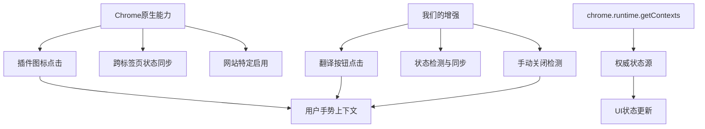

# SidePanel架构设计文档

> **文档创建**: 2025-01-16  
> **版本**: v1.0  
> **设计理念**: Chrome官方API + 最小化自定义逻辑 + 用户手势优先  
> **状态**: 设计完成，待实施

## 🎯 **完整需求总结**

### **核心功能需求**
1. **全局状态同步**：所有YouTube标签页的SidePanel状态保持一致
2. **UI按钮同步**：所有YouTube标签页的翻译设置按钮状态同步
3. **操作方式衔接**：翻译设置按钮、插件图标、手动关闭三种方式完全联动
4. **场景覆盖**：支持标签页切换、页面导航、页面刷新、首次加载

### **技术约束**
- ✅ **用户手势上下文**：所有SidePanel操作必须在用户手势中执行
- ✅ **Chrome官方API优先**：最大化利用Chrome原生能力
- ✅ **架构简洁**：避免过度设计和复杂状态管理

### **具体用户场景**
1. **跨标签页同步**：用户在Tab A打开SidePanel → 切换到Tab B → Tab B的SidePanel也应该打开
2. **操作方式衔接**：翻译按钮打开 → 插件图标关闭 → 翻译按钮状态正确更新
3. **页面导航**：用户在YouTube内跳转视频，SidePanel状态保持
4. **手动关闭检测**：用户点击X关闭SidePanel，所有标签页按钮状态更新

---

## 🏗️ **整体设计框架**

### **设计理念**
```
Chrome官方API + 最小化自定义逻辑 + 用户手势优先
```

### **核心架构图**


### **职责分工**
- **Chrome原生**：插件图标点击处理 + SidePanel跨标签页状态同步 + 网站特定启用
- **我们负责**：翻译按钮点击处理 + 状态检测同步 + UI状态更新 + 手动关闭检测

---

## 🔧 **完整架构实现**

### **Layer 1: Chrome原生基础层**

```typescript
/**
 * 🎯 利用Chrome官方能力处理插件图标和基础管理
 */

// ✅ 启用Chrome自动插件图标处理（用户手势自动保持）
chrome.sidePanel.setPanelBehavior({ openPanelOnActionClick: true });

const YOUTUBE_ORIGINS = [
  'https://www.youtube.com',
  'https://youtube.com', 
  'https://m.youtube.com'
];

// ✅ 官方标准：网站特定启用 + 状态同步
chrome.tabs.onUpdated.addListener(async (tabId, info, tab) => {
  if (!tab.url || !info.url) return;
  
  try {
    const url = new URL(tab.url);
    
    if (YOUTUBE_ORIGINS.includes(url.origin)) {
      // 1. 启用SidePanel功能
      await chrome.sidePanel.setOptions({
        tabId,
        path: 'src/sidepanel/sidepanel.html',
        enabled: true
      });
      
      // 2. 读取并同步状态（页面导航/刷新后）
      const isOpen = await getSidePanelState();
      syncUIState(tabId, isOpen, 'page-load');
      
    } else {
      await chrome.sidePanel.setOptions({ tabId, enabled: false });
    }
  } catch (error) {
    console.error(`[onUpdated] 标签页 ${tabId} 处理失败:`, error);
  }
});

// ✅ 标签页切换同步
chrome.tabs.onActivated.addListener(async (activeInfo) => {
  try {
    const tab = await chrome.tabs.get(activeInfo.tabId);
    if (tab.url && isYoutubeUrl(tab.url)) {
      const isOpen = await getSidePanelState();
      syncUIState(activeInfo.tabId, isOpen, 'tab-switch');
    }
  } catch (error) {
    console.error(`[onActivated] 处理失败:`, error);
  }
});

function isYoutubeUrl(url: string): boolean {
  try {
    const urlObj = new URL(url);
    return YOUTUBE_ORIGINS.includes(urlObj.origin);
  } catch (error) {
    return false;
  }
}
```

### **Layer 2: 状态检测核心层**

```typescript
/**
 * 🎯 基于chrome.runtime.getContexts()的权威状态检测
 */

async function getSidePanelState(): Promise<boolean> {
  try {
    const contexts = await chrome.runtime.getContexts({
      contextTypes: [chrome.runtime.ContextType.SIDE_PANEL]
    });
    return contexts.length > 0;
  } catch (error) {
    console.error('[getSidePanelState] 检测失败:', error);
    return false;
  }
}

function syncUIState(tabId: number, isOpen: boolean, source: string): void {
  chrome.tabs.sendMessage(tabId, {
    type: 'UPDATE_BUTTON_STATE',
    isOpen: isOpen,
    source: source
  }).catch(() => {
    // Content Script可能未就绪，静默忽略
  });
  
  console.log(`[${source}] 标签页 ${tabId} UI同步: ${isOpen ? '已打开' : '已关闭'}`);
}
```

### **Layer 3: 用户操作处理层**

```typescript
/**
 * 🎯 处理翻译按钮点击（保持用户手势上下文）
 */

chrome.runtime.onMessage.addListener((message, sender, sendResponse) => {
  
  // 状态查询（初始化时使用）
  if (message.type === 'getSidePanelState') {
    getSidePanelStateForMessage().then(sendResponse);
    return true;
  }
  
  // 翻译按钮切换（关键：同步处理保持用户手势）
  if (message.type === 'toggleSidePanel') {
    handleTranslateButtonToggle(sender).then(sendResponse);
    return true;
  }
});

async function handleTranslateButtonToggle(sender: chrome.runtime.MessageSender): Promise<any> {
  const tabId = sender.tab?.id;
  if (!tabId) return { success: false, error: 'No tab ID' };
  
  try {
    // 🔥 关键：在用户手势上下文中执行所有操作
    
    // 1. 检测当前状态
    const isCurrentlyOpen = await getSidePanelState();
    
    // 2. 执行相反操作（用户手势上下文保持）
    if (isCurrentlyOpen) {
      // 关闭SidePanel
      await chrome.sidePanel.setOptions({ tabId, enabled: false });
    } else {
      // 打开SidePanel（关键操作必须在用户手势中）
      await chrome.sidePanel.setOptions({
        tabId,
        path: 'src/sidepanel/sidepanel.html',
        enabled: true
      });
      await chrome.sidePanel.open({ tabId }); // 🔥 用户手势要求
    }
    
    const newState = !isCurrentlyOpen;
    console.log(`[翻译按钮] SidePanel状态切换: ${newState ? '已打开' : '已关闭'}`);
    
    return { 
      success: true, 
      newState: newState
    };
    
  } catch (error) {
    console.error('[翻译按钮] 操作失败:', error);
    return { 
      success: false, 
      error: error.message 
    };
  }
}

async function getSidePanelStateForMessage(): Promise<any> {
  try {
    const isOpen = await getSidePanelState();
    return { success: true, isOpen: isOpen };
  } catch (error) {
    return { success: false, error: error.message, isOpen: false };
  }
}
```

### **Layer 4: 手动关闭检测层**

```typescript
/**
 * 🎯 监听手动关闭并同步状态
 */

// SidePanel中建立Port连接
// src/sidepanel/sidepanel.ts
const port = chrome.runtime.connect({ name: 'sidepanel-lifecycle' });
console.log('[sidepanel] Port连接已建立');

// Background中监听Port生命周期
chrome.runtime.onConnect.addListener((port) => {
  if (port.name === 'sidepanel-lifecycle') {
    console.log('[background] SidePanel已连接');
    
    port.onDisconnect.addListener(async () => {
      console.log('[background] 检测到SidePanel断开');
      
      // 延迟确认真正关闭
      setTimeout(async () => {
        const isStillOpen = await getSidePanelState();
        if (!isStillOpen) {
          // 通知当前活动标签页
          const [activeTab] = await chrome.tabs.query({ 
            active: true, 
            currentWindow: true 
          });
          if (activeTab?.id && isYoutubeUrl(activeTab.url || '')) {
            syncUIState(activeTab.id, false, 'manual-close');
          }
        }
      }, 100);
    });
  }
});
```

### **Layer 5: Content Script响应层**

```typescript
/**
 * 🎯 Content Script状态同步和初始化
 */

// 消息监听
chrome.runtime.onMessage.addListener((message, sender, sendResponse) => {
  if (message.type === 'UPDATE_BUTTON_STATE') {
    updateTranslateButtonState(message.isOpen);
    console.log(`[content-script] 按钮状态更新: ${message.isOpen ? '已打开' : '已关闭'} (${message.source})`);
  }
});

// 翻译按钮点击处理（保持用户手势）
async function onTranslateButtonClick() {
  try {
    // 🔥 直接在用户点击事件中发送消息
    const result = await chrome.runtime.sendMessage({
      type: 'toggleSidePanel'
    });
    
    if (result.success) {
      // 立即更新当前按钮状态
      updateTranslateButtonState(result.newState);
    } else {
      console.error('SidePanel操作失败:', result.error);
    }
  } catch (error) {
    console.error('翻译按钮操作失败:', error);
  }
}

// 页面初始化时获取状态
async function initializeTranslateButton() {
  try {
    // 1. 渲染按钮
    renderTranslateButton();
    
    // 2. 获取初始状态
    const result = await chrome.runtime.sendMessage({
      type: 'getSidePanelState'
    });
    
    if (result.success) {
      updateTranslateButtonState(result.isOpen);
      console.log(`[content-script] 初始状态: ${result.isOpen ? '已打开' : '已关闭'}`);
    }
    
  } catch (error) {
    console.error('[content-script] 初始化失败:', error);
    updateTranslateButtonState(false); // 降级默认状态
  }
}

// 智能初始化
if (document.readyState === 'loading') {
  document.addEventListener('DOMContentLoaded', initializeTranslateButton);
} else {
  initializeTranslateButton();
}

// 按钮状态更新函数
function updateTranslateButtonState(isOpen: boolean): void {
  const button = document.querySelector('[data-translate-button]');
  if (button) {
    button.textContent = isOpen ? '翻译设置 (已打开)' : '翻译设置';
    button.setAttribute('data-state', isOpen ? 'open' : 'closed');
  }
}

// 按钮渲染函数
function renderTranslateButton(): void {
  // 具体的按钮渲染逻辑
  const button = document.createElement('button');
  button.setAttribute('data-translate-button', 'true');
  button.addEventListener('click', onTranslateButtonClick);
  // ... 其他渲染逻辑
}
```

---

## 🔗 **三种操作方式衔接机制**

### **衔接原理**
```
所有操作都会影响SidePanel的实际状态
→ chrome.runtime.getContexts()能检测到状态变化
→ 通过Port监听、标签页事件、消息通信实现状态传递
```

### **具体衔接流程**

#### **翻译按钮 ↔ 插件图标**
```
场景1: 翻译按钮打开 → 插件图标关闭
1. 翻译按钮点击 → handleTranslateButtonToggle() → chrome.sidePanel.open()
2. 用户点击插件图标 → Chrome原生关闭SidePanel
3. 用户切换标签页 → onActivated → getSidePanelState() → 检测到已关闭
4. syncUIState() → 翻译按钮状态更新为"已关闭"

场景2: 插件图标打开 → 翻译按钮关闭
1. 插件图标点击 → Chrome原生打开SidePanel
2. 用户切换标签页 → onActivated → getSidePanelState() → 检测到已打开
3. syncUIState() → 翻译按钮状态更新为"已打开"
4. 翻译按钮点击 → 检测状态为已打开 → 执行关闭操作
```

#### **插件图标 ↔ 手动关闭**
```
1. 插件图标打开SidePanel → Chrome原生处理 → Port连接建立
2. 用户手动点击X关闭 → Chrome关闭SidePanel → Port断开
3. Port断开监听器触发 → getSidePanelState()确认关闭
4. syncUIState() → 通知当前活动标签页更新UI
```

#### **翻译按钮 ↔ 手动关闭**
```
1. 翻译按钮打开SidePanel → chrome.sidePanel.open() → Port连接建立
2. 用户手动点击X关闭 → Chrome关闭SidePanel → Port断开
3. Port断开监听器触发 → getSidePanelState()确认关闭
4. syncUIState() → 通知当前活动标签页更新UI
```

---

## 📊 **场景覆盖完整性**

### **标签页切换场景**
```
触发器: chrome.tabs.onActivated
处理流程: 检测YouTube页面 → 获取SidePanel状态 → 同步UI状态
覆盖场景: 用户在不同YouTube标签页间切换
```

### **页面导航场景**
```
触发器: chrome.tabs.onUpdated
处理流程: 启用SidePanel功能 → 获取当前状态 → 同步UI状态
覆盖场景: YouTube站内导航、视频切换
```

### **页面刷新场景**
```
触发器: chrome.tabs.onUpdated + Content Script初始化
处理流程: 重新启用功能 → Content Script主动获取状态 → 初始化UI
覆盖场景: 用户刷新页面、强制刷新
```

### **首次加载场景**
```
触发器: Content Script初始化
处理流程: 渲染按钮 → 主动获取状态 → 设置初始UI状态
覆盖场景: 首次访问YouTube页面
```

---

## 🎯 **架构核心优势**

### **1. 用户手势上下文保证**
- ✅ 翻译按钮点击直接在消息处理器中调用Chrome API
- ✅ 插件图标点击由Chrome原生处理，自动保持用户手势
- ✅ 所有`chrome.sidePanel.open()`调用都在用户操作响应中

### **2. Chrome官方API最大化利用**
- ✅ `setPanelBehavior({ openPanelOnActionClick: true })`处理插件图标
- ✅ `chrome.runtime.getContexts()`作为权威状态源
- ✅ Chrome原生跨标签页状态同步能力
- ✅ 标准的`onUpdated`和`onActivated`事件处理

### **3. 完整场景覆盖**
- ✅ 标签页切换：`chrome.tabs.onActivated`
- ✅ 页面导航：`chrome.tabs.onUpdated`
- ✅ 页面刷新：`onUpdated` + Content Script初始化
- ✅ 首次加载：Content Script主动状态获取

### **4. 架构简洁稳定**
- ✅ 无复杂广播机制
- ✅ 基于事件驱动的状态同步
- ✅ 优雅降级和错误处理
- ✅ 清晰的分层架构和职责分离

---

## 🚀 **实施指导**

### **实施优先级**
1. **P0（核心）**：Layer 1 + Layer 2 - Chrome原生基础 + 状态检测
2. **P1（重要）**：Layer 3 - 翻译按钮点击处理
3. **P2（增强）**：Layer 4 + Layer 5 - 手动关闭检测 + Content Script响应

### **测试验证清单**
- [ ] 插件图标点击能正确开关SidePanel
- [ ] 翻译设置按钮点击能正确开关SidePanel
- [ ] 两种操作方式状态完全同步
- [ ] 标签页切换时状态正确同步
- [ ] 页面导航后状态保持
- [ ] 页面刷新后状态恢复
- [ ] 手动关闭后状态正确更新
- [ ] 用户手势上下文正确保持

### **关键技术要点**
1. **用户手势保持**：所有涉及`chrome.sidePanel.open()`的操作必须在直接的用户操作响应中
2. **状态检测可靠性**：`chrome.runtime.getContexts()`作为唯一权威状态源
3. **错误处理**：所有API调用都有完整的try-catch和降级机制
4. **性能优化**：避免不必要的状态检测和UI更新

---

## 📚 **相关文档**

- [Chrome SidePanel API官方文档](https://developer.chrome.com/docs/extensions/reference/api/sidePanel)
- [Chrome Extension用户手势要求](https://developer.chrome.com/docs/extensions/develop/concepts/user-activation)
- [项目主架构文档](./architecture.md)
- [跨标签页同步问题追踪](./cross-tab-sync-issues.md) 