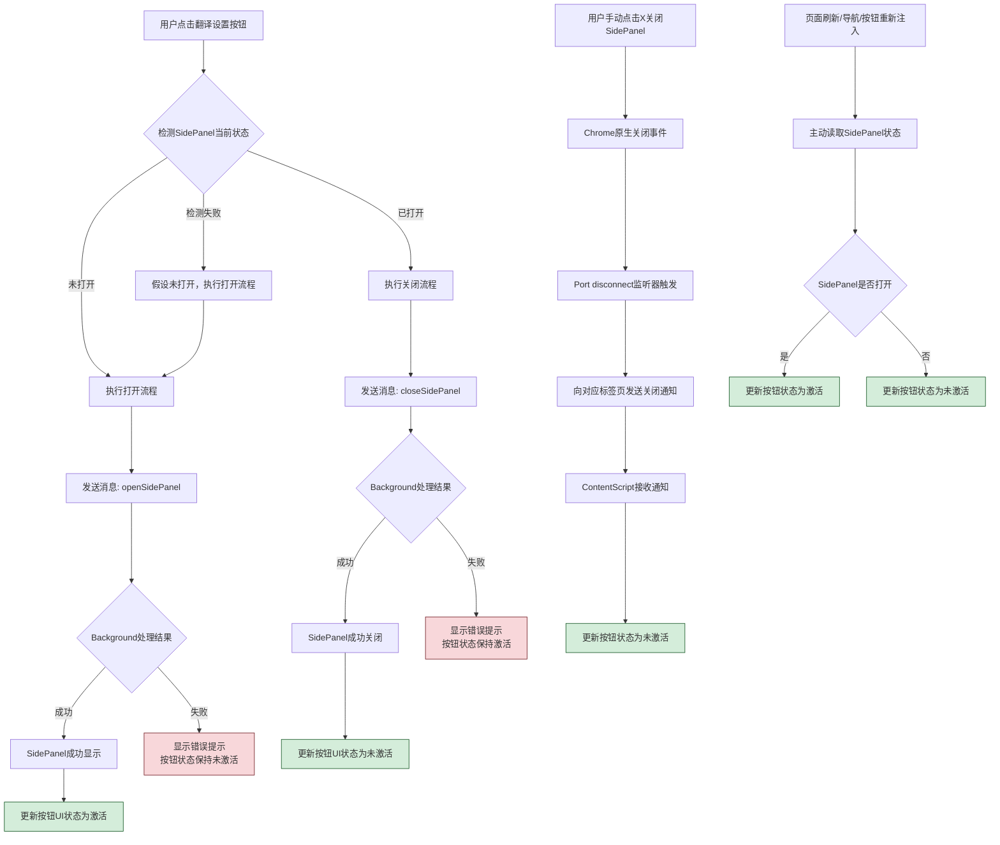
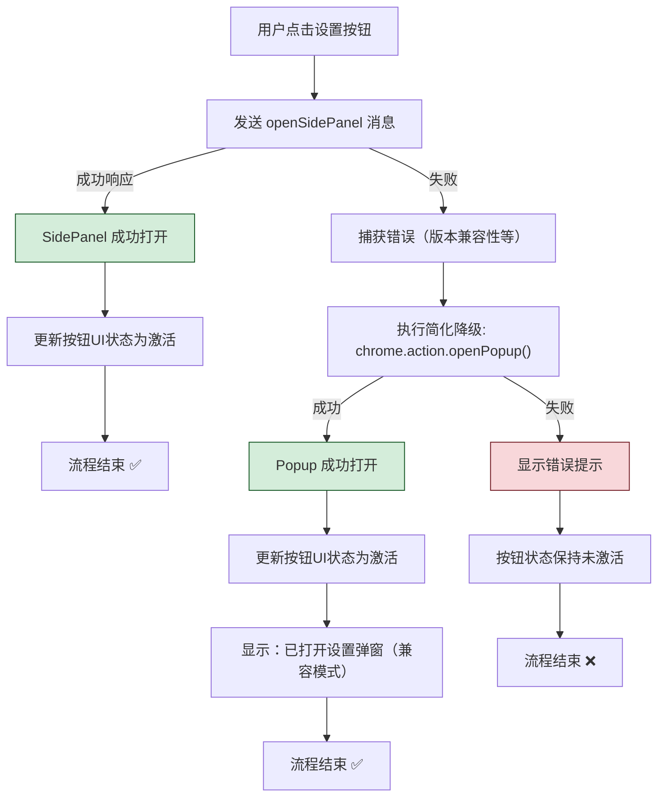

## 4. 核心数据结构

### 4.1 字幕轨道信息

```typescript
/**
 * YouTube API 原始字幕轨道信息
 */
interface CaptionTrack {
  baseUrl: string;          // 字幕数据URL
  name: {                   // 字幕名称（YouTube API原始格式）
    simpleText: string;
  };
  vssId: string;            // 字幕标识符
  languageCode: string;     // 语言代码
  isTranslatable: boolean;  // 是否可翻译
  kind?: string;            // 轨道类型（asr=自动生成，undefined=手动字幕）
}

/**
 * 简化的字幕轨道信息（用于存储和传输）
 */
interface SimplifiedCaptionTrack {
  baseUrl: string;          // 字幕数据URL（获取字幕内容的API地址）
  languageCode: string;     // 语言代码（如：de, fr, es-ES, en）
  name: string;             // 显示名称（如：德语, 法语, English）- 从CaptionTrack.name.simpleText提取
  kind?: string;            // 轨道类型（asr=自动生成，undefined=手动字幕）
}
```

### 4.2 字幕事件

```typescript
interface SubtitleEvent {
  start: number;           // 开始时间(秒)
  end: number;             // 结束时间(秒)
  text: string;            // 文本内容
  langCode: string;        // 语言代码
}
```

### 4.3 处理后的字幕事件

```typescript
interface ProcessedSubtitleEvent {
  start: number;           // 开始时间(秒)
  end: number;             // 结束时间(秒)
  sourceText: string;      // 源语言文本
  targetText: string|null; // 目标语言文本
  sourceLangCode: string;  // 源语言代码
  targetLangCode: string;  // 目标语言代码
}
```

### 4.4 SidePanel专用数据结构

```typescript
/**
 * SidePanel上下文数据 - Background向SidePanel传输的主要数据
 */
interface SidePanelContext {
  /** 当前视频 ID */
  videoId: string;
  /** 当前标签页 ID */
  tabId: number;
  /** 用户偏好设置（目标语言、字幕模式、翻译服务等） */
  userPreferences: UserPreferences;
  /** 自动检测得到的源语言 */
  detectedSourceLang: string;
  /** 统一的语言策略，包含冲突状态与互锁列表 */
  languagePolicy: LanguagePolicy;
  /** 可选择的源语言列表（转换为SidePanel专用格式） */
  availableSourceLanguages: AvailableTrackForSidePanel[];
}

/**
 * 统一语言策略：包含冲突检测结果和下拉列表互锁状态
 */
interface LanguagePolicy {
  /** 冲突检测与自动修正结果 */
  conflictState: ConflictState;
  /** 下拉列表互锁状态，SidePanel 只需按此渲染 */
  languageListState: LanguageListState;
}

/**
 * SidePanel专用的轨道信息（简化版）
 */
interface AvailableTrackForSidePanel {
  name: string;           // 显示名称，如 "English", "中文(自动生成)"
  languageCode: string;   // 语言代码，如 "en", "zh"
  kind: 'asr' | 'undefined';   // 轨道类型：自动生成 | 原生字幕
}

/**
 * 语言冲突状态
 */
interface ConflictState {
  hasConflict: boolean;                 // 是否存在冲突
  sourceLanguage: string;               // 源语言
  targetLanguage: string;               // 目标语言
  conflictType: 'same_family' | 'exact_match' | 'none';  // 冲突类型
  suggestion: string | null;            // 建议的解决方案
  status: 'detecting' | 'conflict' | 'resolved' | 'none';  // 处理状态
}

/**
 * 状态消息 - 独立通信通道
 */
interface StatusMessage {
  type: 'success' | 'error' | 'loading' | 'info' | 'warning';
  message: string;
}

/**
 * OpenAI专用配置
 */
interface OpenAIConfig {
  model: 'gpt-3.5-turbo' | 'gpt-4' | 'gpt-4-turbo';    // 模型选择
  temperature: number;                                   // 温度参数 (0-1)
  apiKey: string;                                      // API密钥（敏感信息）
}
```


## 5. SidePanel架构设计 (2025-06-10更新)

### 5.1 最新简化架构设计 (v5.24.7) ⭐ 

**🎯 设计理念：全局状态管理 + 智能操作检测**

基于实际开发过程中的复杂度评估，我们采用了**大幅简化**的SidePanel架构设计，以降低维护成本并提升稳定性。

#### 5.1.1 核心原则

**智能开关 + 状态检测 + 最小复杂度**

- ✅ **翻译设置按钮**：根据SidePanel当前状态进行开关操作，支持打开和关闭
- ✅ **用户关闭**：通过手动点击X关闭，依赖Chrome原生行为
- ✅ **全局状态同步**：SidePanel状态全局管理，跨标签页同步按钮状态
- ✅ **智能检测**：点击时检查SidePanel是否已打开，避免重复操作

#### 5.1.2 架构对比

| 架构版本 | 代码量 | 复杂度 | 状态同步 | 维护成本 |
|---------|--------|--------|----------|----------|
| 历史版本(已废弃) | ~340行 | 高 | 复杂全局同步 | 高 |
| **简化版本(v5.24.7)** | **~60行** | **低** | **智能全局同步** | **低** |

#### 5.1.3 实现架构

```typescript
// 翻译设置按钮逻辑
button.onclick = async () => {
  try {
    // 1. 检查SidePanel当前状态
    const statusResponse = await chrome.runtime.sendMessage({
      type: 'getSidePanelStatus'
    });
    
    if (!statusResponse.success) {
      console.error('[ui] 状态检测失败');
      return;
    }
    
    const isEnabled = statusResponse.isEnabled;
    
    // 2. 根据状态执行相应操作
    if (isEnabled) {
      // 当前已打开，执行关闭操作
      const result = await chrome.runtime.sendMessage({type: 'closeSidePanel'});
      if (result.success) {
        updateButtonState(false);
        showTip('设置面板已关闭');
      }
    } else {
      // 当前未打开，执行打开操作
      const result = await chrome.runtime.sendMessage({type: 'openSidePanel'});
      if (result.success) {
        updateButtonState(true);
        showTip('设置面板已打开');
      }
    }
    
  } catch (error) {
    console.error('[ui] SidePanel操作失败:', error);
  }
};

// Background处理逻辑
case 'getSidePanelStatus':
  try {
    // 直接从存储读取，高性能方案
    const isEnabled = await runtimeStateManager.getSettingPanelState();
    return { success: true, isEnabled };
  } catch (error) {
    return { success: false, isEnabled: false };
  }

case 'openSidePanel':
  if (isYoutubeUrl(tab.url)) {
    await chrome.sidePanel.setOptions({ 
      tabId, 
      path: 'src/sidepanel/sidepanel.html',
      enabled: true 
    });
    await chrome.sidePanel.open({tabId});
    // 🔥 关键：同步更新存储状态
    await runtimeStateManager.setSettingPanelState(true);
    await initializeSidePanel(tabId);
    return {success: true};
  }
  return {success: false};

case 'closeSidePanel':
  try {
    await chrome.sidePanel.setOptions({ tabId, enabled: false });
    // 🔥 关键：同步更新存储状态
    await runtimeStateManager.setSettingPanelState(false);
    await broadcastSidePanelStateChange(tabId, false);
    return {success: true};
  } catch (error) {
    return {success: false};
  }

// 优化的Port监听器（包含状态同步）
chrome.runtime.onConnect.addListener((port) => {
  if (port.name === 'sidepanel-lifecycle') {
    port.onDisconnect.addListener(async () => {
      console.log('[background] SidePanel已关闭，更新存储状态');
      // 🔥 关键：用户手动关闭必须同步更新存储
      await runtimeStateManager.setSettingPanelState(false);
    });
  }
});
```

#### 5.1.4 状态管理最佳实践 (v5.24.7+ 架构重构经验)

**教训来源**: SidePanel关闭重复状态更新问题解决过程

基于实际开发中遇到的状态管理重复调用问题，我们总结出了Chrome扩展状态管理的最佳实践模式。

##### **核心设计原则：事件溯源模式**

**问题识别**：
- **症状**: 同一状态变更产生多条重复日志
- **根本原因**: 多个事件源同时更新同一状态，违反单一数据源原则
- **架构反模式**: 主动操作事件 + 生命周期事件的竞争条件

**解决方案**：
```typescript
// ❌ 错误模式：双重状态更新
// 路径1：主动关闭逻辑
chrome.sidePanel.setOptions({ tabId, enabled: false }, () => {
  runtimeStateManager.setSettingPanelState(false);  // 第一次更新
  broadcastSidePanelStateChange(false);
});

// 路径2：Port断开监听器  
port.onDisconnect.addListener(async () => {
  await runtimeStateManager.setSettingPanelState(false);  // 重复更新！
});

// ✅ 正确模式：事件溯源，单一权威来源
// 路径1：主动关闭逻辑（只负责API调用）
chrome.sidePanel.setOptions({ tabId, enabled: false }, () => {
  console.log('[background] ❌ SidePanel已关闭 (翻译按钮)');
  sendResponse({ success: true, status: 'closed' });
  // 🔧 移除状态更新：统一由Port断开监听器处理
});

// 路径2：Port断开监听器（唯一状态管理入口）
port.onDisconnect.addListener(async () => {
  console.log('[background] 🔥 检测到SidePanel关闭（Port断开）');
  await runtimeStateManager.setSettingPanelState(false);  // 唯一更新入口
  broadcastSidePanelStateChange(false);
});
```

##### **架构设计模式：读写分离**

**设计原则**：
- 🎯 **操作层职责**: 负责Chrome API调用和用户响应，不管理状态
- 🎯 **事件层职责**: 负责状态持久化和变更广播，作为权威数据源
- 🎯 **事件优先级**: 生命周期事件 > 操作响应事件

**实施策略**：
```typescript
// 操作层：只负责触发，不负责状态管理
async function handleToggleSidePanel(tabId: number): Promise<void> {
  const isCurrentlyOpen = await runtimeStateManager.getSettingPanelState();
  
  if (isCurrentlyOpen) {
    // 只执行关闭API，不更新状态
    chrome.sidePanel.setOptions({ tabId, enabled: false }, () => {
      console.log('[background] API调用完成：SidePanel已关闭');
      // 状态管理委托给Port监听器
    });
  } else {
    // 只执行打开API，不更新状态
    await chrome.sidePanel.open({tabId});
    // 状态管理委托给Port监听器
  }
}

// 事件层：唯一的状态管理权威
function setupStateManagement(): void {
  chrome.runtime.onConnect.addListener(async (port) => {
    if (port.name === 'sidepanel-lifecycle') {
      console.log('[background] Port连接：SidePanel已打开');
      await runtimeStateManager.setSettingPanelState(true);
      broadcastSidePanelStateChange(true);
      
      port.onDisconnect.addListener(async () => {
        console.log('[background] Port断开：SidePanel已关闭');
        await runtimeStateManager.setSettingPanelState(false);
        broadcastSidePanelStateChange(false);
      });
    }
  });
}
```

##### **最终一致性保证机制**

**乐观并发控制**：
- **立即反馈**: UI层快速响应用户操作，提升感知性能
- **异步确认**: 后台异步验证和修正状态，保证数据正确性
- **自动回滚**: 发现不一致时自动修正UI状态

```typescript
// UI层：乐观更新
async function handleButtonClick(): Promise<void> {
  // 1. 立即更新UI（乐观假设）
  updateButtonState(true);
  showLoadingState();
  
  try {
    // 2. 发送操作请求
    const result = await chrome.runtime.sendMessage({type: 'openSidePanel'});
    
    if (!result.success) {
      // 3. 操作失败，回滚UI状态
      updateButtonState(false);
      showErrorMessage('SidePanel打开失败');
    }
  } catch (error) {
    // 4. 网络失败，回滚UI状态
    updateButtonState(false);
    showErrorMessage('网络连接失败');
  }
}

// Background层：最终一致性验证
port.onConnect.addListener(() => {
  // Port连接确认SidePanel真正打开，状态一致
  console.log('[background] 状态一致性确认：SidePanel已实际打开');
});
```

##### **架构优势与性能提升**

| 指标 | 优化前 | 优化后 | 改善效果 |
|------|--------|--------|----------|
| **状态更新调用次数** | 2次 | 1次 | 减少50% |
| **日志重复问题** | 存在 | 消除 | 调试体验提升 |
| **架构复杂度** | 高（双路径） | 低（单路径） | 维护成本降低 |
| **数据一致性** | 竞争条件 | 单一权威 | 可靠性提升 |

#### 5.1.5 常见架构陷阱与解决方案

**教训来源**: Chrome扩展开发中的典型架构问题与重构经验

##### **陷阱1：多事件源竞争 (Multiple Event Source Competition)**

**问题现象**：
```typescript
// ❌ 反模式：多个地方同时更新同一状态
// 陷阱：看似合理的"多保险"设计，实际产生竞争条件

// 地点1：用户主动操作
button.onclick = async () => {
  await chrome.runtime.sendMessage({type: 'toggleSidePanel'});
  updateLocalState(newState);  // 更新1
};

// 地点2：消息响应处理
chrome.runtime.onMessage.addListener((message) => {
  if (message.type === 'sidePanelStateChanged') {
    updateLocalState(message.state);  // 更新2：可能与更新1冲突
  }
});

// 地点3：生命周期事件
port.onDisconnect.addListener(() => {
  updateLocalState(false);  // 更新3：时序不确定
});
```

**解决方案 - 单一权威来源模式**：
```typescript
// ✅ 正确模式：指定唯一的状态管理者
class StateManager {
  private isUpdating = false;
  
  async updateState(newState: boolean, source: string): Promise<void> {
    if (this.isUpdating) {
      console.log(`[StateManager] 状态更新中，忽略来自${source}的更新请求`);
      return;
    }
    
    this.isUpdating = true;
    try {
      await this.doUpdate(newState);
      console.log(`[StateManager] 状态已更新为${newState}，来源：${source}`);
    } finally {
      this.isUpdating = false;
    }
  }
}

// 其他组件只触发，不直接更新
button.onclick = () => stateManager.updateState(true, 'user-action');
```

##### **陷阱2：响应性vs一致性的伪冲突 (False Responsiveness vs Consistency Conflict)**

**问题思维**：
- ❌ **错误假设**: 认为快速响应和数据一致性是冲突的
- ❌ **过度设计**: 为了"完美一致性"放弃用户体验
- ❌ **技术迷思**: 认为必须选择同步或异步，不能结合

**正确理解 - CAP理论在前端的应用**：
```typescript
// ✅ 双阶段提交模式：兼顾响应性和一致性
class ResponsiveStateManager {
  async updateSidePanelState(shouldOpen: boolean): Promise<void> {
    // 阶段1：立即响应（乐观更新）- 优先可用性
    this.updateUIImmediately(shouldOpen);
    this.showOptimisticFeedback();
    
    try {
      // 阶段2：后台确认（最终一致性）- 保证一致性
      const result = await chrome.runtime.sendMessage({
        type: shouldOpen ? 'openSidePanel' : 'closeSidePanel'
      });
      
      if (!result.success) {
        // 发现不一致，自动修正
        this.rollbackUI(!shouldOpen);
        this.showErrorFeedback();
      } else {
        this.confirmOptimisticUpdate();
      }
    } catch (error) {
      // 网络分区情况，优雅降级
      this.handleNetworkPartition(error);
    }
  }
}
```

##### **陷阱3：过度抽象的组件边界 (Over-Abstracted Component Boundaries)**

**问题模式**：
```typescript
// ❌ 反模式：过度抽象，职责不清
class UniversalManager {
  // 试图处理所有事情的"万能管理器"
  async handleEverything(action: string, data: any): Promise<any> {
    switch (action) {
      case 'init': return this.initialize(data);
      case 'update': return this.update(data);
      case 'sync': return this.synchronize(data);
      case 'cleanup': return this.cleanup(data);
      // ... 50+ 个case语句
    }
  }
}
```

**解决方案 - 单一职责组件设计**：
```typescript
// ✅ 正确模式：单一职责，清晰边界
class SidePanelLifecycleManager {
  // 只负责SidePanel生命周期
  async open(tabId: number): Promise<boolean> { /* */ }
  async close(tabId: number): Promise<boolean> { /* */ }
  onStateChange(callback: (state: boolean) => void): void { /* */ }
}

class SidePanelStateSync {
  // 只负责状态同步
  async syncWithStorage(): Promise<void> { /* */ }
  async broadcastChange(newState: boolean): Promise<void> { /* */ }
}

class SidePanelUIController {
  // 只负责UI控制
  updateButtonAppearance(isOpen: boolean): void { /* */ }
  showFeedback(message: string): void { /* */ }
}
```

##### **架构决策框架**

**决策矩阵**：
| 情况 | 响应性优先 | 一致性优先 | 推荐模式 |
|------|------------|------------|----------|
| **用户交互** | ✅ | ⚠️ | 乐观并发控制 |
| **数据同步** | ⚠️ | ✅ | 最终一致性 |
| **错误恢复** | ⚠️ | ✅ | 状态回滚机制 |
| **性能关键** | ✅ | ✅ | 缓存+异步验证 |

#### 5.1.6 响应式架构设计模式

**教训来源**: SidePanel双阶段更新机制的设计决策过程

##### **设计权衡：用户感知 vs 系统一致性**

**核心挑战**：
- **用户期望**: 点击按钮后立即看到反馈（< 100ms）
- **系统现实**: Chrome API调用 + SidePanel实际打开需要200-500ms
- **一致性要求**: 确保UI状态与实际SidePanel状态匹配

**架构决策**：采用**双阶段响应式架构**

```typescript
// 阶段1：立即响应（用户感知优化）
async function handleSidePanelToggle(): Promise<void> {
  const currentState = this.state.settingPanelOpen;
  const targetState = !currentState;
  
  // 🚀 立即更新UI（0-10ms）
  this.state.settingPanelOpen = targetState;
  this.updateSettingsButtonState(targetState);
  this.showLoadingIndicator();
  
  try {
    // 阶段2：异步确认（系统一致性保证）
    const response = await chrome.runtime.sendMessage({
      type: 'toggleSidePanel',
      data: { source: 'translation-button' }
    });
    
    if (response.success) {
      // ✅ 确认成功：乐观更新正确
      this.hideLoadingIndicator();
      this.showSuccessFeedback(targetState ? '设置面板已打开' : '设置面板已关闭');
    } else {
      // ❌ 操作失败：回滚UI状态
      this.state.settingPanelOpen = currentState;
      this.updateSettingsButtonState(currentState);
      this.showErrorFeedback('操作失败，请重试');
    }
  } catch (error) {
    // 🔌 网络问题：回滚 + 重试机制
    this.handleNetworkError(error, currentState);
  }
}
```

##### **响应式架构的三个层次**

###### **Layer 1: 感知响应层 (Perception Response Layer)**
**目标**: 让用户感觉系统"立即响应"
```typescript
interface PerceptionLayer {
  // 用户感知目标：< 100ms
  immediateVisualFeedback(): void;
  optimisticStateUpdate(): void;
  loadingIndicatorShow(): void;
}

// 实现：UI立即变化
this.updateButtonState(targetState);  // 按钮立即变色
this.showRippleEffect();              // 立即显示点击动画
this.updateTooltip(targetState);     // 立即更新提示文本
```

###### **Layer 2: 操作执行层 (Operation Execution Layer)**
**目标**: 执行实际的系统操作
```typescript
interface ExecutionLayer {
  // 操作目标：200-500ms
  executeSystemOperation(): Promise<OperationResult>;
  handleOperationErrors(): void;
  provideProgressFeedback(): void;
}

// 实现：后台执行Chrome API
const result = await chrome.runtime.sendMessage({type: 'toggleSidePanel'});
await this.waitForSidePanelReady();  // 等待SidePanel实际加载
```

###### **Layer 3: 一致性验证层 (Consistency Verification Layer)**
**目标**: 确保UI状态与实际状态一致
```typescript
interface ConsistencyLayer {
  // 一致性目标：系统稳定性
  verifyStateConsistency(): Promise<boolean>;
  handleInconsistency(): void;
  establishEventualConsistency(): void;
}

// 实现：Port连接确认
port.onConnect.addListener(() => {
  console.log('[Consistency] SidePanel实际打开确认');
  this.finalizeStateTransition(true);
});
```

##### **用户体验优化策略**

**时间分配策略**：
```typescript
// 用户感知时间分配
const UX_TIMELINE = {
  // 0-50ms: 视觉反馈必须出现
  IMMEDIATE_FEEDBACK: 50,
  
  // 50-200ms: 操作状态指示
  OPERATION_FEEDBACK: 200,
  
  // 200ms+: 完成确认
  COMPLETION_FEEDBACK: Infinity,
  
  // 错误容忍度
  ERROR_TOLERANCE: 1000  // 1秒内失败可接受
};

async function executeResponsiveOperation(): Promise<void> {
  const startTime = performance.now();
  
  // 立即反馈（必须在50ms内）
  this.immediateUIResponse();
  
  // 异步操作
  const operationPromise = this.executeBackgroundOperation();
  
  // 超时保护
  const timeoutPromise = new Promise((_, reject) => 
    setTimeout(() => reject(new Error('操作超时')), UX_TIMELINE.ERROR_TOLERANCE)
  );
  
  try {
    await Promise.race([operationPromise, timeoutPromise]);
    this.showSuccessState();
  } catch (error) {
    this.rollbackToSafeState();
    this.showErrorState(error);
  }
}
```

##### **架构模式选择指南**

| 用户操作类型 | 推荐响应模式 | 一致性策略 | 性能目标 |
|-------------|-------------|-----------|----------|
| **按钮点击** | 乐观并发控制 | 异步验证 + 回滚 | < 100ms 感知 |
| **状态查询** | 缓存优先 | 最终一致性 | < 50ms 响应 |
| **数据提交** | 悲观锁定 | 强一致性 | < 500ms 完成 |
| **背景同步** | 最终一致性 | 冲突解决 | 不阻塞UI |

**决策框架**：
1. **用户可感知的操作** → 优先响应性，使用乐观并发控制
2. **系统关键状态** → 优先一致性，使用悲观锁定
3. **背景数据同步** → 最终一致性，不影响用户体验
4. **错误恢复场景** → 安全优先，快速回滚到已知稳定状态

#### 5.1.7 状态管理策略

**优化状态管理：存储读取优先策略**：
```typescript
// ✅ 优化方案 (v5.24.7+): 存储读取为主，性能优先
// 直接从RuntimeStateManager读取状态，避免频繁API调用

// Background处理逻辑
case 'getSidePanelStatus':
  try {
    // 直接从存储读取，高性能
    const isEnabled = await runtimeStateManager.getSettingPanelState();
    return { success: true, isEnabled };
  } catch (error) {
    return { success: false, isEnabled: false };
  }

// ContentScript状态查询
const statusResponse = await chrome.runtime.sendMessage({
  type: 'getSidePanelStatus'
});
const isSidePanelOpen = statusResponse.success && statusResponse.isEnabled;
```

**状态同步保证**：
```typescript
// 🔥 关键：所有SidePanel状态变更都必须同步更新存储
// 1. 插件图标打开/关闭
chrome.action.onClicked.addListener(async (tab) => {
  // ... 执行Chrome API操作 ...
  await runtimeStateManager.setSettingPanelState(newState);
});

// 2. 翻译按钮打开/关闭
case 'toggleSidePanel':
  // ... 执行Chrome API操作 ...
  await runtimeStateManager.setSettingPanelState(newState);

// 3. 用户手动关闭检测
chrome.runtime.onConnect.addListener((port) => {
  if (port.name === 'sidepanel-lifecycle') {
    port.onDisconnect.addListener(async () => {
      // 用户手动关闭，必须更新存储状态
      await runtimeStateManager.setSettingPanelState(false);
    });
  }
});
```

**设计优势**：
- ✅ **高性能**：存储读取比API调用快10-100倍
- ✅ **简化架构**：消除API查询的复杂错误处理
- ✅ **状态一致性**：所有操作都保证存储同步
- ✅ **Chrome规范**：符合Background Script作为状态中心的架构原则

#### 5.1.8 用户体验设计

| 操作场景 | 用户体验 | 系统行为 |
|---------|----------|----------|
| 点击按钮打开 | 🔄 检查状态 → 打开SidePanel | 智能检测避免重复操作 |
| 重复点击按钮 | 💡 提示"已打开" | 用户友好的反馈 |
| 手动关闭 | ❌ 点击X关闭 | 依赖Chrome原生行为 |
| 页面刷新 | 🔄 需重新点击按钮 | 轻微体验下降，但可接受 |
| 跨标签页 | 🌐 全局状态同步 | SidePanel状态跨标签页同步 |

#### 5.1.9 优势总结

✅ **代码量减少85%+**：从340行降至60行  
✅ **逻辑清晰简单**：智能开关操作，基于状态检测  
✅ **覆盖主要场景**：满足核心使用需求  
✅ **用户体验可接受**：核心功能完整，仅有轻微体验差异  
✅ **稳定可靠**：依赖Chrome原生行为，减少bug风险  
✅ **易于调试**：没有复杂的Port断开判断逻辑  
✅ **维护成本低**：简化架构便于长期维护

#### 5.1.10 详细流程与实现 ⭐

> **📋 说明**: 本节包含从第3章合并过来的详细技术实现，为SidePanel架构的完整参考。

##### **完整交互流程图**



##### **技术实现要点**

1. **按钮点击处理**：Backend确认成功后再更新按钮状态
2. **状态同步机制**：页面导航后主动读取SidePanel状态
3. **手动关闭检测**：Port监听器通知对应标签页更新状态
4. **错误容错**：简单的错误提示和状态恢复

##### **数据初始化详细流程**

当SidePanel成功打开后，Background会执行以下数据准备流程：

1. **并行读取基础数据**：UserPreferences + VideoSourceLanguageCache
2. **字幕轨道信息获取**：优先使用MemoryCache，未命中时调用YouTube API
3. **语言策略计算**：执行冲突检测和互锁列表生成
4. **SidePanelContext组装**：打包所有数据发送给SidePanel
5. **UI初始化**：SidePanel接收数据并更新界面

##### **缓存优化策略**

- **VideoSpecificData优先级**：包含完整翻译结果，优先检查
- **Memory Cache轨道信息**：减少API调用，提升响应速度
- **三层缓存检查逻辑**：最大化避免重复API调用

##### **状态同步机制**

- **智能全局状态同步**：实现跨标签页状态同步，简化架构
- **两种关闭方式处理**：用户主动关闭 vs 手动关闭X按钮
- **页面导航同步**：主动检测SidePanel状态，更新按钮UI

##### **错误处理与降级**



**降级策略**：
1. **主要方式**: 尝试打开SidePanel
2. **降级方式**: 如果SidePanel不可用，自动切换到Popup模式
3. **错误处理**: 提供用户友好的错误提示和解决建议

**简化原则**：
- 移除复杂的多层降级逻辑
- 保留基本的SidePanel→Popup降级
- 专注核心功能稳定性

##### **v5.24.7+ 架构更新总结**

**核心变更**：
1. **状态管理简化**：从全局状态同步改为页面级状态管理
2. **RuntimeState清理**：移除复杂状态管理相关存储和引用
3. **错误处理简化**：从三层降级机制简化为基本兼容性处理
4. **标签页功能重定义**：从"状态同步"改为"数据切换"

**影响范围**：
- ✅ **UIManager.setSettingPanelOpen**：大幅简化，移除复杂状态管理
- ✅ **多标签页处理**：重命名为"数据切换"，优化触发条件
- ✅ **存储架构**：标记传统同步机制为废弃
- ✅ **错误处理**：简化降级流程，保留基本兼容性

**兼容性处理**：
- 保留SidePanel→Popup降级机制（Chrome版本兼容性）
- 保留标签页数据切换功能（用户体验需求）
- 移除复杂的状态持久化和跨页面同步  

### 5.2 通信架构设计

SidePanel架构的通信机制设计，确保数据传输的完整性和类型安全。

#### 5.2.1 数据结构引用

> **📌 数据结构定义**：SidePanel相关的核心数据结构已统一定义在 **[4.4 SidePanel专用数据结构](#44-sidepanel专用数据结构)**，本节专注于架构设计说明。

核心数据结构包括：
- `SidePanelContext` - SidePanel上下文数据
- `LanguagePolicy` - 统一语言策略  
- `ConflictState` - 语言冲突状态
- `StatusMessage` - 状态消息
- `OpenAIConfig` - OpenAI专用配置

详细定义请参见第4章，避免重复维护。

#### 5.2.2 双向通信架构

**双通道架构**：
- **主数据通道**：`SidePanelContext` - 传输核心业务数据
- **状态消息通道**：`StatusMessage` - 传输UI状态反馈

### 5.3 架构概述

SidePanel作为Chrome Extension的重要用户界面组件，负责为用户提供直观的设置界面和状态反馈。基于消息传递+状态机组合架构，实现Background与SidePanel之间的高效双向通信。

**核心设计原则**：
- **数据单向流**：Background作为唯一数据源，SidePanel作为数据消费者
- **状态机驱动**：语言冲突处理采用状态机模式，确保逻辑清晰
- **按需加载**：多标签页切换时按需重构数据，避免复杂缓存
- **职责分离**：业务逻辑在Background，UI逻辑在SidePanel

### 5.4 参数加载与初始化流程

当用户点击翻译设置按钮打开SidePanel时，插件会执行以下一系列操作来初始化SidePanel的用户界面和功能。这个过程涉及到BackgroundScript、ContentScript，以及各种存储机制（全局设置和视频特定设置缓存）。

#### 5.4.1 核心逻辑顺序

**1. SidePanel 打开并通知 BackgroundScript：**
- SidePanel UI (`SidePanel/SidePanel.ts`) 被用户打开
- SidePanel 获取当前标签页ID和URL，解析视频ID（如果是YouTube页面）
- 向 BackgroundScript 发送消息：`{'action': 'sidePanelOpened', 'tabId': currentTabId, 'videoId': videoId}`

**2. BackgroundScript 收到消息并调用初始化函数：**
- 接收`sidePanelOpened`消息并提取`tabId`和`videoId`参数
- 调用`initializeSidePanel(tabId, videoIdFromSidePanel)`函数处理初始化

**3. BackgroundScript 加载全局设置：**
- 调用`loadAndApplyUserPreferences()`获取所有全局设置
- 获取浏览器UI语言(`uiLang = chrome.i18n.getUILanguage()`)
- 确定视频ID（使用传入的`videoIdFromSidePanel`或通过`getVideoIdForTab(tabId)`获取）

**4. BackgroundScript 检查视频特定设置缓存：**
- 通过`VideoSettingsCache.getInstance().getVideoSettings(currentVideoId)`加载视频设置
- **如果缓存命中：**
  - 读取缓存的`hasSubtitles`值
  - **如果视频有字幕(`hasSubtitles=true`)：**
    - 从缓存加载字幕轨道信息(`availableTracks`)
    - 使用缓存的源语言(`sourceLang`)和目标语言(`targetLang`)
    - 跳到步骤7（组合数据）
  - **如果视频无字幕(`hasSubtitles=false`)：**
    - 设置`availableTracks = []`
    - 跳到步骤7（组合数据）
- **如果缓存未命中：** 继续到步骤5

**5. BackgroundScript 请求ContentScript获取字幕信息：**
- 向SidePanel发送`loadingTracks`状态
- 使用统一的消息请求管理器发送请求：
  ```typescript
  const tracksResponse = await MessageRequestManager.getInstance()
    .sendRequestAndWait<{tracks?: any[], error?: string}>(
      tabId,
      { action: 'getAvailableTracks', videoId: currentVideoId },
      10000
    );
  ```
- 如果超时（10秒），抛出错误

> **注意**：从2025-05-27开始，项目采用统一的MessageRequestManager来处理所有异步请求-响应，替代了之前的临时监听器模式。

**6. BackgroundScript 处理ContentScript返回的字幕信息：**
- **如果成功获取字幕轨道数据：**
  - 设置`hasSubtitles = true`
  - 调用`selectBestSourceLanguage(availableTracks)`选择合适的源语言。优先级如下：
    1. **非ASR英语轨道 (Non-ASR English)**: `languageCode`以`en`开头 (如 'en', 'en-US', 'en-GB') 且 `kind` 不是 `'asr'`。
    2. **ASR英语轨道 (ASR English)**: `languageCode`以`en`开头 且 `kind` 是 `'asr'`。
    3. **列表中的第一个轨道**: 如果以上都未找到，则选择 `availableTracks` 列表中的第一个轨道。
    4. **无字幕**: 如果 `availableTracks` 为空，则表示无字幕，源语言为空字符串。
  - 将轨道数据保存到缓存：`StorageKeys.CACHE.VIDEO_TRACKS_PREFIX + currentVideoId`
- **如果未获取到字幕轨道或出错：**
  - 设置`hasSubtitles = false`
  - 设置`availableTracks = []`

**7. BackgroundScript 组合最终数据：**
- 确保`determinedSourceLang`有值：
  - 如果之前步骤已设置，则使用该值
  - 否则使用全局设置或默认"en"
- 确保`determinedTargetLang`有值：
  - 优先使用之前步骤中的值
  - 其次使用全局设置中的目标语言
  - 如果全局设置中没有，则基于浏览器UI语言匹配适当的目标语言
  - 最后使用默认值"en"
- 构建完整的SidePanelContext对象，包含：
  - `videoId`：当前视频ID
  - `tabId`：当前标签页ID
  - `userPreferences`：用户偏好设置
  - `detectedSourceLang`：检测到的源语言
  - `languagePolicy`：统一语言策略（包含 `conflictState` 与 `languageListState`）

#### 5.4.2 数据准备与传输流程

> **🎯 功能范围**：SidePanel打开时的数据准备和Context传输  
> **⚠️ 区别**：此流程处理设置面板显示，与翻译执行流程完全独立

**8. BackgroundScript数据准备与发送：**
- 更新视频设置缓存（如需要）：
  ```javascript
  VideoSettingsCache.getInstance().saveVideoSettings({
    videoId: currentVideoId,
    sourceLang: determinedSourceLang,
    targetLang: determinedTargetLang,
    lastUsed: Date.now(),
    hasSubtitles: hasSubtitles,
    sourceTrackKind: availableTracks.find(t => t.languageCode === determinedSourceLang)?.kind
  });
  ```
- 发送SidePanelContext到SidePanel：
  ```javascript
  console.log(`[background/background.ts] 向Sidepanel发送初始化数据: hasSubtitles=${hasSubtitles}, tracks=${availableTracks.length}`);
  
  chrome.runtime.sendMessage({
    type: 'SIDEPANEL_CONTEXT_UPDATE',
    tabId: tabId,
    data: sidePanelContext  // 完整的SidePanelContext数据包
  }).catch(e => console.warn("[background/background.ts] 发送到Sidepanel失败:", e));
  ```

**9. SidePanel接收数据并渲染UI：**
- 接收`SIDEPANEL_CONTEXT_UPDATE`消息，提取SidePanelContext
- 从`languagePolicy.languageListState`填充语言选择下拉列表
- 应用`detectedSourceLang`和`userPreferences`中的默认设置
- 根据`languagePolicy.conflictState`显示语言冲突警告和建议
- 配置其他UI元素（字幕模式、翻译服务、API配置等）

#### 5.4.3 核心优势

- **数据完整性**：一次性传输完整Context，避免多次通信
- **缓存优化**：复用翻译流程中的MemoryCache，减少API调用
- **状态一致性**：确保SidePanel显示与当前视频状态完全同步

### 5.5 交互与状态管理详解

本节详细阐述了用户与侧边栏（SidePanel）交互时的具体流程、`chrome.sidePanel` API 的使用关键点以及在开发过程中遇到的问题和解决方案。

#### 5.5.1 Manifest V3 配置 (`manifest.json`)

**`side_panel.default_path` 的必要性**:
- 即使计划为特定标签页动态设置侧边栏的路径和启用状态 (`chrome.sidePanel.setOptions()`)，也 **必须** 在 `manifest.json` 中提供一个全局的 `side_panel.default_path`。
  ```json
  "side_panel": {
    "default_path": "SidePanel/SidePanel.html"
  }
  ```
- 缺少此配置，即使特定标签页的侧边栏被 `setOptions()` 设置为 `enabled: true`，`chrome.sidePanel.open()` 调用也可能因找不到"活动的"或"默认的"侧边栏定义而失败，并报错 "No active side panel for tabId..."。

#### 5.5.2 用户手势限制与 `chrome.sidePanel.open()`

- `chrome.sidePanel.open()` API **必须** 在被浏览器认为是直接响应用户操作（如点击按钮）的上下文中调用。
- 任何导致其在异步回调链深处执行的逻辑（例如，在 `setOptions()` 的回调中再调用 `open()`），都可能导致 "may only be called in response to a user gesture" 错误。
- **解决方案**: 后台脚本 (`background.ts`) 在收到来自内容脚本的 `openSidePanel` 消息后（此消息直接源于用户点击），应直接尝试调用 `chrome.sidePanel.open({ tabId })`。

#### 5.5.3 侧边栏启用状态 (`enabled`) 管理

**主动维护启用状态**:
- 对于希望展示侧边栏的特定页面（如本项目中的YouTube页面），`background.ts` 中的 `updateSidePanelState(tabId)` 函数负责主动确保这些页面的侧边栏是 `enabled: true` 并且 `path` 被正确设置。
- `updateSidePanelState` 会在标签页更新 (`chrome.tabs.onUpdated`) 和激活 (`chrome.tabs.onActivated`) 时被调用。

**关闭后立即重置状态**:
- 当用户通过UI关闭侧边栏（对应到后台的 `closeSidePanel` 消息处理），后台脚本会调用 `chrome.sidePanel.setOptions({ tabId, enabled: false })` 来禁用它。
- **关键处理**: 在成功禁用侧边栏后，`closeSidePanel` 处理器会**立即再次调用 `updateSidePanelState(tabId)`**。
- **原因**: 如果当前标签页仍然符合显示侧边栏的条件（例如，用户关闭了YouTube页面的侧边栏但仍停留在该YouTube页面），`updateSidePanelState` 会再次将其设置为 `enabled: true`（但侧边栏不会被打开）。这为下一次用户点击"打开"按钮做好了准备，解决了之前连续点击开关按钮导致第三次无法打开的问题。

#### 5.5.4 核心交互流程 (打开/关闭 SidePanel)

**1. 用户操作 (在 `content/content-script.ts` 中的 `UIManager`)**:
- 用户点击"翻译设置"按钮。
- `UIManager` 根据当前侧边栏的打开/关闭状态，向后台脚本发送相应的消息：
  - 先查询状态：`chrome.runtime.sendMessage({ type: 'getSidePanelStatus' })`
  - 若要打开：`chrome.runtime.sendMessage({ type: 'openSidePanel' })`
  - 若要关闭：`chrome.runtime.sendMessage({ type: 'closeSidePanel' })`

**2. 后台处理 (在 `background/background.ts`中)**:
- **`getSidePanelStatus` 消息处理器**:
  - 使用 `runtimeStateManager.getSettingPanelState()` 从存储读取状态（高性能）
  - 返回 `{ success: true, isEnabled: storageState }`
- **`openSidePanel` 消息处理器**:
  - 先调用 `chrome.sidePanel.setOptions({ tabId, path: 'src/sidepanel/sidepanel.html', enabled: true })`
  - 然后调用 `chrome.sidePanel.open({ tabId })`
  - 最后调用 `initializeSidePanel(tabId)` 初始化数据
- **`closeSidePanel` 消息处理器**:
  - 调用 `chrome.sidePanel.setOptions({ tabId, enabled: false })` 来关闭侧边栏
  - 广播状态变化到对应标签页：`broadcastSidePanelStateChange(tabId, false)`

通过上述机制，确保了侧边栏的打开和关闭行为符合预期，并遵循了 `chrome.sidePanel` API 的相关限制和要求。

> **📌 通信机制说明**：SidePanel的详细通信架构请参见 **[5.2.2 双向通信架构](#522-双向通信架构)**，避免重复描述。

**Background → SidePanel**：
```typescript
// 主数据更新
chrome.runtime.sendMessage({
  type: 'SIDEPANEL_CONTEXT_UPDATE',
  data: sidePanelContext
});

// 状态消息更新  
chrome.runtime.sendMessage({
  type: 'STATUS_MESSAGE_UPDATE',
  data: statusMessage
});
```

**SidePanel → Background**：
```typescript
// 基础设置变更
chrome.runtime.sendMessage({
  type: 'USER_PREFERENCES_UPDATE',
  data: { targetLang: 'ja', subtitleMode: 'dual' }
});

// 服务配置更新
chrome.runtime.sendMessage({
  type: 'SERVICE_CONFIG_UPDATE', 
  data: { translationService: 'openai', config: openaiConfig }
});

// translationService连接测试
chrome.runtime.sendMessage({
  type: 'API_CONNECTION_TEST',
  data: { service: 'openai' }
});
```

#### 5.5.5 事件分类与处理

**Background监听的事件类型**：

| 事件类型 | 触发时机 | 处理逻辑 |
|---------|---------|---------|
| `USER_PREFERENCES_UPDATE` | 用户修改基础设置 | 更新userPreferences + 重新计算冲突状态 |
| `SERVICE_CONFIG_UPDATE` | 用户配置翻译服务 | 验证配置完整性 + 保存到storage |
| `API_CONNECTION_TEST` | 用户测试API连接 | 执行API测试 + 返回测试结果 |
| `LANGUAGE_SELECTION_CHANGE` | 用户切换语言 | 触发语言策略计算（冲突检测+互锁列表） |

#### 5.5.6 语言冲突处理架构

**核心原则**：
- **单向处理**：只解决源语言冲突目标语言，不解决目标语言冲突源语言
- **状态机驱动**：语言冲突检测和处理采用状态机模式
- **智能互锁**：源语言和目标语言下拉列表互锁，避免用户选择冲突组合

**状态机设计**：
```typescript
enum ConflictResolutionState {
  IDLE = 'idle',                        // 空闲状态
  DETECTING = 'detecting',              // 检测冲突中
  CONFLICT_FOUND = 'conflict_found',    // 发现冲突
  RESOLVING = 'resolving',              // 解决冲突中
  RESOLVED = 'resolved',                // 冲突已解决
  ERROR = 'error'                       // 错误状态
}

class ConflictResolutionStateMachine {
  private state: ConflictResolutionState = ConflictResolutionState.IDLE;
  
  /**
   * 检测语言冲突
   */
  async detectConflict(source: string, target: string): Promise<ConflictState> {
    this.setState(ConflictResolutionState.DETECTING);
    
    try {
      const isSameFamily = this.isSameLanguageFamily(source, target);
      
      if (isSameFamily) {
        this.setState(ConflictResolutionState.CONFLICT_FOUND);
        return {
          hasConflict: true,
          sourceLanguage: source,
          targetLanguage: target,
          conflictType: 'same_family',
          suggestion: 'auto_switch_target_to_auto',
          status: 'conflict'
        };
      } else {
        this.setState(ConflictResolutionState.RESOLVED);
        return {
          hasConflict: false,
          sourceLanguage: source,
          targetLanguage: target,
          conflictType: 'none',
          suggestion: null,
          status: 'none'
        };
      }
    } catch (error) {
      this.setState(ConflictResolutionState.ERROR);
      throw error;
    }
  }
  
  /**
   * 自动解决冲突 - 只处理源语言冲突目标语言
   */
  async resolveConflict(conflictState: ConflictState): Promise<ConflictState> {
    if (!conflictState.hasConflict) return conflictState;
    
    this.setState(ConflictResolutionState.RESOLVING);
    
    // 策略：将目标语言切换为 'auto'
    const resolvedState: ConflictState = {
      ...conflictState,
      targetLanguage: 'auto',
      hasConflict: false,
      status: 'resolved',
      suggestion: 'resolved_by_auto_target'
    };
    
    this.setState(ConflictResolutionState.RESOLVED);
    return resolvedState;
  }
  
  private isSameLanguageFamily(source: string, target: string): boolean {
    // 同族语言判断逻辑
    const languageFamilies = [
      ['zh-cn', 'zh-tw', 'zh'],           // 中文族
      ['en', 'en-us', 'en-gb'],          // 英语族
      ['es', 'es-es', 'es-mx'],          // 西班牙语族
    ];
    
    return languageFamilies.some(family => 
      family.includes(source) && family.includes(target)
    );
  }
}
```

**下拉列表互锁机制**：
- **双向互锁策略**：源语言和目标语言下拉列表相互互锁，防止用户选择冲突的语言组合
- **UI交互设计**：
  - **源语言选择影响目标语言**：当源语言选择"英语"时，目标语言列表中的"英语"显示为灰色，提示"同源语言"
  - **目标语言选择影响源语言**：当目标语言选择"中文"时，源语言列表中的"中文"显示为灰色，提示"同目标语言"
  - **实时更新**：任一语言变更时，对方列表立即更新禁用状态

```typescript
interface LanguageListState {
  sourceLanguages: LanguageOption[];    // 源语言列表（考虑目标语言互锁）
  targetLanguages: LanguageOption[];    // 目标语言列表（考虑源语言互锁）
  mutualConflicts: MutualConflict[];    // 双向冲突关系
}

interface LanguageOption {
  id: string;                           // 语言ID
  name: string;                         // 显示名称
  disabled: boolean;                    // 是否禁用
  disabledReason?: 'same_source' | 'same_target' | 'same_family';  // 禁用原因
  disabledText?: string;                // 禁用提示文本
}

interface MutualConflict {
  sourceId: string;                     // 源语言ID
  targetId: string;                     // 目标语言ID
  conflictType: 'exact_match' | 'same_family';  // 冲突类型
}
```

**Background预处理逻辑**：
```typescript
function buildLanguageListState(
  currentSource: string,
  currentTarget: string,
  availableLanguages: string[]
): LanguageListState {
  
  // 构建源语言列表（禁用与当前目标语言冲突的选项）
  const sourceLanguages = availableLanguages.map(langId => {
    const isConflictWithTarget = isSameLanguageFamily(langId, currentTarget);
    
    return {
      id: langId,
      name: getLanguageName(langId),
      disabled: isConflictWithTarget,
      disabledReason: isConflictWithTarget ? 'same_target' : undefined,
      disabledText: isConflictWithTarget ? '同目标语言' : undefined
    };
  });
  
  // 构建目标语言列表（禁用与当前源语言冲突的选项）
  const targetLanguages = availableLanguages.map(langId => {
    const isConflictWithSource = isSameLanguageFamily(langId, currentSource);
    
    return {
      id: langId,
      name: getLanguageName(langId),
      disabled: isConflictWithSource,
      disabledReason: isConflictWithSource ? 'same_source' : undefined,
      disabledText: isConflictWithSource ? '同源语言' : undefined
    };
  });
  
  // 构建双向冲突关系映射
  const mutualConflicts: MutualConflict[] = [];
  availableLanguages.forEach(source => {
    availableLanguages.forEach(target => {
      if (source !== target && isSameLanguageFamily(source, target)) {
        mutualConflicts.push({
          sourceId: source,
          targetId: target,
          conflictType: source === target ? 'exact_match' : 'same_family'
        });
      }
    });
  });
  
  return {
    sourceLanguages,
    targetLanguages,
    mutualConflicts
  };
}

/**
 * 检查两种语言是否为同族语言（包含完全相同）
 */
function isSameLanguageFamily(lang1: string, lang2: string): boolean {
  // 完全相同
  if (lang1 === lang2) return true;
  
  // 同族语言判断
  const languageFamilies = [
    ['zh-cn', 'zh-tw', 'zh'],           // 中文族
    ['en', 'en-us', 'en-gb'],          // 英语族
    ['es', 'es-es', 'es-mx'],          // 西班牙语族
    ['fr', 'fr-fr', 'fr-ca'],          // 法语族
    ['pt', 'pt-br', 'pt-pt'],          // 葡萄牙语族
  ];
  
  return languageFamilies.some(family => 
    family.includes(lang1) && family.includes(lang2)
  );
}
```

**SidePanel UI实现示例**：
```typescript
class LanguageSelector {
  /**
   * 渲染下拉列表选项
   */
  renderLanguageOptions(languages: LanguageOption[], type: 'source' | 'target'): void {
    languages.forEach(option => {
      const optionElement = document.createElement('option');
      optionElement.value = option.id;
      optionElement.textContent = option.name;
      
      if (option.disabled) {
        optionElement.disabled = true;
        optionElement.style.color = '#999';  // 灰色显示
        
        // 添加禁用原因提示
        if (option.disabledText) {
          optionElement.textContent += ` (${option.disabledText})`;
        }
      }
      
      this.getSelectElement(type).appendChild(optionElement);
    });
  }
  
  /**
   * 处理语言选择变更
   */
  onLanguageChange(type: 'source' | 'target', newValue: string): void {
    // 发送变更到Background重新计算互锁状态
    chrome.runtime.sendMessage({
      action: 'LANGUAGE_SELECTION_CHANGE',
      data: {
        type,
        newValue,
        currentSource: this.currentSource,
        currentTarget: this.currentTarget
      }
    });
  }
  
  /**
   * 更新互锁状态
   */
  updateMutualLockState(languageListState: LanguageListState): void {
    // 清空现有选项
    this.clearAllOptions();
    
    // 重新渲染源语言列表
    this.renderLanguageOptions(languageListState.sourceLanguages, 'source');
    
    // 重新渲染目标语言列表
    this.renderLanguageOptions(languageListState.targetLanguages, 'target');
    
    console.log('[LanguageSelector] 互锁状态已更新:', languageListState.mutualConflicts);
  }
}
```

**用户交互流程**：
```
用户选择源语言：英语
    ↓
Background重新计算互锁状态
    ↓
目标语言列表更新：英语选项变灰 + 显示"(同源语言)"
    ↓
用户尝试选择目标语言：英语（被禁用，无法选择）
    ↓
用户选择目标语言：中文
    ↓
Background重新计算互锁状态
    ↓
源语言列表更新：中文选项变灰 + 显示"(同目标语言)"
```

**性能优化**：
- **缓存互锁关系**：MutualConflict数组在应用启动时计算一次，后续查表即可
- **增量更新**：只更新变化的选项，避免全量重绘
- **防抖处理**：用户快速切换时，延迟200ms后再更新UI

这种双向互锁机制在UI层面有效防止了用户选择冲突的语言组合，同时保持了4.4.1中单向冲突解决策略的简洁性。

### 5.6 多标签页数据切换 (v5.24.7+)

#### 5.6.1 设计策略

**数据切换方案**：
- 用户打开SidePanel后，切换标签页时更新SidePanel显示的数据
- 仅在SidePanel已打开时执行数据切换，避免不必要的计算
- 每次切换重新构建对应视频的SidePanelContext

#### 5.6.2 切换流程

```typescript
/**
 * 标签页数据切换处理流程 (简化版v5.24.7+)
 */
class TabSwitchHandler {
  async handleTabSwitch(newTabId: number): Promise<void> {
    // 0. 检查SidePanel是否打开
    const isSidePanelOpen = await this.checkSidePanelStatus(newTabId);
    if (!isSidePanelOpen) {
      console.log('[TabSwitch] SidePanel未打开，跳过数据更新');
      return;
    }
    
    // 1. 获取新标签页信息
    const tabInfo = await this.getTabInfo(newTabId);
    if (!tabInfo.videoId) {
      console.log('[TabSwitch] 非YouTube视频页面，跳过');
      return;
    }
    
    // 2. 构建该页面的SidePanelContext
    const context = await this.buildSidePanelContext(tabInfo);
    
    // 3. 更新SidePanel显示的数据
    await this.sendToSidePanel('SIDEPANEL_CONTEXT_UPDATE', context);
    
    // 4. 记录切换日志
    console.log(`[TabSwitch] 数据已切换: ${tabInfo.videoId}`);
  }
  
  private async buildSidePanelContext(tabInfo: TabInfo): Promise<SidePanelContext> {
    // 构建数据的完整逻辑
    const userPreferences = await this.loadUserPreferences();
    const detectedSourceLang = await this.detectOrLoadSourceLanguage(tabInfo.videoId);
    const conflictState = await this.detectLanguageConflict(detectedSourceLang, userPreferences.targetLang);
    
    return {
      videoId: tabInfo.videoId,
      tabId: tabInfo.tabId,
      userPreferences,
      detectedSourceLang,
      conflictState
    };
  }
  
  private async checkSidePanelStatus(tabId: number): Promise<boolean> {
    try {
      // 直接从存储读取，高性能方案
      const isEnabled = await runtimeStateManager.getSettingPanelState();
      return isEnabled;
    } catch (error) {
      console.warn('[TabSwitch] 无法检查SidePanel状态:', error);
      return false;
    }
  }
  
  /**
   * 消息处理器中的getSidePanelStatus实现
   */
  async handleGetSidePanelStatus(tabId: number): Promise<{success: boolean, isEnabled: boolean}> {
    try {
      // 直接从存储读取，高性能方案
      const isEnabled = await runtimeStateManager.getSettingPanelState();
      return { success: true, isEnabled };
    } catch (error) {
      console.error('[Background] 获取SidePanel状态失败:', error);
      return { success: false, isEnabled: false };
    }
  }
  
  /**
   * 广播SidePanel状态变化 - 遵循architecture.md命名
   */
  async broadcastSidePanelStateChange(tabId: number, isOpen: boolean): Promise<void> {
    try {
      await chrome.tabs.sendMessage(tabId, {
        type: 'SIDEPANEL_STATE_CHANGED',
        isOpen
      });
    } catch (error) {
      console.warn('[Background] 状态广播失败:', error);
    }
  }
}
```

### 5.7 插件初始化预加载

#### 5.7.1 数据准备策略

**初始化时机**：Chrome启动 → 插件加载 → Background初始化 → SidePanel打开

**数据准备逻辑**：
```typescript
/**
 * 插件初始化时的SidePanelContext预准备
 */
class PluginInitializer {
  async prepareSidePanelContext(): Promise<SidePanelContext> {
    // 1. 获取当前活跃标签页信息
    const { videoId, tabId } = await this.getCurrentVideoInfo();
    
    // 2. 加载全局设置（优先从local storage，无则用默认值）
    const userPreferences = await this.loadOrInitializeUserPreferences();
    
    // 3. 获取源语言（根据匹配逻辑）
    const detectedSourceLang = await this.getDetectedSourceLanguage(videoId);
    
    // 4. 计算冲突状态
    const conflictState = await this.calculateConflictState(
      detectedSourceLang, 
      userPreferences.targetLang
    );
    
    return {
      videoId,
      tabId,
      userPreferences,
      detectedSourceLang,
      conflictState
    };
  }
  
  private async getDetectedSourceLanguage(videoId: string): Promise<string> {
    // 匹配逻辑优先级：
    // 1. 完全匹配local storage中的翻译结果
    // 2. 匹配cache中的数据
    // 3. 都未匹配则返回'auto'（不进行API调用）
    
    const localMatch = await this.matchLocalTranslationResult(videoId);
    if (localMatch) return localMatch.sourceLanguage;
    
    const cacheMatch = await this.matchCacheData(videoId);
    if (cacheMatch) return cacheMatch.sourceLanguage;
    
    return 'auto';  // 首次加载，待用户操作后再获取
  }
}
```

### 5.8 OpenAI配置流程

#### 5.8.1 智能配置策略

**弹窗配置 + 自动检测方案**：
- 用户选择需要API密钥的翻译服务时，SidePanel弹出配置窗口
- 自动检测所有必需参数是否为空
- 配置完整时自动发送给Background进行API测试
- 测试结果通过状态消息反馈给用户

#### 5.8.2 配置流程

```typescript
/**
 * OpenAI配置处理流程
 */
class OpenAIConfigHandler {
  async handleServiceSelection(service: 'openai'): Promise<void> {
    // 1. 显示配置弹窗
    this.showServiceConfigModal(service);
    
    // 2. 等待用户填写配置
    const config = await this.waitForUserConfiguration();
    
    // 3. 验证配置完整性
    const validation = this.validateServiceConfig(service, config);
    if (!validation.isValid) {
      this.showValidationErrors(validation.errors);
      return;
    }
    
    // 4. 发送配置到Background
    await this.sendServiceConfig(service, config);
    
    // 5. 等待测试结果
    const testResult = await this.waitForConnectionTest();
    
    // 6. 显示结果反馈
    this.showTestResult(testResult);
  }
  
  private validateServiceConfig(service: string, config: any): ValidationResult {
    const errors: string[] = [];
    
    if (service === 'openai') {
      if (!config.apiKey || config.apiKey.length < 10) {
        errors.push('API Key不能为空且长度至少10位');
      }
      if (!config.model) {
        errors.push('请选择一个模型');
      }
      if (config.temperature < 0 || config.temperature > 1) {
        errors.push('Temperature必须在0-1之间');
      }
    }
    
    return {
      isValid: errors.length === 0,
      errors
    };
  }
}
```

### 5.9 测试与演示

#### 5.9.1 演示系统

项目包含完整的SidePanel架构演示系统，位于`tests/demos/`目录：

- **`demo-SidePanel-architecture.html`**：完整的SidePanel架构演示
- **`demo-state-machine.html`**：语言冲突状态机演示

**演示功能**：
- 可视化架构展示（Background ⟷ SidePanel）
- 交互式多标签页切换
- 完整的OpenAI配置流程
- 语言冲突处理演示
- 双向通信测试
- 实时日志和状态消息

#### 5.9.2 关键测试场景

**场景1：新用户首次使用**
```
插件初始化 → 加载默认设置 → 构建SidePanelContext → 显示初始状态
```

**场景2：多标签页切换**  
```
标签A → 标签B → 重新构建Context → 更新SidePanel显示
```

**场景3：OpenAI服务配置**
```
选择OpenAI → 弹出配置 → 验证参数 → API测试 → 结果反馈
```

**场景4：语言冲突处理**
```
检测冲突 → 状态机处理 → 自动解决 → 更新UI状态
```

### 5.10 性能与优化

#### 5.10.1 性能特性

- **内存占用**：单一数据源，避免多套数据缓存
- **切换延迟**：0.1-0.3秒（数据重构时间）
- **通信效率**：双通道设计，避免大数据传输
- **状态同步**：按需计算，避免预计算开销

#### 5.10.2 优化策略

- **数据最小化**：只传输必需的数据字段
- **状态缓存**：语言冲突状态适当缓存，避免重复计算
- **异步处理**：所有API调用和数据加载异步执行
- **错误处理**：完善的容错机制和降级策略

### 5.11 集成指导

#### 5.11.1 与现有架构集成

**存储层集成**：
- 复用现有的`UserPreferencesManager`
- ❌ 已移除 (v5.24.7+): 扩展`RuntimeStateManager`处理SidePanel状态，改为页面级状态管理
- 利用现有的三层分离架构

**通信层集成**：
- 扩展现有的消息处理系统
- 集成到消息路由系统
- 复用BackgroundScript的消息路由

**UI层集成**：
- 与现有的按钮状态同步机制协调
- 集成到`UIManager`组件系统
- 保持与ContentScript的状态一致性

#### 5.11.2 开发指导原则

1. **数据流向**：始终从Background流向SidePanel，避免双向数据绑定
2. **状态管理**：使用状态机处理复杂的业务逻辑
3. **错误处理**：完善的验证和容错机制
4. **性能优先**：按需加载，避免过度优化
5. **用户体验**：及时的状态反馈和清晰的错误提示

这套SidePanel架构设计为YouTube字幕翻译助手提供了清晰、高效、可维护的用户界面解决方案，确保了优秀的用户体验和开发效率。


### 5.12 历史参考

> **📚 传统架构说明**：v5.24.6及更早版本采用了复杂的全局状态同步机制，包含340行代码和复杂的Port管理。当前项目已采用简化架构设计（v5.24.7+），代码量减少85%，维护成本大幅降低。
> 
> 详细的传统架构内容已归档至 [legacy/](../legacy/) 目录，此处不再重复描述。
---