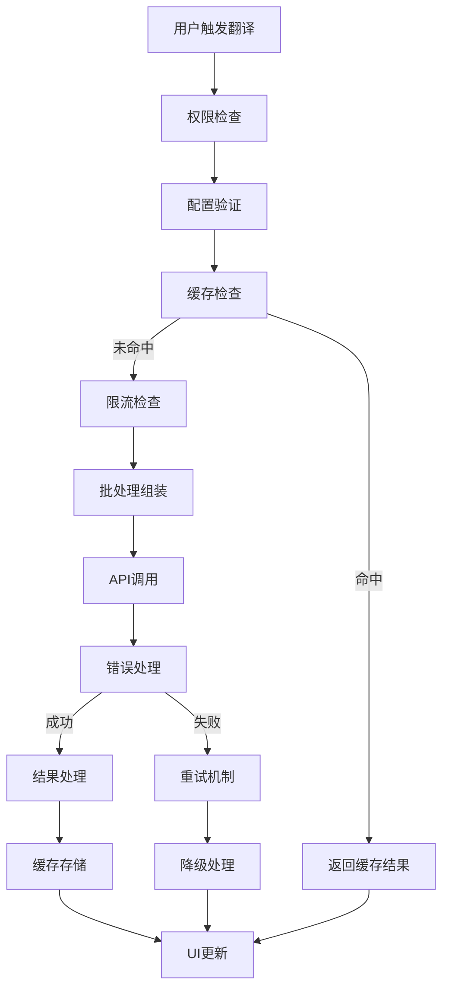
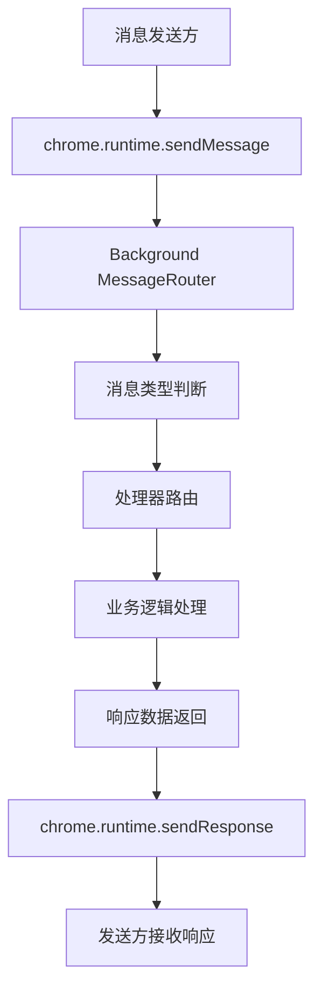
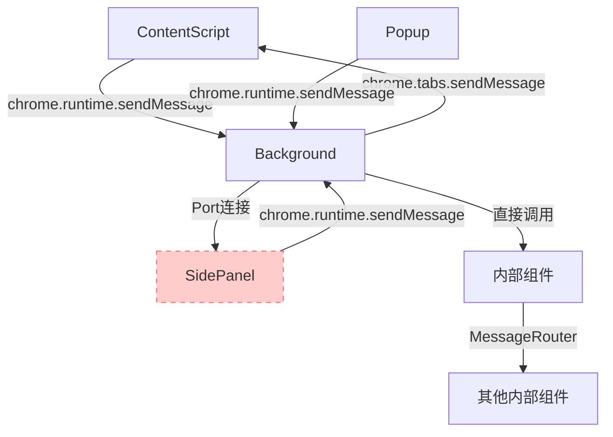

# VTC 5.24 架构设计文档 - Part 4 (翻译服务架构)

> **文档更新**: 2025-07-16  
> **版本**: v5.24.7+ (**当前统一版本**)  
> **当前方案**: ✅ **Popup Fallback** (已实施完成)

## 🚨 **方案变更说明**

### **✅ 当前采用方案: Popup Fallback**
- **翻译服务**: 完全适配Popup架构，支持双重界面调用
- **消息通信**: 简化的翻译请求流程，移除SidePanel专用消息
- **服务管理**: 统一的翻译服务管理，支持Popup和ContentScript调用

### **❌ 已放弃方案: SidePanel**

**放弃原因**:
1. **兼容性问题**: Chrome 114+限制，排除约30%用户
2. **权限复杂性**: 需要scripting权限，用户授权困难
3. **用户体验不一致**: "死按钮"问题，非YouTube页面无响应
4. **开发维护成本**: 复杂的动态状态管理和Port连接处理
5. **实际用户反馈**: 用户对动态逻辑感到困惑，偏好一致性体验

**放弃影响**:
1. **消息类型清理**: 移除`OPEN_SIDEPANEL`等SidePanel专用消息
2. **通信简化**: 移除SidePanel源类型的消息路由
3. **服务调用优化**: 统一为Popup和ContentScript的调用方式

> **📚 保留说明**: SidePanel相关翻译服务调用保留作为历史记录和技术参考

---

## 第8章 翻译服务架构

> **架构依赖**：
> - **数据结构定义**：见 [第7章 数据结构设计规范](#7-数据结构设计规范)
> - **缓存策略**：见 [第6章 存储与缓存架构](#6-存储与缓存架构) 
> - **性能优化**：见 [第10章 性能优化策略](#10-性能优化策略)

### 8.1 翻译服务架构概述

翻译服务是扩展的核心功能模块，负责将YouTube视频字幕从源语言翻译为目标语言。该模块采用插件化架构，支持多种翻译服务提供商的无缝集成。

**架构设计原则**：
- **服务解耦**: 翻译逻辑与具体服务实现分离
- **智能调度**: 基于[三层缓存架构](#62-三层缓存架构)的智能调度策略
- **容错设计**: 多级故障处理和自动恢复机制
- **性能优化**: 集成[限流管理](#84-限流策略集成)和批处理机制

**支持的翻译服务**：
- **免费服务**: Google Free、Microsoft Free
- **付费API**: OpenAI、Google Gemini、DeepSeek、通义千问
- **扩展支持**: 可插件化添加新的翻译服务

> **📋 类型定义**：翻译服务的完整类型定义请参见 [第7章 7.1.1 UserPreferences](#711-userpreferences---持久化用户偏好设置) 中的 `TranslationServiceComplete` 接口定义。

### 8.2 翻译服务注册与发现机制

#### 8.2.1 服务注册架构

```typescript
/**
 * 翻译服务工厂 - 管理所有翻译服务实例
 */
interface TranslationServiceFactory {
  /**
   * 注册新的翻译服务
   * @param serviceType - 服务类型（必须在TranslationServiceType枚举中定义）
   * @param serviceImpl - 服务实现类
   */
  register(serviceType: string, serviceImpl: TranslationServiceProvider): void;
  
  /**
   * 获取翻译服务实例
   * @param config - 完整的翻译服务配置（来自UserPreferences）
   */
  getService(config: TranslationServiceComplete): Promise<TranslationServiceProvider>;
  
  /**
   * 获取所有可用服务列表
   */
  getAvailableServices(): Array<{ type: string; name: string; requiresApiKey: boolean }>;
}

/**
 * 翻译服务提供者接口 - 所有翻译服务必须实现
 */
interface TranslationServiceProvider {
  /**
   * 翻译文本数组
   * @param texts - 待翻译文本数组
   * @param sourceLang - 源语言代码
   * @param targetLang - 目标语言代码
   * @returns 翻译结果数组，与输入数组一一对应
   */
  translate(texts: string[], sourceLang: string, targetLang: string): Promise<string[]>;
  
  /**
   * 验证服务配置
   * @param config - 服务配置
   * @returns 配置验证结果
   */
  validateConfig(config: TranslationServiceComplete): Promise<{ valid: boolean; error?: string }>;
  
  /**
   * 获取服务限制信息
   */
  getLimits(): { rpm?: number; tpm?: number; maxBatchSize?: number };
}
```

#### 8.2.2 服务模板配置

服务模板提供预定义的配置，简化用户设置过程：

```typescript
/**
 * 翻译服务模板配置 - 基于第7章的类型定义
 * 实际实现位置：src/shared/types/user-preferences-types.ts
 */
const TRANSLATION_SERVICE_TEMPLATES: Record<string, TranslationServiceComplete> = {
  // 免费服务
  'google-free': {
    type: TranslationServiceType.GOOGLE_FREE,
    name: 'Google 翻译（免费）',
    model: null,
    requiresApiKey: false
  },
  
  // 付费API服务
  'openai-gpt4': {
    type: TranslationServiceType.OPENAI,
    name: 'OpenAI GPT-4',
    model: 'gpt-4',
    temperature: 0.7,
    maxTokens: 4096,
    rpm: 3500,
    tpm: 40000,
    requiresApiKey: true
  }
  // 其他服务配置...
};
```

### 8.3 翻译流程编排架构

#### 8.3.1 翻译请求生命周期



**关键检查点**：
- **权限检查**: 验证用户是否有翻译权限
- **配置验证**: 确保翻译服务配置完整有效  
- **缓存检查**: 基于[三层缓存架构](#62-三层缓存架构)的智能缓存查询
- **限流控制**: 集成[第10章性能优化](#10-性能优化策略)的限流策略
- **错误处理**: 多级故障恢复机制，详见[8.5节](#85-多级错误处理与恢复机制)

#### 8.3.2 翻译编排器架构

```typescript
/**
 * 翻译编排器 - 协调整个翻译流程
 * 依赖缓存管理器、限流管理器和服务工厂
 */
interface TranslationOrchestrator {
  /**
   * 执行翻译请求
   * @param request - 翻译请求（包含完整的服务配置）
   * @returns 翻译结果或错误信息
   */
  processTranslation(request: TranslationRequest): Promise<TranslationResult>;
  
  /**
   * 批量翻译请求
   * @param requests - 批量翻译请求
   * @returns 批量翻译结果
   */
  processBatch(requests: TranslationRequest[]): Promise<TranslationResult[]>;
}

/**
 * 翻译请求数据结构
 */
interface TranslationRequest {
  videoId: string;
  texts: string[];
  sourceLang: string;
  targetLang: string;
  service: TranslationServiceComplete;  // 引用第7章的完整服务配置
  options?: {
    skipCache?: boolean;
    priority?: 'high' | 'normal' | 'low';
  };
}

/**
 * 翻译结果数据结构
 */
interface TranslationResult {
  translatedTexts: string[];
  metadata: {
    service: string;
    model?: string;
    fromCache: boolean;
    processingTime: number;
    errorCount: number;
  };
}
```

### 8.4 限流策略集成

> **📋 完整限流实现**：详细的限流管理机制请参见 [第10章 性能优化策略](#10-性能优化策略)

#### 8.4.1 限流集成架构

翻译服务架构与性能优化系统的限流管理深度集成：

```typescript
/**
 * 限流管理集成接口 - 与第10章限流系统集成
 */
interface RateLimitIntegration {
  /**
   * 检查服务限流状态
   * @param serviceConfig - 翻译服务配置
   * @returns 是否可以执行请求
   */
  canMakeRequest(serviceConfig: TranslationServiceComplete): Promise<boolean>;
  
  /**
   * 获取等待时间
   * @param serviceConfig - 翻译服务配置  
   * @returns 需要等待的毫秒数
   */
  getWaitTime(serviceConfig: TranslationServiceComplete): Promise<number>;
  
  /**
   * 记录API调用
   * @param serviceConfig - 翻译服务配置
   * @param tokenCount - 使用的token数量
   */
  recordApiCall(serviceConfig: TranslationServiceComplete, tokenCount: number): void;
}
```

#### 8.4.2 智能调度策略

- **动态批处理**: 根据当前限流状态调整批处理大小
- **优先级队列**: 支持高优先级翻译请求的优先处理
- **服务切换**: 当主要服务限流时自动切换到备用服务

### 8.5 翻译性能优化策略

> **📋 通用性能策略**：本节专注于翻译服务的性能优化，通用性能优化策略请参见 [第10章 性能优化策略](#10-性能优化策略)

#### 8.5.1 翻译缓存优化

**智能缓存策略**：
- **多维度缓存键**: 基于videoId、sourceLang、targetLang、service构建精确缓存键
- **LRU清理策略**: 自动清理最少使用的翻译缓存，详见[第6章缓存架构](#62-三层缓存架构)
- **持久化存储**: 翻译结果持久化到chrome.storage.local，跨会话复用
- **缓存预热**: 基于用户历史行为预测并预加载可能需要的翻译

#### 8.5.2 渐进式翻译策略

**优先级翻译机制**：
- **当前位置优先**: 优先翻译用户当前播放位置附近的字幕
- **可视区域优先**: 优先处理即将显示的字幕内容
- **后台批处理**: 在后台处理其余字幕，不阻塞用户操作
- **即时显示**: 已翻译内容立即显示，提升用户感知性能

#### 8.5.3 批处理优化策略

**智能批量分组**：
- **令牌感知分组**: 根据翻译服务的token限制智能分组
- **语义相关性**: 将语义相关的字幕分组，提升翻译质量
- **动态批处理大小**: 根据网络状况和服务响应时间动态调整批处理大小

#### 8.5.4 限流管理与优化

**自适应限流策略**：
- **API响应头分析**: 基于API响应头动态调整请求策略
- **请求计数跟踪**: 实时跟踪请求频率，避免超限
- **自适应延迟**: 根据服务响应时间动态计算延迟时间
- **负载均衡**: 在多个API密钥间分配负载

### 8.6 多级错误处理与恢复机制

#### 8.6.1 错误分类与处理策略

```typescript
/**
 * 翻译错误分类
 */
enum TranslationErrorType {
  // 网络相关错误
  NETWORK_ERROR = 'network_error',
  TIMEOUT_ERROR = 'timeout_error',
  
  // API相关错误  
  API_KEY_INVALID = 'api_key_invalid',
  RATE_LIMIT_EXCEEDED = 'rate_limit_exceeded',
  QUOTA_EXCEEDED = 'quota_exceeded',
  
  // 服务相关错误
  SERVICE_UNAVAILABLE = 'service_unavailable',
  INVALID_LANGUAGE = 'invalid_language',
  TEXT_TOO_LONG = 'text_too_long',
  
  // 配置相关错误
  INVALID_CONFIG = 'invalid_config',
  MISSING_PARAMETERS = 'missing_parameters'
}

/**
 * 错误处理策略配置
 */
interface ErrorHandlingStrategy {
  // 重试策略
  retryConfig: {
    maxRetries: number;
    backoffStrategy: 'exponential' | 'linear' | 'fixed';
    baseDelay: number;
    maxDelay: number;
  };
  
  // 降级策略
  fallbackConfig: {
    enableFallback: boolean;
    fallbackService?: TranslationServiceType;
    fallbackTimeout: number;
  };
  
  // 错误报告
  reportingConfig: {
    enableReporting: boolean;
    reportThreshold: number;
  };
}
```

#### 8.6.2 自动恢复机制

**多级恢复策略**：

1. **重试机制**：
   - 网络错误：指数退避重试，最多3次
   - 限流错误：等待后重试，最多5次
   - 临时错误：线性退避重试，最多2次

2. **服务降级**：
   - 付费服务失败 → 自动切换到免费服务
   - 高级模型失败 → 降级到基础模型
   - 所有服务失败 → 显示友好错误提示

3. **缓存回滚**：
   - 新翻译失败 → 使用历史缓存（如果存在）
   - 部分翻译失败 → 保存已成功的部分

4. **用户通知**：
   - 显示具体错误原因和建议操作
   - 提供手动重试和服务切换选项
   - 记录错误日志供调试使用

```typescript
/**
 * 错误恢复处理器
 */
interface ErrorRecoveryHandler {
  /**
   * 处理翻译错误
   * @param error - 翻译错误信息
   * @param context - 翻译上下文
   * @returns 恢复策略执行结果
   */
  handleError(
    error: TranslationError, 
    context: TranslationContext
  ): Promise<ErrorRecoveryResult>;
  
  /**
   * 执行服务降级
   * @param originalService - 原始服务配置
   * @returns 降级后的服务配置
   */
  fallbackToAlternateService(
    originalService: TranslationServiceComplete
  ): Promise<TranslationServiceComplete | null>;
}
```

这种多级错误处理机制确保了翻译服务的高可用性和用户体验的连续性。

## 第9章 消息通信架构

> **架构依赖**：
> - **数据结构定义**：见 [第4章 核心数据结构](#4-核心数据结构)
> - **状态管理**：见 [第7章 数据结构设计规范](#7-数据结构设计规范)
> - **性能优化**：见 [第10章 性能优化策略](#10-性能优化策略)

### 9.1 统一消息路由架构

消息通信系统是扩展组件间通信的核心机制，基于Chrome原生消息传递API，实现标准化、类型安全的跨组件通信。该架构替代复杂的EventBus系统，提供更简洁可靠的解决方案。

**架构设计原则**：
- **标准化通信**: 基于Chrome原生消息API，避免自定义EventBus的复杂性
- **类型安全**: 完整的消息类型定义，确保编译时类型检查
- **统一路由**: Background Script作为消息路由中心，统一处理所有跨组件通信
- **简化架构**: 移除复杂的发布-订阅模式，采用直接消息传递

**消息分类体系**：
- **数据获取**: YouTube字幕数据、用户设置等数据请求
- **功能操作**: 翻译请求、Popup界面交互等功能调用
- **状态同步**: 运行时状态、UI状态等状态同步
- **系统通知**: 错误处理、性能监控等系统级消息

**核心处理流程**：


### 9.2 标准化消息类型定义

> **📋 数据结构引用**：字幕相关的数据结构定义请参见 [第4章 4.2-4.3节](#42-字幕事件)

系统采用标准化消息类型架构，基于Chrome原生消息传递机制，确保类型安全和清晰分类：
/**
 * 标准化消息类型枚举
 */
enum MessageType {
  // YouTube数据获取
  REQUEST_RAW_TRACKS = 'REQUEST_RAW_TRACKS',
  RAW_TRACKS_DATA = 'RAW_TRACKS_DATA',
  
  // 翻译相关
  TRANSLATION_REQUEST = 'TRANSLATION_REQUEST',
  TRANSLATION_RESPONSE = 'TRANSLATION_RESPONSE',
  
  // 设置相关
  OPEN_SIDEPANEL = 'OPEN_SIDEPANEL',  // 📚 已废弃：SidePanel专用消息
  SETTINGS_UPDATE = 'SETTINGS_UPDATE',
  
  // 状态同步
  STATE_SYNC = 'STATE_SYNC',
  UI_UPDATE = 'UI_UPDATE'
}

/**
 * 标准化消息接口
 */
interface Message<T = any> {
  type: MessageType;
  payload?: T;
  tabId?: number;
  requestId?: string;
  timestamp?: number;
  source?: 'background' | 'content' | 'sidepanel' | 'popup';  // 注：sidepanel已废弃，当前主要使用popup
}

/**
 * 消息响应接口
 */
interface MessageResponse<T = any> {
  success: boolean;
  data?: T;
  error?: string;
  requestId?: string;
}

/**
 * 消息处理器接口
 */
interface MessageHandler<T = any> {
  (message: Message<T>, sender: chrome.runtime.MessageSender): Promise<MessageResponse> | MessageResponse;
}

/**
 * 统一消息路由接口 - 替代EventBus的标准化方案
 */
interface MessageRouter {
  /**
   * 注册消息处理器
   */
  register<T>(type: MessageType, handler: MessageHandler<T>): void;
  
  /**
   * 路由消息到对应处理器
   */
  route<T>(message: Message<T>, sender: chrome.runtime.MessageSender): Promise<MessageResponse>;
  
  /**
   * 广播消息到所有监听组件
   */
  broadcast<T>(type: MessageType, payload: T, options?: { tabId?: number }): Promise<void>;
}
```

### 9.3 消息路由机制

#### 9.3.1 Background消息路由器

Background Script作为消息路由中心，统一处理所有跨组件通信：

```typescript
/**
 * Background消息路由器实现
 */
class BackgroundMessageRouter implements MessageRouter {
  private handlers = new Map<MessageType, MessageHandler>();
  
  register<T>(type: MessageType, handler: MessageHandler<T>): void {
    this.handlers.set(type, handler);
  }
  
  async route<T>(message: Message<T>, sender: chrome.runtime.MessageSender): Promise<MessageResponse> {
    const handler = this.handlers.get(message.type);
    if (!handler) {
      return { success: false, error: `Unknown message type: ${message.type}` };
    }
    
    try {
      return await handler(message, sender);
    } catch (error) {
      return { 
        success: false, 
        error: error instanceof Error ? error.message : 'Unknown error',
        requestId: message.requestId
      };
    }
  }
  
  async broadcast<T>(type: MessageType, payload: T, options?: { tabId?: number }): Promise<void> {
    const message: Message<T> = { type, payload, timestamp: Date.now() };
    
    if (options?.tabId) {
      await chrome.tabs.sendMessage(options.tabId, message);
    } else {
      const tabs = await chrome.tabs.query({});
      await Promise.allSettled(
        tabs.map(tab => chrome.tabs.sendMessage(tab.id!, message))
      );
    }
  }
}
```

#### 9.3.2 消息处理示例

> **📋 实现详情**：完整的消息处理实现请参见相关管理器的源代码实现

消息路由系统的典型使用示例：

```typescript
/**
 * 消息处理器注册示例
 */
class BackgroundService {
  private messageRouter = new BackgroundMessageRouter();
  
  init(): void {
    // 注册各类消息处理器
    this.messageRouter.register(MessageType.REQUEST_RAW_TRACKS, this.handleRawTracksRequest);
    this.messageRouter.register(MessageType.TRANSLATION_REQUEST, this.handleTranslationRequest);
    this.messageRouter.register(MessageType.OPEN_SIDEPANEL, this.handleOpenSidePanel);  // 📚 已废弃：SidePanel处理器
    
    // 监听消息
    chrome.runtime.onMessage.addListener(async (message, sender, sendResponse) => {
      const response = await this.messageRouter.route(message, sender);
      sendResponse(response);
      return true; // 保持消息通道开放
    });
  }
  
  private async handleRawTracksRequest(message: Message, sender: chrome.runtime.MessageSender): Promise<MessageResponse> {
    try {
      const tracks = await this.getYouTubeTracks(message.payload.videoId);
      return { success: true, data: tracks };
    } catch (error) {
      return { success: false, error: error.message };
    }
  }
}
```

**设计优势**：
- ⚡ **性能提升**: 直接消息路由，减少中间层开销
- 🛡️ **容错机制**: 统一错误处理，确保响应可靠性
- 🎯 **职责分离**: Background专注消息路由，各处理器专注业务逻辑

### 9.4 消息优化策略

#### 9.4.1 消息去重机制

> **📋 性能优化**：此机制集成到[第10章性能优化策略](#10-性能优化策略)的整体优化体系中

防止重复消息处理造成的性能问题：

```typescript
/**
 * 消息去重处理器
 */
class MessageDeduplicator {
  private recentMessages = new Map<string, { timestamp: number; requestId: string }>();
  private readonly DUPLICATE_WINDOW = 1000; // 1秒内的重复消息
  
  /**
   * 检查消息是否重复
   * @param message - 消息对象
   * @returns 是否为重复消息
   */
  isDuplicate<T>(message: Message<T>): boolean {
    const key = `${message.type}_${message.tabId || 'global'}`;
    const now = Date.now();
    
    const recent = this.recentMessages.get(key);
    if (recent && (now - recent.timestamp) < this.DUPLICATE_WINDOW) {
      if (message.requestId === recent.requestId) {
        return true; // 重复消息
      }
    }
    
    // 记录新消息
    this.recentMessages.set(key, {
      timestamp: now,
      requestId: message.requestId || `auto_${now}`
    });
    
    // 清理过期记录
    this.cleanup();
    return false;
  }
  
  private cleanup(): void {
    const now = Date.now();
    for (const [key, record] of this.recentMessages.entries()) {
      if (now - record.timestamp > this.DUPLICATE_WINDOW) {
        this.recentMessages.delete(key);
      }
    }
  }
}
```

#### 9.4.2 消息批处理机制

```typescript
/**
 * 消息批处理器 - 合并同类型消息，减少处理次数
 */
interface MessageBatcher {
  /**
   * 添加消息到批处理队列
   */
  addToBatch<T>(messageType: MessageType, payload: T): void;
  
  /**
   * 立即处理批处理队列
   */
  flushBatch(): Promise<void>;
  
  /**
   * 设置自动刷新间隔
   */
  setAutoFlush(intervalMs: number): void;
}
```

#### 9.4.3 消息处理器管理

```typescript
/**
 * 消息处理器生命周期管理
 */
class MessageHandlerManager {
  private handlers = new Map<string, Set<MessageHandler>>();
  
  /**
   * 注册处理器（自动清理）
   */
  registerAutoCleanup(component: string, messageType: MessageType, handler: MessageHandler): void {
    // 组件卸载时自动清理处理器
    const cleanupKey = `${component}_${messageType}`;
    
    if (!this.handlers.has(cleanupKey)) {
      this.handlers.set(cleanupKey, new Set());
    }
    this.handlers.get(cleanupKey)!.add(handler);
    
    // 注册到消息路由器
    this.messageRouter.register(messageType, handler);
  }
  
  /**
   * 清理组件所有处理器
   */
  cleanupComponent(component: string): void {
    for (const [key, handlers] of this.handlers.entries()) {
      if (key.startsWith(`${component}_`)) {
        // 从路由器中移除处理器
        this.handlers.delete(key);
      }
    }
  }
}
```

#### 9.4.4 消息性能监控

```typescript
/**
 * 消息性能监控器
 */
interface MessagePerformanceMonitor {
  /**
   * 记录消息处理时间
   */
  recordMessageProcessing(messageType: MessageType, startTime: number, endTime: number): void;
  
  /**
   * 获取性能统计
   */
  getPerformanceStats(): {
    averageProcessingTime: Map<MessageType, number>;
    messageFrequency: Map<MessageType, number>;
    slowMessages: Array<{ type: MessageType; avgTime: number }>;
  };
}
```

### 9.5 跨组件通信架构

#### 9.5.1 Chrome扩展消息传递

基于Chrome Extension的原生消息传递机制实现跨组件通信：



> **⚠️ 图表说明**: 红色虚线部分为已废弃的SidePanel通信，当前主要使用Popup和ContentScript通信

#### 9.5.2 消息传递策略

```typescript
/**
 * 跨组件消息传递示例
 */
class CrossComponentMessaging {
  /**
   * Content Script 发送消息到 Background
   */
  async sendToBackground<T>(messageType: MessageType, payload: T): Promise<MessageResponse> {
    return new Promise((resolve) => {
      chrome.runtime.sendMessage(
        { type: messageType, payload, timestamp: Date.now() },
        (response: MessageResponse) => resolve(response)
      );
    });
  }
  
  /**
   * Background 发送消息到 Content Script
   */
  async sendToContentScript<T>(tabId: number, messageType: MessageType, payload: T): Promise<void> {
    await chrome.tabs.sendMessage(tabId, {
      type: messageType,
      payload,
      timestamp: Date.now()
    });
  }
  
  /**
   * SidePanel 发送消息到 Background
   * @deprecated 已废弃：SidePanel方案已放弃，请使用Popup通信
   */
  async sendFromSidePanel<T>(messageType: MessageType, payload: T): Promise<MessageResponse> {
    return new Promise((resolve) => {
      chrome.runtime.sendMessage(
        { type: messageType, payload, source: 'sidepanel' },
        (response: MessageResponse) => resolve(response)
      );
    });
  }
}
```


---