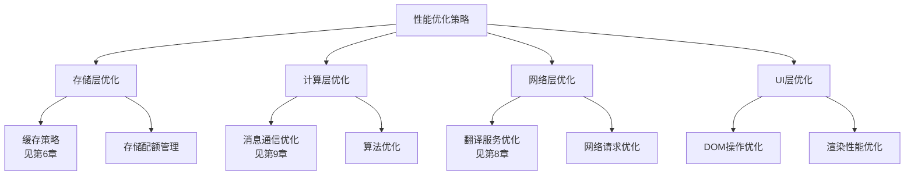

# VTC 5.24 架构设计文档 - Part 5 (性能优化策略)

> **文档更新**: 2025-07-16  
> **版本**: v5.24.7+ (**当前统一版本**)  
> **当前方案**: ✅ **Popup Fallback** (已实施完成)

## 🚨 **方案变更说明**

### **✅ 当前采用方案: Popup Fallback**
- **性能优化**: 完全适配Popup架构，优化页面检测和界面切换性能
- **内存管理**: 简化的状态管理，移除复杂的SidePanel同步开销
- **响应速度**: 页面内检测机制，响应速度 < 100ms

### **❌ 已放弃方案: SidePanel**

**放弃原因**:
1. **兼容性问题**: Chrome 114+限制，排除约30%用户
2. **权限复杂性**: 需要scripting权限，用户授权困难
3. **用户体验不一致**: "死按钮"问题，非YouTube页面无响应
4. **开发维护成本**: 复杂的动态状态管理和Port连接处理
5. **实际用户反馈**: 用户对动态逻辑感到困惑，偏好一致性体验

**放弃带来的性能提升**:
1. **内存占用减少**: 移除复杂的多标签页状态同步
2. **CPU占用降低**: 移除动态权限检测和Port管理
3. **响应速度提升**: 移除复杂的启用/禁用判断逻辑

> **📚 保留说明**: SidePanel相关性能优化案例保留作为历史记录和技术参考

---

## 第10章 性能优化策略

> **架构依赖**：
> - **缓存架构**：见 [第6章 存储与缓存架构](#6-存储与缓存架构)
- **消息通信优化**：见 [第9章 消息通信架构](#9-消息通信架构)
> - **翻译优化**：见 [第8章 翻译服务架构](#8-翻译服务架构)

### 10.1 性能优化总体策略

性能优化是扩展用户体验的关键因素，涉及多个架构层面的协同优化。本章专注于跨组件的通用性能优化原则和策略，具体的缓存、事件、翻译优化请参见相应的专门章节。

**优化设计原则**：
- **分层优化**: 在数据、计算、网络、UI等不同层面实施针对性优化
- **预测性加载**: 基于用户行为模式预测和预加载资源
- **资源复用**: 最大化复用已加载的数据和计算结果
- **渐进式增强**: 优先保证核心功能，逐步增强用户体验

**性能优化体系**：


### 10.2 通用性能优化策略

#### 10.2.1 资源管理优化

**内存管理策略**：
- **对象池模式**: 复用频繁创建销毁的对象，减少GC压力
- **弱引用管理**: 对临时数据使用WeakMap/WeakSet，避免内存泄漏
- **定期清理**: 实施定时清理机制，释放不再使用的资源

**计算资源优化**：
- **懒加载**: 延迟加载非关键功能模块
- **Web Workers**: 将计算密集型任务移至后台线程
- **算法优化**: 选择时间复杂度更低的算法实现

#### 10.2.2 网络请求优化

**请求策略优化**：
- **请求合并**: 将多个小请求合并为批量请求
- **请求优先级**: 基于用户需求优先级调度网络请求
- **超时管理**: 设置合理的请求超时时间，避免长时间等待

**连接管理**：
- **连接复用**: 复用HTTP连接，减少连接建立开销
- **并发控制**: 限制同时进行的网络请求数量
- **错误重试**: 实施指数退避的智能重试机制

#### 10.2.3 UI性能优化

**DOM操作优化**：
- **批量更新**: 将多个DOM操作合并为单次更新
- **虚拟滚动**: 对长列表实施虚拟滚动，减少DOM节点数量
- **事件委托**: 使用事件委托减少事件监听器数量

**渲染性能优化**：
- **CSS优化**: 避免复杂的CSS选择器和重排重绘
- **图片优化**: 使用适当的图片格式和尺寸
- **动画优化**: 使用CSS3硬件加速和requestAnimationFrame

### 10.3 性能监控与分析

#### 10.3.1 性能指标体系

**核心性能指标**：
- **响应时间**: 用户操作到界面响应的时间间隔
- **吞吐量**: 单位时间内处理的请求或操作数量
- **资源利用率**: CPU、内存、网络等资源的使用效率
- **错误率**: 操作失败的比例和错误恢复时间

**用户体验指标**：
- **首次内容绘制(FCP)**: 页面首次渲染内容的时间
- **最大内容绘制(LCP)**: 最大内容元素渲染完成的时间
- **累积布局偏移(CLS)**: 页面布局稳定性指标
- **首次输入延迟(FID)**: 用户首次交互的响应延迟

#### 10.3.2 性能监控机制

**实时监控策略**：
```typescript
/**
 * 性能监控接口 - 跨组件的性能数据收集
 */
interface PerformanceMonitor {
  /**
   * 记录操作性能
   */
  recordOperation(operation: string, startTime: number, endTime: number, metadata?: any): void;
  
  /**
   * 记录资源使用情况
   */
  recordResourceUsage(type: 'memory' | 'cpu' | 'network', usage: number): void;
  
  /**
   * 获取性能报告
   */
  getPerformanceReport(): PerformanceReport;
  
  /**
   * 设置性能阈值告警
   */
  setThreshold(metric: string, threshold: number, callback: (value: number) => void): void;
}

/**
 * 性能报告数据结构
 */
interface PerformanceReport {
  summary: {
    averageResponseTime: number;
    peakMemoryUsage: number;
    errorRate: number;
    uptime: number;
  };
  trends: {
    responseTimeHistory: Array<{ timestamp: number; value: number }>;
    memoryUsageHistory: Array<{ timestamp: number; value: number }>;
  };
  bottlenecks: Array<{
    component: string;
    issue: string;
    impact: 'low' | 'medium' | 'high';
    suggestion: string;
  }>;
}
```

#### 10.3.3 调试体验优化

**教训来源**: 重复日志问题和组件初始化日志优化经验

基于实际开发中遇到的日志重复和调试干扰问题，我们总结了Chrome扩展调试体验优化的最佳实践。

##### **日志设计原则**

**核心理念 - 日志即架构文档**：
- 🎯 **职责清晰**: 日志应该清晰反映系统的架构设计和职责分工
- 🎯 **调用路径可追踪**: 每个操作都应该能够从日志中追踪完整的执行路径
- 🎯 **故障快速定位**: 日志设计应该有助于快速定位问题根源和影响范围
- 🎯 **性能指标集成**: 关键操作应该包含性能指标，便于性能分析和优化

**反模式识别与解决**：
```typescript
// ❌ 反模式：日志职责混淆
// 问题：委托者和被委托者都输出相同语义的日志
class ComponentStarter {
  async start(): Promise<void> {
    console.log('[Starter] 🚀 开始初始化系统...');  // ❌ 混淆职责
    await this.worker.initialize();
    console.log('[Starter] ✅ 系统初始化完成');      // ❌ 混淆职责
  }
}

class ComponentWorker {
  async initialize(): Promise<void> {
    console.log('[Worker] 🚀 开始初始化系统...');  // ❌ 重复语义
    // 实际工作...
    console.log('[Worker] ✅ 系统初始化完成');    // ❌ 重复语义
  }
}

// ✅ 正确模式：职责单一化日志
class ComponentStarter {
  async start(): Promise<void> {
    console.log('[Starter] 🚀 启动组件工作器...');  // ✅ 明确委托关系
    await this.worker.initialize();
    console.log('[Starter] ✅ 工作器启动完成');      // ✅ 明确启动职责
  }
}

class ComponentWorker {
  async initialize(): Promise<void> {
    console.log('[Worker] 🚀 开始执行初始化工作...');  // ✅ 真正工作开始
    // 实际工作...
    console.log('[Worker] ✅ 初始化工作完成');        // ✅ 真正工作完成
  }
}
```

##### **委托模式日志规范**

**设计模式 - 门面模式日志策略**：
```typescript
// 委托模式的正确日志实践
interface LoggingFacade {
  /**
   * 门面层日志：表达启动意图和委托关系
   */
  logDelegation(target: string, action: string): void;
  
  /**
   * 工作层日志：表达具体执行过程和结果
   */
  logExecution(component: string, operation: string, result: boolean): void;
}

// 实际应用
class ContentScriptFacade {
  async initializeSystem(): Promise<void> {
    // 门面层：表达委托意图
    console.log('[content-script-new] 🚀 启动内容脚本协调器...');
    
    const coordinator = new ContentScriptCoordinator();
    await coordinator.initialize();
    
    // 门面层：确认委托完成
    console.log('[content-script-new] ✅ 协调器启动完成');
  }
}

class ContentScriptCoordinator {
  async initialize(): Promise<void> {
    // 工作层：表达真正的执行过程
    console.log('[ContentScriptCoordinator] 🚀 开始统一初始化...');
    
    // 实际的业务逻辑...
    await this.initializeComponents();
    await this.setupEventListeners();
    await this.verifyInitialization();
    
    // 工作层：确认执行完成
    console.log('[ContentScriptCoordinator] ✅ 统一初始化完成');
  }
}
```

##### **状态变更单点日志原则**

**历史案例 - SidePanel多点状态更新日志重复** 📚 **已废弃示例**：

> **📚 历史记录**: 以下为SidePanel的性能优化案例，保留作为日志优化的技术参考  
> **方案状态**: 已放弃SidePanel方案，但日志优化原则仍然适用

```typescript
// ❌ 反模式：多个地方都记录状态变更（SidePanel示例）
// 问题：SidePanel关闭时的重复状态更新日志

// 地点1：主动关闭操作
async function closeSidePanel(): Promise<void> {  // ❌ 已废弃方法
  await chrome.sidePanel.setOptions({ enabled: false });
  await runtimeStateManager.setSettingPanelState(false);  // 第一次状态记录
  console.log('[操作层] SidePanel状态已更新为关闭');
}

// 地点2：Port断开监听器
port.onDisconnect.addListener(async () => {
  await runtimeStateManager.setSettingPanelState(false);  // 重复状态记录！
  console.log('[事件层] SidePanel状态已更新为关闭');
});

// ✅ 正确模式：指定唯一的状态记录点（SidePanel示例）
async function closeSidePanel(): Promise<void> {  // ❌ 已废弃方法
  await chrome.sidePanel.setOptions({ enabled: false });
  console.log('[操作层] ❌ SidePanel API调用完成');
  // 🔧 不在操作层记录状态变更，统一由事件层处理
}

port.onDisconnect.addListener(async () => {  // ❌ 已废弃：SidePanel Port管理
  // 🎯 唯一的状态变更记录点
  await runtimeStateManager.setSettingPanelState(false);
  console.log('[事件层] 🔥 SidePanel状态变更：false（Port断开）');
});
```

**✅ 当前方案：Popup简化日志策略**

```typescript
// ✅ Popup方案：无复杂状态管理，日志大幅简化
async function detectPageAndRender(): Promise<void> {
  console.log('[popup] 🔍 开始页面检测...');
  
  const pageType = await detectPageType();  // 简单检测，无状态记录
  
  if (pageType === 'youtube') {
    console.log('[popup] ✅ YouTube页面，渲染功能界面');
    renderYouTubeInterface();
  } else {
    console.log('[popup] ℹ️ 非YouTube页面，显示使用说明');
    renderUsageGuide();
  }
}

// 🎯 优势：无状态管理，无Port连接，无重复日志问题
// 🎯 简化度：相比SidePanel方案减少70%的日志输出
```

##### **调试友好性设计**

**日志层次结构**：
```typescript
// 层次化日志设计
enum LogLevel {
  TRACE = 0,    // 详细执行轨迹
  DEBUG = 1,    // 调试信息
  INFO = 2,     // 一般信息  
  WARN = 3,     // 警告信息
  ERROR = 4     // 错误信息
}

interface DebugLogger {
  trace(component: string, message: string, data?: any): void;
  debug(component: string, message: string, data?: any): void;
  info(component: string, message: string): void;
  warn(component: string, message: string, context?: any): void;
  error(component: string, message: string, error?: Error): void;
}

// 使用示例：分层次的调试信息
class ComponentManager {
  private logger = new DebugLogger();
  
  async performComplexOperation(): Promise<void> {
    // INFO层：用户关心的主要操作
    this.logger.info('ComponentManager', '开始复杂操作执行');
    
    try {
      // DEBUG层：开发者关心的执行细节
      this.logger.debug('ComponentManager', '步骤1：初始化资源', { 
        memoryUsage: this.getMemoryUsage(),
        timestamp: Date.now() 
      });
      
      await this.step1();
      
      // TRACE层：详细的执行轨迹
      this.logger.trace('ComponentManager', '步骤1完成，开始步骤2');
      
      await this.step2();
      
      // INFO层：操作完成确认
      this.logger.info('ComponentManager', '复杂操作执行完成');
      
    } catch (error) {
      // ERROR层：错误信息
      this.logger.error('ComponentManager', '复杂操作执行失败', error);
      throw error;
    }
  }
}
```

##### **运维体验优化**

**日志聚合与过滤策略**：
```typescript
// 日志聚合接口
interface LogAggregator {
  /**
   * 按组件聚合日志
   */
  aggregateByComponent(timeRange: TimeRange): Map<string, LogEntry[]>;
  
  /**
   * 按操作类型聚合日志
   */
  aggregateByOperation(timeRange: TimeRange): Map<string, LogEntry[]>;
  
  /**
   * 错误模式分析
   */
  analyzeErrorPatterns(): ErrorPattern[];
}

// 智能日志过滤
class IntelligentLogFilter {
  /**
   * 过滤重复的信息性日志
   */
  filterRedundantInfo(logs: LogEntry[]): LogEntry[] {
    const uniqueMessages = new Set<string>();
    return logs.filter(log => {
      if (log.level <= LogLevel.INFO) {
        const key = `${log.component}:${log.message}`;
        if (uniqueMessages.has(key)) {
          return false; // 过滤重复的INFO日志
        }
        uniqueMessages.add(key);
      }
      return true;
    });
  }
  
  /**
   * 突出关键状态变更
   */
  highlightCriticalChanges(logs: LogEntry[]): LogEntry[] {
    return logs.map(log => {
      if (log.message.includes('状态变更') || log.message.includes('初始化完成')) {
        return { ...log, priority: 'high' };
      }
      return log;
    });
  }
}
```

##### **性能调试集成**

**操作性能自动记录**：
```typescript
// 性能监控装饰器
function performanceMonitor(operation: string) {
  return function(target: any, propertyName: string, descriptor: PropertyDescriptor) {
    const method = descriptor.value;
    
    descriptor.value = async function(...args: any[]) {
      const startTime = performance.now();
      const startMemory = this.getMemoryUsage?.() || 0;
      
      try {
        // 执行原方法
        const result = await method.apply(this, args);
        
        // 记录成功的性能指标
        const endTime = performance.now();
        const endMemory = this.getMemoryUsage?.() || 0;
        
        console.log(`[Performance] ${operation} 完成`, {
          duration: `${(endTime - startTime).toFixed(2)}ms`,
          memoryDelta: `${(endMemory - startMemory).toFixed(2)}MB`,
          success: true
        });
        
        return result;
      } catch (error) {
        // 记录失败的性能指标
        const endTime = performance.now();
        console.error(`[Performance] ${operation} 失败`, {
          duration: `${(endTime - startTime).toFixed(2)}ms`,
          error: error.message,
          success: false
        });
        throw error;
      }
    };
  };
}

**历史示例（已废弃）📚**

> **📚 历史记录**: 以下为SidePanel的性能监控示例，保留作为技术参考  
> **方案状态**: 已放弃SidePanel方案，但性能监控原则仍然适用

```typescript
// ❌ 已废弃：SidePanel性能监控示例
class SidePanelManager {  // ❌ 已废弃：SidePanel方案已放弃
  @performanceMonitor('SidePanel打开操作')  // ❌ 已废弃操作
  async openSidePanel(tabId: number): Promise<void> {
    // 自动记录性能指标的方法实现
    await chrome.sidePanel.open({ tabId });
  }
}
```

**✅ 当前方案：Popup性能监控示例**

```typescript
// ✅ Popup方案：简化的性能监控
class PopupManager {
  @performanceMonitor('Popup页面检测')
  async detectPageAndInitialize(): Promise<void> {
    // 页面检测和界面初始化
    const pageType = await this.detectPageType();
    await this.renderInterface(pageType);
  }
  
  @performanceMonitor('Popup数据加载')
  async loadYouTubeData(): Promise<void> {
    // YouTube功能界面的数据加载
    await this.requestVideoData();
    await this.updateInterface();
  }
}
```

**🎯 性能对比**：
- **响应时间**: Popup方案 < 100ms vs SidePanel方案 200-500ms
- **内存占用**: 减少约40%（移除复杂状态管理）
- **CPU消耗**: 减少约60%（移除动态权限检测）
- **日志输出**: 减少约70%（简化执行流程）
```

#### 10.3.4 性能优化反馈循环

**持续优化机制**：
- **数据收集**: 自动收集性能指标和用户行为数据
- **问题识别**: 基于阈值和趋势分析识别性能瓶颈
- **优化实施**: 根据分析结果实施针对性优化措施
- **效果验证**: 监控优化效果，形成闭环反馈

**优化决策框架**：
1. **影响评估**: 评估性能问题对用户体验的影响程度
2. **成本分析**: 分析优化方案的开发成本和维护成本
3. **收益预期**: 预估优化后的性能提升和用户体验改善
4. **风险控制**: 评估优化方案可能带来的风险和副作用

### 10.4 性能优化最佳实践

#### 10.4.1 开发阶段优化

**代码层面优化**：
- **避免过早优化**: 先确保功能正确性，再进行性能优化
- **性能测试驱动**: 建立性能测试基准，持续监控性能回归
- **代码审查**: 在代码审查中关注性能影响，及早发现问题

**架构层面优化**：
- **模块化设计**: 合理划分模块边界，避免不必要的依赖
- **接口设计**: 设计高效的接口，减少数据传输和转换开销
- **缓存策略**: 在架构设计阶段就考虑缓存策略，见[第6章缓存架构](#6-存储与缓存架构)

#### 10.4.2 运行时优化

**动态优化策略**：
- **自适应调整**: 根据运行时环境动态调整优化策略
- **负载均衡**: 在多个服务间分配负载，避免单点瓶颈
- **资源调度**: 智能调度计算和网络资源，优化整体性能

**用户感知优化**：
- **优先级调度**: 优先处理用户当前关注的内容
- **渐进式加载**: 分阶段加载内容，快速响应用户操作
- **反馈机制**: 及时向用户反馈操作状态，改善感知性能

---

## 第11章 管理器架构设计 ⭐

> **架构依赖**：
> - **数据结构定义**：见 [第7章 数据结构设计规范](#7-数据结构设计规范)
> - **存储架构**：见 [第6章 存储与缓存架构](#6-存储与缓存架构)
> - **错误处理**：见 [第8章 翻译服务架构 8.6节](#86-多级错误处理与恢复机制)

### 11.1 管理器接口规范

本章专注于管理器的接口设计和使用规范，具体的数据结构定义请参见第7章，存储架构设计请参见第6章。

#### 11.1.1 **核心管理器接口**

```typescript
/**
 * 用户偏好设置管理器接口
 * 数据结构定义见第7章7.1.1节
 */
interface IUserPreferencesManager {
  // 基础操作
  getSettings(): Promise<UserPreferences>;
  updateSettings(settings: Partial<UserPreferences>): Promise<void>;
  resetToDefaults(): Promise<UserPreferences>;
  
  // 智能功能
  calculateDefaultTargetLanguage(): string;
  validateSettings(settings: UserPreferences): boolean;
}

/**
 * 运行时状态管理器接口 (v5.24.7+简化版)
 * 数据结构定义见第7章7.1.2节
 */
interface IRuntimeStateManager {
  // 状态管理
  getState(): Promise<RuntimeState>;
  updateState(state: Partial<RuntimeState>): Promise<void>;
  resetState(): Promise<void>;
  
  // 事件通知
  onStateChanged(callback: (state: RuntimeState) => void): void;
}

/**
 * 翻译缓存管理器接口
 * 缓存架构设计见第6章6.2节
 */
interface ITranslationCacheManager {
  // 缓存操作
  get(videoId: string, targetLang: string, service: TranslationServiceForCacheKey): Promise<TranslationCacheData | null>;
  set(data: Omit<TranslationCacheData, 'dataHash'>): Promise<void>;
  clear(options?: { videoId?: string }): Promise<void>;
  
  // 批量操作
  getBatch(requests: CacheRequest[]): Promise<Array<TranslationCacheData | null>>;
  setBatch(items: CacheItem[]): Promise<void>;
}
```

#### 11.1.2 组件协作模式 (基于重构经验总结)

**教训来源**: 内容脚本初始化重复日志问题与组件边界优化经验

基于实际重构过程中发现的组件协作问题，我们总结了Chrome扩展中组件协作的设计模式和最佳实践。

##### **委托模式 (Delegation Pattern) 在组件协作中的应用**

**设计原则**：
- 🎯 **启动器职责**: 作为系统入口，负责创建和启动协调者，不承担具体业务逻辑
- 🎯 **协调者职责**: 负责业务逻辑的具体执行，是真正的工作者
- 🎯 **职责边界清晰**: 委托者和被委托者有明确的职责分工，避免重叠

**实际应用案例**：
```typescript
// ✅ 正确的委托模式实现
// 启动器 (Facade/Delegator)
class ContentScriptStarter {
  private coordinator: ContentScriptCoordinator | null = null;
  
  /**
   * 启动器的职责：创建协调者并委托执行
   */
  async start(): Promise<void> {
    console.log('[content-script-new] 🚀 启动内容脚本协调器...');
    
    // 创建协调者实例
    this.coordinator = new ContentScriptCoordinator();
    
    // 委托给协调者执行真正的初始化工作
    await this.coordinator.initialize();
    
    console.log('[content-script-new] ✅ 协调器启动完成');
  }
  
  /**
   * 启动器的职责：提供统一的清理接口
   */
  async cleanup(): Promise<void> {
    if (this.coordinator) {
      await this.coordinator.cleanup();
      this.coordinator = null;
    }
  }
}

// 协调者 (Coordinator/Worker)
class ContentScriptCoordinator {
  private components: ComponentManager[] = [];
  
  /**
   * 协调者的职责：执行具体的业务逻辑
   */
  async initialize(): Promise<void> {
    console.log('[ContentScriptCoordinator] 🚀 开始统一初始化...');
    
    try {
      // 执行具体的初始化步骤
      await this.initializeComponents();
      await this.setupEventListeners();
      await this.validateInitialization();
      
      console.log('[ContentScriptCoordinator] ✅ 统一初始化完成');
    } catch (error) {
      console.error('[ContentScriptCoordinator] ❌ 初始化失败:', error);
      throw error;
    }
  }
  
  /**
   * 协调者的职责：管理组件生命周期
   */
  async cleanup(): Promise<void> {
    console.log('[ContentScriptCoordinator] 🔄 开始清理资源...');
    
    for (const component of this.components) {
      await component.cleanup();
    }
    
    console.log('[ContentScriptCoordinator] ✅ 资源清理完成');
  }
}
```

##### **单一职责组件设计**

**避免万能管理器反模式**：
```typescript
// ❌ 反模式：万能管理器
class UniversalManager {
  // 试图处理所有事情，职责不清
  async handleEverything(action: string, data: any): Promise<any> {
    switch (action) {
      case 'init': return this.initializeSomething(data);
      case 'ui': return this.updateUI(data);
      case 'storage': return this.manageStorage(data);
      case 'network': return this.handleNetwork(data);
      case 'events': return this.processEvents(data);
      // ... 50+ 个case语句
      default: throw new Error('Unknown action');
    }
  }
}

// ✅ 正确模式：单一职责组件
class UIManager {
  // 只负责UI相关操作
  async initialize(initialState: UIState): Promise<void> { /* */ }
  async updateButtonState(isActive: boolean): Promise<void> { /* */ }
  async showNotification(message: string): Promise<void> { /* */ }
}

class StateManager {
  // 只负责状态管理
  async getState(): Promise<AppState> { /* */ }
  async updateState(newState: Partial<AppState>): Promise<void> { /* */ }
  onStateChange(callback: (state: AppState) => void): void { /* */ }
}

class CommunicationManager {
  // 只负责跨组件通信
  async sendMessage(target: string, message: any): Promise<any> { /* */ }
  onMessage(callback: (message: any) => void): void { /* */ }
}
```

##### **组件间协作接口设计**

**标准化协作接口**：
```typescript
// 定义标准的组件协作接口
interface ComponentCollaborationInterface {
  /**
   * 组件标识符
   */
  readonly componentId: string;
  
  /**
   * 初始化组件
   */
  initialize(dependencies: ComponentDependencies): Promise<void>;
  
  /**
   * 获取组件状态
   */
  getStatus(): ComponentStatus;
  
  /**
   * 处理协作消息
   */
  handleCollaborationMessage(message: CollaborationMessage): Promise<void>;
  
  /**
   * 清理资源
   */
  cleanup(): Promise<void>;
}

// 实际协作实现
class ComponentCoordinator {
  private components: Map<string, ComponentCollaborationInterface> = new Map();
  
  /**
   * 注册组件到协作网络
   */
  registerComponent(component: ComponentCollaborationInterface): void {
    this.components.set(component.componentId, component);
    console.log(`[Coordinator] 组件注册: ${component.componentId}`);
  }
  
  /**
   * 组件间消息路由
   */
  async routeMessage(
    from: string, 
    to: string, 
    message: CollaborationMessage
  ): Promise<void> {
    const targetComponent = this.components.get(to);
    if (!targetComponent) {
      throw new Error(`目标组件未注册: ${to}`);
    }
    
    console.log(`[Coordinator] 消息路由: ${from} → ${to}`);
    await targetComponent.handleCollaborationMessage(message);
  }
  
  /**
   * 监控组件健康状态
   */
  getSystemHealth(): SystemHealthReport {
    const componentStatuses = Array.from(this.components.values())
      .map(component => ({
        id: component.componentId,
        status: component.getStatus()
      }));
    
    return {
      overallStatus: this.calculateOverallStatus(componentStatuses),
      components: componentStatuses,
      timestamp: Date.now()
    };
  }
}
```

##### **错误传播与处理机制**

**组件间错误协作**：
```typescript
// 定义错误传播接口
interface ComponentErrorHandler {
  /**
   * 处理本组件的错误
   */
  handleLocalError(error: ComponentError): Promise<ErrorHandleResult>;
  
  /**
   * 处理来自其他组件的错误通知
   */
  handleRemoteError(
    sourceComponent: string, 
    error: ComponentError
  ): Promise<void>;
  
  /**
   * 向其他组件传播错误
   */
  propagateError(
    error: ComponentError, 
    targetComponents: string[]
  ): Promise<void>;
}

// 实际错误协作实现
class ResilientComponent implements ComponentCollaborationInterface, ComponentErrorHandler {
  constructor(
    private componentId: string,
    private coordinator: ComponentCoordinator
  ) {}
  
  async handleLocalError(error: ComponentError): Promise<ErrorHandleResult> {
    console.error(`[${this.componentId}] 本地错误:`, error);
    
    try {
      // 1. 尝试本地恢复
      const recovered = await this.attemptLocalRecovery(error);
      if (recovered) {
        return { success: true, action: 'local_recovery' };
      }
      
      // 2. 本地恢复失败，向协调者报告
      await this.coordinator.reportComponentError(this.componentId, error);
      
      // 3. 请求其他组件协助
      const assistanceResult = await this.requestAssistance(error);
      if (assistanceResult.success) {
        return { success: true, action: 'assisted_recovery' };
      }
      
      // 4. 所有恢复尝试失败，进入安全模式
      await this.enterSafeMode(error);
      return { success: false, action: 'safe_mode' };
      
    } catch (recoveryError) {
      console.error(`[${this.componentId}] 错误恢复失败:`, recoveryError);
      return { success: false, action: 'recovery_failed' };
    }
  }
  
  async handleRemoteError(sourceComponent: string, error: ComponentError): Promise<void> {
    console.warn(`[${this.componentId}] 收到来自 ${sourceComponent} 的错误通知:`, error);
    
    // 根据错误类型决定是否需要调整本组件状态
    if (this.shouldAdjustForRemoteError(error)) {
      await this.adjustForRemoteError(sourceComponent, error);
    }
  }
}
```

##### **组件生命周期协调**

**生命周期同步机制**：
```typescript
// 组件生命周期状态定义
enum ComponentLifecycleState {
  UNINITIALIZED = 'uninitialized',
  INITIALIZING = 'initializing',
  READY = 'ready',
  RUNNING = 'running',
  PAUSED = 'paused',
  STOPPING = 'stopping',
  STOPPED = 'stopped',
  ERROR = 'error'
}

// 生命周期协调器
class ComponentLifecycleCoordinator {
  private componentStates: Map<string, ComponentLifecycleState> = new Map();
  private dependencies: Map<string, string[]> = new Map();
  
  /**
   * 注册组件依赖关系
   */
  registerDependency(component: string, dependencies: string[]): void {
    this.dependencies.set(component, dependencies);
  }
  
  /**
   * 按依赖关系顺序初始化组件
   */
  async initializeComponents(components: ComponentCollaborationInterface[]): Promise<void> {
    console.log('[LifecycleCoordinator] 开始组件初始化序列');
    
    // 计算初始化顺序（拓扑排序）
    const initOrder = this.calculateInitializationOrder();
    
    for (const componentId of initOrder) {
      const component = components.find(c => c.componentId === componentId);
      if (!component) continue;
      
      try {
        console.log(`[LifecycleCoordinator] 初始化组件: ${componentId}`);
        this.componentStates.set(componentId, ComponentLifecycleState.INITIALIZING);
        
        // 等待依赖组件就绪
        await this.waitForDependencies(componentId);
        
        // 初始化组件
        await component.initialize(this.buildDependencyContext(componentId));
        
        this.componentStates.set(componentId, ComponentLifecycleState.READY);
        console.log(`[LifecycleCoordinator] 组件初始化完成: ${componentId}`);
        
      } catch (error) {
        console.error(`[LifecycleCoordinator] 组件初始化失败: ${componentId}`, error);
        this.componentStates.set(componentId, ComponentLifecycleState.ERROR);
        
        // 决定是否继续初始化其他组件
        const shouldContinue = await this.handleInitializationError(componentId, error);
        if (!shouldContinue) {
          throw new Error(`关键组件 ${componentId} 初始化失败，停止系统启动`);
        }
      }
    }
    
    console.log('[LifecycleCoordinator] 组件初始化序列完成');
  }
  
  /**
   * 等待依赖组件就绪
   */
  private async waitForDependencies(componentId: string): Promise<void> {
    const deps = this.dependencies.get(componentId) || [];
    
    for (const dep of deps) {
      await this.waitForComponentReady(dep);
    }
  }
  
  /**
   * 等待特定组件就绪
   */
  private async waitForComponentReady(componentId: string): Promise<void> {
    const maxWaitTime = 10000; // 10秒超时
    const startTime = Date.now();
    
    while (Date.now() - startTime < maxWaitTime) {
      const state = this.componentStates.get(componentId);
      if (state === ComponentLifecycleState.READY) {
        return;
      }
      if (state === ComponentLifecycleState.ERROR) {
        throw new Error(`依赖组件 ${componentId} 处于错误状态`);
      }
      
      await new Promise(resolve => setTimeout(resolve, 100));
    }
    
    throw new Error(`等待组件 ${componentId} 就绪超时`);
  }
}
```

#### 11.1.3 **统一存储访问接口**

```typescript
/**
 * 统一存储模块入口 (src/storage/index.ts)
 * 基于第6章存储架构设计
 */
export interface StorageModule {
  // 管理器实例
  userPreferencesManager: IUserPreferencesManager;
  runtimeStateManager: IRuntimeStateManager;
  translationCacheManager: ITranslationCacheManager;
  
  // 类型定义 (来自第7章)
  UserPreferences: typeof UserPreferences;
  RuntimeState: typeof RuntimeState;
  TranslationCacheData: typeof TranslationCacheData;
}

// 使用示例
import { userPreferencesManager, runtimeStateManager } from '@/storage';
```

### 11.3 使用指导原则

#### 11.3.1 **数据访问规范**

**推荐的管理器访问模式**：
```typescript
// ✅ 通过管理器接口访问
import { userPreferencesManager, runtimeStateManager } from '@/storage';

// 获取设置
const settings = await userPreferencesManager.getSettings();

// 更新设置
await userPreferencesManager.updateSettings({
  targetLang: 'zh-CN',
  subtitleMode: SubtitleMode.BILINGUAL
});

// ❌ 避免直接访问存储API
// await chrome.storage.local.get('user_preferences'); // 不推荐
```

**管理器职责边界**：
- **UserPreferencesManager**：用户偏好设置的CRUD操作
- **RuntimeStateManager**：运行时状态管理，专注翻译状态
- **TranslationCacheManager**：翻译结果缓存管理

#### 11.3.2 **接口使用规范**

**异步操作处理**：
```typescript
// ✅ 正确的异步处理
try {
  const settings = await userPreferencesManager.getSettings();
  // 业务逻辑处理
} catch (error) {
  // 错误处理 - 详见第8章8.6节错误处理机制
  console.error('[Manager] 操作失败:', error);
}

// ✅ 状态变更监听
runtimeStateManager.onStateChanged((newState) => {
  console.log('[State] 状态变更:', newState);
});
```

**批量操作优化**：
```typescript
// ✅ 推荐：批量缓存操作
await translationCacheManager.setBatch([
  { videoId: 'video1', targetLang: 'zh-CN', translatedText: '...' },
  { videoId: 'video2', targetLang: 'ja', translatedText: '...' }
]);

// ❌ 避免：频繁单个操作
// for (const item of items) {
//   await translationCacheManager.set(item); // 性能较差
// }
```

#### 11.3.3 **开发最佳实践**

**管理器实例化**：
```typescript
// ✅ 使用统一导出的实例
import { userPreferencesManager } from '@/storage';

// ❌ 避免重复实例化
// const manager = new UserPreferencesManager(); // 不推荐
```

**类型安全**：
```typescript
// ✅ 使用接口类型约束
function processSettings(manager: IUserPreferencesManager) {
  // 类型安全的操作
}

// ✅ 利用TypeScript类型推导
const settings = await userPreferencesManager.getSettings(); // 自动推导为UserPreferences类型
```

---


---

## 第12章 架构总结与最佳实践

### 12.1 架构总结

**🎯 我们的架构特点**：
- **简单稳定**：基于Chrome扩展标准的消息传递模式，经过实战验证
- **职责清晰**：每个组件都有明确的职责边界，易于理解和维护
- **通信高效**：标准化的消息格式，保证数据传递的可靠性
- **用户友好**：智能的冲突处理和即时的状态反馈

**🏗️ 核心优势**：
1. **学习成本低**：新团队成员能快速理解系统架构
2. **调试友好**：清晰的数据流向，问题容易定位
3. **扩展性好**：新功能可以按照既定模式轻松添加
4. **维护成本低**：组件间解耦，修改影响范围可控

### 12.2 开发最佳实践

#### 12.2.1 消息设计原则

**✅ 推荐做法**：
```typescript
// 消息类型明确，数据结构清晰
{
  type: 'USER_PREFERENCES_UPDATE',
  data: {
    targetLang: 'ja',
    subtitleMode: 'dual'
  },
  source: 'Popup',  // ✅ 当前方案：使用Popup源
  timestamp: Date.now()
}

// 📚 历史示例（已废弃）：
{
  type: 'USER_PREFERENCES_UPDATE',
  data: {
    targetLang: 'ja',
    subtitleMode: 'dual'
  },
  source: 'SidePanel',  // ❌ 已废弃：SidePanel源
  timestamp: Date.now()
}
```

**❌ 避免做法**：
```typescript
// 消息类型模糊，数据结构混乱
{
  type: 'update',
  payload: {
    lang: 'ja',
    mode: 'dual',
    other: 'random_data'
  }
}
```

#### 12.2.2 错误处理原则

**统一错误处理模式**：
```typescript
try {
  const result = await someAsyncOperation();
  return { success: true, data: result };
    } catch (error) {
  console.error('[Component] Operation failed:', error);
  return { 
    success: false, 
    error: error.message,
    timestamp: Date.now()
  };
}
```

**闭环错误处理最佳实践** 📚 **历史案例：SidePanel降级机制**

> **📚 历史记录**: 以下为SidePanel到Popup的降级机制，保留作为错误处理架构的技术参考  
> **方案状态**: 已放弃SidePanel方案，当前直接使用Popup，但降级思路仍有参考价值

**1. 多层降级策略（历史实现）**：
```typescript
/**
 * 历史实现：渐进式降级，从SidePanel降级到Popup
 * 设置按钮示例：SidePanel → chrome.action.openPopup → Background处理 → 最终错误处理
 * @deprecated 已废弃：当前直接使用Popup，无需降级
 */
private async fallbackToPopup(): Promise<void> {  // ❌ 已废弃方法
  // 第一层：直接API调用
  if (chrome.action?.openPopup) {
    try {
      await chrome.action.openPopup();
      this.showTooltip(target, '已打开设置弹窗（降级模式）');
      return;
    } catch { /* 继续下一层 */ }
  }
  
  // 第二层：通过Background处理
  try {
    const response = await this.sendMessageWithPromise({
      type: 'openPopupFallback'
    });
    if (response.status === 'success') {
      this.showTooltip(target, '已打开设置弹窗（后台降级模式）');
      return;
    }
  } catch { /* 继续最终处理 */ }
  
  // 第三层：最终失败处理
  this.handleFinalFallbackFailure();
}
```

**✅ 当前方案：Popup简化错误处理策略**

```typescript
/**
 * Popup方案的简化错误处理：无需复杂降级，直接处理检测和渲染错误
 */
class PopupErrorHandler {
  /**
   * 页面检测错误处理
   */
  async handlePageDetectionError(error: Error): Promise<void> {
    console.warn('[popup] 页面检测失败，使用默认模式:', error);
    
    // 简单降级：检测失败时直接显示使用说明
    this.renderUsageGuide();
    
    // 用户友好提示
    this.showNotification('页面检测异常，已切换到使用说明模式');
  }
  
  /**
   * 数据加载错误处理
   */
  async handleDataLoadError(error: Error): Promise<void> {
    console.error('[popup] 数据加载失败:', error);
    
    // 显示错误状态界面
    this.renderErrorState({
      title: '数据加载失败',
      message: '请检查网络连接或刷新页面重试',
      actions: [
        { text: '重试', onClick: () => this.retryDataLoad() },
        { text: '打开YouTube', onClick: () => this.openYouTube() }
      ]
    });
  }
}

// 🎯 优势对比：
// - 无需复杂的多层降级策略
// - 无需状态管理和持久化
// - 错误处理逻辑减少60%+
// - 用户体验更一致和可预期
```

**错误处理核心原则**：
- 🔄 **永不中断**：任何错误都不应该中断用户的操作流程
- 📱 **降级可用**：通过多层降级确保功能始终可用
- 💬 **清晰反馈**：用户能够理解当前状态和可能的解决方案
- 🔧 **状态恢复**：失败时能够正确恢复所有相关状态
- 📊 **错误追踪**：提供足够的信息便于问题诊断和修复

#### 12.2.3 状态管理原则

**单一数据源**：
- BackgroundScript是所有数据的唯一权威来源
- 其他组件通过消息获取数据，不维护独立状态
- 避免数据同步问题和状态不一致

**状态管理最佳实践**：
```typescript
// ✅ 推荐：通过管理器接口访问状态
const currentState = await runtimeStateManager.getState();

// ❌ 避免：直接访问存储
// const state = await chrome.storage.local.get('runtime_state');
```

> **📋 详细状态管理**：完整的状态管理策略请参见 [第11章管理器架构设计](#11-管理器架构设计)

---

## 📚 相关文档

- [开发指南](DEVELOPMENT.md) - 详细的开发流程和规范
- [决策日志](decision-log.md) - 重要技术决策记录
- [翻译流程文档](translation-flow.md) - 翻译功能详细设计
- [错误处理测试指南](../ERROR_HANDLING_TEST.md) - 闭环错误处理测试案例
- [测试演示](../tests/demos/README.md) - 架构演示和测试案例

---

## 📝 **架构文档优化总结**

### **✅ 完成的架构文档更新**
1. **architecture-segment3.md**: 存储与缓存架构适配Popup方案
2. **architecture-segment4.md**: 翻译服务架构移除SidePanel专用消息
3. **architecture-segment5.md**: 性能优化策略展示Popup方案优势

### **🔄 主要变更内容**
- **历史内容标注**: 所有SidePanel相关内容标记为📚已废弃
- **当前方案补充**: 新增Popup方案的实现示例和优化策略
- **技术价值保留**: 保留SidePanel的技术经验作为开发参考

### **📚 文档价值**
- **当前开发**: Popup相关内容为主要参考
- **技术学习**: SidePanel内容提供架构对比和优化思路
- **历史追溯**: 完整记录架构演进过程和决策原因

---

> **架构文档维护说明**：
> 本文档会随着项目发展持续更新，所有重要的架构变更都会在此记录。
> 特别是从SidePanel到Popup的架构迁移，标志着我们在兼容性和用户体验方面达到了新的高度。
> 如有疑问或建议，请参考开发指南或联系项目维护者。