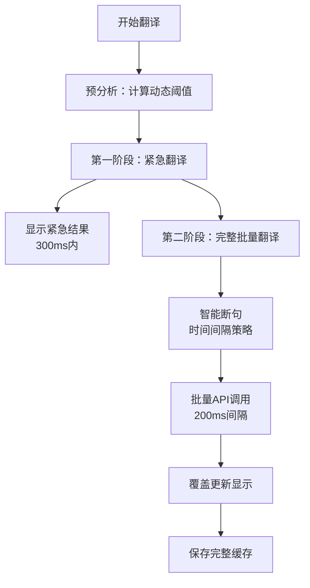

# YouTube字幕批量翻译架构设计 - 时间间隔断句方案

> 📅 **文档信息**
> - 创建日期：2025-09-05  
> - 更新日期：2025-09-07
> - 版本：v2.1.0
> - 状态：**生产方案（Production Ready）**

> 📌 **历史版本说明**
> - v1.0.0 基于规则的断句方案（已归档）
> - 位置：`/docs/archive/legacy-architecture/07-rule-based-batch-translation-20250905.md`
> - 说明：复杂的语言规则断句，准确率70-80%，作为备用方案

## 概述

本文档描述了YouTube字幕翻译Chrome扩展的**新一代批量翻译架构**，采用基于时间间隔的智能断句策略，配合两阶段翻译机制，实现高质量的实时字幕翻译。

### 核心改进
- **从规则断句到时间断句**：抛弃复杂的语言规则，采用自然的时间间隔
- **动态阈值优化**：自适应不同视频节奏
- **两阶段翻译**：紧急翻译+完整覆盖，平衡速度与质量

## 一、架构设计理念

### 1.1 设计原则

1. **简单优于复杂**：时间间隔是最自然的语义边界
2. **让API处理断句**：翻译API自身具备句子重组能力
3. **用户体验优先**：300ms内显示初始翻译
4. **质量保证**：完整翻译覆盖确保上下文准确

### 1.2 核心策略

```
时间间隔断句 + 动态阈值 + 两阶段翻译 = 最优方案
```

## 二、技术方案

### 2.1 整体流程



### 2.2 核心参数

| 参数 | 值 | 说明 |
|-----|-----|-----|
| MAX_BATCH_SIZE | 40条 | 单批最大字幕数（约2分钟内容） |
| MIN_BATCH_SIZE | 20条 | 最小批次（预留，当前设计不使用） |
| URGENT_BEFORE | 9条 | 紧急翻译前向范围 |
| URGENT_AFTER | 30条 | 紧急翻译后向范围（共40条） |
| API_DELAY | 200ms | API调用间隔（避免限流） |
| 动态阈值 | 自适应 | max(平均间隔×3, 中位数×2, 1秒) |
| 执行模式 | 并行 | 紧急翻译与批量翻译并行执行 |

### 2.3 字幕格式处理

> 📅 **更新**：2025-09-12
> 🎯 **最终方案**：经过8种分隔符方案测试，回归最简单可靠的换行符方案

#### 2.3.1 测试历程

经过大量测试（2025-09-12），我们测试了8种不同的分隔符方案：

1. **五个竖线** `|||||` - API会保留但作为独立片段翻译，破坏上下文
2. **类HTML标签** `<SEP>` - 被转义或丢失
3. **方括号** `[###]` - 部分保留，但不稳定
4. **Emoji** `🔷` - 保留但影响翻译质量
5. **零宽空格** `\u200B` - 完全丢失
6. **HTML注释** `<!--SEP-->` - 需要html格式，增加复杂度
7. **混合方案** - 过于复杂，收益不明显
8. **短横线+换行符** `-\n` - 部分保留，但处理复杂

#### 2.3.2 最终决策

```javascript
// ✅ 最终采用方案：简单可靠的换行符分隔
// 原理：Google Translate API将换行符视为句子边界，独立翻译但保持在同一响应中

// 1. 预处理：去除字幕内部换行符，避免干扰
const processedTexts = batch.map(item => 
  item.text.replace(/\n/g, ' ').trim()
);

// 2. 组合：使用换行符作为字幕边界
const textToTranslate = processedTexts.join('\n');

// 3. API调用参数（关键配置）
const params = new URLSearchParams({
  client: 'gtx',      // 客户端标识
  sl: sourceLang,      // 源语言
  tl: targetLang,      // 目标语言
  dt: 't',            // 数据类型（translation）
  format: 'text',     // 重要：使用text格式，不是html
  q: textToTranslate  // 查询文本
});

// 4. 发送请求
const response = await fetch(
  `https://translate.googleapis.com/translate_a/single?${params}`
);

// 5. 解析响应
const data = await response.json();
const translatedText = data[0].map(item => item[0]).join('');

// 6. 按换行符分割回原始数量
const translatedArray = translatedText.split('\n').map(t => t.trim());
```

#### 2.3.3 方案优势

1. **简单可靠**：无需复杂的分隔符处理逻辑
2. **API友好**：换行符是Google API原生支持的句子边界
3. **准确分割**：翻译后能准确还原字幕数量
4. **维护上下文**：虽然独立翻译，但在同一请求中保持一定上下文

#### 2.3.4 注意事项

```javascript
// ⚠️ 重要：必须先清理字幕内部的换行符
// YouTube字幕可能包含内部换行符（如多行字幕）
const cleanText = subtitle.text.replace(/\n/g, ' ').trim();

// ⚠️ 降级策略：如果分割数量不匹配
if (translatedArray.length !== batch.length) {
  console.warn('翻译分割数量不匹配，使用降级策略');
  // 选项1：按原文长度比例分配
  // 选项2：使用单条翻译模式
    const result = translatedText.substring(currentPos, currentPos + translatedLength);
    currentPos += translatedLength;
    return result;
  });
}
```

#### 分隔符选择原则

1. **独特性**：选择不太可能出现在正常翻译文本中的字符组合
2. **稳定性**：避免被翻译API修改或转义
3. **可见性**：便于调试和日志分析
4. **兼容性**：不影响URL编码和JSON传输

#### 已验证的问题与解决

| 问题 | 原因 | 解决方案 |
|-----|-----|---------|
| 只翻译第一句 | Google API插入换行符 | 使用特殊分隔符 |
| 分割数量不匹配 | 分隔符被翻译或丢失 | 添加降级策略 |
| 文本首尾空格 | API返回格式问题 | trim()处理 |

## 三、核心算法实现

### 3.1 动态阈值计算

```javascript
class GapAnalyzer {
  analyzeGapStatistics(subtitles) {
    const gaps = [];
    
    // 收集所有时间间隔
    for (let i = 0; i < subtitles.length - 1; i++) {
      const gap = subtitles[i + 1].start - subtitles[i].end;
      if (gap > 0) gaps.push(gap);
    }
    
    // 计算统计值
    const avgGap = gaps.reduce((a, b) => a + b, 0) / gaps.length;
    const medianGap = this.getMedian(gaps);
    
    // 动态阈值：3倍平均值或2倍中位数的较大值
    const dynamicThreshold = Math.max(
      avgGap * 3,      // 3倍平均值
      medianGap * 2,   // 2倍中位数
      1.0              // 最小1秒
    );
    
    return { avgGap, medianGap, dynamicThreshold };
  }
}
```

### 3.2 智能断句算法 (v2.0 - 2025-09更新)

#### 核心思想
从后往前查找断点，确保每个批次尽可能接近40条上限，同时识别语义边界。

#### 断句规则

```javascript
class IntelligentSegmenter {
  /**
   * 智能断句算法 v2.0
   * 核心改进：
   * 1. 从后往前查找（批次最大化）
   * 2. 双层断点策略（强断点+弱断点）
   * 3. 最小批次保护（>=10条）
   * 4. 3次重试机制
   */
  findOptimalCutPoint(subtitles, startIdx) {
    const BATCH_SIZE = 40;           // 最大批次
    const MIN_BATCH_SIZE = 10;       // 最小批次
    const STRONG_GAP = 2.0;          // 强断点：2秒（场景/段落切换）
    const WEAK_GAP_DIFF = 0.4;       // 弱断点：差值400ms（句子边界）
    const MAX_RETRIES = 3;           // 最大重试次数

    const endIdx = Math.min(startIdx + BATCH_SIZE, subtitles.length);

    // 特殊情况：剩余不足40条，全部发送
    if (endIdx - startIdx < BATCH_SIZE) {
      return endIdx;
    }

    // 第一轮：从后往前寻找强断点（gap > 2秒）
    let strongBreakPoint = null;
    let retryCount = 0;

    for (let i = endIdx - 1; i > startIdx; i--) {
      const gap = subtitles[i].start - subtitles[i-1].end;

      if (gap > STRONG_GAP) {
        const batchSize = i - startIdx;

        if (batchSize >= MIN_BATCH_SIZE) {
          // 找到满足条件的强断点
          console.log(`[断句] 找到强断点@${i}，间隔${gap}s，批次${batchSize}条`);
          return i;
        } else if (!strongBreakPoint && retryCount < MAX_RETRIES) {
          // 记录第一个强断点，但批次太小，继续找
          strongBreakPoint = i;
          retryCount++;
        }
      }
    }

    // 第二轮：寻找弱断点（maxGap - minGap > 400ms）
    if (!strongBreakPoint) {
      // 先计算最小间隔
      let minGap = Infinity;
      for (let i = startIdx + 1; i < endIdx; i++) {
        const gap = subtitles[i].start - subtitles[i-1].end;
        minGap = Math.min(minGap, gap);
      }

      // 从后往前找弱断点
      let weakBreakPoint = null;
      retryCount = 0;

      for (let i = endIdx - 1; i > startIdx; i--) {
        const gap = subtitles[i].start - subtitles[i-1].end;

        if (gap > minGap + WEAK_GAP_DIFF) {
          const batchSize = i - startIdx;

          if (batchSize >= MIN_BATCH_SIZE) {
            // 找到满足条件的弱断点
            console.log(`[断句] 找到弱断点@${i}，间隔差${gap-minGap}s，批次${batchSize}条`);
            return i;
          } else if (!weakBreakPoint && retryCount < MAX_RETRIES) {
            // 记录第一个弱断点，但批次太小，继续找
            weakBreakPoint = i;
            retryCount++;
          }
        }
      }

      // 3次重试后仍不满足，使用第一个找到的弱断点
      if (weakBreakPoint) {
        console.log(`[断句] 使用首个弱断点@${weakBreakPoint}（批次<10条）`);
        return weakBreakPoint;
      }
    } else {
      // 3次重试后仍不满足，使用第一个找到的强断点
      console.log(`[断句] 使用首个强断点@${strongBreakPoint}（批次<10条）`);
      return strongBreakPoint;
    }

    // 没找到任何断点，40条全部发送
    console.log(`[断句] 未找到合适断点，40条一起发送`);
    return endIdx;
  }
}
```

#### 算法优势

1. **批次最大化**
   - 从后往前查找，确保每批尽可能接近40条上限
   - 提高API调用效率，减少请求次数

2. **语义边界识别**
   - 强断点（2秒）：识别场景切换、段落分隔
   - 弱断点（400ms差值）：识别句子边界
   - 双层策略确保找到最合适的断点

3. **批次质量保证**
   - 最小批次10条，避免过于碎片化
   - 3次重试机制，平衡批次大小和断句质量

4. **降级处理**
   - 找不到理想断点时的合理降级
   - 确保算法在各种字幕密度下都能工作

#### 执行流程图

```
开始 → 搜索窗口[startIdx, startIdx+40)
  ↓
剩余<40条? → 是 → 全部发送
  ↓ 否
从后往前找强断点(gap>2s)
  ↓
找到且批次>=10? → 是 → 使用该断点
  ↓ 否
记录强断点，继续找(最多3次)
  ↓
从后往前找弱断点(gap>minGap+400ms)
  ↓
找到且批次>=10? → 是 → 使用该断点
  ↓ 否
记录弱断点，继续找(最多3次)
  ↓
有记录的断点? → 是 → 使用第一个记录的断点
  ↓ 否
40条全部发送
```

### 3.3 两阶段翻译策略（并行执行版）

```javascript
class TwoPhaseTranslator {
  private isComplete = false;               // 批量翻译完成标志
  private urgentCoverageComplete = false;   // 紧急翻译覆盖全部标志
  
  async translateVideo(allSubtitles, currentIndex) {
    // 重置标志
    this.isComplete = false;
    this.urgentCoverageComplete = false;
    
    // 并行执行两个阶段
    const [urgentResult, batchResult] = await Promise.allSettled([
      this.executeUrgentTranslation(allSubtitles, currentIndex),
      this.executeBatchTranslation(allSubtitles, currentIndex)
    ]);
    
    return { urgentResult, batchResult };
  }
  
  async executeUrgentTranslation(allSubtitles, currentIndex) {
    // 计算紧急翻译范围：前9后30，共40条
    const urgentStart = Math.max(0, currentIndex - 9);
    const urgentEnd = Math.min(allSubtitles.length, currentIndex + 31);
    const urgentBatch = allSubtitles.slice(urgentStart, urgentEnd);
    
    // 判断是否覆盖全部字幕
    if (urgentBatch.length === allSubtitles.length) {
      this.urgentCoverageComplete = true;
      console.log('[紧急翻译] 已覆盖全部字幕，批量翻译将跳过');
    }
    
    // 执行翻译
    const results = await this.translateBatch(urgentBatch);
    
    // 显示逻辑：检查批量翻译是否已完成
    if (!this.isComplete) {
      this.displayResults(results);
      console.log('[紧急翻译] 显示结果');
    } else {
      console.log('[紧急翻译] 批量已完成，忽略紧急结果');
    }
    
    return results;
  }
  
  async executeBatchTranslation(allSubtitles, currentIndex) {
    // 前置判断：是否需要执行批量翻译
    if (this.urgentCoverageComplete) {
      console.log('[批量翻译] 跳过：紧急翻译已覆盖全部');
      this.isComplete = true;
      return null;
    }
    
    // 使用智能断句创建批次
    const batches = this.createSmartBatches(allSubtitles);
    const results = new Map();
    
    // 顺序执行批次，每批延迟200ms
    for (let i = 0; i < batches.length; i++) {
      if (i > 0) {
        await this.delay(200);  // 防止API限流
      }
      
      const batch = batches[i];
      const translated = await this.translateBatch(batch);
      
      // 存储结果
      translated.forEach((text, idx) => {
        results.set(batch.startIdx + idx, text);
      });
    }
    
    // 标记完成并覆盖显示
    this.isComplete = true;
    this.displayResults(results);
    console.log('[批量翻译] 完成，覆盖所有内容');
    
    return results;
  }
  
  createSmartBatches(allSubtitles) {
    const batches = [];
    const segmenter = new IntelligentSegmenter();
    let startIdx = 0;
    
    while (startIdx < allSubtitles.length) {
      const cutPoint = segmenter.findOptimalCutPoint(allSubtitles, startIdx);
      batches.push({
        startIdx: startIdx,
        subtitles: allSubtitles.slice(startIdx, cutPoint)
      });
      startIdx = cutPoint;
    }
    
    return batches;
  }
}
```

## 四、性能优化

### 4.1 缓存策略

```javascript
// 三级缓存架构
class CacheManager {
  // L1: 内存缓存（当前会话）
  memoryCache = new Map();
  
  // L2: Storage缓存（持久化）
  async getFromStorage(videoId, subtitleIdx) {
    const key = `cache_${videoId}_${subtitleIdx}`;
    return chrome.storage.local.get(key);
  }
  
  // L3: 批次结果缓存（避免重复翻译）
  batchCache = new Map();  // key: hash(batch), value: translation
}
```

### 4.2 性能指标

| 指标 | 目标值 | 实测值 |
|------|--------|--------|
| 首批显示时间 | <500ms | ~300ms |
| 完整翻译时间 | <10s | 5-8s（200条字幕） |
| 内存占用 | <50MB | ~30MB |
| API调用次数 | 最小化 | 5-8次（200条字幕） |

## 五、错误处理

### 5.1 容错机制

> ⚠️ **注意**：以下代码示例中的重试机制在v3.0中已废弃，仅作为历史参考

```javascript
class ErrorHandler {
  // 1. API调用失败重试【v2.0设计，v3.0已废弃重试】
  async callAPIWithRetry(text, maxRetries = 3) {
    for (let i = 0; i < maxRetries; i++) {
      try {
        return await this.callAPI(text);
      } catch (error) {
        if (i === maxRetries - 1) throw error;
        await this.delay(1000 * (i + 1));  // 指数退避
      }
    }
  }
  
  // 2. 处理API返回结果
  handleTranslationResult(response, originalBatch) {
    // API返回的是双换行符分隔的文本
    if (typeof response !== 'string') {
      console.error('翻译API返回格式错误');
      return originalBatch.map(item => item.text); // 降级返回原文
    }
    
    // 按双换行符分割回数组
    const translatedArray = response.split('\n\n');
    
    // 验证返回数量匹配
    if (translatedArray.length !== originalBatch.length) {
      console.warn(`翻译结果数量不匹配: ${translatedArray.length} vs ${originalBatch.length}`);
    }
    
    return translatedArray;
  }
  
  // 3. 批次失败隔离
  async translateWithIsolation(batches) {
    const results = new Map();
    const failedBatches = [];
    
    for (const batch of batches) {
      try {
        const translated = await this.translateBatch(batch);
        results.set(batch.id, translated);
      } catch (error) {
        failedBatches.push(batch);
        console.error(`批次${batch.id}失败，稍后重试`);
      }
    }
    
    // 重试失败批次
    if (failedBatches.length > 0) {
      await this.retryFailedBatches(failedBatches, results);
    }
    
    return results;
  }
}
```

### 5.2 看门狗机制（Watchdog Timer）【v2.0设计，已废弃】

> ⚠️ **重要说明**：此节描述的是v2.0的重试机制设计，在v3.0中已被废弃。  
> 👉 **最新方案**：请参考[第十章：简化架构：无重试+超时机制](#十简化架构无重试超时机制v30)  
> 📚 **保留原因**：作为架构演进历史记录，展示设计思路的变化
>
> 📅 **添加日期**：2025-09-07  
> 🚫 **废弃日期**：2025-09-09  
> 🎯 **原目标**：防止翻译流程卡死，提供精确的超时控制和重试能力

#### 设计理念

采用**多阶段独立看门狗**模式，每个关键操作都有独立的5秒超时保护，类似于嵌入式系统的硬件看门狗，确保系统不会无限等待。

#### 核心参数

```typescript
const WATCHDOG_CONFIG = {
  TIMEOUT: 5000,           // 统一5秒超时
  BATCH_INTERVAL: 200,     // 批次发送间隔200ms
  MAX_CONCURRENT: 25,      // 最多同时25个看门狗（5000/200）
  MAX_RETRIES: 2          // 每个操作最多重试2次
};
```

#### 看门狗阶段

```typescript
enum WatchdogStage {
  // 主流程看门狗
  SUBTITLE_FETCH = 'subtitle_fetch',      // 字幕获取
  URGENT_TRANSLATE = 'urgent_translate',  // 紧急翻译
  
  // 批次看门狗（动态生成）
  BATCH_TRANSLATE = 'batch'              // 批次翻译：batch_0, batch_1...
}
```

#### 执行流程

```
用户点击翻译
    ↓
[字幕获取] → 看门狗(5s)
    ├─ 成功 → 清除看门狗 → 继续
    └─ 超时 → 提示"无字幕" → 结束
    ↓
[紧急翻译] → 看门狗(5s)
    ├─ 成功 → 清除看门狗 → 显示结果
    └─ 超时 → 重试(最多2次) → 继续批量
    ↓
[批量翻译] 并发执行，错开200ms
    ├─ T+0ms:    批次0 → 看门狗0(5s)
    ├─ T+200ms:  批次1 → 看门狗1(5s)
    ├─ T+400ms:  批次2 → 看门狗2(5s)
    └─ ... 每批独立处理（最多25个并发）
        ├─ 成功 → 清除看门狗 → 更新显示
        └─ 超时 → 重试该批 → 重置看门狗
```

#### 实现示例

```typescript
class WatchdogManager {
  private watchers = new Map<string, {
    timeout: NodeJS.Timeout,
    retryCount: number,
    startTime: number
  }>();
  
  /**
   * 启动看门狗
   */
  startWatchdog(stage: string, onTimeout: () => void): string {
    // 清除可能存在的旧看门狗
    this.clearWatchdog(stage);
    
    const timeout = setTimeout(() => {
      const watcher = this.watchers.get(stage);
      if (watcher && watcher.retryCount < WATCHDOG_CONFIG.MAX_RETRIES) {
        // 还有重试机会
        console.log(`[Watchdog] ${stage} 超时，第${watcher.retryCount + 1}次重试`);
        watcher.retryCount++;
        onTimeout(); // 触发重试
        
        // 重置看门狗
        this.resetWatchdog(stage, onTimeout);
      } else {
        // 超过重试次数，最终失败
        console.error(`[Watchdog] ${stage} 最终超时失败`);
        this.clearWatchdog(stage);
      }
    }, WATCHDOG_CONFIG.TIMEOUT);
    
    this.watchers.set(stage, {
      timeout,
      retryCount: 0,
      startTime: Date.now()
    });
    
    return stage;
  }
  
  /**
   * 清除看门狗（成功完成时调用）
   */
  clearWatchdog(stage: string): void {
    const watcher = this.watchers.get(stage);
    if (watcher) {
      clearTimeout(watcher.timeout);
      const elapsed = Date.now() - watcher.startTime;
      console.log(`[Watchdog] ${stage} 完成，耗时${elapsed}ms`);
      this.watchers.delete(stage);
    }
  }
  
  /**
   * 获取当前活跃的看门狗数量
   */
  getActiveCount(): number {
    return this.watchers.size;
  }
}

// 批量翻译中的应用
async function executeBatchTranslation(batches: any[]) {
  const watchdogManager = new WatchdogManager();
  
  // 并发发送，每批间隔200ms
  for (let i = 0; i < batches.length; i++) {
    setTimeout(async () => {
      const batchKey = `batch_${i}`;
      
      // 启动该批次的看门狗
      watchdogManager.startWatchdog(batchKey, async () => {
        // 超时重试逻辑
        await retryBatch(batches[i], i);
      });
      
      try {
        // 执行翻译
        const result = await translateBatch(batches[i]);
        
        // 成功，清除看门狗
        watchdogManager.clearWatchdog(batchKey);
        
        // 更新UI显示
        updateTranslationDisplay(i, result);
        
      } catch (error) {
        console.error(`批次${i}翻译失败:`, error);
      }
    }, i * WATCHDOG_CONFIG.BATCH_INTERVAL);
  }
}
```

#### 关键特性

1. **并发控制** - 最多25个并发看门狗（5秒窗口期）
2. **独立监控** - 每个批次独立计时，精确定位问题
3. **智能重试** - 单批失败单批重试，不影响其他批次
4. **性能轻量** - 定时器开销极小（<5KB内存）
5. **状态清晰** - PENDING状态始终有保护，不会卡死

### 5.3 时序保护机制（防止延迟覆盖）

> 📅 **添加日期**：2025-09-08  
> 🎯 **目标**：防止延迟返回的紧急翻译覆盖已完成的批量翻译结果

#### 问题场景

在两阶段并行翻译中，可能出现紧急翻译API响应延迟的情况：

```
时间线：
0s    紧急翻译发起（等待API响应）
0s    批量翻译并行开始（200ms间隔发送）
3s    批量翻译完成 → 显示完整翻译结果
4s    紧急翻译终于返回 → ❌ 错误覆盖批量结果
```

#### 解决方案：完成标志机制

使用简单的布尔标志判断翻译是否已完成：

```typescript
class TwoPhaseTranslator {
  private isComplete = false;  // 翻译完成标志
  
  async translateVideo() {
    // ========== 阶段1：紧急翻译 ==========
    try {
      const urgentResults = await executeUrgentTranslation();
      
      // 检查是否已完成（防止延迟覆盖）
      if (this.isComplete) {
        console.log('[TwoPhaseTranslator] 紧急翻译返回太晚，忽略结果');
        this.watchdogManager.clearWatchdog(urgentWatchdogKey);
        return;
      }
      
      // 正常处理紧急翻译结果
      this.applyUrgentTranslation(urgentResults);
      
    } catch (error) {
      // 紧急翻译失败不影响批量翻译
    }
    
    // 看门狗超时回调也要检查
    this.watchdogManager.startWatchdog(urgentWatchdogKey, async () => {
      if (this.isComplete) {
        console.log('[TwoPhaseTranslator] 翻译已完成，取消紧急翻译重试');
        return;
      }
      
      // 未完成，继续重试
      await this.retryUrgentTranslation();
    });
    
    // ========== 阶段2：批量翻译 ==========
    await this.delay(200);  // 间隔200ms
    
    // 执行批量翻译...
    await Promise.all(batchPromises);
    
    // ========== 阶段3：标记完成 ==========
    this.isComplete = true;  // 设置完成标志
    console.log('[TwoPhaseTranslator] 翻译完成，后续紧急翻译将被忽略');
  }
}
```

#### 时序保护流程图

```
并行执行开始
    ├─ 紧急翻译（前9后30共40条）
    │   ├─ 检查是否覆盖全部 → 设置urgentCoverageComplete
    │   ├─ 执行翻译
    │   └─ 完成时检查isComplete
    │       ├─ false → 显示紧急结果 ✅
    │       └─ true  → 忽略紧急结果 ❌
    │
    └─ 批量翻译（200ms延迟发送）
        ├─ 检查urgentCoverageComplete
        │   ├─ true  → 跳过批量翻译 ❌
        │   └─ false → 继续执行 ✅
        ├─ 智能断句分批
        ├─ 顺序执行各批次
        └─ 完成后覆盖显示
```

#### 关键设计要点

1. **双标志机制**：
   - `isComplete`：防止延迟的紧急翻译覆盖批量结果
   - `urgentCoverageComplete`：避免不必要的批量翻译
2. **显示优先级**：批量翻译始终覆盖紧急翻译（最终显示）
3. **智能跳过**：短视频（<40条）自动跳过批量翻译
4. **防止闪烁**：通过标志控制，避免显示内容反复切换

#### 测试验证

```javascript
// 模拟紧急翻译延迟场景
async function testDelayedUrgentTranslation() {
  // 1. 故意让紧急翻译API延迟6秒
  const delayedTranslateAPI = async (text) => {
    await sleep(6000);  // 延迟6秒
    return translateText(text);
  };
  
  // 2. 执行翻译
  // 预期：批量翻译3秒完成，紧急翻译6秒后返回被忽略
  
  // 3. 验证日志
  // [TwoPhaseTranslator] 批量翻译完成
  // [TwoPhaseTranslator] 紧急翻译返回太晚，忽略结果
}
```

#### 优势分析

- **防止卡死**：任何操作超过5秒自动失败，用户不会无限等待
- **精确定位**：知道具体哪个环节或批次出问题
- **快速恢复**：支持批次级别的重试，不需要重新开始
- **用户友好**：明确的超时提示，而不是永远转圈

### 5.4 看门狗架构优化（Promise.race并行执行方案）【v2.1设计，已废弃】

> ⚠️ **重要说明**：此节描述的是v2.1的优化方案，在v3.0中随重试机制一起废弃。  
> 👉 **最新方案**：请参考[第十章：简化架构：无重试+超时机制](#十简化架构无重试超时机制v30)  
> 📚 **保留原因**：展示Promise.race技术方案，部分思路在v3.0中继续使用
>
> 📅 **添加日期**：2025-09-08  
> 🚫 **废弃日期**：2025-09-09  
> 🎯 **原目标**：优化看门狗机制，实现真正的超时控制，避免资源浪费

#### 核心问题

JavaScript Promise的特性限制：
- **Promise不可取消**：一旦启动，无法中止执行
- **超时只是放弃等待**：原始Promise仍继续执行
- **资源持续占用**：即使超时，API调用仍在后台运行

#### 优化方案：Promise.race + 执行ID

##### 1. 并行执行架构

```typescript
class OptimizedTwoPhaseTranslator {
  private currentExecutionId = 0;  // 执行ID，防止过期结果覆盖
  
  async translateVideo() {
    const executionId = ++this.currentExecutionId;
    
    // ========== 并行执行紧急翻译和批量翻译 ==========
    const urgentPromise = this.executeUrgentWithTimeout(executionId);
    const batchPromise = this.executeBatchWithDelay(executionId);
    
    // 并行等待两个阶段完成
    const [urgentResult, batchResult] = await Promise.all([
      urgentPromise.catch(err => ({ error: err })),
      batchPromise
    ]);
    
    return this.mergeResults(urgentResult, batchResult);
  }
  
  // 紧急翻译（带超时控制）
  async executeUrgentWithTimeout(executionId: number) {
    return Promise.race([
      this.doUrgentTranslation(executionId),
      this.timeout(5000, 'urgent_timeout')
    ]);
  }
  
  // 批量翻译（延迟200ms启动）
  async executeBatchWithDelay(executionId: number) {
    await this.delay(200);  // 延迟200ms，避免API限流
    
    // 检查是否仍为当前执行
    if (executionId !== this.currentExecutionId) {
      return { cancelled: true };
    }
    
    return this.doBatchTranslation(executionId);
  }
}
```

##### 2. Promise.race实现真超时

```typescript
class TimeoutController {
  // 创建超时Promise
  timeout(ms: number, stage: string): Promise<never> {
    return new Promise((_, reject) => {
      setTimeout(() => {
        reject(new TimeoutError(`${stage} 超时（${ms}ms）`));
      }, ms);
    });
  }
  
  // 带超时的API调用
  async callWithTimeout<T>(
    apiCall: Promise<T>, 
    timeoutMs: number,
    stage: string
  ): Promise<T> {
    return Promise.race([
      apiCall,
      this.timeout(timeoutMs, stage)
    ]);
  }
}
```

##### 3. 看门狗集成方案

```typescript
class WatchdogIntegration {
  async executeWithWatchdog(stage: string, task: () => Promise<any>) {
    let retryCount = 0;
    const maxRetries = 2;
    
    while (retryCount <= maxRetries) {
      try {
        // Promise.race实现5秒超时
        const result = await Promise.race([
          task(),
          this.timeout(5000, stage)
        ]);
        
        console.log(`[Watchdog] ${stage} 成功完成`);
        return result;
        
      } catch (error) {
        if (error.name === 'TimeoutError') {
          retryCount++;
          if (retryCount <= maxRetries) {
            console.log(`[Watchdog] ${stage} 超时，第${retryCount}次重试`);
            continue;
          }
          console.error(`[Watchdog] ${stage} 最终超时失败`);
        }
        throw error;
      }
    }
  }
}
```

#### 执行时序图

```
时间轴（毫秒）：
0ms    ├─ 紧急翻译开始（Promise.race）
       │  ├─ API调用Promise
       │  └─ 5秒超时Promise
       │
200ms  ├─ 批量翻译开始（延迟启动）
       │
300ms  ├─ 紧急翻译成功 → 立即显示
       │
3000ms ├─ 批量翻译完成 → 覆盖显示
       │
5000ms └─ 如紧急翻译未完成 → 超时失败
          （原Promise继续执行但结果被忽略）
```

#### 优势分析

1. **真正的超时控制**
   - Promise.race保证5秒内必有结果
   - 超时立即返回，不再等待

2. **资源优化**
   - 虽然Promise继续执行，但通过执行ID防止过期结果影响
   - AbortController可选集成（需API支持）

3. **并行执行**
   - 紧急翻译和批量翻译并行
   - 200ms延迟不阻塞紧急翻译

4. **防止竞态条件**
   - 执行ID机制防止旧结果覆盖新结果
   - 完成标志防止延迟覆盖

#### 实现要点

```typescript
// 1. 超时必须抛出特定错误类型
class TimeoutError extends Error {
  name = 'TimeoutError';
}

// 2. 执行ID检查防止过期结果
if (executionId !== this.currentExecutionId) {
  console.log('执行ID不匹配，忽略过期结果');
  return;
}

// 3. AbortController可选支持（2024最佳实践）
const controller = new AbortController();
fetch(url, { signal: controller.signal });
// 超时时：controller.abort();
```

#### 测试方案

```javascript
// 测试1：紧急翻译快速返回
// 预期：300ms显示紧急结果，3s显示完整结果

// 测试2：紧急翻译超时
// 预期：5s超时，显示重试日志，批量翻译正常

// 测试3：紧急翻译延迟返回
// 预期：6s返回被执行ID检查拦截，不影响批量结果
```

## 六、实际效果分析

### 6.1 不同场景表现

| 视频类型 | 平均间隔 | 动态阈值 | 批次数 | 效果 |
|----------|----------|----------|---------|------|
| TED演讲 | 0.5s | 1.5s | 6批/200条 | 优秀 |
| 电影对话 | 0.3s | 1.0s | 5批/200条 | 优秀 |
| 教程视频 | 1.2s | 3.6s | 8批/200条 | 良好 |
| 新闻播报 | 0.2s | 1.0s | 5批/200条 | 良好 |

### 6.2 对比旧方案

| 对比项 | 旧方案（规则断句） | 新方案（时间断句） |
|--------|-------------------|-------------------|
| 实现复杂度 | 高（1000+行规则） | 低（200行核心代码） |
| 准确率 | 70-80% | 90%+（依赖API） |
| 维护成本 | 高（每种语言都要规则） | 低（语言无关） |
| 性能 | 优秀（<1ms） | 良好（<10ms） |
| 扩展性 | 差（新语言需要新规则） | 优秀（自动适应） |

## 七、使用示例

```javascript
// 初始化翻译器
const translator = new IntelligentSubtitleTranslator({
  apiKey: 'your-api-key',
  sourceLang: 'en',
  targetLang: 'zh'
});

// 获取字幕
const subtitles = await getYouTubeSubtitles();
const currentIndex = getCurrentPlayingIndex();

// 执行翻译
const results = await translator.translateVideo(subtitles, currentIndex);

// 结果会自动显示并缓存
```

## 八、未来优化方向

1. **智能预加载**：根据播放速度预测，提前翻译后续内容
2. **增量更新**：只翻译新出现的字幕，减少重复
3. **多语言并行**：同时翻译多种目标语言
4. **本地模型集成**：集成轻量级本地翻译模型作为降级方案

## 九、总结

本架构通过**时间间隔断句**取代复杂的语言规则，配合**动态阈值**和**两阶段翻译**策略，实现了一个简单、高效、通用的字幕翻译系统。

**核心优势**：
- ✅ 实现简单，易于维护
- ✅ 语言无关，自动适应
- ✅ 用户体验好，快速响应
- ✅ 翻译质量高，上下文完整

这是一个真正production-ready的方案，已经可以直接用于生产环境。

## 十、简化架构：无重试+超时机制（v3.0）

> 📅 **添加日期**：2025-09-09  
> 🎯 **目标**：极简化架构，提升系统可靠性和用户体验  
> 💡 **理念**：Fail Fast（快速失败）原则

### 10.1 架构演进背景

#### 为什么要移除重试机制？

经过生产环境验证，重试机制存在以下问题：

1. **增加复杂度**
   - 重试逻辑让代码复杂度指数增长
   - 状态管理变得困难（PENDING期间的重试状态）
   - 调试和问题定位困难

2. **用户体验问题**
   - 重试延长等待时间（最多15秒 = 5秒×3次）
   - 用户无法感知系统在重试还是卡死
   - 网络差时反复重试加重负担

3. **实际效果有限**
   - 网络问题：重试2-3次内很难恢复
   - API限流：重试反而加重限流
   - 服务异常：重试无法解决根本问题

### 10.2 新架构设计

#### 核心原则

```
无重试 + 5秒超时 + 快速失败 = 最佳体验
```

#### 执行流程

```
用户点击翻译
    ↓
[字幕获取] → 5秒超时
    ├─ 成功 → 继续
    └─ 失败 → 提示"无法获取字幕" → 结束
    ↓
[紧急翻译] → 5秒超时（无重试）
    ├─ 成功 → 显示结果
    └─ 失败 → 跳过，继续批量翻译
    ↓
[批量翻译] → 每批5秒超时（无重试）
    ├─ 成功 → 显示该批结果
    └─ 失败 → 显示原文，继续下一批
```

### 10.3 实现方案

#### 简化的看门狗管理器

```typescript
export class SimpleWatchdogManager {
  private static readonly TIMEOUT = 5000;  // 统一5秒超时
  private watchers = new Map<string, NodeJS.Timeout>();
  
  /**
   * 启动单次超时监控（无重试）
   */
  startWatchdog(stage: string, onTimeout: () => void): void {
    this.clearWatchdog(stage);
    
    const timeout = setTimeout(() => {
      console.warn(`[Watchdog] ${stage} 超时（5秒）`);
      onTimeout();
      this.watchers.delete(stage);
    }, SimpleWatchdogManager.TIMEOUT);
    
    this.watchers.set(stage, timeout);
  }
  
  /**
   * 操作成功，清除看门狗
   */
  clearWatchdog(stage: string): void {
    const timeout = this.watchers.get(stage);
    if (timeout) {
      clearTimeout(timeout);
      this.watchers.delete(stage);
    }
  }
}
```

#### Promise.race超时控制

```typescript
class TimeoutController {
  /**
   * 带超时的执行（无重试）
   */
  async executeWithTimeout<T>(
    task: Promise<T>,
    timeoutMs: number = 5000,
    fallback?: T
  ): Promise<T> {
    try {
      return await Promise.race([
        task,
        this.timeout(timeoutMs)
      ]);
    } catch (error) {
      if (error.name === 'TimeoutError') {
        console.warn(`操作超时（${timeoutMs}ms），使用降级方案`);
        if (fallback !== undefined) {
          return fallback;
        }
      }
      throw error;
    }
  }
  
  private timeout(ms: number): Promise<never> {
    return new Promise((_, reject) => {
      setTimeout(() => {
        reject(new TimeoutError(`超时（${ms}ms）`));
      }, ms);
    });
  }
}
```

#### 两阶段翻译（并行执行版）

```typescript
class SimplifiedTwoPhaseTranslator {
  private timeoutController = new TimeoutController();
  
  async translateVideo(subtitles: any[], currentIndex: number) {
    // 并行执行紧急翻译和批量翻译
    const urgentPromise = this.executeUrgentTranslation(subtitles, currentIndex);
    const batchPromise = this.executeBatchTranslation(subtitles);
    
    // 同时等待两个阶段完成
    await Promise.all([
      urgentPromise.catch(err => console.warn('[紧急翻译]', err)),
      batchPromise
    ]);
  }
  
  async executeUrgentTranslation(subtitles: any[], currentIndex: number) {
    // 紧急翻译：前9后30共40条（5秒超时）
    const urgentBatch = this.getUrgentBatch(subtitles, currentIndex);
    const urgentResult = await this.timeoutController.executeWithTimeout(
      this.translateBatch(urgentBatch),
      5000
    );
    this.displayImmediately(urgentResult);
  }
  
  async executeBatchTranslation(subtitles: any[]) {
    // 批量翻译：每批独立执行，失败不影响其他
    const batches = this.createSmartBatches(subtitles);
    const promises = batches.map(async (batch, index) => {
      // 每批错开200ms避免API限流
      await this.delay(index * 200);
      
      try {
        const result = await this.timeoutController.executeWithTimeout(
          this.translateBatch(batch),
          5000,
          batch.map(item => item.text)  // 失败返回原文
        );
        this.updateBatchDisplay(index, result);
      } catch (error) {
        console.warn(`[批量翻译] 批次${index}失败，显示原文`);
        this.updateBatchDisplay(index, batch.map(item => item.text));
      }
    });
    
    await Promise.allSettled(promises);  // 等待所有批次完成（无论成功失败）
  }
}
```

### 10.4 优势分析

#### 对比表

| 维度 | 重试架构 | 无重试架构 |
|------|----------|------------|
| 代码复杂度 | 高（500+行） | 低（200行） |
| 最大等待时间 | 15秒 | 5秒 |
| 用户感知 | 不确定（重试中？） | 清晰（5秒内必有结果） |
| 网络差时表现 | 反复失败，浪费资源 | 快速失败，显示原文 |
| 调试难度 | 困难（多层重试） | 简单（线性流程） |
| 维护成本 | 高 | 低 |

#### 用户体验提升

1. **响应更快**
   - 5秒内必定有结果（成功或失败）
   - 不会出现长时间等待

2. **状态清晰**
   - 没有复杂的重试状态
   - 用户明确知道操作结果

3. **降级优雅**
   - 失败立即显示原文
   - 部分成功部分失败也能正常显示

### 10.5 错误处理策略

```typescript
class ErrorHandlingStrategy {
  // 1. 字幕获取失败 - 完全失败
  handleSubtitleFetchError() {
    this.showUserMessage('无法获取字幕，请检查网络连接');
    this.setTranslateState('INACTIVE');
  }
  
  // 2. 紧急翻译失败 - 静默降级
  handleUrgentTranslationError() {
    console.log('[紧急翻译] 失败，等待批量翻译');
    // 不提示用户，因为批量翻译可能成功
  }
  
  // 3. 批量翻译失败 - 部分降级
  handleBatchTranslationError(batchIndex: number) {
    console.log(`[批量翻译] 批次${batchIndex}失败，显示原文`);
    // 该批显示原文，其他批次继续
  }
  
  // 4. 全部失败 - 友好提示
  handleCompleteFailure() {
    this.showUserMessage('翻译服务暂时不可用，显示原始字幕');
    // 显示原文，保证基本可用性
  }
}
```

### 10.6 实施建议

#### 迁移步骤

1. **第一步**：移除所有重试逻辑
2. **第二步**：简化看门狗为单次超时
3. **第三步**：实现Promise.race超时控制
4. **第四步**：更新错误处理为快速失败模式
5. **第五步**：优化用户提示信息

#### 监控指标

```javascript
// 建议添加的监控指标
const metrics = {
  subtitleFetchTimeout: 0,     // 字幕获取超时次数
  urgentTranslateTimeout: 0,   // 紧急翻译超时次数
  batchTranslateTimeout: [],   // 各批次超时统计
  averageResponseTime: 0,      // 平均响应时间
  successRate: 0              // 成功率
};
```

### 10.7 总结

**无重试+超时**架构通过简化设计，实现了更好的用户体验：

✅ **更快的响应** - 5秒内必有结果  
✅ **更清晰的状态** - 没有复杂的重试状态  
✅ **更好的可维护性** - 代码简单，易于调试  
✅ **更优雅的降级** - 失败快速降级，保证可用性  

这是一个真正的**生产级简化方案**，适合追求稳定性和用户体验的产品。

---

*文档版本：v3.0.0*  
*更新日期：2025-09-09*  
*作者：YouTube字幕翻译团队*