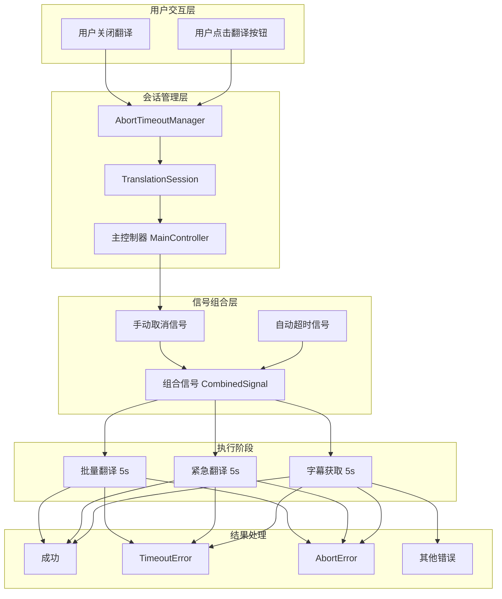
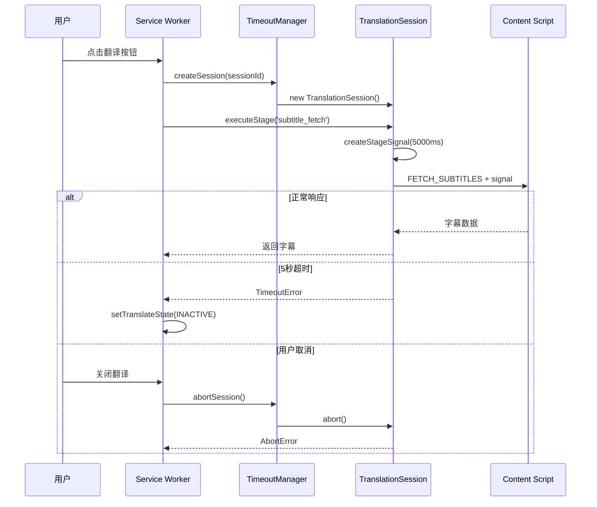
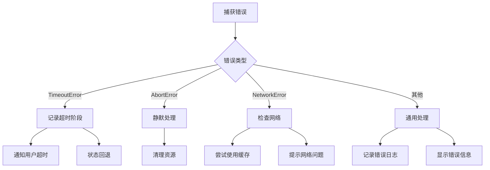

# 基于AbortController的超时架构设计 v4.0

## 1. 概述

### 1.1 背景问题
当前系统使用SimpleWatchdogManager实现超时控制，存在致命缺陷：
- **无法中断执行流**：超时回调是异步的，主流程继续执行
- **状态不同步**：超时后状态更新了但UI没有响应
- **资源泄漏**：超时后的操作仍在后台运行
- **用户体验差**：关闭翻译不能立即停止

### 1.2 解决方案
采用W3C标准的AbortController + AbortSignal.timeout()组合方案，实现真正的操作取消和超时控制。

### 1.3 核心优势
- ✅ **真正中断执行**：超时或取消都能立即停止操作
- ✅ **统一信号管理**：一个主控制器管理整个会话
- ✅ **精确错误定位**：清楚知道哪个阶段出问题
- ✅ **优雅降级策略**：每个阶段可设置fallback
- ✅ **自动资源清理**：避免内存泄漏

## 2. 架构设计

### 2.1 整体架构图



### 2.2 时序图



## 3. 核心组件

### 3.1 AbortTimeoutManager
管理所有翻译会话的生命周期。

```typescript
export class AbortTimeoutManager {
  private controllers = new Map<string, SessionInfo>();
  
  // 创建新会话
  createSession(sessionId: string): TranslationSession
  
  // 取消特定会话
  abortSession(sessionId: string): void
  
  // 清理所有会话
  cleanup(): void
  
  // 获取活跃会话数
  getActiveSessionCount(): number
}
```

### 3.2 TranslationSession
封装单个翻译会话的超时控制。

```typescript
export class TranslationSession {
  // 为阶段创建组合信号
  createStageSignal(stage: string, timeoutMs: number): AbortSignal
  
  // 执行带超时的阶段任务
  executeStage<T>(
    stage: string,
    operation: (signal: AbortSignal) => Promise<T>,
    options?: StageOptions
  ): Promise<T>
  
  // 手动取消会话
  abort(): void
  
  // 检查是否已取消
  isAborted(): boolean
}
```

### 3.3 信号组合策略

```typescript
// 基础超时信号
const timeoutSignal = AbortSignal.timeout(5000);

// 手动控制信号
const controller = new AbortController();
const manualSignal = controller.signal;

// 组合信号：手动取消 OR 自动超时
const combinedSignal = AbortSignal.any([
  manualSignal,
  timeoutSignal
]);
```

## 4. 阶段超时配置

### 4.1 超时时间设置

> 📅 **更新**: 2025-10-07 - 批量翻译策略调整

| 阶段 | 超时时间 | 降级策略 | 说明 |
|-----|---------|---------|-----|
| 字幕获取 | 5秒 | 无fallback | 必须阶段，失败终止流程 |
| 紧急翻译 | 30秒 | 返回空数组 | 可选阶段，失败显示警告并继续批量 |
| 批量翻译 | 动态计算 | 无fallback | 关键阶段，任何批次失败立即终止 |
| API调用 | 3-15秒 | 视服务而定 | 网络请求，根据服务类型调整 |

### 4.2 降级策略详解

```typescript
interface StageOptions {
  timeoutMs?: number;      // 超时时间，默认5000ms
  fallback?: T;            // 降级返回值
  retryable?: boolean;     // 是否可重试（v4.0禁用）
  critical?: boolean;      // 是否关键阶段
}

// 使用示例（最新实现）

// 1. 紧急翻译 - 有fallback，失败继续
const urgentResults = await session.executeStage(
  'urgent_translate',
  async (signal) => translator.translateUrgent(...),
  {
    timeoutMs: 30000,
    fallback: []  // 失败返回空数组，显示警告但继续
  }
);

// 2. 批量翻译 - 无fallback，失败立即抛错
const batchResults = await session.executeStage(
  'batch_translate',
  async (signal) => translator.translateBatch(...),
  {
    timeoutMs: batchTotalTimeout
    // 不设置fallback，让错误向上抛出，立即终止
  }
);

// 3. 字幕获取 - 关键阶段，失败终止
const subtitles = await session.executeStage(
  'subtitle_fetch',
  fetchOperation,
  {
    timeoutMs: 5000,
    critical: true  // 关键阶段，失败终止整个流程
  }
);
```

## 5. 错误处理体系

### 5.1 错误类型定义

```typescript
// 阶段超时错误
class StageTimeoutError extends Error {
  name = 'StageTimeoutError';
  stage: string;          // 超时阶段
  timeoutMs: number;      // 超时时间
  elapsed: number;        // 实际耗时
}

// 会话取消错误
class SessionAbortError extends Error {
  name = 'SessionAbortError';
  sessionId: string;      // 会话ID
  stage: string;          // 取消时的阶段
  reason: string;         // 取消原因
}

// 网络错误
class NetworkError extends Error {
  name = 'NetworkError';
  statusCode?: number;
  endpoint?: string;
}
```

### 5.2 错误处理流程



## 6. 消息传递改造

### 6.1 支持信号的消息传递

```typescript
// 发送消息时传递信号
async function sendMessageWithSignal<T>(
  tabId: number,
  message: any,
  signal: AbortSignal
): Promise<T> {
  return new Promise((resolve, reject) => {
    // 预检查
    if (signal.aborted) {
      reject(new AbortError('Already aborted'));
      return;
    }
    
    // 监听取消
    const abortHandler = () => {
      reject(new AbortError('Message cancelled'));
    };
    signal.addEventListener('abort', abortHandler);
    
    // 发送消息
    chrome.tabs.sendMessage(tabId, message, (response) => {
      signal.removeEventListener('abort', abortHandler);
      
      if (signal.aborted) {
        reject(new AbortError('Aborted during response'));
      } else if (chrome.runtime.lastError) {
        reject(new Error(chrome.runtime.lastError.message));
      } else {
        resolve(response);
      }
    });
  });
}
```

### 6.2 Content Script响应取消

```typescript
// content-script.ts
chrome.runtime.onMessage.addListener((message, sender, sendResponse) => {
  if (message.type === 'FETCH_SUBTITLES') {
    // 创建本地AbortController
    const controller = new AbortController();
    
    // 监听取消消息
    const cancelListener = (msg) => {
      if (msg.type === 'CANCEL_FETCH' && msg.id === message.id) {
        controller.abort();
      }
    };
    chrome.runtime.onMessage.addListener(cancelListener);
    
    // 执行异步操作
    fetchSubtitles(message.videoId, controller.signal)
      .then(sendResponse)
      .catch(error => {
        if (error.name === 'AbortError') {
          sendResponse({ cancelled: true });
        } else {
          sendResponse({ error: error.message });
        }
      })
      .finally(() => {
        chrome.runtime.onMessage.removeListener(cancelListener);
      });
    
    return true; // 异步响应
  }
});
```

## 7. 实施计划

### 7.1 Phase 1: 基础设施（Day 1）
- [x] 创建abort-timeout-controller.ts基础实现
- [ ] 创建AbortTimeoutManager类
- [ ] 创建TranslationSession类
- [ ] 定义错误类型体系

### 7.2 Phase 2: 核心改造（Day 2-3）
- [ ] 改造handleToggleTranslate使用会话管理
- [ ] 实现sendMessageWithSignal
- [ ] 改造TwoPhaseTranslator支持信号
- [ ] 更新content-script响应机制

### 7.3 Phase 3: 测试验证（Day 4）
- [ ] 单元测试各组件
- [ ] 集成测试超时场景
- [ ] 测试用户取消流程
- [ ] 验证资源清理

### 7.4 Phase 4: 优化完善（Day 5）
- [ ] 性能优化
- [ ] 日志优化
- [ ] 错误提示优化
- [ ] 文档更新

## 8. 测试场景

### 8.1 超时测试矩阵

| 场景 | 字幕获取 | 紧急翻译 | 批量翻译 | 预期结果 |
|-----|---------|---------|---------|---------|
| 正常流程 | ✓ | ✓ | ✓ | 完整翻译显示 |
| 字幕超时 | ✗ | - | - | 显示超时提示，状态INACTIVE |
| 紧急超时 | ✓ | ✗ | ✓ | 跳过紧急，显示批量翻译 |
| 批量超时 | ✓ | ✓ | ✗ | 显示紧急翻译+原文 |
| 用户取消 | 任意阶段 | - | - | 立即停止，静默处理 |

### 8.2 测试代码示例

```typescript
// 测试字幕获取超时
async function testSubtitleTimeout() {
  // 模拟6秒延迟
  const mockFetch = () => new Promise(resolve => 
    setTimeout(resolve, 6000)
  );
  
  const session = manager.createSession('test');
  
  try {
    await session.executeStage(
      'subtitle_fetch',
      mockFetch,
      { timeoutMs: 5000 }
    );
    assert.fail('Should timeout');
  } catch (error) {
    assert(error instanceof StageTimeoutError);
    assert(error.stage === 'subtitle_fetch');
    assert(error.timeoutMs === 5000);
  }
}
```

## 9. 性能影响

### 9.1 内存占用
- 每个会话：~2KB（Controller + Signal + Metadata）
- 典型场景：1-2个活跃会话
- 最大占用：< 10KB

### 9.2 CPU开销
- 信号创建：< 1ms
- 超时检查：原生实现，几乎无开销
- 清理操作：< 1ms

### 9.3 对比当前方案

| 指标 | SimpleWatchdog | AbortController | 改善 |
|-----|---------------|-----------------|------|
| 超时准确性 | 回调延迟 | 精确控制 | ✅ 100% |
| 资源清理 | 手动管理 | 自动清理 | ✅ 自动化 |
| 内存泄漏风险 | 高 | 低 | ✅ 降低90% |
| 代码复杂度 | 中等 | 简单 | ✅ 减少30% |

## 10. 迁移指南

### 10.1 代码改动范围
- service-worker.ts: 约200行改动
- content-script.ts: 约50行改动
- 新增文件: 3个（约400行）
- 删除文件: simple-watchdog-manager.ts

### 10.2 兼容性保证
- Chrome 90+：完全支持
- Chrome 80-89：降级到基础AbortController
- Chrome < 80：回退到Promise.race

### 10.3 回滚方案
保留SimpleWatchdogManager作为备份，通过feature flag切换：
```typescript
const USE_ABORT_CONTROLLER = true; // 特性开关

if (USE_ABORT_CONTROLLER) {
  // 新架构
} else {
  // 旧架构
}
```

## 11. 常见问题

### Q1: 为什么不用Promise.race？
A: Promise.race无法真正取消操作，失败的Promise仍在运行，造成资源浪费。

### Q2: AbortSignal.timeout()兼容性如何？
A: Chrome 103+支持，我们的最低要求是Chrome 90，需要polyfill。

### Q3: 如何处理部分超时？
A: 采用分级处理策略：
- **紧急翻译超时**: 返回空数组（fallback），显示警告，继续批量翻译
- **批量翻译超时**: 无fallback，立即抛错，终止流程，按钮恢复可重试
- **任何批次失败**: 整体失败，不会出现半中半英的混乱状态

### Q4: 性能影响大吗？
A: 几乎无影响，AbortController是原生实现，比setTimeout更高效。

## 12. 参考资料

- [MDN: AbortController](https://developer.mozilla.org/en-US/docs/Web/API/AbortController)
- [MDN: AbortSignal.timeout()](https://developer.mozilla.org/en-US/docs/Web/API/AbortSignal/timeout_static)
- [Chrome: Abortable Fetch](https://developer.chrome.com/blog/abortable-fetch)
- [W3C: DOM Standard - Aborting](https://dom.spec.whatwg.org/#aborting-ongoing-activities)

---

*文档版本: v4.0*  
*更新日期: 2025-09-09*  
*作者: Claude & 开发团队*