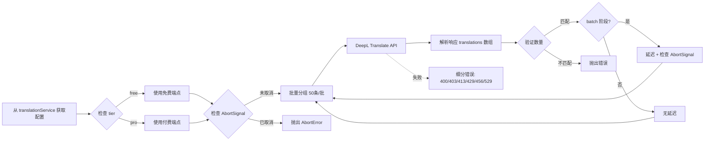
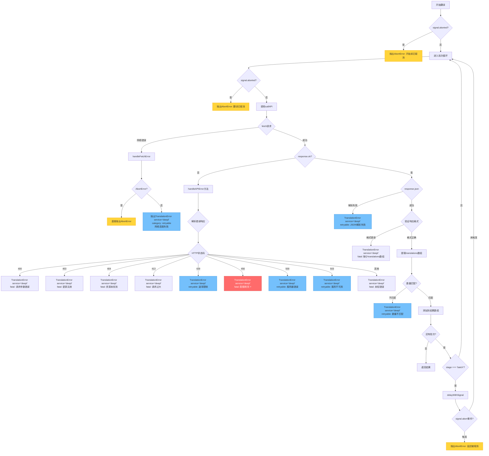

# DeepL翻译API实现指南

> 最后更新：2025-10-22
> 状态：📝 待实现
> 版本：V4架构兼容（AbortSignal + 统一存储）
> 官方文档：https://developers.deepl.com/api-reference/translate

## 📋 概述

本文档提供 DeepL 翻译 API 的完整实现指南，符合项目 V4 架构规范。DeepL 以专业翻译质量著称，提供简洁的 REST API，支持原生批量翻译，适合作为高质量翻译备选方案，与 OpenAI、Gemini、DeepSeek 并列为翻译服务选项。

## 🔑 核心特性

- **专业翻译质量**：业界公认的高质量机器翻译引擎
- **原生批量支持**：API 直接支持文本数组批量翻译，无需特殊拼接
- **简洁 REST API**：标准 HTTP POST，无需复杂的 prompt 工程
- **自动语言检测**：source_lang 可选，API 自动检测源语言
- **免费层可用**：500,000 字符/月免费额度
- **双端点架构**：免费层和付费层使用不同的 API 端点
- **灵活参数**：支持正式度（formality）、句子分割、格式保留等高级参数
- **V4 架构集成**：完整支持 AbortSignal、两阶段翻译、统一缓存

## 📊 定价与限额

### 免费层（DeepL API Free）

| 项目 | 限额 | 说明 |
|------|------|------|
| 月度字符限制 | 500,000 字符 | 约 250,000 中文字 |
| API 端点 | `https://api-free.deepl.com/v2/translate` | 专用免费端点 |
| 功能限制 | 不支持下一代模型、DeepL Write | 基础翻译功能完整 |
| 数据隐私 | 数据可能用于改进服务 | 免费层隐私政策 |

### 付费层（DeepL API Pro）

| 项目 | 计费方式 | 说明 |
|------|---------|------|
| 字符计费 | 按实际翻译字符数 | 文档翻译单次最多100万字符 |
| API 端点 | `https://api.deepl.com/v2/translate` | 专用付费端点 |
| 完整功能 | 下一代模型、DeepL Write | 全功能访问 |
| 数据隐私 | 数据不用于改进服务 | 付费层隐私保护 |
| 成本控制 | 可设置字符限额 | 达到限额后自动停止 |

### 速率限制与请求约束

| 错误码 | 说明 | 处理方式 |
|--------|------|---------|
| **HTTP 429/529** | Too Many Requests | 请求过多，使用指数退避重试 |
| **HTTP 456** | Quota Exceeded | 月度配额已用完或达到key级限额 |
| **HTTP 413** | Request Too Large | 请求体超过128 KiB，减少批次大小 |

**请求约束**：
- 最大请求体：**128 KiB**（131,072 bytes）
- 最大Header：16 KiB
- 最多文本数：50条/请求

> 数据来源：DeepL 官方文档（2025-10-22）
>
> **重要**：DeepL 按**字符**计费，不是 token。中文、日文、韩文等每个字符计为 1 个字符。

## 🏗️ 架构设计

### 基础配置

| 参数 | 值 | 说明 |
|------|-----|------|
| **免费层端点** | `https://api-free.deepl.com/v2/translate` | 免费账户专用 |
| **付费层端点** | `https://api.deepl.com/v2/translate` | Pro 账户专用 |
| **认证方式** | `Authorization: DeepL-Auth-Key {API_KEY}` | HTTP Header |
| **请求方法** | `POST` | JSON body |
| 批次大小 | 50 条字幕/批 | API最大支持50条/请求 |
| 批次间延迟 | 免费层: 1000ms, 付费层: 200ms | ⚠️ 建议值（官方无明确数据） |
| 存储位置 | `translationService.apiKey` | 统一存储，不单独存储 |
| split_sentences | `"0"` | **字符串类型**，禁止分句（字幕已分句） |
| preserve_formatting | `false` | 默认不保留原始格式 |
| formality | `"default"` | 默认语气（可选 more/less） |
| model_type | `"latency_optimized"` | 延迟优化（适合字幕翻译） |

> **关键参数说明**：
> - `text`: 必需，字符串数组，最多50条
> - `target_lang`: 必需，目标语言代码
> - `source_lang`: 可选，省略则自动检测
> - `split_sentences`: **"0"** | **"1"** | **"nonewlines"**（⚠️ 字符串类型）
> - `model_type`: "latency_optimized"（默认） | "quality_optimized" | "prefer_quality_optimized"
> - `context`: 额外上下文（不翻译，不计费）
> - `show_billed_characters`: 在响应中包含计费字符数

### 支持的语言代码

**源语言 (source_lang - 可选)**：
```
AR, BG, CS, DA, DE, EL, EN, ES, ET, FI, FR, HU, ID, IT, JA, KO,
LT, LV, NB, NL, PL, PT, RO, RU, SK, SL, SV, TR, UK, ZH
```

**目标语言 (target_lang - 必需)**：
```
AR, BG, CS, DA, DE, EL, EN-GB, EN-US, ES, ET, FI, FR, HU, ID, IT,
JA, KO, LT, LV, NB, NL, PL, PT-BR, PT-PT, RO, RU, SK, SL, SV, TR,
UK, ZH, ZH-HANS, ZH-HANT
```

> 注意：英语和中文有多个变体（EN-GB/EN-US, ZH/ZH-HANS/ZH-HANT）

### 存储架构

```typescript
// ✅ 正确：统一存储在 translationService
TRANSLATION_SERVICE_TEMPLATES = {
  'deepl': {
    type: 'deepl',
    name: 'DeepL',
    apiKey: '',                      // 用户填写
    tier: 'free',                    // 'free' | 'pro'（用户选择）
    model: 'latency_optimized',      // 模型类型
    availableModels: ['latency_optimized', 'quality_optimized', 'prefer_quality_optimized'],
    temperature: null,               // DeepL 不支持 temperature
    maxTokens: null,                 // DeepL 按字符计费，无 token 概念

    // DeepL 特有参数
    formality: 'default',            // 'default' | 'more' | 'less' | 'prefer_more' | 'prefer_less'
    splitSentences: "0",             // ⚠️ 字符串类型："0" | "1" | "nonewlines"
    preserveFormatting: false,       // 是否保留原始格式
    showBilledCharacters: true,      // 显示计费字符数（便于监控）

    // 速率控制（⚠️ 估算值，无官方数据）
    rpm: null,                       // 官方未公布RPM限制
    tpm: null,                       // 按字符计费，无TPM概念
    batchDelay: 1000                 // 建议值：免费层 1000ms, 付费层 200ms
  }
}

// ❌ 错误：不要单独存储
// await chrome.storage.local.set({ deeplApiKey: apiKey });
```

### 调用流程



## 🚨 错误处理架构

### 错误分类哲学

DeepL错误处理遵循**两级分类系统**（与DeepSeek保持一致）：

```typescript
// 复用 translation-errors.ts 中的统一类型
export type TranslationErrorCategory = 'fatal' | 'retryable';
```

- **fatal（致命错误）**：需要用户干预才能解决，无法自动恢复
  - API密钥问题（403）
  - 配额用完（456）⭐最重要
  - 请求参数错误（400）
  - 请求过大（413）
  - 资源不存在（404）
  - 其他未知错误

- **retryable（可重试错误）**：临时性问题，稍后可能成功
  - 速率限制（429）
  - 服务器错误（500）
  - 服务不可用（503）
  - 网络连接问题
  - JSON解析失败
  - 数据验证错误

- **特殊处理：AbortError**：
  - **不进行分类**，直接抛出到上层
  - 区分超时（`message.includes('timeout')`）和用户取消
  - 由 `timeout-errors.ts` 统一处理

### 统一错误工具

DeepL Translator 复用 `src/shared/types/translation-errors.ts` 中的通用工具：

```typescript
import {
  TranslationError,
  TranslationErrorCategory,
  handleFetchError,
} from '@/shared/types/translation-errors';
```

- `TranslationError`：统一封装错误信息，`service` 必须传入 `'deepl'`
- `handleFetchError`：处理 `fetch` 抛出的网络错误，自动识别 `AbortError`
- `TranslationError.category`：使用 `fatal` / `retryable` 两级分类

> 注意：不单独定义 `DeepLTranslationError`，复用项目统一的 `TranslationError` 类。

### 完整错误分类表

#### 1. API错误（8种）

| HTTP状态码 | 错误类型 | 分类 | 用户提示 | 说明 |
|-----------|---------|------|---------|------|
| 400 | Bad Request | `fatal` | DeepL请求参数错误，请检查设置 | 必需参数缺失或参数值错误 |
| 403 | Forbidden | `fatal` | DeepL API密钥无效，请检查设置 | 认证失败或CORS策略拒绝 |
| 404 | Not Found | `fatal` | DeepL资源未找到，请检查配置 | 请求的资源不存在 |
| 413 | Request Too Large | `fatal` | DeepL请求过大（超过128KiB），请减少批次大小 | 请求体超过128KiB限制 |
| 429 | Too Many Requests | `retryable` | DeepL请求过于频繁，请稍后重试 | 短时间内请求过多，建议指数退避 |
| 456 | Quota Exceeded | `fatal` | DeepL配额已用完，请检查账户额度 | ⭐月度字符限额已达或Cost Control限制 |
| 500 | Internal Server Error | `retryable` | DeepL服务器错误，请稍后重试 | DeepL服务临时故障，建议指数退避 |
| 503 | Service Unavailable | `retryable` | DeepL服务暂时不可用，请稍后重试 | 资源暂时无法使用 |

> 数据来源：[DeepL官方错误处理文档](https://developers.deepl.com/docs/best-practices/error-handling)

#### 2. 客户端错误（5种）

| 错误类型 | 分类 | 检测位置 | 用户提示 | 说明 |
|---------|------|---------|---------|------|
| 网络连接失败 | `retryable` | `fetch()` catch块 | 网络连接失败，请检查网络设置 | DNS解析失败、连接超时等 |
| JSON解析失败 | `retryable` | `response.json()` catch块 | 翻译服务响应异常，请重试 | 返回内容不是有效JSON |
| 响应格式错误 | `fatal` | 格式验证阶段 | 翻译服务响应异常，请重试 | 缺少必要字段（translations数组） |
| 翻译数量不匹配 | `retryable` | 数据验证阶段 | 翻译服务响应异常，请重试 | 返回译文数量 ≠ 输入数量 |
| AbortError（超时） | 特殊 | 各阶段signal检查 | 网络超时，请检查网络连接后重试 | 5秒超时触发 |
| AbortError（用户取消） | 特殊 | 各阶段signal检查 | （不显示） | 用户主动取消 |

### 错误检测流程（5个关键点）

```typescript
/**
 * callAPI方法中的5个错误检测点
 */
private async callAPI(
  requestBody: DeepLRequest,
  signal: AbortSignal
): Promise<DeepLResponse> {
  let response: Response;

  // ━━━━━━━━━━━━━━━━━━━━━━━━━━━━━━━━━━━━━━━━
  // 检测点1: fetch()网络请求（网络错误 + AbortError）
  // ━━━━━━━━━━━━━━━━━━━━━━━━━━━━━━━━━━━━━━━━
  try {
    response = await fetch(this.endpoint, {
      method: 'POST',
      headers: {
        'Authorization': `DeepL-Auth-Key ${this.apiKey}`,
        'Content-Type': 'application/json'
      },
      body: JSON.stringify(requestBody),
      signal  // 关键：使用AbortSignal
    });
  } catch (error) {
    // 使用统一工具：自动识别AbortError并直接抛出
    handleFetchError(error, 'deepl', 'DeepL API 网络请求失败');
  }

  // ━━━━━━━━━━━━━━━━━━━━━━━━━━━━━━━━━━━━━━━━
  // 检测点2: HTTP状态码检查（API错误）
  // ━━━━━━━━━━━━━━━━━━━━━━━━━━━━━━━━━━━━━━━━
  if (!response.ok) {
    await this.handleAPIError(response);  // 单独方法处理
  }

  let data: DeepLResponse;

  // ━━━━━━━━━━━━━━━━━━━━━━━━━━━━━━━━━━━━━━━━
  // 检测点3: JSON解析（解析错误）
  // ━━━━━━━━━━━━━━━━━━━━━━━━━━━━━━━━━━━━━━━━
  try {
    data = await response.json();
  } catch (error) {
    throw new TranslationError(
      'DeepL API 返回内容解析失败',
      'retryable',
      'deepl',
      response.status
    );
  }

  // ━━━━━━━━━━━━━━━━━━━━━━━━━━━━━━━━━━━━━━━━
  // 检测点4: 响应格式验证（格式错误）
  // ━━━━━━━━━━━━━━━━━━━━━━━━━━━━━━━━━━━━━━━━
  if (!data.translations || !Array.isArray(data.translations)) {
    throw new TranslationError(
      'DeepL API 返回格式错误：缺少translations数组',
      'fatal',
      'deepl',
      response.status
    );
  }

  // 记录字符使用统计
  const totalChars = data.translations.reduce((sum, t) => sum + (t.billed_characters || 0), 0);
  if (totalChars > 0) {
    console.log(`[DeepLTranslator] 计费字符数: ${totalChars}`);
  }

  // 记录检测到的源语言
  if (data.translations[0]?.detected_source_language) {
    console.log(`[DeepLTranslator] 检测到源语言: ${data.translations[0].detected_source_language}`);
  }

  return data;
}
```

### handleAPIError方法设计

```typescript
/**
 * 处理DeepL API错误
 * 根据HTTP状态码和错误响应体进行分类
 */
private async handleAPIError(response: Response): Promise<never> {
  let errorMessage = '未知错误';

  // 尝试解析错误响应体
  try {
    const errorData = await response.json();
    errorMessage = errorData.message || '未知错误';
  } catch {
    // JSON解析失败，尝试获取纯文本
    errorMessage = await response.text().catch(() => '未知错误');
  }

  const status = response.status;

  // 根据HTTP状态码分类错误
  switch (status) {
    case 400:
      throw new TranslationError(
        `DeepL 请求参数错误: ${errorMessage}`,
        'fatal',
        'deepl',
        status
      );

    case 403:
      throw new TranslationError(
        'DeepL API 密钥无效，请检查设置',
        'fatal',
        'deepl',
        status
      );

    case 404:
      throw new TranslationError(
        'DeepL 资源未找到，请检查配置',
        'fatal',
        'deepl',
        status
      );

    case 413:
      throw new TranslationError(
        'DeepL 请求过大（超过128KiB），请减少批次大小',
        'fatal',
        'deepl',
        status
      );

    case 429:
      throw new TranslationError(
        'DeepL 请求过于频繁，请稍后重试',
        'retryable',
        'deepl',
        status
      );

    case 456:
      // ⭐最重要的用户错误
      throw new TranslationError(
        'DeepL 配额已用完，请检查账户额度或升级订阅',
        'fatal',
        'deepl',
        status
      );

    case 500:
      throw new TranslationError(
        'DeepL 服务器错误，请稍后重试',
        'retryable',
        'deepl',
        status
      );

    case 503:
      throw new TranslationError(
        'DeepL 服务暂时不可用，请稍后重试',
        'retryable',
        'deepl',
        status
      );

    default:
      throw new TranslationError(
        `DeepL API 错误 (${status}): ${errorMessage}`,
        'fatal',
        'deepl',
        status
      );
  }
}
```

### translate方法中的signal检查

```typescript
/**
 * 批量翻译方法中的AbortSignal检查（3个位置）
 */
public async translate(
  texts: string[],
  sourceLang: string,
  targetLang: string,
  stage: 'urgent' | 'batch',
  signal: AbortSignal
): Promise<string[]> {
  // ━━━━━━━━━━━━━━━━━━━━━━━━━━━━━━━━━━━━━━━━
  // 位置1: 方法入口检查
  // ━━━━━━━━━━━━━━━━━━━━━━━━━━━━━━━━━━━━━━━━
  if (signal.aborted) {
    throw new DOMException('DeepL翻译开始前已取消', 'AbortError');
  }

  const results: string[] = [];

  // 分批处理（50条/批）
  for (let i = 0; i < texts.length; i += DeepLTranslator.BATCH_SIZE) {
    // ━━━━━━━━━━━━━━━━━━━━━━━━━━━━━━━━━━━━━━━━
    // 位置2: 循环入口检查（每批次前）
    // ━━━━━━━━━━━━━━━━━━━━━━━━━━━━━━━━━━━━━━━━
    if (signal.aborted) {
      throw new DOMException('DeepL翻译已取消', 'AbortError');
    }

    const batch = texts.slice(i, i + DeepLTranslator.BATCH_SIZE);

    // 构建请求体
    const requestBody: DeepLRequest = {
      text: batch,
      target_lang: this.mapTargetLanguage(targetLang),
      split_sentences: this.splitSentences,
      preserve_formatting: this.preserveFormatting,
      model_type: this.modelType as any,
      show_billed_characters: this.showBilledCharacters
    };

    // 调用API（内部会传递signal到fetch）
    const response = await this.callAPI(requestBody, signal);

    // 提取翻译结果
    const translations = response.translations.map(t => t.text);

    // ━━━━━━━━━━━━━━━━━━━━━━━━━━━━━━━━━━━━━━━━
    // 检测点5: 翻译数量验证
    // ━━━━━━━━━━━━━━━━━━━━━━━━━━━━━━━━━━━━━━━━
    if (translations.length !== batch.length) {
      console.error(
        `[DeepLTranslator] 批次 ${Math.floor(i / DeepLTranslator.BATCH_SIZE) + 1} ` +
        `翻译数量不匹配: 期望 ${batch.length}，实际 ${translations.length}`
      );
      throw new TranslationError(
        `批次 ${Math.floor(i / DeepLTranslator.BATCH_SIZE) + 1} 翻译数量不匹配`,
        'retryable',
        'deepl'
      );
    }

    results.push(...translations);

    // 批次间延迟（仅batch阶段）
    if (stage === 'batch' && i + DeepLTranslator.BATCH_SIZE < texts.length) {
      // ━━━━━━━━━━━━━━━━━━━━━━━━━━━━━━━━━━━━━━━━
      // 位置3: 延迟期间可取消（delayWithSignal内部监听abort事件）
      // ━━━━━━━━━━━━━━━━━━━━━━━━━━━━━━━━━━━━━━━━
      await this.delayWithSignal(this.batchDelay, signal);
    }
  }

  return results;
}
```

### delayWithSignal实现

```typescript
/**
 * 支持取消的延迟工具
 * 监听AbortSignal，一旦取消立即中断延迟
 */
private async delayWithSignal(ms: number, signal: AbortSignal): Promise<void> {
  return new Promise((resolve, reject) => {
    const timer = setTimeout(resolve, ms);

    const abortHandler = () => {
      clearTimeout(timer);
      reject(new DOMException('延迟被取消', 'AbortError'));
    };

    signal.addEventListener('abort', abortHandler, { once: true });
  });
}
```

### 错误处理执行流程图



### 与timeout-errors.ts的集成

DeepL错误最终会被上层（handle-toggle-translate-v4.ts）捕获并转换为用户友好的提示：

```typescript
/**
 * 在 handle-toggle-translate-v4.ts 中的错误处理
 */
import { getUserFriendlyMessage, getErrorLevel, ErrorLevel } from '../shared/types/timeout-errors';
import { TranslationError } from '../shared/types/translation-errors';

try {
  // ... 翻译逻辑
} catch (error: any) {
  let userMessage = '翻译失败，请稍后重试';
  let errorLevel = ErrorLevel.ERROR;

  // 1. AbortError（用户取消）
  if (isAbortError(error)) {
    userMessage = '';  // 不显示消息
    errorLevel = ErrorLevel.INFO;
    console.log('[service-worker-v4] 用户取消翻译');
  }
  // 2. AbortError（超时）
  else if (isTimeoutError(error)) {
    userMessage = '网络超时，请检查网络连接后重试';
    errorLevel = ErrorLevel.WARNING;
    console.log('[service-worker-v4] 超时错误');
  }
  // 3. TranslationError（来自 DeepL）
  else if (error instanceof TranslationError && error.service === 'deepl') {
    userMessage = error.message;  // 直接使用message
    errorLevel = error.category === 'fatal' ? ErrorLevel.ERROR : ErrorLevel.WARNING;

    // 特殊提示：配额用完
    if (error.status === 456) {
      console.error('[service-worker-v4] ⚠️ DeepL配额已用完');
    }

    // 特殊提示：请求过大
    if (error.status === 413) {
      console.error('[service-worker-v4] ⚠️ DeepL请求过大，需要减少批次大小');
    }
  }
  // 4. 其他未知错误
  else {
    userMessage = getUserFriendlyMessage(error);
  }

  // 更新状态并通知用户
  await RuntimeStateManager.getInstance().updateTranslateActiveState(
    tabId,
    'inactive',
    userMessage
  );
}
```

### 架构设计要点总结

1. **错误分类明确**：fatal（6种）vs retryable（3种）vs AbortError（特殊）
2. **无errorCode字段**：DeepL不返回错误码，仅依赖HTTP状态码分类
3. **5个检测点**：网络 → HTTP状态 → JSON解析 → 格式验证 → 数量验证
4. **3个signal检查**：方法入口 → 循环入口 → 延迟期间
5. **AbortError直接抛出**：使用handleFetchError统一处理
6. **用户提示友好化**：翻译器抛出的 `TranslationError`（service=`'deepl'`）消息直接面向用户
7. **与项目集成**：复用translation-errors.ts和timeout-errors.ts工具函数
8. **特殊错误关注**：
   - **456配额用完**：最重要的用户错误⭐，需引导用户升级或检查额度
   - **413请求过大**：需要调整批次大小，当前默认50条可能超限
   - **429速率限制**：建议指数退避重试（当前实现为固定延迟）

> 说明：DeepL翻译器在抛出 `TranslationError`（service=`'deepl'`）时直接提供用户友好的消息，上层不会再做二次映射。

## 📝 实现代码

### 1. TypeScript 接口定义

```typescript
/**
 * DeepL API 请求参数（基于官方文档 2025-10-22）
 */
interface DeepLRequest {
  // 必需参数
  text: string[];                    // 待翻译文本数组，最多50条
  target_lang: string;               // 目标语言代码

  // 可选参数
  source_lang?: string;              // 源语言（省略则自动检测）
  context?: string;                  // 额外上下文（不翻译，不计费）
  split_sentences?: "0" | "1" | "nonewlines";  // ⚠️ 字符串类型
  preserve_formatting?: boolean | "0" | "1";   // 保留格式（支持字符串）
  formality?: "default" | "more" | "less" | "prefer_more" | "prefer_less";
  model_type?: "latency_optimized" | "quality_optimized" | "prefer_quality_optimized";
  glossary_id?: string;              // 词汇表ID（需要source_lang）
  show_billed_characters?: boolean;  // 在响应中包含计费字符数
  tag_handling?: "xml" | "html";     // 标签处理
  outline_detection?: boolean;       // XML结构检测
  non_splitting_tags?: string[];     // 不分句的XML标签
  splitting_tags?: string[];         // 强制分句的XML标签
  ignore_tags?: string[];            // 不翻译的XML标签
}

/**
 * DeepL API 响应格式
 */
interface DeepLResponse {
  translations: Array<{
    detected_source_language: string;  // 检测到的源语言
    text: string;                      // 翻译后的文本
    billed_characters?: number;        // 计费字符数（可选，设置show_billed_characters时返回）
    model_type_used?: string;          // 使用的模型类型（可选）
  }>;
  billed_characters?: number;          // 总计费字符数（可选）
}

/**
 * DeepL 错误响应
 */
interface DeepLErrorResponse {
  message: string;
}
```

### 2. DeepLTranslator 类实现（V4 架构）

```typescript
/**
 * DeepL 翻译服务实现
 * @file src/background/components/deepl-translator.ts
 * @version V4 - 支持 AbortSignal、两阶段翻译
 */

export class DeepLTranslator {
  // 常量配置
  private static readonly FREE_ENDPOINT = 'https://api-free.deepl.com/v2/translate';
  private static readonly PRO_ENDPOINT = 'https://api.deepl.com/v2/translate';
  private static readonly BATCH_SIZE = 50;              // DeepL 原生支持数组批量
  private static readonly FREE_BATCH_DELAY_MS = 1000;   // 免费层延迟
  private static readonly PRO_BATCH_DELAY_MS = 200;     // 付费层延迟

  private apiKey: string;
  private tier: 'free' | 'pro';
  private endpoint: string;
  private batchDelay: number;
  private formality: string;
  private splitSentences: "0" | "1" | "nonewlines";  // ⚠️ 字符串类型
  private preserveFormatting: boolean;
  private modelType: string;
  private showBilledCharacters: boolean;

  constructor(
    apiKey: string,
    tier: 'free' | 'pro' = 'free',
    formality: string = 'default',
    splitSentences: "0" | "1" | "nonewlines" = "0",  // ⚠️ 默认"0"禁止分句
    preserveFormatting: boolean = false,
    modelType: string = 'latency_optimized',
    showBilledCharacters: boolean = true
  ) {
    this.apiKey = apiKey;
    this.tier = tier;
    this.endpoint = tier === 'free' ? DeepLTranslator.FREE_ENDPOINT : DeepLTranslator.PRO_ENDPOINT;
    this.batchDelay = tier === 'free' ? DeepLTranslator.FREE_BATCH_DELAY_MS : DeepLTranslator.PRO_BATCH_DELAY_MS;
    this.formality = formality;
    this.splitSentences = splitSentences;
    this.preserveFormatting = preserveFormatting;
    this.modelType = modelType;
    this.showBilledCharacters = showBilledCharacters;

    console.debug(
      `[DeepLTranslator] 初始化: tier=${tier}, endpoint=${this.endpoint}, ` +
      `split_sentences="${splitSentences}", model_type="${modelType}", 批次延迟=${this.batchDelay}ms`
    );
  }

  /**
   * 批量翻译文本（支持 AbortSignal 和两阶段翻译）
   * @param texts 待翻译文本数组
   * @param sourceLang 源语言代码（YouTube 标准）
   * @param targetLang 目标语言代码（YouTube 标准）
   * @param stage 翻译阶段：urgent（无延迟） | batch（有延迟）
   * @param signal AbortSignal 用于取消操作
   */
  public async translate(
    texts: string[],
    sourceLang: string,
    targetLang: string,
    stage: 'urgent' | 'batch',
    signal: AbortSignal
  ): Promise<string[]> {
    if (texts.length === 0) {
      return [];
    }

    // 检查初始信号状态
    if (signal.aborted) {
      throw new DOMException('DeepL 翻译开始前已取消', 'AbortError');
    }

    const results: string[] = [];

    // 分批处理（50 条/批）
    for (let i = 0; i < texts.length; i += DeepLTranslator.BATCH_SIZE) {
      const batch = texts.slice(i, i + DeepLTranslator.BATCH_SIZE);

      console.log(
        `[DeepLTranslator] 翻译批次 ${Math.floor(i / DeepLTranslator.BATCH_SIZE) + 1}: ` +
        `${batch.length} 条字幕 (${stage}阶段)`
      );

      // 调用 DeepL API
      const requestBody: DeepLRequest = {
        text: batch,
        target_lang: this.mapTargetLanguage(targetLang),
        split_sentences: this.splitSentences,           // ⚠️ 字符串类型
        preserve_formatting: this.preserveFormatting,
        model_type: this.modelType as any,              // 模型类型
        show_billed_characters: this.showBilledCharacters  // 显示计费字符数
      };

      // 只有在支持 formality 的语言时才添加该参数
      if (this.isFormalitySupported(targetLang)) {
        requestBody.formality = this.formality as any;
      }

      // 源语言可选（省略则自动检测）
      if (sourceLang && sourceLang !== 'auto') {
        requestBody.source_lang = this.mapSourceLanguage(sourceLang);
      }

      const response = await this.callAPI(requestBody, signal);

      // 提取翻译结果
      const translations = response.translations.map(t => t.text);

      // 验证数量匹配
      if (translations.length !== batch.length) {
        console.error(
          `[DeepLTranslator] 批次翻译数量不匹配: 期望${batch.length}, 实际${translations.length}`
        );
        throw new Error('DeepL 翻译结果数量不匹配');
      }

      results.push(...translations);

      // 批次间延迟（仅 batch 阶段）
      if (stage === 'batch' && i + DeepLTranslator.BATCH_SIZE < texts.length) {
        await this.delayWithSignal(this.batchDelay, signal);
      }
    }

    return results;
  }

  /**
   * 调用 DeepL API（支持 AbortSignal）
   */
  private async callAPI(
    requestBody: DeepLRequest,
    signal: AbortSignal
  ): Promise<DeepLResponse> {
    try {
      const response = await fetch(this.endpoint, {
        method: 'POST',
        headers: {
          'Authorization': `DeepL-Auth-Key ${this.apiKey}`,
          'Content-Type': 'application/json'
        },
        body: JSON.stringify(requestBody),
        signal  // 使用外部 AbortSignal
      });

      // 错误处理细化
      if (!response.ok) {
        const errorData: DeepLErrorResponse = await response.json().catch(() => ({ message: '' }));
        const errorText = errorData.message || await response.text();

        switch (response.status) {
          case 400:
            throw new Error(`DeepL 请求参数错误: ${errorText}`);
          case 403:
            throw new Error('DeepL API 密钥无效，请检查设置');
          case 413:
            throw new Error('DeepL 请求过大（超过128KiB），请减少批次大小');
          case 429:
          case 529:
            throw new Error('DeepL API 速率限制，请稍后重试');
          case 456:
            throw new Error('DeepL 配额已用完，请检查账户额度');
          default:
            throw new Error(`DeepL API 错误 (${response.status}): ${errorText}`);
        }
      }

      const data: DeepLResponse = await response.json();

      if (!data.translations || !Array.isArray(data.translations)) {
        throw new Error('DeepL API 返回格式错误');
      }

      // 记录字符使用情况（如果有）
      const totalChars = data.translations.reduce((sum, t) => sum + (t.billed_characters || 0), 0);
      if (totalChars > 0) {
        console.log(`[DeepLTranslator] 计费字符数: ${totalChars}`);
      }

      // 记录检测到的源语言
      if (data.translations[0]?.detected_source_language) {
        console.log(`[DeepLTranslator] 检测到源语言: ${data.translations[0].detected_source_language}`);
      }

      return data;

    } catch (error: any) {
      // AbortError 处理
      if (error.name === 'AbortError') {
        throw new DOMException('DeepL API 请求被取消', 'AbortError');
      }
      throw error;
    }
  }

  /**
   * 延迟工具（支持 AbortSignal 中断）
   */
  private async delayWithSignal(ms: number, signal: AbortSignal): Promise<void> {
    return new Promise((resolve, reject) => {
      const timer = setTimeout(resolve, ms);

      const abortHandler = () => {
        clearTimeout(timer);
        reject(new DOMException('延迟被取消', 'AbortError'));
      };

      signal.addEventListener('abort', abortHandler, { once: true });
    });
  }

  /**
   * 语言代码映射 - 源语言（YouTube 标准 → DeepL 标准）
   */
  private mapSourceLanguage(ytCode: string): string {
    const mapping: Record<string, string> = {
      'zh-CN': 'ZH',
      'zh-Hans': 'ZH',
      'zh-Hant': 'ZH',
      'en': 'EN',
      'ja': 'JA',
      'ko': 'KO',
      'es': 'ES',
      'fr': 'FR',
      'de': 'DE',
      'pt': 'PT',
      'ru': 'RU',
      'ar': 'AR',
      'it': 'IT',
      'nl': 'NL',
      'pl': 'PL',
      'tr': 'TR',
      'vi': 'VI',
      'th': 'TH',
      'id': 'ID',
      'cs': 'CS',
      'da': 'DA',
      'el': 'EL',
      'et': 'ET',
      'fi': 'FI',
      'hu': 'HU',
      'lt': 'LT',
      'lv': 'LV',
      'nb': 'NB',
      'ro': 'RO',
      'sk': 'SK',
      'sl': 'SL',
      'sv': 'SV',
      'uk': 'UK',
      'bg': 'BG'
    };

    return mapping[ytCode] || ytCode.toUpperCase();
  }

  /**
   * 语言代码映射 - 目标语言（YouTube 标准 → DeepL 标准）
   * 注意：DeepL 目标语言有更细的变体（如 EN-US/EN-GB）
   */
  private mapTargetLanguage(ytCode: string): string {
    const mapping: Record<string, string> = {
      'zh-CN': 'ZH-HANS',      // 简体中文
      'zh-Hans': 'ZH-HANS',
      'zh-TW': 'ZH-HANT',      // 繁体中文
      'zh-Hant': 'ZH-HANT',
      'en': 'EN-US',           // 默认美式英语
      'en-US': 'EN-US',
      'en-GB': 'EN-GB',
      'pt': 'PT-BR',           // 默认巴西葡萄牙语
      'pt-BR': 'PT-BR',
      'pt-PT': 'PT-PT',
      'ja': 'JA',
      'ko': 'KO',
      'es': 'ES',
      'fr': 'FR',
      'de': 'DE',
      'ru': 'RU',
      'ar': 'AR',
      'it': 'IT',
      'nl': 'NL',
      'pl': 'PL',
      'tr': 'TR',
      'id': 'ID',
      'cs': 'CS',
      'da': 'DA',
      'el': 'EL',
      'et': 'ET',
      'fi': 'FI',
      'hu': 'HU',
      'lt': 'LT',
      'lv': 'LV',
      'nb': 'NB',
      'ro': 'RO',
      'sk': 'SK',
      'sl': 'SL',
      'sv': 'SV',
      'uk': 'UK',
      'bg': 'BG'
    };

    return mapping[ytCode] || ytCode.toUpperCase();
  }

  /**
   * 检查目标语言是否支持 formality 参数
   */
  private isFormalitySupported(targetLang: string): boolean {
    const supportedLangs = ['de', 'fr', 'it', 'es', 'nl', 'pl', 'pt', 'pt-BR', 'pt-PT', 'ja', 'ru'];
    return supportedLangs.includes(targetLang.toLowerCase());
  }
}

// ⚠️ 重要警告：Next-gen模型会忽略split_sentences参数
//
// 根据DeepL官方文档：
// "Please note that for next-gen models, the parameter split_sentences passed
//  by the user is ignored and a value of 'nonewlines' is used for maximum
//  translation quality."
//
// 这意味着即使我们设置 split_sentences="0"，DeepL可能仍会分句（只是不按换行符分句）。
// 需要在实际测试时验证返回数量是否匹配输入数量。
// 如果数量不匹配，需要在代码中添加数量验证和错误处理逻辑。
}
```

### 3. 集成到 V4 架构

```typescript
/**
 * 集成到 two-phase-translator-v4.ts
 */

import { DeepLTranslator } from './deepl-translator';

export class TwoPhaseTranslatorV4 {
  // ... 现有代码

  /**
   * 在 callTranslationAPI 方法中添加 DeepL 分支
   */
  private async callTranslationAPI(
    texts: string[],
    service: any,
    sourceLang: string,
    targetLang: string,
    signal: AbortSignal,
    options?: { stage?: 'urgent' | 'batch' }
  ): Promise<string[]> {
    return new Promise<string[]>((resolve, reject) => {
      // ... 现有 abort handler 代码

      try {
        let translatedTexts: string[] = [];

        // DeepL 分支
        if (service.type === 'deepl') {
          if (!service.apiKey) {
            throw new Error('DeepL API 密钥未配置');
          }

          const translator = new DeepLTranslator(
            service.apiKey,
            service.tier || 'free',
            service.formality || 'default',
            service.splitSentences ?? "0",              // ⚠️ 字符串类型，默认"0"
            service.preserveFormatting ?? false,
            service.model || 'latency_optimized',
            service.showBilledCharacters ?? true
          );

          const stage = options?.stage ?? 'batch';

          // 调用翻译（传递 signal）
          translatedTexts = await translator.translate(
            texts,
            sourceLang,
            targetLang,
            stage,
            signal
          );
        }
        // ... 其他服务分支（openai, gemini, deepseek, google-free, microsoft-free）

        resolve(translatedTexts);

      } catch (error) {
        reject(error);
      }
    });
  }

  /**
   * 在超时配置中添加 DeepL
   */
  private calculateTimeouts(serviceType: string, subtitleCount: number) {
    // ... 现有代码

    if (serviceType === 'deepl') {
      // DeepL 响应较快，但考虑网络延迟
      perBatchTimeout = 10000;  // 单批 10 秒
    }

    // ... 其他服务
  }
}
```

### 4. 用户偏好模板配置

```typescript
/**
 * 在 src/shared/types/user-preferences-types.ts 中添加
 */

export enum TranslationServiceType {
  // ... 现有类型
  DEEPL = 'deepl'
}

export const TRANSLATION_SERVICE_TEMPLATES: Record<TranslationServiceType, TranslationService> = {
  // ... 现有模板

  [TranslationServiceType.DEEPL]: {
    type: TranslationServiceType.DEEPL,
    name: 'DeepL',
    apiKey: '',                      // 用户填写
    tier: 'free',                    // 'free' | 'pro'
    model: 'latency_optimized',      // 模型类型（默认延迟优化）
    availableModels: ['latency_optimized', 'quality_optimized', 'prefer_quality_optimized'],
    temperature: null,               // DeepL 不支持
    maxTokens: null,                 // DeepL 按字符计费

    // DeepL 特有参数
    formality: 'default',            // 正式度
    splitSentences: "0",             // ⚠️ 字符串类型，默认"0"禁止分句
    preserveFormatting: false,       // 格式保留
    showBilledCharacters: true,      // 显示计费字符数

    // 速率控制（⚠️ 估算值，官方未公布）
    rpm: null,                       // 官方未公布RPM限制
    tpm: null,                       // 按字符计费，无TPM概念
    batchDelay: 1000                 // 建议值：免费层 1000ms, 付费层 200ms
  }
};
```

### 5. Popup 设置界面集成

```html
<!-- popup.html - 添加 DeepL 选项 -->
<select id="translation-api-select">
  <option value="google-free">Google 免费翻译</option>
  <option value="microsoft-free">Microsoft 免费翻译</option>
  <option value="deepseek">DeepSeek AI</option>
  <option value="openai">OpenAI</option>
  <option value="gemini">Google Gemini</option>
  <option value="deepl">DeepL</option>  <!-- 新增 -->
</select>

<!-- DeepL 基础设置面板 -->
<div id="deepl-basic-panel" class="setting-item" style="display: none;">
    <div class="inline-setting-row">
        <label for="deepl-api-key">DeepL API Key:</label>
        <input type="password" id="deepl-api-key" placeholder="输入 DeepL API Key">
    </div>

    <div class="inline-setting-row">
        <label>API 层级:</label>
        <div class="switch-container">
            <span>免费</span>
            <label class="switch">
                <input type="checkbox" id="deepl-tier-switch">
                <span class="slider round"></span>
            </label>
            <span>付费</span>
        </div>
    </div>

    <div class="inline-setting-row">
        <label for="deepl-formality">语气:</label>
        <select id="deepl-formality">
            <option value="default">默认</option>
            <option value="more">正式</option>
            <option value="less">非正式</option>
            <option value="prefer_more">倾向正式</option>
            <option value="prefer_less">倾向非正式</option>
        </select>
        <span class="setting-hint">仅支持部分语言</span>
    </div>
</div>
```

```typescript
// popup.ts - DeepL 设置处理

function updateTranslationServiceUI(serviceType: TranslationServiceType) {
  // ... 隐藏所有面板

  if (serviceType === 'deepl') {
    // 显示 DeepL 设置面板
    document.getElementById('deepl-basic-panel').style.display = 'block';
  }
  // ... 其他服务
}

// 保存 DeepL 设置
async function saveDeepLSettings() {
  const apiKey = (document.getElementById('deepl-api-key') as HTMLInputElement).value;
  const tierSwitch = (document.getElementById('deepl-tier-switch') as HTMLInputElement).checked;
  const formality = (document.getElementById('deepl-formality') as HTMLSelectElement).value;

  const tier = tierSwitch ? 'pro' : 'free';
  const batchDelay = tier === 'free' ? 1000 : 200;

  const updatedService = {
    ...userPreferences.translationService,
    type: 'deepl',
    apiKey: apiKey,
    tier: tier,
    formality: formality,
    batchDelay: batchDelay
  };

  await UserPreferencesManager.getInstance().setUserPreferences({
    ...userPreferences,
    translationService: updatedService
  });
}
```

## 🔧 架构优化说明

### 优化1：统一存储架构
- **问题**：独立存储 API Key 导致架构不一致
- **解决**：存储在 `translationService.apiKey`，和 OpenAI/Gemini 保持一致
- **安全性**：Chrome Storage 本身加密，导出时自动移除敏感信息

### 优化2：双端点架构
- **问题**：免费层和付费层使用不同的 API 端点
- **解决**：根据 `tier` 参数自动选择正确的端点
- **用户体验**：Popup 提供切换开关，自动调整端点和批次延迟

### 优化3：原生批量支持
- **问题**：是否需要特殊拼接格式
- **解决**：DeepL 原生支持 `text: string[]`，直接传数组即可
- **优势**：无需像 OpenAI 那样做 JSON 拼接，API 自动处理

### 优化4：AbortSignal 集成
- **问题**：无法响应 V4 架构的取消信号
- **解决**：所有方法接收 `signal: AbortSignal`，使用 `delayWithSignal` 支持中断

### 优化5：语言代码规范化
- **问题**：DeepL 使用特殊的语言代码（EN-US、ZH-HANS）
- **解决**：实现 `mapSourceLanguage` 和 `mapTargetLanguage` 映射函数
- **注意**：目标语言需要更精细的变体（EN-US/EN-GB, PT-BR/PT-PT）

### 优化6：自动语言检测
- **问题**：源语言是否必需
- **解决**：`source_lang` 可选，省略时 DeepL 自动检测
- **日志**：记录检测到的源语言，便于调试

### 优化7：错误处理细化
- **问题**：只有简单的 try-catch
- **解决**：细分错误类型（400/403/413/429/456/529），提供明确的用户提示
- **特殊错误**：
  - HTTP 413: 请求超过128 KiB，提示减少批次大小
  - HTTP 456: 配额用完或达到key级限额
  - HTTP 429/529: 速率限制，使用指数退避重试

### 优化8：Formality 参数支持
- **问题**：是否暴露正式度参数
- **解决**：Popup 提供下拉选择，但仅在支持的语言显示提示
- **支持语言**：DE, FR, IT, ES, NL, PL, PT, JA, RU

### 优化9：批次大小优化
- **问题**：批次大小如何确定
- **解决**：DeepL 原生支持批量，设为 50 条/批（平衡性能和速率）
- **速率控制**：免费层 1000ms 延迟，付费层 200ms 延迟

### 优化10：字符计数统计
- **问题**：用户无法了解字符消耗
- **解决**：设置 `show_billed_characters: true`，记录 `billed_characters` 字段
- **日志输出**：每批翻译后输出计费字符数
- **未来**：可在 Popup 显示月度字符使用情况

### 优化11：model_type 参数支持（新增）
- **问题**：是否允许用户选择模型类型
- **解决**：默认使用 `latency_optimized`（适合字幕翻译）
- **可选**：Popup 可提供下拉选择（quality_optimized / prefer_quality_optimized）
- **建议**：字幕场景优先速度，使用默认值即可

### 优化12：context 参数预留（新增）
- **功能**：提供额外上下文改进翻译质量
- **特性**：不翻译、不计费
- **未来用途**：可传入视频标题/描述作为上下文
- **Phase 1**：暂不实现，预留接口

### 优化13：split_sentences 警告（⚠️ 重要）
- **问题**：Next-gen 模型会忽略 split_sentences 参数
- **影响**：即使设置 "0"，DeepL 可能仍按标点分句
- **风险**：返回数量可能不匹配输入数量
- **解决**：代码中严格验证返回数量，不匹配则抛出错误

## ⚡ 批量策略

- **紧急翻译（urgent）**：50 条/批，无延迟，快速响应
- **批量翻译（batch）**：50 条/批，免费层 1000ms 延迟，付费层 200ms 延迟
- **批量模式**：原生 JSON 数组，无需特殊分隔符
- **失败策略**：直接抛出错误，不降级到单条翻译
- **数量验证**：严格验证返回数量与输入数量一致

## ⚠️ 注意事项

### 必要条件
1. **需要 API Key**：必须在 [DeepL 官网](https://www.deepl.com/pro-api) 注册获取
2. **免费层限制**：500,000 字符/月，约 250,000 中文字
3. **双端点区分**：免费层和付费层必须使用正确的端点
4. **网络要求**：需要能访问 api.deepl.com 或 api-free.deepl.com

### 架构限制
1. **字符计费**：不是 token 计费，中文每字 1 个字符
2. **双端点**：免费/付费使用不同 URL，需正确配置
3. **无 temperature**：DeepL 不支持温度参数，翻译结果固定
4. **批次限制**：统一 50 条/批，不动态调整
5. **请求体大小**：最大 128 KiB，超过会返回 413 错误
6. **split_sentences 限制**：Next-gen 模型会忽略此参数，可能导致分句

### 最佳实践
1. **缓存使用**：复用项目统一的 `TranslationCacheManager`
2. **错误提示**：提供明确的错误信息，引导用户检查 API Key 和配额
3. **取消支持**：完整支持 AbortSignal，响应用户取消操作
4. **日志规范**：使用 `[DeepLTranslator]` 前缀，记录字符消耗

### formality 支持语言
- **支持**：DE（德语）、FR（法语）、IT（意大利语）、ES（西班牙语）、NL（荷兰语）、PL（波兰语）、PT（葡萄牙语）、JA（日语）、RU（俄语）
- **不支持**：EN（英语）、ZH（中文）、KO（韩语）等

## 🧪 测试验证

### 测试脚本

```bash
# 测试 DeepL Free API
curl -X POST https://api-free.deepl.com/v2/translate \
  -H "Authorization: DeepL-Auth-Key YOUR_FREE_API_KEY" \
  -H "Content-Type: application/json" \
  -d '{
    "text": ["Hello world", "How are you"],
    "target_lang": "ZH-HANS"
  }'

# 测试 DeepL Pro API
curl -X POST https://api.deepl.com/v2/translate \
  -H "Authorization: DeepL-Auth-Key YOUR_PRO_API_KEY" \
  -H "Content-Type: application/json" \
  -d '{
    "text": ["Hello world", "How are you"],
    "target_lang": "ZH-HANS",
    "formality": "more"
  }'
```

### 预期结果

```json
{
  "translations": [
    {
      "detected_source_language": "EN",
      "text": "你好世界"
    },
    {
      "detected_source_language": "EN",
      "text": "你好吗"
    }
  ]
}
```

### 功能测试清单

**基础功能**：
- [ ] Popup 下拉菜单显示 "DeepL" 选项
- [ ] 选中 DeepL 时显示 API Key 输入框
- [ ] 免费/付费层切换开关正常工作
- [ ] 切换层级时自动更新端点和批次延迟
- [ ] formality 下拉菜单正常工作（仅支持的语言）
- [ ] API Key 保存到 `translationService.apiKey`

**翻译功能**：
- [ ] 紧急翻译（urgent）正常工作，无延迟
- [ ] 批量翻译（batch）正常工作，有延迟
- [ ] 翻译结果数量与输入数量匹配
- [ ] split_sentences="0" 参数生效（验证不分句）
- [ ] AbortSignal 能正确取消翻译
- [ ] 自动语言检测正常工作
- [ ] 翻译缓存正常工作（TranslationCacheManager）

**错误处理**：
- [ ] 403 错误提示 "API 密钥无效"
- [ ] 413 错误提示 "请求过大"
- [ ] 429/529 错误提示 "速率限制"
- [ ] 456 错误提示 "配额已用完"

**监控与日志**：
- [ ] 字符计数日志正常输出（show_billed_characters）
- [ ] 检测到的源语言日志正常输出
- [ ] model_type 参数正确传递

**兼容性**：
- [ ] 切换到其他服务无影响
- [ ] 旧数据迁移正常（如有）

## 🔗 相关文档

- [V4 架构设计](../architecture/08-abort-timeout-architecture.md)
- [用户偏好管理](../architecture/03-component-design.md)
- [两阶段翻译器](../architecture/07-batch-translation-architecture.md)
- [OpenAI 翻译实现](./openai-translate-implementation.md)
- [Gemini 翻译实现](./gemini-translate-implementation.md)
- [DeepSeek 翻译实现](./deepseek-translate-implementation.md)
- [DeepL 官方文档](https://developers.deepl.com/docs)

## 📅 更新历史

- **2025-10-25**：添加完整的错误处理架构设计章节（基于统一错误处理模式）
  - 统一使用 TranslationError + handleFetchError
  - 13种错误完整分类表（8个API + 5个客户端）
  - 5个错误检测点详细说明
  - handleAPIError方法架构设计
  - 3个signal检查位置
  - 错误处理执行流程图（Mermaid）
  - 与timeout-errors.ts集成说明
- **2025-10-22**：对齐官方文档，修正以下内容：
  - 修正 `split_sentences` 为字符串类型 ("0" | "1" | "nonewlines")
  - 添加 `model_type` 参数支持
  - 添加 `context` 参数说明（Phase 1 暂不实现）
  - 添加 `show_billed_characters` 参数
  - 修正错误码（添加 413/529，移除 401/500/502/503）
  - 添加 128 KiB 请求体限制说明
  - 添加 next-gen 模型忽略 split_sentences 的警告
  - 标注批次延迟为建议值（官方未公布）
  - 标注 RPM/TPM 为估算值（官方未公布）
  - 澄清付费层字符限制（文档翻译100万字符）

---

*本文档已完成 V4 架构优化、官方 API 对齐和错误处理架构设计，符合项目规范，可直接用于实现*

**参考资料**：
- DeepL 翻译 API：https://developers.deepl.com/api-reference/translate
- DeepL 认证文档：https://developers.deepl.com/docs/getting-started/auth
- DeepL 使用限额：https://developers.deepl.com/docs/resources/usage-limits
- DeepL 错误处理：https://developers.deepl.com/docs/best-practices/error-handling
