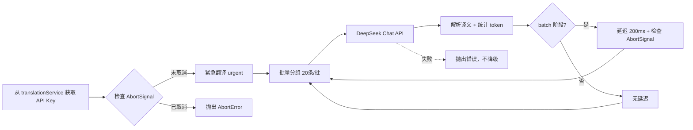

# DeepSeek AI翻译API实现指南

> 最后更新：2025-10-06
> 状态：✅ V4架构优化完成，待实现
> 版本：V4架构兼容（AbortSignal + 统一存储）

## 📋 概述

本文档提供 DeepSeek 翻译 API 的完整实现指南，符合项目 V4 架构规范。DeepSeek API 与 OpenAI 兼容，适合作为中文场景的低成本翻译备选方案，和 Google Free、Microsoft Free 并列为免费/低成本翻译选项。

## 🔑 核心特性

- **低成本**：输入（cache miss）$0.28/百万 token，输出 $0.42/百万 token，cache hit $0.028
- **默认模型**：`deepseek-chat`（DeepSeek-V3.2-Exp 非思考模式）
- **中文优化**：对中英互译表现稳定，适合字幕翻译场景
- **OpenAI 兼容**：支持 OpenAI SDK / API 生态（`https://api.deepseek.com`）
- **大上下文**：上下文窗口 128K token，默认输出 4K，可配置到 8K
- **轻限流**：官方不设置硬性 rate limit，自行按 200 ms 节奏节流（batch 阶段）
- **V4 架构集成**：完整支持 AbortSignal、两阶段翻译、统一缓存

## 📊 模型规格

| 模型 | 模式 | 上下文 | 默认输出 | 最大输出 | 价格（输入 cache miss / hit / 输出） |
|------|------|--------|----------|----------|-----------------------------------|
| `deepseek-chat` | 非思考模式（推荐用于翻译） | 128K | 4K | 8K | $0.28 / $0.028 / $0.42 |

> 数据来源：DeepSeek 官方文档（2025-09-29）

## 🏗️ 架构设计

### 基础配置

| 参数 | 值 | 说明 |
|------|-----|------|
| API 基础地址 | `https://api.deepseek.com/v1/chat/completions` | 单一端点，无备用端点 |
| 推荐模型 | `deepseek-chat` | 固定值，不暴露给用户 |
| Temperature | `1.3` | 官方推荐值，固定不可配置 |
| 输出上限 | `max_tokens: 8000` | 固定值 |
| 批次大小 | 20 条字幕/批 | urgent 和 batch 阶段统一 |
| 批次间延迟 | 200 ms（仅 batch 阶段） | urgent 阶段无延迟 |
| 存储位置 | `translationService.apiKey` | 统一存储，不单独存储 |

> 响应体包含 `usage.prompt_tokens` / `completion_tokens` / `total_tokens` 字段，可直接记录用量。

### 存储架构（优化1）

```typescript
// ✅ 正确：统一存储在 translationService
TRANSLATION_SERVICE_TEMPLATES = {
  'deepseek': {
    type: 'deepseek',
    apiKey: '',                // 用户填写
    model: 'deepseek-chat',    // 固定值
    customModel: null,
    temperature: 1.3           // 固定值，不暴露给用户
  }
}

// ❌ 错误：不要单独存储
// await chrome.storage.local.set({ deepseekApiKey: apiKey });
```

### 调用流程



## 📝 实现代码

### 1. TypeScript实现（V4架构兼容）

```typescript
/**
 * DeepSeek翻译服务实现
 * @file src/background/components/deepseek-translator.ts
 * @version V4 - 支持 AbortSignal、两阶段翻译
 */

interface DeepSeekMessage {
  role: 'system' | 'user' | 'assistant';
  content: string;
}

interface DeepSeekRequest {
  model: string;
  messages: DeepSeekMessage[];
  temperature: number;
  max_tokens: number;
  stream: false;
}

interface DeepSeekResponse {
  id: string;
  model: string;
  choices: Array<{
    message: {
      role: string;
      content: string;
    };
    finish_reason: string;
  }>;
  usage: {
    prompt_tokens: number;
    completion_tokens: number;
    total_tokens: number;
  };
}

export class DeepSeekTranslator {
  // 常量配置
  private static readonly ENDPOINT = 'https://api.deepseek.com/v1/chat/completions';
  private static readonly MODEL = 'deepseek-chat';
  private static readonly TEMPERATURE = 1.3;          // 官方推荐，固定值（优化8）
  private static readonly MAX_TOKENS = 8000;
  private static readonly BATCH_SIZE = 20;            // 统一批次大小（优化13）
  private static readonly BATCH_DELAY_MS = 200;       // batch 阶段延迟
  private static readonly SEPARATOR = '\n---\n';      // 分隔符

  private apiKey: string;

  constructor(apiKey: string) {
    this.apiKey = apiKey;
  }

  /**
   * 批量翻译文本（支持 AbortSignal 和两阶段翻译）
   * @param texts 待翻译文本数组
   * @param sourceLang 源语言代码（YouTube标准）
   * @param targetLang 目标语言代码（YouTube标准）
   * @param stage 翻译阶段：urgent（无延迟） | batch（200ms延迟）（优化9）
   * @param signal AbortSignal 用于取消操作（优化2）
   */
  public async translate(
    texts: string[],
    sourceLang: string,
    targetLang: string,
    stage: 'urgent' | 'batch',
    signal: AbortSignal
  ): Promise<string[]> {
    if (texts.length === 0) {
      return [];
    }

    // 检查初始信号状态
    if (signal.aborted) {
      throw new DOMException('DeepSeek翻译开始前已取消', 'AbortError');
    }

    const results: string[] = [];

    // 分批处理（统一 20 条/批）
    for (let i = 0; i < texts.length; i += DeepSeekTranslator.BATCH_SIZE) {
      const batch = texts.slice(i, i + DeepSeekTranslator.BATCH_SIZE);

      console.log(
        `[DeepSeekTranslator] 翻译批次 ${Math.floor(i / DeepSeekTranslator.BATCH_SIZE) + 1}: ` +
        `${batch.length} 条字幕 (${stage}阶段)`
      );

      // 构建提示词并调用 API（单端点，失败直接抛错，优化6、7）
      const messages = this.buildTranslationPrompt(
        batch,
        this.mapLanguageCode(sourceLang),
        this.mapLanguageCode(targetLang)
      );

      const response = await this.callAPI(messages, signal);

      // 解析响应
      const translations = response.split(DeepSeekTranslator.SEPARATOR);

      // 验证数量匹配
      if (translations.length !== batch.length) {
        console.error(
          `[DeepSeekTranslator] 批次翻译数量不匹配: 期望${batch.length}, 实际${translations.length}`
        );
        throw new Error('DeepSeek翻译结果数量不匹配');
      }

      results.push(...translations.map(t => t.trim()));

      // 批次间延迟（仅 batch 阶段，优化3、9）
      if (stage === 'batch' && i + DeepSeekTranslator.BATCH_SIZE < texts.length) {
        await this.delayWithSignal(DeepSeekTranslator.BATCH_DELAY_MS, signal);
      }
    }

    return results;
  }

  /**
   * 构建翻译提示词
   */
  private buildTranslationPrompt(
    texts: string[],
    sourceLang: string,
    targetLang: string
  ): DeepSeekMessage[] {
    const combinedText = texts.join(DeepSeekTranslator.SEPARATOR);

    return [
      {
        role: 'system',
        content: `You are a professional translator. Translate from ${sourceLang} to ${targetLang}.
Keep the same format and structure.
If there are multiple texts separated by "---", translate each one and keep the separator.
Return ONLY the translation without any explanation.`
      },
      {
        role: 'user',
        content: combinedText
      }
    ];
  }

  /**
   * 调用 DeepSeek API（支持 AbortSignal，优化2、12）
   */
  private async callAPI(
    messages: DeepSeekMessage[],
    signal: AbortSignal
  ): Promise<string> {
    try {
      const response = await fetch(DeepSeekTranslator.ENDPOINT, {
        method: 'POST',
        headers: {
          'Authorization': `Bearer ${this.apiKey}`,
          'Content-Type': 'application/json'
        },
        body: JSON.stringify({
          model: DeepSeekTranslator.MODEL,
          messages,
          temperature: DeepSeekTranslator.TEMPERATURE,
          max_tokens: DeepSeekTranslator.MAX_TOKENS,
          stream: false
        } as DeepSeekRequest),
        signal  // 使用外部 AbortSignal
      });

      // 错误处理细化（优化12）
      if (!response.ok) {
        const errorText = await response.text();

        switch (response.status) {
          case 401:
          case 403:
            throw new Error('DeepSeek API密钥无效，请检查设置');
          case 429:
            throw new Error('DeepSeek API速率限制，请稍后重试');
          case 500:
          case 502:
          case 503:
            throw new Error('DeepSeek服务暂时不可用');
          default:
            throw new Error(`DeepSeek API错误 (${response.status}): ${errorText}`);
        }
      }

      const data: DeepSeekResponse = await response.json();

      if (!data.choices || !data.choices[0] || !data.choices[0].message) {
        throw new Error('DeepSeek API返回格式错误');
      }

      // 记录 token 使用情况
      console.log(
        `[DeepSeekTranslator] Token使用: ` +
        `输入=${data.usage.prompt_tokens}, ` +
        `输出=${data.usage.completion_tokens}, ` +
        `总计=${data.usage.total_tokens}`
      );

      return data.choices[0].message.content;

    } catch (error: any) {
      // AbortError 处理
      if (error.name === 'AbortError') {
        throw new DOMException('DeepSeek API请求被取消', 'AbortError');
      }
      throw error;
    }
  }

  /**
   * 延迟工具（支持 AbortSignal 中断，优化3）
   */
  private async delayWithSignal(ms: number, signal: AbortSignal): Promise<void> {
    return new Promise((resolve, reject) => {
      const timer = setTimeout(resolve, ms);

      const abortHandler = () => {
        clearTimeout(timer);
        reject(new DOMException('延迟被取消', 'AbortError'));
      };

      signal.addEventListener('abort', abortHandler, { once: true });
    });
  }

  /**
   * 语言代码映射（YouTube标准 → DeepSeek标准，优化5）
   */
  private mapLanguageCode(code: string): string {
    // DeepSeek 使用标准 ISO 639-1 语言代码
    const mapping: Record<string, string> = {
      'zh-CN': 'zh',
      'zh-TW': 'zh',
      'zh-Hans': 'zh',
      'zh-Hant': 'zh',
      'en': 'en',
      'ja': 'ja',
      'ko': 'ko',
      'es': 'es',
      'fr': 'fr',
      'de': 'de',
      'ru': 'ru',
      'ar': 'ar',
      'pt': 'pt',
      'it': 'it',
      'nl': 'nl',
      'hi': 'hi',
      'vi': 'vi',
      'th': 'th',
      'id': 'id'
    };

    return mapping[code] || code;
  }
}
```

### 2. 集成到 V4 架构（优化10）

```typescript
/**
 * 集成到 two-phase-translator-v4.ts
 */

import { DeepSeekTranslator } from './deepseek-translator';

export class TwoPhaseTranslatorV4 {
  // ... 现有代码

  /**
   * 在 callTranslationAPI 方法中添加 DeepSeek 分支
   */
  private async callTranslationAPI(
    texts: string[],
    service: any,
    sourceLang: string,
    targetLang: string,
    signal: AbortSignal,
    options?: { stage?: 'urgent' | 'batch' }
  ): Promise<string[]> {
    return new Promise<string[]>((resolve, reject) => {
      // ... 现有 abort handler 代码

      try {
        let translatedTexts: string[] = [];

        // DeepSeek 分支
        if (service.type === 'deepseek') {
          if (!service.apiKey) {
            throw new Error('DeepSeek API密钥未配置');
          }

          const translator = new DeepSeekTranslator(service.apiKey);
          const stage = options?.stage ?? 'batch';

          // 调用翻译（传递 signal）
          translatedTexts = await translator.translate(
            texts,
            sourceLang,
            targetLang,
            stage,
            signal
          );
        }
        // ... 其他服务分支（openai, google-free, microsoft-free）

        resolve(translatedTexts);

      } catch (error) {
        reject(error);
      }
    });
  }
}
```

### 3. 用户偏好模板配置（优化1）

```typescript
/**
 * 在 src/shared/storage/user-preferences-manager.ts 中添加
 */

export const TRANSLATION_SERVICE_TEMPLATES: Record<TranslationServiceType, TranslationService> = {
  // ... 现有模板

  'deepseek': {
    type: 'deepseek',
    apiKey: '',                      // 用户填写
    model: 'deepseek-chat',          // 固定值，不暴露给用户
    customModel: null,
    temperature: 1.3                 // 固定值，不暴露给用户（官方推荐）
  }
};
```

### 4. Popup 设置界面集成（优化11）

```typescript
/**
 * 在 popup.ts 中修改
 */

// HTML - 下拉菜单添加 DeepSeek 选项（与 Google/Microsoft 并列）
<select id="translation-api-select">
  <option value="google-free">Google 免费翻译</option>
  <option value="microsoft-free">Microsoft 免费翻译</option>
  <option value="deepseek">DeepSeek AI</option>  <!-- 新增 -->
  <option value="openai">OpenAI</option>
</select>

// TypeScript - 显示/隐藏 API Key 输入框
function updateTranslationServiceUI(serviceType: TranslationServiceType) {
  const apiKeySection = document.getElementById('api-key-section');
  const apiKeyLabel = document.getElementById('api-key-label');
  const modelSection = document.getElementById('model-section');
  const temperatureSection = document.getElementById('temperature-section');

  if (serviceType === 'deepseek') {
    // 显示 API Key 输入框
    apiKeySection.style.display = 'block';
    apiKeyLabel.textContent = 'DeepSeek API Key';

    // 隐藏 Model 和 Temperature 设置（因为是固定值）
    modelSection.style.display = 'none';
    temperatureSection.style.display = 'none';
  } else if (serviceType === 'openai') {
    // OpenAI 显示所有设置
    apiKeySection.style.display = 'block';
    modelSection.style.display = 'block';
    temperatureSection.style.display = 'block';
  } else {
    // Google/Microsoft 免费版不显示任何设置
    apiKeySection.style.display = 'none';
    modelSection.style.display = 'none';
    temperatureSection.style.display = 'none';
  }
}

// 保存设置时使用统一的 translationService 结构
async function saveTranslationSettings() {
  const serviceType = translationApiSelect.value as TranslationServiceType;
  const apiKey = apiKeyInput.value;

  const updatedService = {
    ...userPreferences.translationService,
    type: serviceType,
    apiKey: apiKey || '',  // DeepSeek 的 API Key 存储在这里（优化1）
  };

  await UserPreferencesManager.getInstance().setUserPreferences({
    ...userPreferences,
    translationService: updatedService
  });
}
```

## 🔧 架构优化说明

### 优化1：统一存储架构
- **问题**：独立存储 API Key 导致架构不一致
- **解决**：存储在 `translationService.apiKey`，和 OpenAI/Microsoft 保持一致
- **安全性**：Chrome Storage 本身加密，导出时自动移除敏感信息

### 优化2-3：AbortSignal 集成
- **问题**：无法响应 V4 架构的取消信号
- **解决**：所有方法接收 `signal: AbortSignal`，使用 `delayWithSignal` 支持中断

### 优化4：复用缓存系统
- **问题**：独立实现缓存导致重复代码
- **解决**：删除 `DeepSeekCache`，使用项目统一的 `TranslationLocalStorage`（待实现时集成）

### 优化5：语言代码规范化
- **问题**：使用全名（"Chinese Simplified"）不符合项目规范
- **解决**：使用 YouTube 标准语言代码（'zh', 'en'），内部映射

### 优化6：降级策略统一
- **问题**：批量失败降级到单条翻译，等待时间过长
- **解决**：失败直接抛出错误，和 Google/Microsoft 保持一致

### 优化7：单端点架构
- **问题**：无备用端点
- **解决**：明确说明单端点设计，失败直接返回错误

### 优化8：Temperature 固定化
- **问题**：是否暴露给用户配置
- **解决**：固定 1.3（官方推荐），不暴露给用户，和 Google/Microsoft 免费版保持一致

### 优化9：批处理阶段区分
- **问题**：未区分 urgent 和 batch 阶段
- **解决**：urgent 阶段无延迟，batch 阶段 200ms 延迟，和 Google/Microsoft 保持一致

### 优化10：集成代码完善
- **问题**：集成示例不完整
- **解决**：提供完整的 `callTranslationAPI` 集成代码

### 优化11：Popup UI 规范化
- **问题**：独立 section 不符合现有架构
- **解决**：DeepSeek 作为下拉选项，选中时显示 API Key 输入框，不显示 Model/Temperature

### 优化12：错误处理细化
- **问题**：只有简单的 try-catch
- **解决**：细分错误类型（401/403、429、500+），提供明确的用户提示

### 优化13：批次大小统一
- **问题**：是否区分 urgent 和 batch 阶段的批次大小
- **解决**：统一 20 条/批（DeepSeek 单批处理能力有限）

## ⚡ 批量策略

- **紧急翻译（urgent）**：20 条/批，无延迟，快速响应
- **批量翻译（batch）**：20 条/批，200ms 延迟，避免速率限制
- **分隔符**：使用 `\n---\n` 拼接/拆分字幕
- **失败策略**：直接抛出错误，不降级到单条翻译

## ⚠️ 注意事项

### 必要条件
1. **需要 API Key**：必须在 platform.deepseek.com 注册获取
2. **需要付费**：虽然成本极低，但仍需付费（有免费额度）
3. **网络要求**：需要能访问 api.deepseek.com

### 架构限制
1. **单一端点**：只有一个 API 端点，无备用端点
2. **固定参数**：Model 和 Temperature 固定，不可配置
3. **批次限制**：统一 20 条/批，不动态调整

### 最佳实践
1. **缓存使用**：复用项目统一的 `TranslationLocalStorage`
2. **错误提示**：提供明确的错误信息，引导用户检查 API Key
3. **取消支持**：完整支持 AbortSignal，响应用户取消操作
4. **日志规范**：使用 `[DeepSeekTranslator]` 前缀

## 🧪 测试验证

### 测试脚本

```bash
# 测试 DeepSeek API
curl -X POST https://api.deepseek.com/v1/chat/completions \
  -H "Authorization: Bearer YOUR_API_KEY" \
  -H "Content-Type: application/json" \
  -d '{
    "model": "deepseek-chat",
    "messages": [
      {
        "role": "system",
        "content": "Translate from English to Chinese. Return only translation."
      },
      {
        "role": "user",
        "content": "Hello world"
      }
    ],
    "temperature": 1.3,
    "max_tokens": 8000
  }'
```

### 预期结果
```json
{
  "id": "chatcmpl-xxx",
  "model": "deepseek-chat",
  "choices": [{
    "message": {
      "role": "assistant",
      "content": "你好世界"
    },
    "finish_reason": "stop"
  }],
  "usage": {
    "prompt_tokens": 20,
    "completion_tokens": 4,
    "total_tokens": 24
  }
}
```

### 功能测试清单

- [ ] Popup 下拉菜单显示 "DeepSeek AI" 选项
- [ ] 选中 DeepSeek 时显示 API Key 输入框
- [ ] 选中 DeepSeek 时隐藏 Model 和 Temperature 设置
- [ ] API Key 保存到 `translationService.apiKey`
- [ ] 紧急翻译（urgent）正常工作，无延迟
- [ ] 批量翻译（batch）正常工作，200ms 延迟
- [ ] AbortSignal 能正确取消翻译
- [ ] 401/403 错误提示 "API密钥无效"
- [ ] 429 错误提示 "速率限制"
- [ ] 翻译缓存正常工作（TranslationLocalStorage）
- [ ] 切换到其他服务无影响

## 🔗 相关文档

- [V4 架构设计](../architecture/08-abort-timeout-architecture.md)
- [用户偏好管理](../architecture/03-component-design.md)
- [两阶段翻译器](../architecture/07-batch-translation-architecture.md)
- [微软翻译实现](./microsoft-translate-implementation.md)

## 📅 更新历史

- **2025-10-06**：架构优化，集成 V4 规范（AbortSignal、统一存储、错误处理细化）
- **2025-09-29**：核实 DeepSeek-V3.2-Exp 规格，补充 20 条批量策略
- **2025-09-26**：创建初始文档，完成 API 调研和实现设计

---

*本文档已完成 V4 架构优化，符合项目规范，可直接用于实现*
