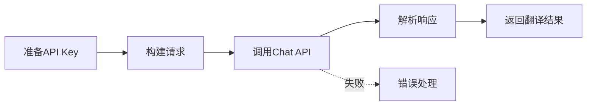

# DeepSeek AI翻译API实现指南

> 最后更新：2025-09-26
> 状态：📝 规划中
> 版本：V4架构兼容

## 📋 概述

本文档提供完整的DeepSeek AI翻译API实现指南，包括认证、调用、批量优化和最佳实践。DeepSeek是一家中国AI公司，提供极低成本的高质量翻译服务，特别适合中文场景。

## 🔑 核心特性

- **极低成本**：比OpenAI便宜95%（$0.27/百万输入tokens）
- **中文优化**：专为中文场景优化，翻译质量优秀
- **OpenAI兼容**：完全兼容OpenAI SDK，易于集成
- **大上下文**：支持64K上下文窗口
- **官方支持**：有完整的官方文档和平台

## 🏗️ 架构设计

### 调用流程



## 📝 实现代码

### 1. TypeScript实现（推荐用于Chrome扩展）

```typescript
/**
 * DeepSeek翻译服务实现
 * @file deepseek-translator.ts
 */

interface DeepSeekConfig {
  apiKey: string;           // API密钥
  model: string;            // 模型名称，默认deepseek-chat
  temperature: number;      // 温度参数，翻译建议0.3
  maxTokens: number;        // 最大输出tokens
  batchSize: number;        // 批量大小
  retryDelay: number;       // 重试延迟
  timeout: number;          // 请求超时
}

interface DeepSeekMessage {
  role: 'system' | 'user' | 'assistant';
  content: string;
}

interface DeepSeekRequest {
  model: string;
  messages: DeepSeekMessage[];
  temperature?: number;
  max_tokens?: number;
  stream?: boolean;
}

interface DeepSeekResponse {
  id: string;
  model: string;
  choices: Array<{
    message: {
      role: string;
      content: string;
    };
    finish_reason: string;
  }>;
  usage: {
    prompt_tokens: number;
    completion_tokens: number;
    total_tokens: number;
  };
}

export class DeepSeekTranslator {
  private config: DeepSeekConfig = {
    apiKey: '',
    model: 'deepseek-chat',
    temperature: 0.3,
    maxTokens: 2000,
    batchSize: 10,
    retryDelay: 500,
    timeout: 10000
  };

  constructor(apiKey: string, customConfig?: Partial<DeepSeekConfig>) {
    this.config = {
      ...this.config,
      apiKey,
      ...customConfig
    };
  }

  /**
   * 构建翻译提示词
   */
  private buildTranslationPrompt(
    texts: string[],
    sourceLang: string,
    targetLang: string
  ): DeepSeekMessage[] {
    // 使用明确的分隔符处理批量翻译
    const separator = '\n---\n';
    const combinedText = texts.join(separator);

    return [
      {
        role: 'system',
        content: `You are a professional translator. Translate from ${sourceLang} to ${targetLang}.
                  Keep the same format and structure.
                  If there are multiple texts separated by "---", translate each one and keep the separator.
                  Return ONLY the translation without any explanation.`
      },
      {
        role: 'user',
        content: combinedText
      }
    ];
  }

  /**
   * 调用DeepSeek API
   */
  private async callAPI(messages: DeepSeekMessage[]): Promise<string> {
    const controller = new AbortController();
    const timeoutId = setTimeout(() => controller.abort(), this.config.timeout);

    try {
      const response = await fetch('https://api.deepseek.com/v1/chat/completions', {
        method: 'POST',
        headers: {
          'Authorization': `Bearer ${this.config.apiKey}`,
          'Content-Type': 'application/json'
        },
        body: JSON.stringify({
          model: this.config.model,
          messages,
          temperature: this.config.temperature,
          max_tokens: this.config.maxTokens,
          stream: false
        } as DeepSeekRequest),
        signal: controller.signal
      });

      clearTimeout(timeoutId);

      if (!response.ok) {
        const error = await response.text();
        throw new Error(`DeepSeek API错误 (${response.status}): ${error}`);
      }

      const data: DeepSeekResponse = await response.json();

      if (!data.choices || !data.choices[0] || !data.choices[0].message) {
        throw new Error('DeepSeek API返回格式错误');
      }

      console.log(`[DeepSeekTranslator] Token使用:
        输入=${data.usage.prompt_tokens},
        输出=${data.usage.completion_tokens},
        总计=${data.usage.total_tokens},
        成本≈$${(data.usage.prompt_tokens * 0.00000027 + data.usage.completion_tokens * 0.0000011).toFixed(6)}`);

      return data.choices[0].message.content;
    } catch (error) {
      clearTimeout(timeoutId);

      if (error.name === 'AbortError') {
        throw new Error('DeepSeek API请求超时');
      }

      throw error;
    }
  }

  /**
   * 批量翻译文本
   */
  public async translate(
    texts: string[],
    sourceLang: string,
    targetLang: string
  ): Promise<string[]> {
    const results: string[] = [];
    const separator = '\n---\n';

    // 分批处理
    for (let i = 0; i < texts.length; i += this.config.batchSize) {
      const batch = texts.slice(i, i + this.config.batchSize);

      try {
        console.log(`[DeepSeekTranslator] 翻译批次 ${Math.floor(i / this.config.batchSize) + 1}: ${batch.length}条文本`);

        const messages = this.buildTranslationPrompt(batch, sourceLang, targetLang);
        const response = await this.callAPI(messages);

        // 分割响应
        const translations = response.split(separator);

        // 验证数量匹配
        if (translations.length !== batch.length) {
          console.warn(`[DeepSeekTranslator] 批次翻译数量不匹配: 期望${batch.length}, 实际${translations.length}`);
          // 降级处理：逐条翻译
          for (const text of batch) {
            const singleTranslation = await this.translateSingle(text, sourceLang, targetLang);
            results.push(singleTranslation);
          }
        } else {
          results.push(...translations.map(t => t.trim()));
        }
      } catch (error) {
        console.error(`[DeepSeekTranslator] 批次翻译失败:`, error);

        // 降级处理：逐条翻译
        for (const text of batch) {
          try {
            const singleTranslation = await this.translateSingle(text, sourceLang, targetLang);
            results.push(singleTranslation);
          } catch (singleError) {
            console.error(`[DeepSeekTranslator] 单条翻译失败:`, singleError);
            results.push(''); // 失败项返回空字符串
          }
        }
      }

      // 批次间延迟
      if (i + this.config.batchSize < texts.length) {
        await new Promise(resolve => setTimeout(resolve, this.config.retryDelay));
      }
    }

    return results;
  }

  /**
   * 翻译单条文本
   */
  public async translateSingle(
    text: string,
    sourceLang: string,
    targetLang: string
  ): Promise<string> {
    const messages: DeepSeekMessage[] = [
      {
        role: 'system',
        content: `Translate from ${sourceLang} to ${targetLang}. Return only the translation.`
      },
      {
        role: 'user',
        content: text
      }
    ];

    return await this.callAPI(messages);
  }

  /**
   * 估算翻译成本
   */
  public estimateCost(texts: string[]): number {
    // 粗略估算：平均每条字幕50个字符
    const totalChars = texts.reduce((sum, text) => sum + text.length, 0);

    // 估算tokens（英文1.3 tokens/word，中文0.6 tokens/char）
    const estimatedInputTokens = totalChars * 0.8; // 平均估算
    const estimatedOutputTokens = totalChars * 0.8;

    // 计算成本（美元）
    const inputCost = estimatedInputTokens * 0.00000027;
    const outputCost = estimatedOutputTokens * 0.0000011;

    return inputCost + outputCost;
  }
}
```

### 2. 集成到V4架构

```typescript
/**
 * 集成到two-phase-translator-v4.ts
 */

import { DeepSeekTranslator } from './deepseek-translator';

export class TwoPhaseTranslatorV4 {
  private deepseekTranslator: DeepSeekTranslator | null = null;

  /**
   * 初始化DeepSeek翻译器
   */
  private async initDeepSeekTranslator(): Promise<void> {
    // 从存储获取API Key
    const { deepseekApiKey } = await chrome.storage.local.get('deepseekApiKey');

    if (deepseekApiKey) {
      this.deepseekTranslator = new DeepSeekTranslator(deepseekApiKey, {
        batchSize: 5, // 字幕场景建议小批量
        temperature: 0.3, // 低温度保证一致性
        maxTokens: 2000
      });
    }
  }

  /**
   * 执行翻译
   */
  private async performTranslation(
    texts: string[],
    sourceLang: string,
    targetLang: string,
    service: TranslationServiceType
  ): Promise<{ [id: string]: string }> {
    const results: { [id: string]: string } = {};

    switch (service) {
      case 'deepseek':
        if (!this.deepseekTranslator) {
          await this.initDeepSeekTranslator();
        }

        if (!this.deepseekTranslator) {
          throw new Error('DeepSeek API密钥未配置');
        }

        try {
          // 估算成本并提示
          const estimatedCost = this.deepseekTranslator.estimateCost(texts);
          console.log(`[TwoPhaseTranslatorV4] 预计DeepSeek翻译成本: $${estimatedCost.toFixed(6)}`);

          const translations = await this.deepseekTranslator.translate(
            texts,
            this.mapLanguageCode(sourceLang, 'deepseek'),
            this.mapLanguageCode(targetLang, 'deepseek')
          );

          texts.forEach((text, index) => {
            results[index.toString()] = translations[index];
          });
        } catch (error) {
          console.error('[TwoPhaseTranslatorV4] DeepSeek翻译失败:', error);
          throw error;
        }
        break;

      // ... 其他翻译服务
    }

    return results;
  }

  /**
   * 语言代码映射
   */
  private mapLanguageCode(code: string, service: 'deepseek' | 'google' | 'microsoft'): string {
    if (service === 'deepseek') {
      // DeepSeek使用标准语言代码
      const mapping: Record<string, string> = {
        'zh-CN': 'Chinese Simplified',
        'zh-TW': 'Chinese Traditional',
        'zh-Hans': 'Chinese Simplified',
        'zh-Hant': 'Chinese Traditional',
        'en': 'English',
        'ja': 'Japanese',
        'ko': 'Korean',
        'es': 'Spanish',
        'fr': 'French',
        'de': 'German',
        'ru': 'Russian',
        'ar': 'Arabic',
        'pt': 'Portuguese'
      };
      return mapping[code] || code;
    }

    // 其他服务的映射...
    return code;
  }
}
```

### 3. Popup设置界面集成

```typescript
/**
 * 添加到popup.ts
 */

// DeepSeek API设置部分
const deepseekSection = document.createElement('div');
deepseekSection.className = 'api-settings-section';
deepseekSection.innerHTML = `
  <div class="setting-group">
    <h3>DeepSeek AI翻译设置</h3>
    <div class="api-key-input">
      <input type="password"
             id="deepseek-api-key"
             placeholder="输入DeepSeek API Key">
      <button id="save-deepseek-key">保存</button>
    </div>
    <div class="api-info">
      <p>💰 成本：约$0.001/100条字幕（比OpenAI便宜95%）</p>
      <p>🔗 获取API Key：<a href="https://platform.deepseek.com" target="_blank">platform.deepseek.com</a></p>
      <p>✨ 特点：中文翻译质量优秀，支持64K上下文</p>
    </div>
    <div class="cost-estimator">
      <button id="estimate-cost">估算当前视频翻译成本</button>
      <div id="cost-result"></div>
    </div>
  </div>
`;

// 保存API Key
document.getElementById('save-deepseek-key')?.addEventListener('click', async () => {
  const apiKey = (document.getElementById('deepseek-api-key') as HTMLInputElement).value;

  if (apiKey) {
    await chrome.storage.local.set({ deepseekApiKey: apiKey });
    alert('DeepSeek API Key已保存');
  }
});

// 成本估算
document.getElementById('estimate-cost')?.addEventListener('click', async () => {
  const response = await chrome.runtime.sendMessage({
    type: 'estimateDeepSeekCost'
  });

  if (response.cost !== undefined) {
    document.getElementById('cost-result')!.innerHTML =
      `预计翻译成本：<strong>$${response.cost.toFixed(6)}</strong>
       (约${response.subtitleCount}条字幕)`;
  }
});
```

## 🔧 配置选项

### 推荐配置

```javascript
const DEEPSEEK_CONFIG = {
  // API设置
  model: 'deepseek-chat',    // 推荐模型

  // 批量设置
  batchSize: 5,              // 每批5条（字幕较长时）
  maxBatchSize: 10,          // 最大批量（字幕较短时）

  // 温度设置
  temperature: 0.3,          // 低温度保证翻译一致性

  // Token限制
  maxTokens: 2000,           // 单次请求最大输出
  maxContextTokens: 4000,    // 包含输入的总token限制

  // 超时设置
  timeout: 10000,            // 请求超时10秒

  // 重试策略
  maxRetries: 2,             // 最多重试2次
  retryDelay: 500,           // 重试延迟500ms

  // 缓存设置
  cacheEnabled: true,        // 启用翻译缓存
  cacheDuration: 86400000    // 缓存24小时
};
```

## ⚠️ 注意事项

### 必要条件
1. **需要API Key**：必须在platform.deepseek.com注册获取
2. **需要付费**：虽然成本极低，但仍需付费（有免费额度）
3. **网络要求**：需要能访问api.deepseek.com

### 最佳实践
1. **批量优化**：
   - 短字幕：10条一批
   - 长字幕：5条一批
   - 使用明确分隔符避免混淆

2. **成本控制**：
   - 实现翻译缓存，避免重复翻译
   - 提供成本估算功能
   - 记录API使用统计

3. **错误处理**：
   - API Key无效：提示用户检查设置
   - 配额用尽：提示用户充值
   - 网络错误：降级到其他翻译服务

4. **质量保证**：
   - Temperature设置0.3保证一致性
   - 提供清晰的系统提示词
   - 批量失败时降级到单条翻译

## 📊 性能优化

### 1. 智能批处理

```typescript
// 根据字幕长度动态调整批量大小
function calculateOptimalBatchSize(texts: string[]): number {
  const avgLength = texts.reduce((sum, t) => sum + t.length, 0) / texts.length;

  if (avgLength < 30) return 10;   // 短字幕，10条一批
  if (avgLength < 60) return 7;    // 中等字幕，7条一批
  if (avgLength < 100) return 5;   // 较长字幕，5条一批
  return 3;                         // 长字幕，3条一批
}
```

### 2. 缓存策略

```typescript
// 实现翻译缓存
class DeepSeekCache {
  private cache = new Map<string, { translation: string; timestamp: number }>();
  private maxAge = 86400000; // 24小时

  generateKey(text: string, from: string, to: string): string {
    return `deepseek_${from}_${to}_${text}`;
  }

  get(text: string, from: string, to: string): string | null {
    const key = this.generateKey(text, from, to);
    const cached = this.cache.get(key);

    if (cached && Date.now() - cached.timestamp < this.maxAge) {
      return cached.translation;
    }

    return null;
  }

  set(text: string, translation: string, from: string, to: string): void {
    const key = this.generateKey(text, from, to);
    this.cache.set(key, { translation, timestamp: Date.now() });
  }
}
```

### 3. 并发控制

```typescript
// 避免并发请求过多
class RateLimiter {
  private queue: Array<() => void> = [];
  private running = 0;
  private maxConcurrent = 2;

  async execute<T>(fn: () => Promise<T>): Promise<T> {
    while (this.running >= this.maxConcurrent) {
      await new Promise(resolve => this.queue.push(resolve));
    }

    this.running++;
    try {
      return await fn();
    } finally {
      this.running--;
      const next = this.queue.shift();
      if (next) next();
    }
  }
}
```

## 🧪 测试验证

### 测试脚本

```bash
# 测试DeepSeek API
curl -X POST https://api.deepseek.com/v1/chat/completions \
  -H "Authorization: Bearer YOUR_API_KEY" \
  -H "Content-Type: application/json" \
  -d '{
    "model": "deepseek-chat",
    "messages": [
      {
        "role": "system",
        "content": "Translate from English to Chinese Simplified. Return only translation."
      },
      {
        "role": "user",
        "content": "Hello world"
      }
    ],
    "temperature": 0.3
  }'
```

### 预期结果
```json
{
  "id": "chatcmpl-xxx",
  "model": "deepseek-chat",
  "choices": [{
    "message": {
      "role": "assistant",
      "content": "你好世界"
    },
    "finish_reason": "stop"
  }],
  "usage": {
    "prompt_tokens": 20,
    "completion_tokens": 4,
    "total_tokens": 24
  }
}
```

## 🔗 相关文档

- [API文档](../api/api.md#deepseek-ai翻译api)
- [决策日志](./decision-log.md#22-deepseek-ai翻译api集成-2025-09-26)
- [架构设计](../architecture/03-component-design.md)
- [微软翻译实现](./microsoft-translate-implementation.md)

## 📅 更新历史

- **2025-09-26**：创建初始文档，完成API调研和实现设计

---

*本文档将随着实际实现和使用反馈持续更新*