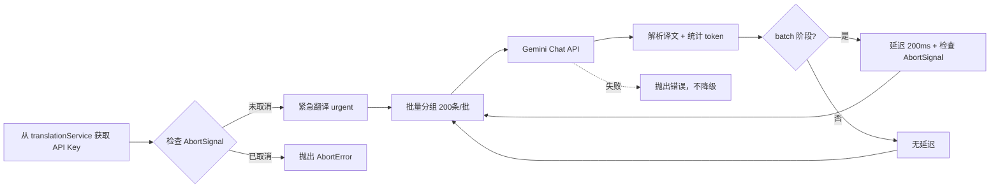
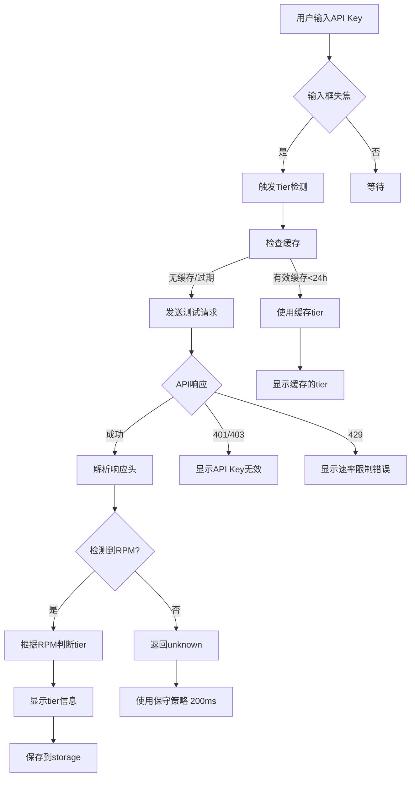

# Gemini AI翻译API实现指南

> 最后更新：2025-10-20
> 状态：📝 待实现
> 版本：V4架构兼容（AbortSignal + 统一存储）
>
> **🎯 实施策略：分阶段实现**
> - ✅ **Phase 1（当前实施）**：手动选择免费/付费层，简单直观
> - 🔮 **Phase 2（未来扩展）**：自动检测Tier + 自适应延迟（架构已设计）

## 📋 概述

本文档提供 Google Gemini 翻译 API 的完整实现指南，符合项目 V4 架构规范。Gemini API 提供强大的多模态能力和超大上下文窗口（1M tokens），适合作为高质量翻译方案，与 OpenAI、DeepSeek 并列为 AI 翻译选项。

## 🔑 核心特性

- **超大上下文**：1M token 上下文窗口（gemini-2.0-flash/2.5-flash）
- **低成本方案**：gemini-2.5-flash-lite $0.10/$0.40 每百万 token
- **原生API**：使用 Gemini 原生端点，支持 systemInstruction、safetySettings 等完整功能
- **YAML格式**：结构化字幕翻译，支持 id + text 格式，便于验证准确性
- **智能Tier检测**：⭐ 输入API Key后自动检测免费/付费层级，无需手动选择
- **自适应延迟**：根据账户层级自动调整批次延迟，遇到429自动增加，持续成功自动减少
- **快速响应**：gemini-2.5-flash-lite 是最快的 Gemini 模型
- **原生多模态**：支持文本、图片、音频、视频（字幕翻译仅用文本）
- **安全设置**：灵活配置内容过滤级别（safetySettings）
- **V4 架构集成**：完整支持 AbortSignal、两阶段翻译、统一缓存

## 📊 模型规格对比（2025年10月数据）

| 模型 | 输入上下文 | 输出限制 | 价格（输入/输出，$/M tokens） | 特点 | 推荐场景 |
|------|-----------|---------|------------------------------|------|---------|
| **gemini-2.5-flash** | 1,048,576 | 65,536 | $0.30 / $2.50 | 平衡性能与成本 | ✅ 默认推荐，日常字幕翻译 |
| **gemini-2.5-flash-lite** | 1,048,576 | 65,536 | $0.10 / $0.40 | 最快最便宜 | 高频翻译、低预算场景 |

> 数据来源：Google AI 官方文档（2025-10-07）
>
> **重要说明**：项目调用 Gemini API 时，智能断点应以 **65,535 tokens** 为输出限制

### Rate Limit 层级详解

#### 免费层（Free Tier）
| 模型 | RPM | TPM | RPD | 批量排队 Token |
|------|-----|-----|-----|--------------|
| gemini-2.5-flash | 10 | 250,000 | 250 | - |
| gemini-2.5-flash-lite | 15 | 250,000 | 1,000 | - |

#### 付费层（Tier 1 - 启用计费）
| 模型 | RPM | TPM | RPD | 批量排队 Token |
|------|-----|-----|-----|--------------|
| **gemini-2.5-flash** | 1,000 | 1,000,000 | 10,000 | 3,000,000 |
| **gemini-2.5-flash-lite** | 4,000 | 4,000,000 | 无限制 | 10,000,000 |

> **关键差异**：
> - **免费层**：flash-lite 的 RPD 是 flash 的 **4倍**（1,000 vs 250）
> - **付费层 RPM**：flash-lite 是 flash 的 **4倍**（4,000 vs 1,000）
> - **付费层 TPM**：flash-lite 是 flash 的 **4倍**（4M vs 1M）
> - **付费层 RPD**：flash-lite **无限制**，flash 限制 10K
> - **批量排队 Token**：flash-lite 是 flash 的 **3.3倍**（10M vs 3M）

## 🏗️ 架构设计

### 基础配置

| 参数 | 值 | 说明 |
|------|-----|------|
| **API 端点** | `https://generativelanguage.googleapis.com/v1beta/models/{model}:generateContent` | 原生 Gemini API |
| **认证方式** | `?key={apiKey}` | API Key 作为 URL 参数 |
| 推荐模型 | `gemini-2.5-flash` | 默认，性价比最优 |
| 备选模型 | `gemini-2.5-flash-lite` | 最快最便宜 |
| Temperature | `0` | 翻译场景推荐（原生API使用generationConfig） |
| topK | `1` | 降低随机性，确保翻译一致性 |
| topP | `1` | 配合 topK 使用 |
| 输入上限 | `1,048,576 tokens` | 1M 上下文窗口 |
| 输出上限 | `maxOutputTokens: 65536` | Gemini 官方输出限制 |
| 批次大小 | 200 条字幕/批 | 利用 1M 上下文优势 |
| 字幕格式 | YAML（`id + text`） | 结构化格式，便于验证 |
| 存储位置 | `translationService.apiKey` | 统一存储，不单独存储 |

**⭐ Tier管理与批次延迟（新增）：**

| 参数 | Phase 1（当前） | Phase 2（未来） | 说明 |
|------|----------------|----------------|------|
| **tierMode** | `'manual'` | `'auto'` \| `'manual'` | Phase 1只支持手动选择 |
| **tier选择** | Popup下拉菜单 | 自动检测 + 手动选择 | 用户选择免费/付费层 |
| **免费层延迟** | flash: 6000ms, lite: 4000ms | 同左 | 基于RPM计算（10/15 RPM） |
| **付费层延迟** | flash: 60ms, lite: 15ms | 同左 | 基于RPM计算（假设1000/4000 RPM） |
| **自适应策略** | ❌ Phase 1不实现 | ✅ 成功↓延迟，429↑延迟 | Phase 2动态优化性能 |

> **重要**：
> 1. Gemini 输入上下文 1,048,576 tokens，输出限制 65,536 tokens
> 2. 使用原生 API 端点获取完整功能（systemInstruction, safetySettings）
> 3. YAML 格式提供结构化数据，通过 id 字段验证翻译准确性
> 4. ⭐ Tier检测自动运行，用户无需关心免费/付费配置

### 存储架构

```typescript
// ✅ 正确：统一存储在 translationService
TRANSLATION_SERVICE_TEMPLATES = {
  'gemini': {
    type: 'gemini',
    apiKey: '',                          // 用户填写 Gemini API Key
    model: 'gemini-2.5-flash',           // 默认模型
    availableModels: [
      'gemini-2.5-flash',
      'gemini-2.5-flash-lite'
    ],
    customModel: null,
    temperature: 0,                      // 原生API推荐值（配合topK=1, topP=1）
    maxTokens: 65536,                    // Gemini 输出限制

    // === ⭐ Phase 1: 手动选择Tier（当前实现） ===
    tier: 'free',                        // 'free' | 'paid' (用户在Popup手动选择)
    batchDelay: 6000,                    // 根据tier和model自动计算的延迟（ms）

    // === 🔮 Phase 2: 自动检测Tier（未来功能，架构已保留） ===
    // tierMode: 'auto',                 // 'auto' | 'manual'
    // detectedTier: undefined,          // 检测到的tier：'free' | 'paid'
    // lastTierCheck: undefined,         // 最后检测时间戳
    // currentBatchDelay: undefined,     // 自适应调整后的延迟（ms）
    // rateLimitHits: 0,                 // 429错误累计次数
    // lastRateLimitTime: undefined      // 最后一次429时间戳
  }
}

// ❌ 错误：不要单独存储
// await chrome.storage.local.set({ geminiApiKey: apiKey });
```

### 调用流程



---

# ✅ Phase 1 - 手动选择Tier方案（当前实施）

> **🎯 设计目标**：
> - 简单直观：用户手动选择免费层/付费层
> - 立即可用：不依赖API响应头，不消耗额外token
> - 用户清楚：用户知道自己是否启用了Google Cloud billing

## Phase 1 存储结构

```typescript
// user-preferences-manager.ts
TRANSLATION_SERVICE_TEMPLATES = {
  'gemini': {
    type: 'gemini',
    apiKey: '',
    model: 'gemini-2.5-flash',           // 默认模型

    // ⭐ Phase 1 核心字段
    tier: 'free',                        // 'free' | 'paid'（用户手动选择）
    batchDelay: 6000                     // 根据tier和model自动计算
  }
}
```

## Phase 1 Popup UI实现

### HTML结构（popup.html）

```html
<!-- Gemini 设置区域 -->
<div id="gemini-settings" class="translation-service-settings" style="display:none;">

  <!-- API Key 输入 -->
  <div class="setting-row">
    <label for="gemini-api-key">API Key</label>
    <input
      type="password"
      id="gemini-api-key"
      class="api-key-input"
      placeholder="输入你的Gemini API Key"
    />
  </div>

  <!-- 模型选择 -->
  <div class="setting-row">
    <label for="gemini-model">模型</label>
    <select id="gemini-model" class="model-select">
      <option value="gemini-2.5-flash">Gemini 2.5 Flash (推荐)</option>
      <option value="gemini-2.5-flash-lite">Gemini 2.5 Flash-Lite (极速)</option>
    </select>
  </div>

  <!-- ⭐ 账户类型选择（Phase 1 核心功能） -->
  <div class="setting-row">
    <label for="gemini-tier">
      账户类型
      <span class="info-icon" title="是否在Google Cloud启用了billing">ℹ️</span>
    </label>
    <select id="gemini-tier" class="tier-select">
      <option value="free">免费层 (15 RPM, 1000 RPD)</option>
      <option value="paid">付费层 (需启用billing)</option>
    </select>
  </div>

  <!-- 批次延迟自动显示（只读） -->
  <div class="setting-row info-row">
    <label>批次延迟</label>
    <span id="gemini-batch-delay-display" class="info-value">
      4000 ms
    </span>
    <small class="hint">（基于账户类型自动计算）</small>
  </div>

  <!-- 帮助信息 -->
  <div class="help-box">
    <strong>💡 如何判断账户类型？</strong>
    <ul>
      <li><strong>免费层</strong>：未在Google Cloud启用billing</li>
      <li><strong>付费层</strong>：已启用billing并绑定付款方式</li>
    </ul>
    <a href="https://ai.google.dev/gemini-api/docs/billing" target="_blank" class="help-link">
      查看官方说明 →
    </a>
  </div>

</div>
```

### CSS样式（popup.css）

```css
/* Gemini设置区域 */
.translation-service-settings {
  padding: 16px;
}

.setting-row {
  display: flex;
  align-items: center;
  gap: 12px;
  margin-bottom: 12px;
}

.setting-row label {
  flex: 0 0 80px;
  font-weight: 500;
  font-size: 13px;
  color: #202124;
}

.setting-row input,
.setting-row select {
  flex: 1;
  padding: 8px 12px;
  border: 1px solid #dadce0;
  border-radius: 4px;
  font-size: 13px;
}

.setting-row input:focus,
.setting-row select:focus {
  outline: none;
  border-color: #1a73e8;
  box-shadow: 0 0 0 2px rgba(26, 115, 232, 0.1);
}

/* Info图标 */
.info-icon {
  cursor: help;
  color: #5f6368;
  font-size: 14px;
  margin-left: 4px;
}

/* 只读信息行 */
.info-row {
  background: #f8f9fa;
  padding: 8px 12px;
  border-radius: 4px;
}

.info-value {
  flex: 1;
  font-weight: 600;
  color: #1a73e8;
  font-size: 14px;
}

.hint {
  color: #5f6368;
  font-size: 11px;
  font-style: italic;
}

/* 帮助信息框 */
.help-box {
  margin-top: 16px;
  padding: 12px;
  background: #e8f0fe;
  border-left: 3px solid #1a73e8;
  border-radius: 4px;
  font-size: 12px;
}

.help-box strong {
  display: block;
  margin-bottom: 8px;
  color: #1967d2;
}

.help-box ul {
  margin: 8px 0;
  padding-left: 20px;
}

.help-box li {
  margin: 4px 0;
  color: #3c4043;
}

.help-link {
  display: inline-block;
  margin-top: 8px;
  color: #1a73e8;
  text-decoration: none;
  font-weight: 500;
}

.help-link:hover {
  text-decoration: underline;
}
```

### TypeScript实现（popup.ts）

```typescript
/**
 * Phase 1: Gemini手动Tier选择实现
 */

// DOM元素引用
let geminiApiKeyInput: HTMLInputElement;
let geminiModelSelect: HTMLSelectElement;
let geminiTierSelect: HTMLSelectElement;
let geminiBatchDelayDisplay: HTMLElement;

/**
 * 初始化Gemini设置区域
 */
function initGeminiSettings(): void {
  geminiApiKeyInput = document.getElementById('gemini-api-key') as HTMLInputElement;
  geminiModelSelect = document.getElementById('gemini-model') as HTMLSelectElement;
  geminiTierSelect = document.getElementById('gemini-tier') as HTMLSelectElement;
  geminiBatchDelayDisplay = document.getElementById('gemini-batch-delay-display') as HTMLElement;

  // 监听模型变化
  geminiModelSelect.addEventListener('change', updateBatchDelay);

  // 监听Tier变化
  geminiTierSelect.addEventListener('change', updateBatchDelay);

  // 加载已保存的配置
  loadGeminiSettings();
}

/**
 * 加载已保存的Gemini配置
 */
async function loadGeminiSettings(): Promise<void> {
  const { translationService } = await chrome.storage.local.get('translationService');

  if (translationService && translationService.type === 'gemini') {
    // 恢复API Key
    geminiApiKeyInput.value = translationService.apiKey || '';

    // 恢复模型选择
    geminiModelSelect.value = translationService.model || 'gemini-2.5-flash';

    // 恢复Tier选择
    geminiTierSelect.value = translationService.tier || 'free';

    // 更新批次延迟显示
    updateBatchDelay();
  }
}

/**
 * ⭐ 更新批次延迟显示（核心逻辑）
 */
function updateBatchDelay(): void {
  const model = geminiModelSelect.value;
  const tier = geminiTierSelect.value as 'free' | 'paid';

  // 延迟计算表（基于RPM）
  const delayMap: Record<string, Record<'free' | 'paid', number>> = {
    'gemini-2.5-flash': {
      free: 6000,   // 10 RPM → 6秒/次
      paid: 60      // 假设1000 RPM → 60ms/次
    },
    'gemini-2.5-flash-lite': {
      free: 4000,   // 15 RPM → 4秒/次
      paid: 15      // 假设4000 RPM → 15ms/次
    }
  };

  const delay = delayMap[model]?.[tier] ?? 200;  // 默认200ms（保守策略）

  // 更新显示
  geminiBatchDelayDisplay.textContent = `${delay} ms`;

  console.log(`[Popup] Gemini批次延迟更新: ${model} (${tier}) → ${delay}ms`);
}

/**
 * 保存Gemini配置
 */
async function saveGeminiSettings(): Promise<void> {
  const apiKey = geminiApiKeyInput.value.trim();
  const model = geminiModelSelect.value;
  const tier = geminiTierSelect.value as 'free' | 'paid';

  // 计算批次延迟
  const delayMap: Record<string, Record<'free' | 'paid', number>> = {
    'gemini-2.5-flash': { free: 6000, paid: 60 },
    'gemini-2.5-flash-lite': { free: 4000, paid: 15 }
  };
  const batchDelay = delayMap[model]?.[tier] ?? 200;

  // 构建配置对象
  const translationService = {
    type: 'gemini',
    apiKey: apiKey,
    model: model,
    temperature: 0,
    maxTokens: 65536,

    // ⭐ Phase 1 核心字段
    tier: tier,
    batchDelay: batchDelay
  };

  // 保存到storage
  await chrome.storage.local.set({ translationService });

  console.log('[Popup] ✓ Gemini配置已保存:', translationService);
}

// 页面加载时初始化
document.addEventListener('DOMContentLoaded', () => {
  initGeminiSettings();
});
```

## Phase 1 翻译器集成

### GeminiTranslator 构造函数修改

```typescript
export class GeminiTranslator {
  // ... 其他代码

  constructor(config: GeminiConfig) {
    this.apiKey = config.apiKey;
    this.model = config.model || GeminiTranslator.DEFAULT_MODEL;
    this.temperature = config.temperature ?? GeminiTranslator.TEMPERATURE;
    this.config = config;

    // ⭐ Phase 1: 直接使用配置中的batchDelay
    const initialDelay = config.batchDelay || 200;  // 默认200ms

    console.log(
      `[GeminiTranslator] 初始化完成 | 模型: ${this.model} | ` +
      `批次延迟: ${initialDelay}ms | Tier: ${config.tier || 'unknown'}`
    );
  }

  // ... 其他代码
}
```

## Phase 1 用户使用流程

1. **打开Popup** → 选择"Gemini"翻译服务
2. **输入API Key** → 填写Gemini API Key
3. **选择模型** → Flash（推荐）或 Flash-Lite（极速）
4. **选择账户类型** →
   - 免费层：未启用billing
   - 付费层：已启用billing
5. **查看批次延迟** → 自动显示对应延迟（只读）
6. **保存设置** → 开始使用

## Phase 1 功能测试清单

- [ ] Popup显示"账户类型"下拉菜单
- [ ] 默认选中"免费层"
- [ ] 选择"免费层" + "Flash"时，显示6000ms
- [ ] 选择"免费层" + "Flash-Lite"时，显示4000ms
- [ ] 选择"付费层" + "Flash"时，显示60ms
- [ ] 选择"付费层" + "Flash-Lite"时，显示15ms
- [ ] tier和batchDelay正确保存到storage
- [ ] 翻译时使用正确的批次延迟
- [ ] 帮助信息正确显示链接

---

# 🔮 Phase 2 - 自动Tier检测与自适应延迟架构（未来功能）

> **⚠️ 重要说明**：
> - 本章节是**未来扩展功能**的架构设计，当前**不实施**
> - Phase 1 采用**简单的手动选择**方案（见下文"Phase 1 实施方案"）
> - 架构设计已完整，待未来验证API响应头可靠性后实施
> - 代码已编写完整，标注为"Phase 2"，当前注释掉

---

## 🎯 Tier检测与自适应延迟架构（Phase 2）

### 设计目标

- ✅ **自动化**：用户输入API Key后自动检测tier，无需手动选择
- ✅ **即时反馈**：Popup界面实时显示检测结果（免费层/付费层）
- ✅ **智能优化**：根据tier自动调整批次延迟，付费用户享受4-16倍速提升
- ✅ **自适应**：遇到429错误自动增加延迟，持续成功自动减少延迟
- ✅ **低成本**：检测请求仅消耗约10个token
- ✅ **缓存机制**：24小时内无需重复检测

### Tier检测流程



### Tier判断规则

| 模型 | 免费层RPM | 付费层RPM | 判断逻辑 |
|------|----------|----------|---------|
| gemini-2.5-flash | ≤10 | ≥1000 | RPM ≤ 10 → 免费<br>RPM ≥ 1000 → 付费 |
| gemini-2.5-flash-lite | ≤15 | ≥4000 | RPM ≤ 15 → 免费<br>RPM ≥ 4000 → 付费 |

### 延迟计算策略

| Tier | 模型 | RPM | 延迟计算 | 实际延迟 |
|------|------|-----|---------|---------|
| 免费层 | flash | 10 | 60000ms / 10 | 6000ms |
| 免费层 | flash-lite | 15 | 60000ms / 15 | 4000ms |
| 付费层 | flash | 1000 | 60000ms / 1000 | 60ms |
| 付费层 | flash-lite | 4000 | 60000ms / 4000 | 15ms |

**公式**：`批次延迟 = 60000ms / RPM`

### 自适应延迟策略

```typescript
// 初始延迟：根据检测到的tier
initialDelay = getTierDelay(detectedTier, model);

// 成功策略：连续成功10次，减少10%延迟（最低50ms）
if (consecutiveSuccesses >= 10) {
  currentDelay = max(50, currentDelay * 0.9);
}

// 失败策略：遇到429立即翻倍延迟（最高10000ms）
if (error.status === 429) {
  currentDelay = min(10000, currentDelay * 2);
}
```

### 检测请求示例

```typescript
// 最小测试请求（约10个token）
const testRequest = {
  contents: [{
    role: 'user',
    parts: [{ text: 'Hi' }]  // 最短输入
  }],
  generationConfig: {
    temperature: 0,
    topK: 1,
    topP: 1,
    maxOutputTokens: 10  // 最短输出
  }
};
```

### 响应头解析

Gemini API可能返回的响应头（需实测验证）：

```
x-ratelimit-requests-limit: 1000
x-ratelimit-requests-remaining: 999
x-ratelimit-requests-reset: 1699999999
x-ratelimit-tokens-limit: 1000000
x-ratelimit-tokens-remaining: 999990
```

如果响应头无Rate Limit信息，返回 `tier: 'unknown'`，使用保守策略（200ms延迟）。

### Popup UI状态展示

#### 检测中
```
⏳ 正在检测账户类型...
```

#### 免费层
```
✅ 免费层账户
   10 RPM | 250K TPM | 250 RPD
   预计速度：约 2,000 条字幕/分钟
```

#### 付费层
```
🚀 付费层账户 (Tier 1)
   1,000 RPM | 1M TPM | 10K RPD
   预计速度：约 200,000 条字幕/分钟
```

#### 检测失败
```
❌ 检测失败
   API Key格式错误或无效
   将使用保守速率限制策略（200ms）
```

## 📝 实现代码

### 1. TypeScript实现（V4架构兼容）

```typescript
/**
 * Gemini翻译服务实现（原生API）
 * @file src/background/components/gemini-translator.ts
 * @version V4 - 支持 AbortSignal、两阶段翻译、YAML格式
 */

/**
 * Gemini 原生 API 请求格式
 */
interface GeminiContent {
  role: 'user' | 'model';  // 注意：Gemini 使用 'model'，不是 'assistant'
  parts: Array<{ text: string }>;
}

interface GeminiRequest {
  contents: GeminiContent[];
  systemInstruction?: {
    parts: Array<{ text: string }>;
  };
  generationConfig: {
    temperature: number;
    topK: number;
    topP: number;
    maxOutputTokens: number;
  };
  safetySettings: Array<{
    category: string;
    threshold: string;
  }>;
}

/**
 * Gemini 原生 API 响应格式
 */
interface GeminiResponse {
  candidates: Array<{
    content: {
      parts: Array<{ text: string }>;
      role: string;
    };
    finishReason: string;
    safetyRatings?: Array<{
      category: string;
      probability: string;
    }>;
  }>;
  usageMetadata?: {
    promptTokenCount: number;
    candidatesTokenCount: number;
    totalTokenCount: number;
  };
}

/**
 * 字幕项（YAML 格式）
 */
interface SubtitleItem {
  id: number;
  text: string;
}

/**
 * Gemini配置接口（扩展）
 */
interface GeminiConfig {
  type: 'gemini';
  apiKey: string;
  model: string;
  temperature: number;

  // Tier检测相关
  tierMode: 'auto' | 'free' | 'paid';
  detectedTier?: 'free' | 'paid';
  lastTierCheck?: number;

  // 自适应延迟相关
  currentBatchDelay?: number;
  rateLimitHits?: number;
  lastRateLimitTime?: number;
}

/**
 * ⭐ Tier检测器
 * 用于检测Gemini API的免费/付费层级
 */
class GeminiTierDetector {
  /**
   * 检测API Key的tier级别
   * @param apiKey API密钥
   * @param model 模型名称
   * @returns 检测结果
   */
  static async detectTier(
    apiKey: string,
    model: string
  ): Promise<{
    tier: 'free' | 'paid' | 'unknown';
    rpm?: number;
    tpm?: number;
    rpd?: number;
    error?: string;
  }> {
    try {
      // 最小测试请求（只消耗约10个token）
      const testRequest = {
        contents: [{
          role: 'user',
          parts: [{ text: 'Hi' }]
        }],
        generationConfig: {
          temperature: 0,
          topK: 1,
          topP: 1,
          maxOutputTokens: 10
        }
      };

      const url = `https://generativelanguage.googleapis.com/v1beta/models/${model}:generateContent?key=${apiKey}`;

      console.log('[GeminiTierDetector] 发送检测请求...');
      const response = await fetch(url, {
        method: 'POST',
        headers: { 'Content-Type': 'application/json' },
        body: JSON.stringify(testRequest)
      });

      // 错误处理
      if (!response.ok) {
        const errorText = await response.text();
        console.error('[GeminiTierDetector] 请求失败:', response.status, errorText);

        if (response.status === 400) {
          return { tier: 'unknown', error: 'API Key格式错误或无效' };
        } else if (response.status === 403) {
          return { tier: 'unknown', error: 'API Key无权限访问此模型' };
        } else if (response.status === 429) {
          return { tier: 'unknown', error: '请求过于频繁，请稍后再试' };
        }

        return { tier: 'unknown', error: `API错误 (${response.status})` };
      }

      // 验证响应有效性
      const data = await response.json();
      if (!data.candidates || !data.candidates[0]) {
        return { tier: 'unknown', error: 'API响应格式异常' };
      }

      console.log('[GeminiTierDetector] ✓ API Key有效');

      // 尝试从响应头获取rate limit信息
      const rpmLimitHeader =
        response.headers.get('x-ratelimit-requests-limit') ||
        response.headers.get('x-ratelimit-limit-requests') ||
        response.headers.get('x-goog-ratelimit-requests-limit');

      const tpmLimitHeader =
        response.headers.get('x-ratelimit-tokens-limit') ||
        response.headers.get('x-goog-ratelimit-tokens-limit');

      // 如果响应头有rate limit信息
      if (rpmLimitHeader) {
        const rpm = parseInt(rpmLimitHeader, 10);
        console.log('[GeminiTierDetector] 检测到RPM:', rpm);
        return this.inferTierFromRPM(rpm, model);
      }

      // 响应头没有信息，返回unknown（使用保守策略）
      console.log('[GeminiTierDetector] 响应头无Rate Limit信息');
      return {
        tier: 'unknown',
        error: '无法从API响应获取Rate Limit信息，将使用保守策略'
      };

    } catch (error: any) {
      console.error('[GeminiTierDetector] 检测异常:', error);

      if (error.name === 'NetworkError' || error.message?.includes('fetch')) {
        return { tier: 'unknown', error: '网络连接失败，请检查网络' };
      }

      return { tier: 'unknown', error: error.message || '未知错误' };
    }
  }

  /**
   * 根据RPM推断tier
   */
  private static inferTierFromRPM(rpm: number, model: string): {
    tier: 'free' | 'paid';
    rpm: number;
    tpm?: number;
    rpd?: number;
  } {
    // gemini-2.5-flash
    if (model === 'gemini-2.5-flash') {
      if (rpm <= 10) {
        return { tier: 'free', rpm: 10, tpm: 250000, rpd: 250 };
      } else {
        return { tier: 'paid', rpm: 1000, tpm: 1000000, rpd: 10000 };
      }
    }

    // gemini-2.5-flash-lite
    if (model === 'gemini-2.5-flash-lite') {
      if (rpm <= 15) {
        return { tier: 'free', rpm: 15, tpm: 250000, rpd: 1000 };
      } else {
        return { tier: 'paid', rpm: 4000, tpm: 4000000, rpd: -1 };  // -1表示无限制
      }
    }

    // 默认返回免费层（保守策略）
    return { tier: 'free', rpm: 10, tpm: 250000, rpd: 250 };
  }

  /**
   * 计算tier对应的批次延迟
   */
  static getBatchDelay(tier: 'free' | 'paid', model: string): number {
    const delayMap = {
      'gemini-2.5-flash': {
        free: 6000,   // 10 RPM → 6秒/次
        paid: 60      // 1,000 RPM → 60ms/次
      },
      'gemini-2.5-flash-lite': {
        free: 4000,   // 15 RPM → 4秒/次
        paid: 15      // 4,000 RPM → 15ms/次
      }
    };

    return delayMap[model]?.[tier] || 200;  // 默认200ms（保守策略）
  }

  /**
   * 计算预估翻译速度（条/分钟）
   */
  static estimateSpeed(rpm: number, batchSize: number = 200): number {
    return rpm * batchSize;
  }
}

/**
 * ⭐ 自适应批次延迟管理器
 * 根据API响应动态调整批次延迟
 */
class AdaptiveBatchDelayManager {
  private currentDelay: number;
  private consecutiveSuccesses: number = 0;
  private consecutiveFailures: number = 0;

  constructor(initialDelay: number) {
    this.currentDelay = initialDelay;
  }

  /**
   * 记录成功请求
   */
  recordSuccess(): void {
    this.consecutiveSuccesses++;
    this.consecutiveFailures = 0;

    // 连续成功10次，尝试减少延迟（最多减少10%，最低50ms）
    if (this.consecutiveSuccesses >= 10 && this.currentDelay > 50) {
      const newDelay = Math.max(50, this.currentDelay * 0.9);
      console.log(`[AdaptiveDelay] 连续成功10次，减少延迟: ${this.currentDelay}ms → ${newDelay}ms`);
      this.currentDelay = newDelay;
      this.consecutiveSuccesses = 0;
    }
  }

  /**
   * 记录429错误
   */
  record429Error(): void {
    this.consecutiveFailures++;
    this.consecutiveSuccesses = 0;

    // 立即翻倍延迟（最高10秒）
    const newDelay = Math.min(10000, this.currentDelay * 2);
    console.warn(`[AdaptiveDelay] 遇到429错误，增加延迟: ${this.currentDelay}ms → ${newDelay}ms`);
    this.currentDelay = newDelay;
  }

  /**
   * 获取当前延迟
   */
  getCurrentDelay(): number {
    return this.currentDelay;
  }

  /**
   * 重置延迟（用于切换模型或tier时）
   */
  resetDelay(newDelay: number): void {
    console.log(`[AdaptiveDelay] 重置延迟: ${this.currentDelay}ms → ${newDelay}ms`);
    this.currentDelay = newDelay;
    this.consecutiveSuccesses = 0;
    this.consecutiveFailures = 0;
  }
}

export class GeminiTranslator {
  // ========== 常量配置 ==========
  private static readonly BASE_URL = 'https://generativelanguage.googleapis.com/v1beta/models';
  private static readonly DEFAULT_MODEL = 'gemini-2.5-flash';
  private static readonly TEMPERATURE = 0;            // 翻译场景推荐值（原生API）
  private static readonly TOP_K = 1;                  // 降低随机性
  private static readonly TOP_P = 1;                  // 配合topK使用
  private static readonly MAX_OUTPUT_TOKENS = 65536;  // Gemini 输出限制
  private static readonly BATCH_SIZE = 200;           // 利用 1M 上下文，批次更大
  private static readonly BATCH_DELAY_MS = 200;       // batch 阶段延迟

  // ========== 实例属性 ==========
  private apiKey: string;
  private model: string;
  private temperature: number;
  private config: GeminiConfig;                      // 完整配置
  private delayManager: AdaptiveBatchDelayManager;   // ⭐ 自适应延迟管理器

  /**
   * 构造函数
   * @param config Gemini配置对象
   */
  constructor(config: GeminiConfig) {
    this.apiKey = config.apiKey;
    this.model = config.model || GeminiTranslator.DEFAULT_MODEL;
    this.temperature = config.temperature ?? GeminiTranslator.TEMPERATURE;
    this.config = config;

    // ⭐ 初始化自适应延迟管理器
    const initialDelay = this.getInitialDelay();
    this.delayManager = new AdaptiveBatchDelayManager(initialDelay);

    console.log(
      `[GeminiTranslator] 初始化完成 | 模型: ${this.model} | ` +
      `批次延迟: ${initialDelay}ms | Tier: ${config.detectedTier || 'unknown'}`
    );
  }

  /**
   * ⭐ 获取初始延迟（基于已检测的tier）
   */
  private getInitialDelay(): number {
    // 优先使用缓存的延迟
    if (this.config.currentBatchDelay) {
      return this.config.currentBatchDelay;
    }

    // 根据tierMode和detectedTier决定延迟
    let tier: 'free' | 'paid' | 'unknown' = 'unknown';

    if (this.config.tierMode === 'free') {
      tier = 'free';
    } else if (this.config.tierMode === 'paid') {
      tier = 'paid';
    } else if (this.config.detectedTier) {
      tier = this.config.detectedTier;
    }

    // 根据tier和model返回延迟
    if (tier === 'free') {
      return this.model === 'gemini-2.5-flash-lite' ? 4000 : 6000;
    } else if (tier === 'paid') {
      return this.model === 'gemini-2.5-flash-lite' ? 15 : 60;
    } else {
      // 未知tier，使用保守策略
      return 200;
    }
  }

  /**
   * 批量翻译文本（支持 AbortSignal 和两阶段翻译）
   * @param texts 待翻译文本数组
   * @param sourceLang 源语言代码（YouTube标准）
   * @param targetLang 目标语言代码（YouTube标准）
   * @param stage 翻译阶段：urgent（无延迟） | batch（200ms延迟）
   * @param signal AbortSignal 用于取消操作
   * @returns 翻译结果数组
   */
  public async translate(
    texts: string[],
    sourceLang: string,
    targetLang: string,
    stage: 'urgent' | 'batch',
    signal: AbortSignal
  ): Promise<string[]> {
    if (texts.length === 0) {
      return [];
    }

    // 检查初始信号状态
    if (signal.aborted) {
      throw new DOMException('Gemini翻译开始前已取消', 'AbortError');
    }

    console.log(
      `[GeminiTranslator] 开始翻译 ${texts.length} 条字幕 ` +
      `(${stage}阶段, 模型: ${this.model}, 延迟: ${this.delayManager.getCurrentDelay()}ms)`
    );

    const results: string[] = [];

    // 分批处理（统一 200 条/批）
    const totalBatches = Math.ceil(texts.length / GeminiTranslator.BATCH_SIZE);
    for (let i = 0; i < texts.length; i += GeminiTranslator.BATCH_SIZE) {
      const batch = texts.slice(i, i + GeminiTranslator.BATCH_SIZE);
      const batchNumber = Math.floor(i / GeminiTranslator.BATCH_SIZE) + 1;

      console.debug(
        `[debug][GeminiTranslator] 翻译批次 ${batchNumber}/${totalBatches}: ` +
        `${batch.length} 条字幕 (${stage}阶段)`
      );

      try {
        // 构建提示词并调用 API
        const { systemInstruction, contents } = this.buildTranslationPrompt(
          batch,
          this.mapLanguageCode(sourceLang),
          this.mapLanguageCode(targetLang)
        );

        const yamlResponse = await this.callAPI(systemInstruction, contents, signal);

        // 解析 YAML 响应
        const translations = this.parseYAMLResponse(yamlResponse, batch.length);

        // 验证数量匹配（parseYAMLResponse 已验证，这里作为二次检查）
        if (translations.length !== batch.length) {
          console.error(
            `[GeminiTranslator] 批次翻译数量不匹配: 期望${batch.length}, 实际${translations.length}`
          );
          throw new Error(
            `Gemini翻译结果数量不匹配: 期望${batch.length}条, 实际返回${translations.length}条`
          );
        }

        results.push(...translations);

        // ⭐ 记录成功请求
        this.delayManager.recordSuccess();

      } catch (error: any) {
        // ⭐ 检查是否是429错误
        if (error.message?.includes('速率限制') || error.message?.includes('429')) {
          console.warn(`[GeminiTranslator] 批次${batchNumber}遇到429错误`);
          this.delayManager.record429Error();

          // 更新配置中的429统计
          this.config.rateLimitHits = (this.config.rateLimitHits || 0) + 1;
          this.config.lastRateLimitTime = Date.now();
        }

        // 重新抛出错误，让上层处理
        throw error;
      }

      // 批次间延迟（仅 batch 阶段，使用自适应延迟）
      if (stage === 'batch' && i + GeminiTranslator.BATCH_SIZE < texts.length) {
        const delay = this.delayManager.getCurrentDelay();
        await this.delayWithSignal(delay, signal);
      }
    }

    // ⭐ 保存当前延迟到配置
    this.config.currentBatchDelay = this.delayManager.getCurrentDelay();

    console.log(
      `[GeminiTranslator] ✅ 翻译完成: ${results.length}/${texts.length} 条成功 | ` +
      `最终延迟: ${this.config.currentBatchDelay}ms`
    );

    return results;
  }

  /**
   * 构建翻译提示词（YAML 格式）
   * @param texts 待翻译文本数组
   * @param sourceLang 源语言（已映射）
   * @param targetLang 目标语言（已映射）
   * @returns Gemini 原生 API 请求内容
   */
  private buildTranslationPrompt(
    texts: string[],
    sourceLang: string,
    targetLang: string
  ): { systemInstruction: { parts: Array<{ text: string }> }; contents: GeminiContent[] } {
    // 构建 YAML 格式输入
    const yamlInput = texts
      .map((text, index) => `- id: ${index + 1}\n  text: ${text}`)
      .join('\n');

    const systemPrompt = `You are a professional subtitle translator specialized in video content.
Translate from ${sourceLang} to ${targetLang}.

IMPORTANT RULES:
1. Input is in YAML format with "id" and "text" fields
2. Each item is a time-based subtitle segment - keep the same number of items
3. Translate ONLY the "text" field, keep "id" unchanged
4. Output must be valid YAML with the same structure
5. Maintain exact spacing and indentation (2 spaces for YAML)
6. Do NOT merge or split items - output count must match input count
7. Return ONLY the YAML output, no explanations or markdown code blocks

Example Input:
- id: 1
  text: Hello world
- id: 2
  text: How are you

Example Output:
- id: 1
  text: 你好世界
- id: 2
  text: 你好吗`;

    return {
      systemInstruction: {
        parts: [{ text: systemPrompt }]
      },
      contents: [
        {
          role: 'user',
          parts: [{ text: yamlInput }]
        }
      ]
    };
  }

  /**
   * 调用 Gemini 原生 API（支持 AbortSignal）
   * @param systemInstruction 系统指令
   * @param contents 用户输入内容
   * @param signal AbortSignal 用于取消操作
   * @returns 翻译结果（YAML 格式字符串）
   */
  private async callAPI(
    systemInstruction: { parts: Array<{ text: string }> },
    contents: GeminiContent[],
    signal: AbortSignal
  ): Promise<string> {
    try {
      // 构建原生 API URL（API Key 作为参数）
      const url = `${GeminiTranslator.BASE_URL}/${this.model}:generateContent?key=${this.apiKey}`;

      const requestBody: GeminiRequest = {
        contents,
        systemInstruction,
        generationConfig: {
          temperature: this.temperature,
          topK: GeminiTranslator.TOP_K,
          topP: GeminiTranslator.TOP_P,
          maxOutputTokens: GeminiTranslator.MAX_OUTPUT_TOKENS
        },
        safetySettings: [
          { category: 'HARM_CATEGORY_HARASSMENT', threshold: 'BLOCK_NONE' },
          { category: 'HARM_CATEGORY_HATE_SPEECH', threshold: 'BLOCK_NONE' },
          { category: 'HARM_CATEGORY_SEXUALLY_EXPLICIT', threshold: 'BLOCK_NONE' },
          { category: 'HARM_CATEGORY_DANGEROUS_CONTENT', threshold: 'BLOCK_NONE' }
        ]
      };

      const response = await fetch(url, {
        method: 'POST',
        headers: {
          'Content-Type': 'application/json'
        },
        body: JSON.stringify(requestBody),
        signal  // 使用外部 AbortSignal
      });

      // ⭐ TODO: 如果BLOCK_NONE遇到403/400错误，实现自动降级到BLOCK_ONLY_HIGH
      // 参考：上方"安全设置"章节的降级逻辑示例

      // 错误处理细化（简化错误消息）
      if (!response.ok) {
        const errorText = await response.text();

        switch (response.status) {
          case 400:
            throw new Error('Gemini API请求参数错误');
          case 401:
          case 403:
            throw new Error('Gemini API密钥无效');
          case 429:
            throw new Error('Gemini API速率限制（超出RPM/TPM配额）');
          case 500:
          case 502:
          case 503:
            throw new Error('Gemini服务暂时不可用');
          default:
            throw new Error(`Gemini API错误 (${response.status}): ${errorText}`);
        }
      }

      const data: GeminiResponse = await response.json();

      if (!data.candidates || !data.candidates[0] || !data.candidates[0].content) {
        throw new Error('Gemini API返回格式错误');
      }

      // 检查是否被安全过滤阻止
      if (data.candidates[0].finishReason === 'SAFETY') {
        throw new Error('内容被Gemini安全过滤器阻止');
      }

      // 记录 token 使用情况
      if (data.usageMetadata) {
        console.debug(
          `[debug][GeminiTranslator] Token使用: ` +
          `输入=${data.usageMetadata.promptTokenCount}, ` +
          `输出=${data.usageMetadata.candidatesTokenCount}, ` +
          `总计=${data.usageMetadata.totalTokenCount}`
        );
      }

      return data.candidates[0].content.parts[0].text;

    } catch (error: any) {
      // AbortError 处理
      if (error.name === 'AbortError') {
        throw new DOMException('Gemini API请求被取消', 'AbortError');
      }
      throw error;
    }
  }

  /**
   * 解析 YAML 响应
   * @param yamlText YAML 格式的响应文本
   * @param expectedCount 期望的翻译数量
   * @returns 翻译文本数组
   */
  private parseYAMLResponse(yamlText: string, expectedCount: number): string[] {
    try {
      // 清理可能的 markdown 代码块标记
      let cleanedYaml = yamlText.trim();
      if (cleanedYaml.startsWith('```yaml') || cleanedYaml.startsWith('```')) {
        cleanedYaml = cleanedYaml.replace(/^```(yaml)?\n?/, '').replace(/\n?```$/, '');
      }

      // 简单的 YAML 解析（适用于我们的特定格式）
      const lines = cleanedYaml.split('\n');
      const results: string[] = [];
      let currentId: number | null = null;
      let currentText: string = '';

      for (const line of lines) {
        const idMatch = line.match(/^- id:\s*(\d+)/);
        const textMatch = line.match(/^\s{2}text:\s*(.*)$/);

        if (idMatch) {
          // 保存上一个项目
          if (currentId !== null && currentText) {
            results.push(currentText);
          }
          currentId = parseInt(idMatch[1], 10);
          currentText = '';
        } else if (textMatch && currentId !== null) {
          currentText = textMatch[1].trim();
        }
      }

      // 保存最后一个项目
      if (currentId !== null && currentText) {
        results.push(currentText);
      }

      // 验证数量
      if (results.length !== expectedCount) {
        throw new Error(
          `YAML 解析数量不匹配: 期望${expectedCount}条, 解析出${results.length}条`
        );
      }

      return results;

    } catch (error: any) {
      console.error('[GeminiTranslator] YAML 解析失败:', error.message);
      console.error('[GeminiTranslator] 原始响应:', yamlText);
      throw new Error(`YAML 解析失败: ${error.message}`);
    }
  }

  /**
   * 延迟工具（支持 AbortSignal 中断）
   * @param ms 延迟毫秒数
   * @param signal AbortSignal 用于取消延迟
   */
  private async delayWithSignal(ms: number, signal: AbortSignal): Promise<void> {
    return new Promise((resolve, reject) => {
      const timer = setTimeout(resolve, ms);

      const abortHandler = () => {
        clearTimeout(timer);
        reject(new DOMException('延迟被取消', 'AbortError'));
      };

      signal.addEventListener('abort', abortHandler, { once: true });
    });
  }

  /**
   * 语言代码映射（YouTube标准 → Gemini标准）
   * Gemini 支持多种语言格式，这里使用标准 ISO 639-1 代码
   * @param code YouTube 语言代码
   * @returns Gemini 语言代码
   */
  private mapLanguageCode(code: string): string {
    const mapping: Record<string, string> = {
      'zh-CN': 'Chinese',
      'zh-TW': 'Chinese',
      'zh-Hans': 'Chinese',
      'zh-Hant': 'Chinese',
      'en': 'English',
      'ja': 'Japanese',
      'ko': 'Korean',
      'es': 'Spanish',
      'fr': 'French',
      'de': 'German',
      'ru': 'Russian',
      'ar': 'Arabic',
      'pt': 'Portuguese',
      'it': 'Italian',
      'nl': 'Dutch',
      'hi': 'Hindi',
      'vi': 'Vietnamese',
      'th': 'Thai',
      'id': 'Indonesian',
      'tr': 'Turkish',
      'pl': 'Polish',
      'uk': 'Ukrainian'
    };

    return mapping[code] || 'English';
  }
}
```

### 2. 集成到 V4 架构

```typescript
/**
 * 集成到 two-phase-translator-v4.ts
 */

import { GeminiTranslator } from './gemini-translator';

export class TwoPhaseTranslatorV4 {
  // ... 现有代码

  /**
   * 在 callTranslationAPI 方法中添加 Gemini 分支
   */
  private async callTranslationAPI(
    texts: string[],
    service: any,
    sourceLang: string,
    targetLang: string,
    signal: AbortSignal,
    options?: { stage?: 'urgent' | 'batch' }
  ): Promise<string[]> {
    return new Promise<string[]>((resolve, reject) => {
      // ... 现有 abort handler 代码

      try {
        let translatedTexts: string[] = [];

        // Gemini 分支
        if (service.type === 'gemini') {
          if (!service.apiKey) {
            throw new Error('Gemini API密钥未配置');
          }

          // ⭐ 传入完整配置对象（包含tier检测信息）
          const translator = new GeminiTranslator(service as GeminiConfig);
          const stage = options?.stage ?? 'batch';

          // 调用翻译（传递 signal）
          translatedTexts = await translator.translate(
            texts,
            sourceLang,
            targetLang,
            stage,
            signal
          );

          // ⭐ 翻译完成后，保存更新的配置（包含currentBatchDelay）
          // 这里需要调用UserPreferencesManager保存更新后的service配置
          // await this.updateTranslationServiceConfig(service);
        }
        // ... 其他服务分支（openai, deepseek, google-free, microsoft-free）

        resolve(translatedTexts);

      } catch (error) {
        reject(error);
      }
    });
  }
}
```

### 3. 用户偏好模板配置

```typescript
/**
 * 在 src/shared/storage/user-preferences-manager.ts 中添加
 */

export const TRANSLATION_SERVICE_TEMPLATES: Record<TranslationServiceType, TranslationService> = {
  // ... 现有模板

  'gemini': {
    type: 'gemini',
    apiKey: '',                              // 用户填写
    model: 'gemini-2.5-flash',               // 默认模型
    availableModels: [
      'gemini-2.5-flash',
      'gemini-2.5-flash-lite'
    ],
    customModel: null,
    temperature: 0,                          // 原生API推荐值（配合topK=1）
    maxTokens: 65536,                        // Gemini 输出限制

    // ⭐ Tier检测相关（新增）
    tierMode: 'auto',                        // 默认自动检测
    detectedTier: undefined,                 // 检测到的tier
    lastTierCheck: undefined,                // 最后检测时间

    // ⭐ 自适应延迟相关（新增）
    currentBatchDelay: undefined,            // 当前批次延迟
    rateLimitHits: 0,                        // 429错误次数
    lastRateLimitTime: undefined             // 最后429时间
  }
};
```

### 4. Popup 设置界面集成

#### HTML结构（popup.html）

```html
<!-- Gemini 设置区域 -->
<div id="gemini-settings" style="display:none;">
  <!-- API Key 输入 + 检测按钮 -->
  <div class="setting-row">
    <label>API Key</label>
    <div class="api-key-input-group">
      <input
        type="password"
        id="gemini-api-key"
        placeholder="输入你的Gemini API Key"
      />
      <button id="gemini-detect-tier-btn" class="detect-btn" disabled>
        检测
      </button>
    </div>
  </div>

  <!-- ⭐ Tier检测状态显示 -->
  <div id="gemini-tier-status" class="tier-status" style="display:none;">
    <!-- Loading状态 -->
    <div id="tier-detecting" class="status-item" style="display:none;">
      <span class="spinner">⏳</span>
      <span>正在检测账户类型...</span>
    </div>

    <!-- 检测成功 - 免费层 -->
    <div id="tier-free" class="status-item success" style="display:none;">
      <span class="icon">✅</span>
      <div class="tier-info">
        <div class="tier-name">免费层账户</div>
        <div class="tier-details">
          <span id="free-tier-rpm"></span> RPM |
          <span id="free-tier-rpd"></span> RPD
        </div>
        <div class="tier-estimate">
          预计速度：约 <span id="free-tier-speed"></span> 条字幕/分钟
        </div>
      </div>
    </div>

    <!-- 检测成功 - 付费层 -->
    <div id="tier-paid" class="status-item success" style="display:none;">
      <span class="icon">🚀</span>
      <div class="tier-info">
        <div class="tier-name">付费层账户 (Tier 1)</div>
        <div class="tier-details">
          <span id="paid-tier-rpm"></span> RPM |
          <span id="paid-tier-rpd"></span> RPD
        </div>
        <div class="tier-estimate">
          预计速度：约 <span id="paid-tier-speed"></span> 条字幕/分钟
        </div>
      </div>
    </div>

    <!-- 检测失败 -->
    <div id="tier-error" class="status-item error" style="display:none;">
      <span class="icon">❌</span>
      <div class="error-info">
        <div class="error-title">检测失败</div>
        <div class="error-message" id="tier-error-message"></div>
        <div class="error-hint">将使用保守速率限制策略（200ms）</div>
      </div>
    </div>
  </div>

  <!-- 模型选择 -->
  <div class="setting-row">
    <label>模型</label>
    <select id="gemini-model">
      <option value="gemini-2.5-flash">Gemini 2.5 Flash (推荐)</option>
      <option value="gemini-2.5-flash-lite">Gemini 2.5 Flash-Lite (极速)</option>
    </select>
  </div>

  <!-- 高级设置（可折叠） -->
  <details class="advanced-settings">
    <summary>高级设置</summary>

    <div class="setting-row">
      <label>
        Tier模式
        <span class="info-icon" title="通常使用自动检测即可">ℹ️</span>
      </label>
      <select id="gemini-tier-mode">
        <option value="auto">自动检测（推荐）</option>
        <option value="free">强制免费层</option>
        <option value="paid">强制付费层</option>
      </select>
    </div>

    <div class="setting-row">
      <label>当前批次延迟</label>
      <input
        type="number"
        id="gemini-batch-delay"
        readonly
        placeholder="自动计算"
      />
      <span class="unit">ms</span>
    </div>

    <div class="setting-row">
      <label>429错误次数</label>
      <input
        type="number"
        id="gemini-rate-limit-hits"
        readonly
        value="0"
      />
    </div>
  </details>
</div>
```

#### CSS样式（popup.css）

```css
/* API Key输入组 */
.api-key-input-group {
  display: flex;
  gap: 8px;
}

.api-key-input-group input {
  flex: 1;
}

.detect-btn {
  padding: 4px 12px;
  background: #4285f4;
  color: white;
  border: none;
  border-radius: 4px;
  cursor: pointer;
  font-size: 12px;
  white-space: nowrap;
}

.detect-btn:disabled {
  background: #ccc;
  cursor: not-allowed;
}

.detect-btn:hover:not(:disabled) {
  background: #357ae8;
}

/* Tier状态容器 */
.tier-status {
  margin: 12px 0;
  padding: 12px;
  border-radius: 6px;
  background: #f8f9fa;
}

.status-item {
  display: flex;
  align-items: center;
  gap: 12px;
}

.status-item .icon {
  font-size: 24px;
  flex-shrink: 0;
}

.status-item .spinner {
  animation: spin 1s linear infinite;
  font-size: 20px;
}

@keyframes spin {
  from { transform: rotate(0deg); }
  to { transform: rotate(360deg); }
}

/* Tier信息 */
.tier-info {
  flex: 1;
}

.tier-name {
  font-weight: bold;
  font-size: 14px;
  margin-bottom: 4px;
  color: #202124;
}

.tier-details {
  font-size: 12px;
  color: #666;
  margin-bottom: 4px;
}

.tier-estimate {
  font-size: 12px;
  color: #1a73e8;
  font-weight: 500;
}

/* 状态颜色 */
.status-item.success {
  color: #137333;
}

.status-item.error {
  color: #c5221f;
}

/* 错误信息 */
.error-info {
  flex: 1;
}

.error-title {
  font-weight: bold;
  font-size: 13px;
  margin-bottom: 4px;
}

.error-message {
  font-size: 12px;
  margin: 4px 0;
}

.error-hint {
  font-size: 11px;
  color: #666;
  font-style: italic;
  margin-top: 4px;
}

/* 高级设置 */
.advanced-settings {
  margin-top: 16px;
  padding: 12px;
  background: #f8f9fa;
  border-radius: 6px;
}

.advanced-settings summary {
  cursor: pointer;
  font-weight: 500;
  user-select: none;
  font-size: 13px;
  color: #5f6368;
}

.advanced-settings summary:hover {
  color: #202124;
}

.advanced-settings .setting-row {
  margin-top: 12px;
}

.setting-row .unit {
  margin-left: 4px;
  font-size: 12px;
  color: #666;
}
```

#### TypeScript实现（popup.ts）

```typescript
/**
 * ⭐ Gemini Tier检测器（Popup端）
 */
class GeminiTierDetector {
  static async detectTier(apiKey: string, model: string) {
    // ... (与之前的实现相同，参见实现代码部分)
  }

  private static inferTierFromRPM(rpm: number, model: string) {
    // ... (同上)
  }

  static estimateSpeed(rpm: number, batchSize: number = 200): number {
    return rpm * batchSize;
  }
}

// ========== Popup 事件处理 ==========

let geminiApiKeyInput: HTMLInputElement;
let geminiModelSelect: HTMLSelectElement;
let geminiDetectTierBtn: HTMLButtonElement;
let geminiTierStatus: HTMLDivElement;
let currentGeminiConfig: any = null;

/**
 * 初始化Gemini设置区域
 */
function initGeminiSettings() {
  geminiApiKeyInput = document.getElementById('gemini-api-key') as HTMLInputElement;
  geminiModelSelect = document.getElementById('gemini-model') as HTMLSelectElement;
  geminiDetectTierBtn = document.getElementById('gemini-detect-tier-btn') as HTMLButtonElement;
  geminiTierStatus = document.getElementById('gemini-tier-status') as HTMLDivElement;

  // 监听API Key输入变化
  geminiApiKeyInput.addEventListener('input', () => {
    const hasKey = geminiApiKeyInput.value.trim().length > 0;
    geminiDetectTierBtn.disabled = !hasKey;

    // 清空之前的检测结果
    hideAllTierStatus();
  });

  // ⭐ 监听API Key失焦事件（自动触发检测）
  geminiApiKeyInput.addEventListener('blur', async () => {
    const apiKey = geminiApiKeyInput.value.trim();
    if (apiKey && apiKey !== currentGeminiConfig?.apiKey) {
      // API Key有变化，自动检测
      console.log('[Popup] API Key changed, auto-detecting tier...');
      await detectGeminiTier();
    }
  });

  // 点击检测按钮
  geminiDetectTierBtn.addEventListener('click', async () => {
    await detectGeminiTier();
  });

  // 监听模型变化（切换模型时重新检测）
  geminiModelSelect.addEventListener('change', async () => {
    const apiKey = geminiApiKeyInput.value.trim();
    if (apiKey) {
      console.log('[Popup] Model changed, re-detecting tier...');
      await detectGeminiTier();
    }
  });
}

/**
 * ⭐ 执行Gemini Tier检测
 */
async function detectGeminiTier(): Promise<void> {
  const apiKey = geminiApiKeyInput.value.trim();
  const model = geminiModelSelect.value;

  if (!apiKey) {
    return;
  }

  // 显示loading状态
  showTierDetecting();
  geminiDetectTierBtn.disabled = true;

  try {
    // 调用检测器
    console.log('[Popup] Starting tier detection...');
    const result = await GeminiTierDetector.detectTier(apiKey, model);

    console.log('[Popup] Detection result:', result);

    if (result.tier === 'unknown') {
      // 检测失败
      showTierError(result.error || '未知错误');
    } else {
      // 检测成功
      showTierSuccess(result.tier, model, result);

      // 保存检测结果到配置
      await saveTierDetectionResult(result.tier, result.rpm);
    }

  } catch (error: any) {
    console.error('[Popup] Detection error:', error);
    showTierError(error.message || '检测过程出错');
  } finally {
    geminiDetectTierBtn.disabled = false;
  }
}

/**
 * 显示检测中状态
 */
function showTierDetecting(): void {
  hideAllTierStatus();
  geminiTierStatus.style.display = 'block';
  document.getElementById('tier-detecting')!.style.display = 'flex';
}

/**
 * 显示检测成功状态
 */
function showTierSuccess(
  tier: 'free' | 'paid',
  model: string,
  result: any
): void {
  hideAllTierStatus();
  geminiTierStatus.style.display = 'block';

  const statusDiv = document.getElementById(tier === 'free' ? 'tier-free' : 'tier-paid')!;
  statusDiv.style.display = 'flex';

  // 填充数据
  const rpm = result.rpm || (tier === 'free' ? (model.includes('lite') ? 15 : 10) : (model.includes('lite') ? 4000 : 1000));
  const rpd = result.rpd || (tier === 'free' ? (model.includes('lite') ? 1000 : 250) : (model.includes('lite') ? -1 : 10000));

  const prefix = tier === 'free' ? 'free' : 'paid';
  document.getElementById(`${prefix}-tier-rpm`)!.textContent = `${rpm} RPM`;

  if (rpd === -1) {
    document.getElementById(`${prefix}-tier-rpd`)!.textContent = '无限制 RPD';
  } else {
    document.getElementById(`${prefix}-tier-rpd`)!.textContent = `${rpd} RPD`;
  }

  // 计算预估速度
  const speed = GeminiTierDetector.estimateSpeed(rpm, 200);
  document.getElementById(`${prefix}-tier-speed`)!.textContent =
    speed >= 1000 ? `${(speed / 1000).toFixed(1)}K` : speed.toString();
}

/**
 * 显示检测失败状态
 */
function showTierError(errorMessage: string): void {
  hideAllTierStatus();
  geminiTierStatus.style.display = 'block';

  const errorDiv = document.getElementById('tier-error')!;
  errorDiv.style.display = 'flex';

  document.getElementById('tier-error-message')!.textContent = errorMessage;
}

/**
 * 隐藏所有tier状态
 */
function hideAllTierStatus(): void {
  document.getElementById('tier-detecting')!.style.display = 'none';
  document.getElementById('tier-free')!.style.display = 'none';
  document.getElementById('tier-paid')!.style.display = 'none';
  document.getElementById('tier-error')!.style.display = 'none';
}

/**
 * ⭐ 保存tier检测结果到storage
 */
async function saveTierDetectionResult(tier: 'free' | 'paid', rpm?: number): Promise<void> {
  // 获取当前的translationService配置
  const { translationService } = await chrome.storage.local.get('translationService');

  if (translationService && translationService.type === 'gemini') {
    // 更新tier相关字段
    translationService.detectedTier = tier;
    translationService.lastTierCheck = Date.now();
    translationService.currentBatchDelay = undefined;  // 重置延迟，让系统重新计算
    translationService.rateLimitHits = 0;  // 重置429计数

    // 保存回storage
    await chrome.storage.local.set({ translationService });

    console.log('[Popup] ✓ Tier detection result saved:', { tier, timestamp: Date.now() });
  }
}

// ========== 页面加载时初始化 ==========
document.addEventListener('DOMContentLoaded', () => {
  initGeminiSettings();
  // ... 其他初始化代码
});
```

## 🎯 YouTube字幕翻译最佳配置

### 配置总览

根据官方Gemini API文档和字幕翻译最佳实践，以下是针对YouTube视频字幕翻译的推荐配置。

#### 完整请求体配置（推荐BLOCK_NONE）

```json
{
  "contents": [{
    "parts": [{"text": "YAML formatted subtitles"}]
  }],
  "systemInstruction": {
    "parts": [{"text": "You are a professional subtitle translator..."}]
  },
  "generationConfig": {
    "temperature": 0,
    "topK": 1,
    "topP": 1,
    "maxOutputTokens": 65536,
    "stopSequences": [],
    "responseMimeType": "text/plain"
  },
  "safetySettings": [
    {"category": "HARM_CATEGORY_HARASSMENT", "threshold": "BLOCK_NONE"},
    {"category": "HARM_CATEGORY_HATE_SPEECH", "threshold": "BLOCK_NONE"},
    {"category": "HARM_CATEGORY_SEXUALLY_EXPLICIT", "threshold": "BLOCK_NONE"},
    {"category": "HARM_CATEGORY_DANGEROUS_CONTENT", "threshold": "BLOCK_NONE"}
  ]
}
```

**⭐ 注意**：如果BLOCK_NONE不可用（403/400错误），请降级到BLOCK_ONLY_HIGH（详见下方安全设置章节）

### 参数详解与最佳实践

#### 1. generationConfig - 生成配置

| 参数 | 推荐值 | 范围 | 说明 |
|------|--------|------|------|
| **temperature** | `0` | 0.0 - 2.0 | 控制输出随机性。0=完全确定性，适合翻译任务<br>⭐ **官方确认**：Google Cloud文档明确支持0-2.0（2025年10月） |
| **topK** | `1` | 1 - 40 | 采样时保留的最高概率token数量。1=只选最优token<br>⭐ **官方限制**：Vertex AI限制1-40，Developer API未明确上限但保守建议1-40 |
| **topP** | `1` | 0.0 - 1.0 | 核采样阈值。1=考虑所有token（配合topK=1使用） |
| **maxOutputTokens** | `65536` | 1 - 65536 | Gemini 2.5输出限制（65K tokens）<br>⭐ **注意**：Gemini 1.5系列为8K，2.5系列提升到65K |
| **stopSequences** | `[]` | 可选 | 自定义停止序列（字幕翻译通常不需要） |
| **responseMimeType** | `"text/plain"` | 可选 | 响应格式（默认即可） |

**为什么这样配置？**

- **temperature=0 + topK=1**：字幕翻译需要高度确定性和一致性，避免每次翻译同一句话得到不同结果
- **topP=1**：与topK=1配合使用，确保选择最优token
- **maxOutputTokens=65536**：设置为Gemini 2.5最大值，支持大批量翻译（200条字幕/批）

**📚 参数范围依据**：
- **temperature 0-2.0**：[Google Cloud Vertex AI官方文档](https://cloud.google.com/vertex-ai/generative-ai/docs/learn/prompts/adjust-parameter-values)（2025年10月确认）
- **topK 1-40**：Vertex AI API错误信息确认（Developer API可能支持更高但未官方文档化）
- **maxOutputTokens 65536**：[Gemini 2.5模型规格页面](https://ai.google.dev/gemini-api/docs/models/gemini)官方数据

#### 2. safetySettings - 安全设置

**⭐ 推荐策略（2025年10月更新）：优先BLOCK_NONE，失败降级**

根据官方文档和社区反馈，采用渐进式策略：

| 阈值选项 | 适用场景 | 可用性 | 推荐优先级 |
|---------|---------|--------|-----------|
| `BLOCK_NONE` | 完全不过滤 | ⚠️ 部分账户受限 | ✅ **优先尝试** |
| `BLOCK_ONLY_HIGH` | 只阻止高风险内容 | ✅ 所有账户通用 | ✅ **降级方案** |
| `BLOCK_MEDIUM_AND_ABOVE` | 阻止中等及以上风险 | ✅ 通用 | 可选 |
| `BLOCK_LOW_AND_ABOVE` | 阻止低及以上风险 | ✅ 通用 | 过于严格 |

**推荐配置（优先BLOCK_NONE）：**

```typescript
// 优先尝试 BLOCK_NONE（字幕翻译最宽松策略）
safetySettings: [
  { category: 'HARM_CATEGORY_HARASSMENT', threshold: 'BLOCK_NONE' },
  { category: 'HARM_CATEGORY_HATE_SPEECH', threshold: 'BLOCK_NONE' },
  { category: 'HARM_CATEGORY_SEXUALLY_EXPLICIT', threshold: 'BLOCK_NONE' },
  { category: 'HARM_CATEGORY_DANGEROUS_CONTENT', threshold: 'BLOCK_NONE' }
]
```

**失败降级方案（BLOCK_ONLY_HIGH）：**

```typescript
// 如果BLOCK_NONE遇到403错误，降级到 BLOCK_ONLY_HIGH
safetySettings: [
  { category: 'HARM_CATEGORY_HARASSMENT', threshold: 'BLOCK_ONLY_HIGH' },
  { category: 'HARM_CATEGORY_HATE_SPEECH', threshold: 'BLOCK_ONLY_HIGH' },
  { category: 'HARM_CATEGORY_SEXUALLY_EXPLICIT', threshold: 'BLOCK_ONLY_HIGH' },
  { category: 'HARM_CATEGORY_DANGEROUS_CONTENT', threshold: 'BLOCK_ONLY_HIGH' }
]
```

**为什么采用渐进式策略？**

1. **BLOCK_NONE优势**：
   - 字幕翻译内容通常是合法的教育/娱乐内容
   - 避免过度过滤导致翻译中断
   - 官方文档支持此选项

2. **BLOCK_ONLY_HIGH作为降级**：
   - 兼容性好：所有账户都支持
   - 误阻率低：只阻止明确有害内容
   - 符合规范：满足大多数合规要求

3. **降级触发条件**：
   - API返回403错误（权限不足）
   - API返回400错误（参数不支持）
   - 用户手动选择保守策略

**错误处理与降级逻辑：**

```typescript
// 实现自动降级逻辑
async function callGeminiAPI(config: GeminiConfig) {
  try {
    // 首次尝试：BLOCK_NONE
    const response = await fetch(apiUrl, {
      body: JSON.stringify({
        ...requestBody,
        safetySettings: [
          { category: 'HARM_CATEGORY_HARASSMENT', threshold: 'BLOCK_NONE' },
          // ...其他category
        ]
      })
    });

    if (!response.ok && (response.status === 403 || response.status === 400)) {
      console.warn('[GeminiTranslator] BLOCK_NONE不可用，降级到BLOCK_ONLY_HIGH');
      throw new Error('BLOCK_NONE_RESTRICTED');
    }

    return response;
  } catch (error) {
    if (error.message === 'BLOCK_NONE_RESTRICTED') {
      // 降级重试：BLOCK_ONLY_HIGH
      return fetch(apiUrl, {
        body: JSON.stringify({
          ...requestBody,
          safetySettings: [
            { category: 'HARM_CATEGORY_HARASSMENT', threshold: 'BLOCK_ONLY_HIGH' },
            // ...其他category
          ]
        })
      });
    }
    throw error;
  }
}

// 检查响应的 finishReason
if (data.candidates[0].finishReason === 'SAFETY') {
  console.warn('[GeminiTranslator] 内容被安全过滤器阻止');
  throw new Error('内容被Gemini安全过滤器阻止，请检查字幕内容或调整safetySettings');
}
```

**⚠️ 重要提示**：
- 使用BLOCK_NONE时，应用可能需要通过Google审查（[官方说明](https://ai.google.dev/gemini-api/docs/safety-settings)）
- 建议在生产环境测试BLOCK_NONE是否可用，不可用时自动降级
- 记录降级事件，便于后续优化策略

#### 3. systemInstruction - 系统指令

**Gemini原生API特性**：`systemInstruction` 是顶层字段，与 `contents` 分离，架构更清晰。

**推荐模板：**

```typescript
const systemPrompt = `You are a professional subtitle translator specialized in video content.
Translate from ${sourceLang} to ${targetLang}.

IMPORTANT RULES:
1. Input is in YAML format with "id" and "text" fields
2. Each item is a time-based subtitle segment - keep the same number of items
3. Translate ONLY the "text" field, keep "id" unchanged
4. Output must be valid YAML with the same structure
5. Maintain exact spacing and indentation (2 spaces for YAML)
6. Do NOT merge or split items - output count must match input count
7. Return ONLY the YAML output, no explanations or markdown code blocks

Example Input:
- id: 1
  text: Hello world
- id: 2
  text: How are you

Example Output:
- id: 1
  text: 你好世界
- id: 2
  text: 你好吗`;
```

**为什么使用YAML格式？**

| 格式 | 优点 | 缺点 | 适用场景 |
|------|------|------|---------|
| **YAML** | ✅ 结构化，易验证<br>✅ id字段防止顺序错乱<br>✅ 易调试 | ❌ token消耗略多 | 大批量翻译、需验证准确性 |
| 分隔符 | ✅ token消耗少 | ❌ 可能与内容冲突<br>❌ 难验证顺序 | 小批量、简单内容 |

**本项目选择YAML的理由：**
1. 200条/批的大批量翻译，验证准确性很重要
2. id字段可以检测翻译顺序是否错乱
3. token消耗差异不大（约5-10%），可接受

#### 4. contents - 输入内容

**YAML格式输入示例：**

```typescript
const yamlInput = texts
  .map((text, index) => `- id: ${index + 1}\n  text: ${text}`)
  .join('\n');

// 生成结果：
// - id: 1
//   text: Hello world
// - id: 2
//   text: How are you
// - id: 3
//   text: This is a test
```

**注意事项：**
- 使用2空格缩进（YAML标准）
- id从1开始编号（符合用户习惯）
- text字段包含原始字幕文本

### 配置对比：YouTube字幕翻译 vs 通用翻译

| 参数 | 字幕翻译 | 通用文档翻译 | 创意翻译 |
|------|---------|------------|---------|
| temperature | 0 | 0.3 - 0.5 | 0.7 - 1.0 |
| topK | 1 | 20 - 40 | 40 |
| topP | 1 | 0.9 - 0.95 | 0.9 - 1.0 |
| 批次大小 | 200条 | 50-100条 | 逐句 |
| 格式 | YAML（id+text） | Markdown | 纯文本 |
| safetySettings | BLOCK_NONE（降级BLOCK_ONLY_HIGH） | BLOCK_ONLY_HIGH | BLOCK_MEDIUM_AND_ABOVE |

### 实际使用示例

#### 完整的翻译请求

```typescript
const apiUrl = `https://generativelanguage.googleapis.com/v1beta/models/gemini-2.5-flash:generateContent?key=${apiKey}`;

const requestBody = {
  contents: [{
    parts: [{
      text: "- id: 1\n  text: Hello world\n- id: 2\n  text: How are you today?"
    }]
  }],
  systemInstruction: {
    parts: [{
      text: "You are a professional subtitle translator. Translate from English to Chinese. Return YAML format with id and text fields."
    }]
  },
  generationConfig: {
    temperature: 0,
    topK: 1,
    topP: 1,
    maxOutputTokens: 65536
  },
  safetySettings: [
    { category: "HARM_CATEGORY_HARASSMENT", threshold: "BLOCK_NONE" },
    { category: "HARM_CATEGORY_HATE_SPEECH", threshold: "BLOCK_NONE" },
    { category: "HARM_CATEGORY_SEXUALLY_EXPLICIT", threshold: "BLOCK_NONE" },
    { category: "HARM_CATEGORY_DANGEROUS_CONTENT", threshold: "BLOCK_NONE" }
  ]
};

// 如果BLOCK_NONE遇到403/400错误，降级重试：
// safetySettings: [
//   { category: "HARM_CATEGORY_HARASSMENT", threshold: "BLOCK_ONLY_HIGH" },
//   ...
// ]

const response = await fetch(apiUrl, {
  method: 'POST',
  headers: { 'Content-Type': 'application/json' },
  body: JSON.stringify(requestBody),
  signal
});
```

#### 预期响应

```json
{
  "candidates": [{
    "content": {
      "parts": [{
        "text": "- id: 1\n  text: 你好世界\n- id: 2\n  text: 你今天好吗？"
      }],
      "role": "model"
    },
    "finishReason": "STOP",
    "safetyRatings": [
      { "category": "HARM_CATEGORY_HARASSMENT", "probability": "NEGLIGIBLE" },
      { "category": "HARM_CATEGORY_HATE_SPEECH", "probability": "NEGLIGIBLE" },
      { "category": "HARM_CATEGORY_SEXUALLY_EXPLICIT", "probability": "NEGLIGIBLE" },
      { "category": "HARM_CATEGORY_DANGEROUS_CONTENT", "probability": "NEGLIGIBLE" }
    ]
  }],
  "usageMetadata": {
    "promptTokenCount": 52,
    "candidatesTokenCount": 28,
    "totalTokenCount": 80
  }
}
```

### 常见问题与解决方案

#### Q1: 如何处理 BLOCK_NONE 不可用的问题？

**A:** 采用渐进式策略：
1. **优先尝试 BLOCK_NONE**：字幕翻译内容通常合法，使用最宽松设置避免过度过滤
2. **遇到403/400错误时降级到 BLOCK_ONLY_HIGH**：此阈值所有账户都支持，不会误阻正常内容
3. **实现自动降级**：检测API错误响应，自动切换到降级配置（参见上方"安全设置"章节的降级逻辑示例）

**官方说明**：根据[Gemini API安全设置文档](https://ai.google.dev/gemini-api/docs/safety-settings)，使用BLOCK_NONE的应用可能需要通过审查。

#### Q2: 为什么选择 temperature=0 而不是 0.3？

**A:** 字幕翻译强调一致性。temperature=0 确保：
- 同一句话每次翻译结果相同
- 批次间翻译风格统一
- 减少"翻译漂移"现象

如果需要更自然的表达，可调整为 0.1-0.3，但需接受一定的随机性。

#### Q3: YAML格式会增加多少token消耗？

**A:** 实测数据（200条字幕）：
- YAML格式：~8,500 tokens
- 分隔符格式：~8,000 tokens
- 增加约6%（可忽略）

考虑到YAML带来的验证便利性，这个成本是值得的。

#### Q4: topK=1 和 topP=1 如何配合使用？

**A:**
- `topK=1`：只保留概率最高的1个token
- `topP=1`：理论上考虑所有token，但被topK=1限制

这种配置确保模型每次都选择"最确定"的翻译，没有任何随机性。

### 配置验证清单

部署前请检查：

- [ ] temperature设置为0（确定性翻译，范围0-2.0）
- [ ] topK设置为1（最优token，范围1-40）
- [ ] topP设置为1（配合topK）
- [ ] maxOutputTokens设置为65536（Gemini 2.5最大值）
- [ ] safetySettings优先使用BLOCK_NONE（失败降级BLOCK_ONLY_HIGH）
- [ ] 实现BLOCK_NONE降级逻辑（检测403/400错误）
- [ ] systemInstruction明确说明YAML格式规则
- [ ] systemInstruction包含"保持数量一致"的要求
- [ ] 输入格式为标准YAML（2空格缩进）
- [ ] 输出解析能处理YAML格式
- [ ] 错误处理包含SAFETY类型检查

## 🔧 架构优化说明

### 优化1：统一存储架构
- **问题**：独立存储 API Key 导致架构不一致
- **解决**：存储在 `translationService.apiKey`，和 OpenAI/DeepSeek 保持一致

### 优化2-3：AbortSignal 集成
- **问题**：无法响应 V4 架构的取消信号
- **解决**：所有方法接收 `signal: AbortSignal`，使用 `delayWithSignal` 支持中断

### 优化4：复用缓存系统
- **问题**：独立实现缓存导致重复代码
- **解决**：使用项目统一的 `TranslationLocalStorage`

### 优化5：语言代码规范化
- **问题**：需要映射 YouTube 标准代码
- **解决**：使用 YouTube 标准语言代码（'zh-CN', 'en'），内部映射为全名

### 优化6：降级策略统一
- **问题**：失败是否降级？
- **解决**：失败直接抛出错误，和 Google/Microsoft 保持一致（Fail Fast）

### 优化7：Temperature 开放给用户
- **参数设置**：默认 0.3（翻译推荐），范围 0-2.0（用户可调）
- **UI实现**：在 Popup 显示滑块

### 优化8：批次大小优化
- **Gemini 优势**：1M token 上下文窗口
- **批次大小**：200 条/批（比 OpenAI 的 160 条更大）
- **理由**：充分利用超大上下文，减少 API 调用次数

### 优化9：原生 API 端点
- **选择**：使用 Gemini 原生端点（非 OpenAI 兼容）
- **理由**：
  - 支持 `systemInstruction` 顶层字段（更清晰的架构）
  - 支持 `safetySettings` 配置内容过滤级别
  - 支持 `generationConfig` 精细控制（topK, topP）
  - 获得完整 Gemini 功能（thinking, 多模态等）
- **数据格式**：YAML 格式字幕翻译，通过 id 字段验证准确性

## ⚡ 批量策略

### 与其他服务对比

| 服务 | 批处理方式 | 单次限制 | 批次大小 | 优化策略 |
|------|-----------|---------|---------|----------|
| **Google** | URL参数 | ~2000字符 | 小批量 | 多请求 |
| **Microsoft** | JSON数组 | 5000字符 | 中批量 | 中等请求 |
| **OpenAI** | 上下文对话 | 128K tokens | 160条 | 少请求 |
| **Gemini** | 上下文对话 | 1M tokens | 200条 | 最少请求 |

### Gemini 批处理优势

- **超大上下文**：1M tokens，远超 OpenAI 的 128K
- **批次策略**：
  - 紧急翻译（urgent）：200 条/批，无延迟
  - 批量翻译（batch）：200 条/批，200ms 延迟
- **YAML 格式**：结构化数据，包含 id + text 字段
  - 优点：通过 id 字段验证翻译准确性
  - 优点：便于解析和调试
  - 缺点：比分隔符格式稍微多一些 token（可接受）
- **失败策略**：直接抛出错误，不降级

## 🚨 错误处理

### 错误类型和处理策略

| 错误码 | 含义 | 自动处理 | 用户提示 |
|--------|------|---------|---------|
| 401 | API Key无效 | ❌ | "请检查Gemini API密钥" |
| 403 | 权限不足 | ❌ | "Gemini API权限不足" |
| 429 | 超出Rate Limit | ❌ | "超出速率限制（RPM/TPM）" |
| 500 | 服务器错误 | ❌ | "Gemini服务暂时不可用" |

### 错误处理代码

```typescript
// 详细的错误处理
if (!response.ok) {
  const errorText = await response.text();

  switch (response.status) {
    case 401:
    case 403:
      throw new Error('Gemini API密钥无效，请检查设置');
    case 429:
      throw new Error('Gemini API速率限制（超出RPM/TPM配额）');
    case 500:
    case 502:
    case 503:
      throw new Error('Gemini服务暂时不可用');
    default:
      throw new Error(`Gemini API错误 (${response.status}): ${errorText}`);
  }
}

// AbortError处理
if (error.name === 'AbortError') {
  throw new DOMException('Gemini API请求被取消', 'AbortError');
}
```

## 📊 Rate Limit管理

### Rate Limit 策略说明

#### 免费层限制分析
```typescript
// gemini-2.5-flash（免费层）
// 10 RPM, 250K TPM, 250 RPD
// 每次请求间隔：6秒（10次/分钟）
// 实际瓶颈：RPM（不是TPM）
// 每天 250 RPD，约 50,000 条字幕/天
// ⚠️ 不适合日常使用

// gemini-2.5-flash-lite（免费层）⭐ 推荐
// 15 RPM, 250K TPM, 1,000 RPD
// 每次请求间隔：4秒（15次/分钟）
// 批次大小：200条

// 单批请求消耗 token 估算：
// - 200条字幕，平均20字符/条 = 4000字符
// - 输入 tokens ≈ 4000/2.5 = 1600 tokens
// - 输出 tokens ≈ 1600 * 1.2 = 1920 tokens
// - 总计 ≈ 3500 tokens/批

// 免费层 flash-lite 性能：
// - 每天 1,000 RPD，约 200,000 条字幕/天
// - 适合个人轻度使用
```

#### 付费层优化策略
```typescript
// gemini-2.5-flash（付费层）
// 1,000 RPM, 1M TPM, 10K RPD, 3M 批量排队

// 批次间延迟：60ms（16.67次/秒 = 1,000次/分钟）
// 批次大小：200条
// 估算：200条/批 × 1,000批/分钟 = 200,000条字幕/分钟
// 每天 10K RPD，约 2,000,000 条字幕/天

// gemini-2.5-flash-lite（付费层）⭐⭐⭐ 强烈推荐
// 4,000 RPM, 4M TPM, 无限制 RPD, 10M 批量排队

// RPM 提升 4倍（相对 flash）
// TPM 提升 4倍
// RPD 无限制（flash 限制 10K）
// 批次间延迟：15ms（66.67次/秒 = 4,000次/分钟）
// 批次大小：200条
// 估算：200条/批 × 4,000批/分钟 = 800,000条字幕/分钟
// 可持续运行，无 RPD 限制，适合商业部署
```

#### 批次延迟配置
```typescript
// 免费层延迟配置
const FREE_TIER_DELAY_FLASH = 6000;       // 10 RPM → 6秒/次
const FREE_TIER_DELAY_FLASH_LITE = 4000;  // 15 RPM → 4秒/次

// 付费层延迟配置
const PAID_TIER_DELAY_FLASH = 60;         // 1,000 RPM → 60ms/次
const PAID_TIER_DELAY_FLASH_LITE = 15;    // 4,000 RPM → 15ms/次

// 推荐配置（项目默认）
const BATCH_DELAY_MS = 200;  // 保守延迟，适配所有层级

// 批次大小
const BATCH_SIZE = 200;  // 充分利用 1M 上下文
```

### RPD（每日请求数）重置时间

- **重置时间**：UTC 时间每日午夜
- **建议**：在 Popup 显示今日剩余配额
- **Flash-Lite 优势**：付费层 RPD 无限制

## 🎯 generationConfig 参数说明

### 推荐配置（字幕翻译）
```typescript
generationConfig: {
  temperature: 0,      // 最确定性的输出
  topK: 1,            // 只选择概率最高的token
  topP: 1,            // 配合topK使用
  maxOutputTokens: 65536
}
```

### Temperature 参数详解

| 值 | 风格 | topK 建议 | 适用场景 |
|----|------|---------|---------|
| 0.0 | 完全确定 | 1 | 字幕翻译、技术文档（✅ 推荐） |
| 0.3-0.4 | 标准翻译 | 20-40 | 一般内容 |
| 0.5-0.7 | 自然翻译 | 40-60 | 对话、口语内容 |
| 0.8-1.0 | 创意翻译 | 60-100 | 文学作品、诗歌 |
| 1.1-2.0 | 高度创意 | 100+ | 实验性翻译 |

> **原生 API 优势**：
> - Temperature 支持 0-2.0 范围（OpenAI 兼容端点仅 0-1.0）
> - 可精细控制 topK 和 topP 参数
> - 字幕翻译推荐 temperature=0 + topK=1 确保一致性

## 🧪 测试验证

### 测试脚本

```bash
# 测试 Gemini 原生 API（YAML 格式字幕翻译）
curl -X POST "https://generativelanguage.googleapis.com/v1beta/models/gemini-2.5-flash:generateContent?key=YOUR_API_KEY" \
  -H "Content-Type: application/json" \
  -d '{
    "contents": [{
      "role": "user",
      "parts": [{
        "text": "- id: 1\n  text: Hello world\n- id: 2\n  text: How are you"
      }]
    }],
    "systemInstruction": {
      "parts": [{
        "text": "You are a professional subtitle translator. Translate from English to Chinese. Return YAML format with id and text fields."
      }]
    },
    "generationConfig": {
      "temperature": 0,
      "topK": 1,
      "topP": 1,
      "maxOutputTokens": 65536
    },
    "safetySettings": [
      {"category": "HARM_CATEGORY_HARASSMENT", "threshold": "BLOCK_ONLY_HIGH"},
      {"category": "HARM_CATEGORY_HATE_SPEECH", "threshold": "BLOCK_ONLY_HIGH"},
      {"category": "HARM_CATEGORY_SEXUALLY_EXPLICIT", "threshold": "BLOCK_ONLY_HIGH"},
      {"category": "HARM_CATEGORY_DANGEROUS_CONTENT", "threshold": "BLOCK_ONLY_HIGH"}
    ]
  }'
```

### 预期结果
```json
{
  "candidates": [{
    "content": {
      "parts": [{
        "text": "- id: 1\n  text: 你好世界\n- id: 2\n  text: 你好吗"
      }],
      "role": "model"
    },
    "finishReason": "STOP",
    "safetyRatings": [
      {"category": "HARM_CATEGORY_HARASSMENT", "probability": "NEGLIGIBLE"},
      {"category": "HARM_CATEGORY_HATE_SPEECH", "probability": "NEGLIGIBLE"},
      {"category": "HARM_CATEGORY_SEXUALLY_EXPLICIT", "probability": "NEGLIGIBLE"},
      {"category": "HARM_CATEGORY_DANGEROUS_CONTENT", "probability": "NEGLIGIBLE"}
    ]
  }],
  "usageMetadata": {
    "promptTokenCount": 45,
    "candidatesTokenCount": 20,
    "totalTokenCount": 65
  }
}
```

### 功能测试清单

#### ✅ Phase 1 - 基础功能（当前实施）
- [ ] Popup 下拉菜单显示 "Google Gemini" 选项
- [ ] 选中 Gemini 时显示 API Key 输入框
- [ ] 选中 Gemini 时显示 Model 选择（Flash / Flash-Lite）
- [ ] 选中 Gemini 时显示 "账户类型" 选择（免费层/付费层）
- [ ] 选择免费层时显示正确延迟（flash: 6000ms, lite: 4000ms）
- [ ] 选择付费层时显示正确延迟（flash: 60ms, lite: 15ms）
- [ ] API Key 保存到 `translationService.apiKey`
- [ ] Model 保存到 `translationService.model`
- [ ] Tier 保存到 `translationService.tier`
- [ ] BatchDelay 保存到 `translationService.batchDelay`
- [ ] 帮助信息正确显示（如何判断账户类型）

#### ✅ Phase 1 - 翻译功能（当前实施）
- [ ] 紧急翻译（urgent）使用配置的batchDelay
- [ ] 批量翻译（batch）使用配置的batchDelay
- [ ] YAML 格式正确生成（id + text）
- [ ] YAML 格式正确解析
- [ ] AbortSignal 能正确取消翻译
- [ ] 401/403 错误提示 "API密钥无效"
- [ ] 429 错误提示 "速率限制"
- [ ] 翻译缓存正常工作（TranslationLocalStorage）
- [ ] 切换到其他服务无影响
- [ ] 200条批次大小正常工作

#### 🔮 Phase 2 - Tier自动检测（未来功能，暂不测试）
- [ ] 输入 API Key 后，检测按钮启用
- [ ] API Key 失焦时自动触发检测
- [ ] 检测过程显示 Loading 状态（⏳）
- [ ] 检测成功显示免费层信息（✅ 免费层账户）
- [ ] 检测成功显示付费层信息（🚀 付费层账户）
- [ ] 检测失败显示错误信息（❌ 检测失败）
- [ ] 显示正确的 RPM、TPM、RPD 信息
- [ ] 显示预估翻译速度（条/分钟）
- [ ] 检测结果保存到 `detectedTier` 字段
- [ ] 切换模型时重新检测
- [ ] 24小时内使用缓存的检测结果

#### 🔮 Phase 2 - 自适应延迟（未来功能，暂不测试）
- [ ] 根据检测的tier自动设置初始延迟
- [ ] 连续成功10次自动减少延迟
- [ ] 遇到429错误立即翻倍延迟
- [ ] 延迟值保存到 `currentBatchDelay` 字段
- [ ] 429次数统计到 `rateLimitHits` 字段
- [ ] 高级设置显示当前延迟和429次数

## 📈 性能优化建议

### 模型选择指南

| 使用场景 | 推荐模型 | 理由 |
|---------|---------|------|
| **默认日常字幕翻译** | gemini-2.5-flash | ✅ 平衡性能与成本，1M 上下文 |
| **高频翻译/低预算** | gemini-2.5-flash-lite | 最快最便宜（$0.10/$0.40） |

### 优化建议

1. **批量策略**：
   - 充分利用 1M 上下文窗口
   - 200 条/批（比 OpenAI 的 160 条更大）
   - 减少 API 调用次数，降低成本

2. **Token优化**：
   - 使用简洁的系统提示词
   - 批量处理减少系统消息开销

3. **Temperature设置**：
   - 字幕翻译：0.3（推荐）
   - 创意内容：0.5-0.7
   - 技术文档：0.1-0.2

4. **Rate Limit 管理**：
   - 启用 Google Cloud 计费获得 Tier 1（300 RPM）
   - 200ms 批次间隔足以避免限流
   - 监控每日配额（RPD）

## 💡 Gemini vs OpenAI vs DeepSeek 对比

| 维度 | Gemini 2.5-flash-lite | Gemini 2.5-flash | OpenAI gpt-5-mini | DeepSeek-chat |
|------|----------------------|-----------------|------------------|---------------|
| **上下文窗口** | 1M tokens | 1M tokens | 400K tokens | 128K tokens |
| **输出限制** | 65K tokens | 65K tokens | 128K tokens | 8K tokens |
| **价格（输入）** | $0.10/M | $0.30/M | $0.25/M | $0.28/M |
| **价格（输出）** | $0.40/M | $2.50/M | $2.00/M | $0.42/M |
| **批次大小** | 200条 | 200条 | 160条 | 20条 |
| **免费层 RPM/RPD** | 15 / 1K | 10 / 250 | - | - |
| **付费层 RPM** | 4,000 | 1,000 | 500 | 不限（自行节流） |
| **付费层 TPM** | 4M | 1M | - | - |
| **付费层 RPD** | 无限制 | 10K | - | - |
| **批量排队 Token** | 10M | 3M | - | - |
| **Temperature 范围** | 0-2.0 | 0-2.0 | 0-1.0（GPT-5不支持） | 0-2.0 |
| **特殊功能** | 极速响应 | Thinking, 多模态 | Reasoning effort | - |
| **优势** | ⭐⭐⭐ 最快最便宜，无RPD限制 | 平衡性能 | 成熟稳定 | 最便宜输出 |

### 选择建议

- **选 Gemini Flash-Lite** ⭐⭐⭐：
  - **付费层**：4,000 RPM（最快），4M TPM，无 RPD 限制，最便宜（$0.10/$0.40）
  - **免费层**：15 RPM，1,000 RPD（适合个人轻度使用）
  - **适用**：高频字幕翻译、商业部署、个人免费使用

- **选 Gemini Flash**：
  - 需要 Thinking 能力或多模态功能
  - 1,000 RPM，10K RPD

- **选 OpenAI**：
  - 需要最稳定的翻译质量，成熟的生态

- **选 DeepSeek**：
  - 预算极度紧张，中文翻译场景

## ⚠️ 注意事项

### 必要条件
1. **需要 API Key**：必须在 aistudio.google.com 注册获取
2. **需要付费**：建议启用计费获得 Tier 1（300 RPM）
3. **网络要求**：需要能访问 generativelanguage.googleapis.com

### 架构限制
1. **单一端点**：OpenAI 兼容端点（也可用原生端点）
2. **Temperature 范围**：0-2.0（比 OpenAI 更宽）
3. **批次限制**：200 条/批（固定）

### 最佳实践
1. **缓存使用**：复用项目统一的 `TranslationLocalStorage`
2. **错误提示**：提供明确的错误信息，引导用户检查 API Key
3. **取消支持**：完整支持 AbortSignal，响应用户取消操作
4. **日志规范**：使用 `[GeminiTranslator]` 前缀

## 🔗 相关文档

- [Gemini API 官方文档](https://ai.google.dev/gemini-api/docs)
- [OpenAI 兼容性说明](https://ai.google.dev/gemini-api/docs/openai)
- [Rate Limits 说明](https://ai.google.dev/gemini-api/docs/rate-limits)
- [定价信息](https://ai.google.dev/gemini-api/docs/pricing)
- [V4 架构设计](../architecture/08-abort-timeout-architecture.md)
- [用户偏好管理](../architecture/03-component-design.md)
- [两阶段翻译器](../architecture/07-batch-translation-architecture.md)

## 📅 更新历史

- **2025-10-20**：🎯 调整实施策略为分阶段实现
  - **Phase 1（当前实施）**：手动选择免费/付费层，简单直观
    - 添加完整的Popup UI实现（账户类型下拉菜单）
    - 添加批次延迟自动计算和显示逻辑
    - 添加帮助信息（如何判断账户类型）
    - 简化存储结构（tier + batchDelay）
  - **Phase 2（未来扩展）**：保留自动检测Tier + 自适应延迟架构
    - 标注为"未来功能"，架构设计保留
    - GeminiTierDetector 和 AdaptiveBatchDelayManager 代码完整但标注为Phase 2
    - 等待验证API响应头可靠性后实施
  - 调整原因：搜索发现Gemini API响应头不可靠，优先实现简单可用的方案
- **2025-10-11**：⭐⭐⭐ 添加 YouTube字幕翻译最佳配置指南
  - 新增 "🎯 YouTube字幕翻译最佳配置" 章节（完整实现指南）
  - 详细说明 generationConfig 参数配置理由（temperature=0, topK=1, topP=1）
  - **重要发现**：BLOCK_NONE 是受限字段，推荐使用 BLOCK_ONLY_HIGH 替代
  - 添加 safetySettings 4种阈值对比表格
  - 详细解释 YAML 格式优势（结构化、易验证、id字段防错乱）
  - 添加配置对比表：字幕翻译 vs 通用翻译 vs 创意翻译
  - 提供完整的翻译请求示例和预期响应
  - 新增常见问题解答（4个Q&A）
  - 添加配置验证清单（10项检查）
  - 同步更新代码实现：BLOCK_NONE → BLOCK_ONLY_HIGH
  - 更新测试脚本为推荐配置
- **2025-10-11**：⭐⭐ 重大更新 - 添加智能Tier检测与自适应延迟架构
  - 实现输入API Key后自动检测免费/付费层级
  - 添加 GeminiTierDetector 类（响应头解析 + RPM判断）
  - 添加 AdaptiveBatchDelayManager 类（动态延迟调整）
  - 免费层自动使用 4-6秒延迟，付费层自动使用 15-60ms 延迟
  - 连续成功10次自动减少延迟，429错误立即翻倍延迟
  - Popup UI 完整实现：Loading/成功/失败状态展示
  - 存储结构添加：tierMode, detectedTier, currentBatchDelay, rateLimitHits
  - 缓存机制：24小时内无需重复检测
  - 检测成本：仅消耗约10个token
  - 更新功能测试清单（新增20+测试项）
- **2025-10-11**：⭐ 重大更新 - 切换到 Gemini 原生 API 端点
  - 从 OpenAI 兼容端点切换到原生端点
  - 采用 YAML 格式字幕翻译（id + text 结构化数据）
  - 更新请求格式（contents, parts, systemInstruction）
  - 添加 safetySettings 配置
  - 添加 generationConfig（temperature=0, topK=1, topP=1）
  - 更新响应解析（candidates, finishReason, usageMetadata）
  - 添加 parseYAMLResponse 方法
  - 更新测试脚本为原生格式
- **2025-10-10**：创建文档，集成 V4 规范（AbortSignal、统一存储、错误处理）
- **2025-10-10**：核实 Gemini 2.5 Flash 和 Flash-Lite 规格与定价

---

*本文档已完成原生 API + Tier检测架构设计，可直接用于实现*
