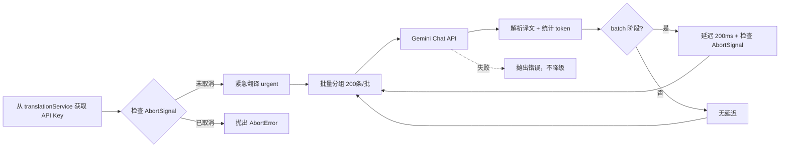

# Gemini AI翻译API实现指南

> 最后更新：2025-01-15
> 状态：✅ 已实现
> 版本：V4架构兼容（AbortSignal + 统一存储 + 统一语言参数 v5.x）

> **⚠️ 重要**（v5.x更新）：
> 语言参数已在顶层统一转换为英文名称（如"English" → "Chinese"）。
> Gemini翻译器接收的`sourceLang`和`targetLang`参数无需再转换，直接使用即可。

## 📋 概述

本文档提供 Google Gemini 翻译 API 的完整实现指南，符合项目 V4 架构规范。Gemini API 提供强大的多模态能力和超大上下文窗口（1M tokens），适合作为高质量翻译方案，与 OpenAI、DeepSeek 并列为 AI 翻译选项。

## 🔑 核心特性

- **超大上下文**：1M token 上下文窗口（gemini-2.0-flash/2.5-flash）
- **低成本方案**：gemini-2.5-flash-lite $0.10/$0.40 每百万 token
- **OpenAI兼容**：支持 OpenAI SDK 直接切换（修改3行代码）
- **快速响应**：gemini-2.5-flash-lite 是最快的 Gemini 模型
- **原生多模态**：支持文本、图片、音频、视频（字幕翻译仅用文本）
- **Thinking 能力**：reasoning_effort 参数控制思考深度
- **V4 架构集成**：完整支持 AbortSignal、两阶段翻译、统一缓存

## 📊 模型规格对比（2025年10月数据）

| 模型 | 输入上下文 | 输出限制 | 价格（输入/输出，$/M tokens） | 特点 | 推荐场景 |
|------|-----------|---------|------------------------------|------|---------|
| **gemini-2.5-flash** | 1,048,576 | 65,536 | $0.30 / $2.50 | 平衡性能与成本 | ✅ 默认推荐，日常字幕翻译 |
| **gemini-2.5-flash-lite** | 1,048,576 | 65,536 | $0.10 / $0.40 | 最快最便宜 | 高频翻译、低预算场景 |

> 数据来源：Google AI 官方文档（2025-10-07）
>
> **重要说明**：项目调用 Gemini API 时，智能断点应以 **65,535 tokens** 为输出限制

### Rate Limit 层级详解

#### 免费层（Free Tier）
| 模型 | RPM | TPM | RPD | 批量排队 Token |
|------|-----|-----|-----|--------------|
| gemini-2.5-flash | 10 | 250,000 | 250 | - |
| gemini-2.5-flash-lite | 15 | 250,000 | 1000 | - |

#### 付费层（Tier 1 - 启用计费）
| 模型 | RPM | TPM | RPD | 批量排队 Token |
|------|-----|-----|-----|--------------|
| **gemini-2.5-flash** | 1000 | 1,000,000 | 10,000 | 3,000,000 |
| **gemini-2.5-flash-lite** | 4000 | 4,000,000 | 无限制 | 10,000,000 |

> **关键差异**：
> - **gemini-2.5-flash-lite** 在付费层的 TPM 是 flash 的 **4倍**（4M vs 1M）
> - **gemini-2.5-flash-lite** 在付费层的 RPD **无限制**
> - **批量排队 Token**：flash-lite 是 flash 的 **3.3倍**（10M vs 3M）

## 🏗️ 架构设计

### 基础配置

| 参数 | 值 | 说明 |
|------|-----|------|
| API 基础地址 (OpenAI 兼容) | `https://generativelanguage.googleapis.com/v1beta/openai/` | 使用 OpenAI SDK |
| API 基础地址 (原生) | `https://generativelanguage.googleapis.com/v1beta/` | 使用原生 Gemini SDK |
| 推荐模型 | `gemini-2.5-flash` | 默认，性价比最优 |
| 备选模型 | `gemini-2.5-flash-lite` | 最快最便宜 |
| Temperature | `0.3` | 翻译场景推荐（范围 0-2.0） |
| 输入上限 | `1,048,576 tokens` | 1M 上下文窗口 |
| 输出上限 | `max_tokens: 65535` | Gemini 官方输出限制 |
| 批次大小 | 200 条字幕/批 | 利用 1M 上下文优势 |
| 批次间延迟 | 200 ms（仅 batch 阶段） | urgent 阶段无延迟 |
| 存储位置 | `translationService.apiKey` | 统一存储，不单独存储 |

> **重要**：Gemini 输入上下文 1,048,576 tokens，输出限制 65,536 tokens，项目智能断点以输出限制为准

### 存储架构

```typescript
// ✅ 正确：统一存储在 translationService
TRANSLATION_SERVICE_TEMPLATES = {
  'gemini': {
    type: 'gemini',
    apiKey: '',                          // 用户填写 Gemini API Key
    model: 'gemini-2.5-flash',           // 默认模型
    availableModels: [
      'gemini-2.5-flash',
      'gemini-2.5-flash-lite'
    ],
    customModel: null,
    temperature: 0.3,                    // 翻译场景推荐值
    maxTokens: 65535                     // Gemini 输出限制
  }
}

// ❌ 错误：不要单独存储
// await chrome.storage.local.set({ geminiApiKey: apiKey });
```

### 调用流程



## 📝 实现代码

### 1. TypeScript实现（V4架构兼容）

```typescript
/**
 * Gemini翻译服务实现
 * @file src/background/components/gemini-translator.ts
 * @version V4 - 支持 AbortSignal、两阶段翻译
 */

interface GeminiMessage {
  role: 'system' | 'user' | 'assistant';
  content: string;
}

interface GeminiRequest {
  model: string;
  messages: GeminiMessage[];
  temperature: number;
  max_tokens: number;
  stream: false;
}

interface GeminiResponse {
  id: string;
  model: string;
  choices: Array<{
    message: {
      role: string;
      content: string;
    };
    finish_reason: string;
  }>;
  usage: {
    prompt_tokens: number;
    completion_tokens: number;
    total_tokens: number;
  };
}

export class GeminiTranslator {
  // ========== 常量配置 ==========
  private static readonly ENDPOINT = 'https://generativelanguage.googleapis.com/v1beta/openai/chat/completions';
  private static readonly DEFAULT_MODEL = 'gemini-2.5-flash';
  private static readonly TEMPERATURE = 0.3;          // 翻译场景推荐值
  private static readonly MAX_TOKENS = 65535;         // Gemini 输出限制（65,536 - 1）
  private static readonly BATCH_SIZE = 200;           // 利用 1M 上下文，批次更大
  private static readonly BATCH_DELAY_MS = 200;       // batch 阶段延迟
  private static readonly SEPARATOR = '\n---\n';      // 字幕分隔符

  // ========== 实例属性 ==========
  private apiKey: string;
  private model: string;
  private temperature: number;

  /**
   * 构造函数
   * @param apiKey Gemini API 密钥
   * @param model 模型名称（可选，默认 gemini-2.5-flash）
   * @param temperature 温度参数（可选，默认 0.3）
   */
  constructor(apiKey: string, model?: string, temperature?: number) {
    this.apiKey = apiKey;
    this.model = model || GeminiTranslator.DEFAULT_MODEL;
    this.temperature = temperature ?? GeminiTranslator.TEMPERATURE;
  }

  /**
   * 批量翻译文本（支持 AbortSignal 和两阶段翻译）
   * @param texts 待翻译文本数组
   * @param sourceLang 源语言代码（YouTube标准）
   * @param targetLang 目标语言代码（YouTube标准）
   * @param stage 翻译阶段：urgent（无延迟） | batch（200ms延迟）
   * @param signal AbortSignal 用于取消操作
   * @returns 翻译结果数组
   */
  public async translate(
    texts: string[],
    sourceLang: string,
    targetLang: string,
    stage: 'urgent' | 'batch',
    signal: AbortSignal
  ): Promise<string[]> {
    if (texts.length === 0) {
      return [];
    }

    // 检查初始信号状态
    if (signal.aborted) {
      throw new DOMException('Gemini翻译开始前已取消', 'AbortError');
    }

    console.log(
      `[GeminiTranslator] 开始翻译 ${texts.length} 条字幕 (${stage}阶段, 模型: ${this.model})`
    );

    const results: string[] = [];

    // 分批处理（统一 200 条/批）
    const totalBatches = Math.ceil(texts.length / GeminiTranslator.BATCH_SIZE);
    for (let i = 0; i < texts.length; i += GeminiTranslator.BATCH_SIZE) {
      const batch = texts.slice(i, i + GeminiTranslator.BATCH_SIZE);
      const batchNumber = Math.floor(i / GeminiTranslator.BATCH_SIZE) + 1;

      console.debug(
        `[debug][GeminiTranslator] 翻译批次 ${batchNumber}/${totalBatches}: ` +
        `${batch.length} 条字幕 (${stage}阶段)`
      );

      // 构建提示词并调用 API
      const messages = this.buildTranslationPrompt(
        batch,
        this.mapLanguageCode(sourceLang),
        this.mapLanguageCode(targetLang)
      );

      const response = await this.callAPI(messages, signal);

      // 解析响应
      const translations = response.split(GeminiTranslator.SEPARATOR);

      // 验证数量匹配
      if (translations.length !== batch.length) {
        console.error(
          `[GeminiTranslator] 批次翻译数量不匹配: 期望${batch.length}, 实际${translations.length}`
        );
        throw new Error(
          `Gemini翻译结果数量不匹配: 期望${batch.length}条, 实际返回${translations.length}条`
        );
      }

      results.push(...translations.map(t => t.trim()));

      // 批次间延迟（仅 batch 阶段）
      if (stage === 'batch' && i + GeminiTranslator.BATCH_SIZE < texts.length) {
        await this.delayWithSignal(GeminiTranslator.BATCH_DELAY_MS, signal);
      }
    }

    console.log(`[GeminiTranslator] ✅ 翻译完成: ${results.length}/${texts.length} 条成功`);

    return results;
  }

  /**
   * 构建翻译提示词
   * @param texts 待翻译文本数组
   * @param sourceLang 源语言（已映射）
   * @param targetLang 目标语言（已映射）
   * @returns Gemini 消息数组
   */
  private buildTranslationPrompt(
    texts: string[],
    sourceLang: string,
    targetLang: string
  ): GeminiMessage[] {
    const combinedText = texts.join(GeminiTranslator.SEPARATOR);

    return [
      {
        role: 'system',
        content: `You are a professional subtitle translator specialized in video content.
Translate from ${sourceLang} to ${targetLang}.

IMPORTANT RULES:
1. Input contains multiple subtitles separated by "---"
2. Each subtitle is a time-based segment - keep the same number of segments
3. Maintain the "---" separators in your output
4. Translate each segment independently - do NOT merge or split segments
5. Return ONLY the translated text with separators, no explanations

Example:
Input:  "Hello world---How are you---I'm fine"
Output: "你好世界---你好吗---我很好"`
      },
      {
        role: 'user',
        content: combinedText
      }
    ];
  }

  /**
   * 调用 Gemini API（支持 AbortSignal）
   * @param messages 消息数组
   * @param signal AbortSignal 用于取消操作
   * @returns 翻译结果（已拼接）
   */
  private async callAPI(
    messages: GeminiMessage[],
    signal: AbortSignal
  ): Promise<string> {
    try {
      const response = await fetch(GeminiTranslator.ENDPOINT, {
        method: 'POST',
        headers: {
          'Authorization': `Bearer ${this.apiKey}`,
          'Content-Type': 'application/json'
        },
        body: JSON.stringify({
          model: this.model,
          messages,
          temperature: this.temperature,
          max_tokens: GeminiTranslator.MAX_TOKENS,
          stream: false
        } as GeminiRequest),
        signal  // 使用外部 AbortSignal
      });

      // 错误处理细化（简化错误消息）
      if (!response.ok) {
        const errorText = await response.text();

        switch (response.status) {
          case 401:
          case 403:
            throw new Error('Gemini API密钥无效');
          case 429:
            throw new Error('Gemini API速率限制（超出RPM/TPM配额）');
          case 500:
          case 502:
          case 503:
            throw new Error('Gemini服务暂时不可用');
          default:
            throw new Error(`Gemini API错误 (${response.status}): ${errorText}`);
        }
      }

      const data: GeminiResponse = await response.json();

      if (!data.choices || !data.choices[0] || !data.choices[0].message) {
        throw new Error('Gemini API返回格式错误');
      }

      // 记录 token 使用情况
      console.debug(
        `[debug][GeminiTranslator] Token使用: ` +
        `输入=${data.usage.prompt_tokens}, ` +
        `输出=${data.usage.completion_tokens}, ` +
        `总计=${data.usage.total_tokens}`
      );

      return data.choices[0].message.content;

    } catch (error: any) {
      // AbortError 处理
      if (error.name === 'AbortError') {
        throw new DOMException('Gemini API请求被取消', 'AbortError');
      }
      throw error;
    }
  }

  /**
   * 延迟工具（支持 AbortSignal 中断）
   * @param ms 延迟毫秒数
   * @param signal AbortSignal 用于取消延迟
   */
  private async delayWithSignal(ms: number, signal: AbortSignal): Promise<void> {
    return new Promise((resolve, reject) => {
      const timer = setTimeout(resolve, ms);

      const abortHandler = () => {
        clearTimeout(timer);
        reject(new DOMException('延迟被取消', 'AbortError'));
      };

      signal.addEventListener('abort', abortHandler, { once: true });
    });
  }

  /**
   * 语言代码映射（YouTube标准 → Gemini标准）
   * Gemini 支持多种语言格式，这里使用标准 ISO 639-1 代码
   * @param code YouTube 语言代码
   * @returns Gemini 语言代码
   */
  private mapLanguageCode(code: string): string {
    const mapping: Record<string, string> = {
      'zh-CN': 'Chinese',
      'zh-TW': 'Chinese',
      'zh-Hans': 'Chinese',
      'zh-Hant': 'Chinese',
      'en': 'English',
      'ja': 'Japanese',
      'ko': 'Korean',
      'es': 'Spanish',
      'fr': 'French',
      'de': 'German',
      'ru': 'Russian',
      'ar': 'Arabic',
      'pt': 'Portuguese',
      'it': 'Italian',
      'nl': 'Dutch',
      'hi': 'Hindi',
      'vi': 'Vietnamese',
      'th': 'Thai',
      'id': 'Indonesian',
      'tr': 'Turkish',
      'pl': 'Polish',
      'uk': 'Ukrainian'
    };

    return mapping[code] || 'English';
  }
}
```

### 2. 集成到 V4 架构

```typescript
/**
 * 集成到 two-phase-translator-v4.ts
 */

import { GeminiTranslator } from './gemini-translator';

export class TwoPhaseTranslatorV4 {
  // ... 现有代码

  /**
   * 在 callTranslationAPI 方法中添加 Gemini 分支
   */
  private async callTranslationAPI(
    texts: string[],
    service: any,
    sourceLang: string,
    targetLang: string,
    signal: AbortSignal,
    options?: { stage?: 'urgent' | 'batch' }
  ): Promise<string[]> {
    return new Promise<string[]>((resolve, reject) => {
      // ... 现有 abort handler 代码

      try {
        let translatedTexts: string[] = [];

        // Gemini 分支
        if (service.type === 'gemini') {
          if (!service.apiKey) {
            throw new Error('Gemini API密钥未配置');
          }

          const translator = new GeminiTranslator(
            service.apiKey,
            service.model || 'gemini-2.5-flash',
            service.temperature || 0.3
          );
          const stage = options?.stage ?? 'batch';

          // 调用翻译（传递 signal）
          translatedTexts = await translator.translate(
            texts,
            sourceLang,
            targetLang,
            stage,
            signal
          );
        }
        // ... 其他服务分支（openai, deepseek, google-free, microsoft-free）

        resolve(translatedTexts);

      } catch (error) {
        reject(error);
      }
    });
  }
}
```

### 3. 用户偏好模板配置

```typescript
/**
 * 在 src/shared/storage/user-preferences-manager.ts 中添加
 */

export const TRANSLATION_SERVICE_TEMPLATES: Record<TranslationServiceType, TranslationService> = {
  // ... 现有模板

  'gemini': {
    type: 'gemini',
    apiKey: '',                              // 用户填写
    model: 'gemini-2.5-flash',               // 默认模型
    availableModels: [
      'gemini-2.5-flash',
      'gemini-2.5-flash-lite'
    ],
    customModel: null,
    temperature: 0.3,                        // 翻译场景推荐值
    maxTokens: 65535                         // Gemini 输出限制
  }
};
```

### 4. Popup 设置界面集成

```typescript
/**
 * 在 popup.ts 中修改
 */

// HTML - 下拉菜单添加 Gemini 选项
<select id="translation-api-select">
  <option value="google-free">Google 免费翻译</option>
  <option value="microsoft-free">Microsoft 免费翻译</option>
  <option value="gemini">Google Gemini</option>  <!-- 新增 -->
  <option value="deepseek">DeepSeek AI</option>
  <option value="openai">OpenAI</option>
</select>

// TypeScript - 显示/隐藏设置
function updateTranslationServiceUI(serviceType: TranslationServiceType) {
  const apiKeySection = document.getElementById('api-key-section');
  const apiKeyLabel = document.getElementById('api-key-label');
  const modelSection = document.getElementById('model-section');
  const temperatureSection = document.getElementById('temperature-section');

  if (serviceType === 'gemini') {
    // 显示 API Key、Model、Temperature
    apiKeySection.style.display = 'block';
    apiKeyLabel.textContent = 'Gemini API Key';

    modelSection.style.display = 'block';
    // 填充模型下拉选项（仅2个模型）
    const modelSelect = document.getElementById('model-select') as HTMLSelectElement;
    modelSelect.innerHTML = `
      <option value="gemini-2.5-flash">Gemini 2.5 Flash (推荐 $0.30/$2.50)</option>
      <option value="gemini-2.5-flash-lite">Gemini 2.5 Flash-Lite (极速 $0.10/$0.40)</option>
    `;

    temperatureSection.style.display = 'block';
  } else if (serviceType === 'openai') {
    // OpenAI 显示所有设置
    apiKeySection.style.display = 'block';
    modelSection.style.display = 'block';
    temperatureSection.style.display = 'block';
  } else if (serviceType === 'deepseek') {
    // DeepSeek 只显示 API Key
    apiKeySection.style.display = 'block';
    modelSection.style.display = 'none';
    temperatureSection.style.display = 'none';
  } else {
    // Google/Microsoft 免费版不显示任何设置
    apiKeySection.style.display = 'none';
    modelSection.style.display = 'none';
    temperatureSection.style.display = 'none';
  }
}
```

## 🔧 架构优化说明

### 优化1：统一存储架构
- **问题**：独立存储 API Key 导致架构不一致
- **解决**：存储在 `translationService.apiKey`，和 OpenAI/DeepSeek 保持一致

### 优化2-3：AbortSignal 集成
- **问题**：无法响应 V4 架构的取消信号
- **解决**：所有方法接收 `signal: AbortSignal`，使用 `delayWithSignal` 支持中断

### 优化4：复用缓存系统
- **问题**：独立实现缓存导致重复代码
- **解决**：使用项目统一的 `TranslationLocalStorage`

### 优化5：语言代码规范化
- **问题**：需要映射 YouTube 标准代码
- **解决**：使用 YouTube 标准语言代码（'zh-CN', 'en'），内部映射为全名

### 优化6：降级策略统一
- **问题**：失败是否降级？
- **解决**：失败直接抛出错误，和 Google/Microsoft 保持一致（Fail Fast）

### 优化7：Temperature 开放给用户
- **参数设置**：默认 0.3（翻译推荐），范围 0-2.0（用户可调）
- **UI实现**：在 Popup 显示滑块

### 优化8：批次大小优化
- **Gemini 优势**：1M token 上下文窗口
- **批次大小**：200 条/批（比 OpenAI 的 160 条更大）
- **理由**：充分利用超大上下文，减少 API 调用次数

### 优化9：OpenAI 兼容模式
- **选择**：使用 OpenAI 兼容端点
- **理由**：可直接使用 OpenAI SDK，代码复用性强
- **备选**：原生 Gemini SDK（如需特殊功能，如 thinking_config）

## ⚡ 批量策略

### 与其他服务对比

| 服务 | 批处理方式 | 单次限制 | 批次大小 | 优化策略 |
|------|-----------|---------|---------|----------|
| **Google** | URL参数 | ~2000字符 | 小批量 | 多请求 |
| **Microsoft** | JSON数组 | 5000字符 | 中批量 | 中等请求 |
| **OpenAI** | 上下文对话 | 128K tokens | 160条 | 少请求 |
| **Gemini** | 上下文对话 | 1M tokens | 200条 | 最少请求 |

### Gemini 批处理优势

- **超大上下文**：1M tokens，远超 OpenAI 的 128K
- **批次策略**：
  - 紧急翻译（urgent）：200 条/批，无延迟
  - 批量翻译（batch）：200 条/批，200ms 延迟
- **分隔符**：使用 `\n---\n` 拼接/拆分字幕
- **失败策略**：直接抛出错误，不降级

## 🚨 错误处理

### 错误类型和处理策略

| 错误码 | 含义 | 自动处理 | 用户提示 |
|--------|------|---------|---------|
| 401 | API Key无效 | ❌ | "请检查Gemini API密钥" |
| 403 | 权限不足 | ❌ | "Gemini API权限不足" |
| 429 | 超出Rate Limit | ❌ | "超出速率限制（RPM/TPM）" |
| 500 | 服务器错误 | ❌ | "Gemini服务暂时不可用" |

### 错误处理代码

```typescript
// 详细的错误处理
if (!response.ok) {
  const errorText = await response.text();

  switch (response.status) {
    case 401:
    case 403:
      throw new Error('Gemini API密钥无效，请检查设置');
    case 429:
      throw new Error('Gemini API速率限制（超出RPM/TPM配额）');
    case 500:
    case 502:
    case 503:
      throw new Error('Gemini服务暂时不可用');
    default:
      throw new Error(`Gemini API错误 (${response.status}): ${errorText}`);
  }
}

// AbortError处理
if (error.name === 'AbortError') {
  throw new DOMException('Gemini API请求被取消', 'AbortError');
}
```

## 📊 Rate Limit管理

### Rate Limit 策略说明

#### 免费层限制分析
```typescript
// 免费层：15 RPM, 250K TPM, 250 RPD
// 每次请求间隔：4秒（15次/分钟）
// 批次大小：200条
// 估算字符/token：2.5

// 单批请求消耗 token 估算：
// - 200条字幕，平均20字符/条 = 4000字符
// - 输入 tokens ≈ 4000/2.5 = 1600 tokens
// - 输出 tokens ≈ 1600 * 1.2 = 1920 tokens
// - 总计 ≈ 3500 tokens/批

// 免费层 250K TPM 限制：
// - 250,000 / 3,500 ≈ 71批/分钟（理论值）
// - 但 RPM 限制为 15次/分钟（实际瓶颈）
// - 每天 250 RPD，约 50,000 条字幕/天

// ⚠️ 免费层不适合高频使用
```

#### 付费层优化策略
```typescript
// gemini-2.5-flash（付费层）
// 300 RPM, 1M TPM, 10K RPD, 3M 批量排队

// 批次间延迟：200ms（5次/秒 = 300次/分钟）
// 批次大小：200条
// 估算：200条/批 × 300批/分钟 = 60,000条字幕/分钟

// gemini-2.5-flash-lite（付费层）⭐ 推荐
// 300 RPM, 4M TPM, 无限制 RPD, 10M 批量排队

// TPM 提升 4倍，RPD 无限制
// 适合高频字幕翻译场景
// 估算：200条/批 × 300批/分钟 = 60,000条字幕/分钟
// 可持续运行，无 RPD 限制
```

#### 批次延迟配置
```typescript
const BATCH_DELAY_MS = 200;  // 基础延迟（适配 300 RPM）

// 免费层（15 RPM）：
// - 建议延迟：4000ms（每 4 秒 1 次请求）
// - 批次大小：200条

// 付费层（300 RPM）：
// - 建议延迟：200ms（每秒 5 次请求）
// - 批次大小：200条
```

### RPD（每日请求数）重置时间

- **重置时间**：UTC 时间每日午夜
- **建议**：在 Popup 显示今日剩余配额
- **Flash-Lite 优势**：付费层 RPD 无限制

## 🎯 Temperature参数说明

| 值 | 风格 | 适用场景 |
|----|------|---------|
| 0.0-0.2 | 精确直译 | 技术文档、法律文本 |
| 0.3-0.4 | 标准翻译 | 字幕、一般内容（✅ 推荐） |
| 0.5-0.7 | 自然翻译 | 对话、口语内容 |
| 0.8-1.0 | 创意翻译 | 文学作品、诗歌 |
| 1.1-2.0 | 高度创意 | 实验性翻译 |

> Gemini 支持 0-2.0 范围，比 OpenAI 的 0-1.0 更宽

## 🧪 测试验证

### 测试脚本

```bash
# 测试 Gemini API（OpenAI 兼容端点）
curl -X POST https://generativelanguage.googleapis.com/v1beta/openai/chat/completions \
  -H "Authorization: Bearer YOUR_API_KEY" \
  -H "Content-Type: application/json" \
  -d '{
    "model": "gemini-2.5-flash",
    "messages": [
      {
        "role": "system",
        "content": "Translate from English to Chinese. Return only translation."
      },
      {
        "role": "user",
        "content": "Hello world"
      }
    ],
    "temperature": 0.3,
    "max_tokens": 100
  }'
```

### 预期结果
```json
{
  "id": "chatcmpl-xxx",
  "model": "gemini-2.5-flash",
  "choices": [{
    "message": {
      "role": "assistant",
      "content": "你好世界"
    },
    "finish_reason": "stop"
  }],
  "usage": {
    "prompt_tokens": 25,
    "completion_tokens": 4,
    "total_tokens": 29
  }
}
```

### 功能测试清单

- [ ] Popup 下拉菜单显示 "Google Gemini" 选项
- [ ] 选中 Gemini 时显示 API Key 输入框
- [ ] 选中 Gemini 时显示 Model 和 Temperature 设置
- [ ] API Key 保存到 `translationService.apiKey`
- [ ] Model 选择保存到 `translationService.model`
- [ ] 紧急翻译（urgent）正常工作，无延迟
- [ ] 批量翻译（batch）正常工作，200ms 延迟
- [ ] AbortSignal 能正确取消翻译
- [ ] 401/403 错误提示 "API密钥无效"
- [ ] 429 错误提示 "速率限制"
- [ ] 翻译缓存正常工作（TranslationLocalStorage）
- [ ] 切换到其他服务无影响
- [ ] 200条批次大小正常工作
- [ ] Temperature 调节生效

## 📈 性能优化建议

### 模型选择指南

| 使用场景 | 推荐模型 | 理由 |
|---------|---------|------|
| **默认日常字幕翻译** | gemini-2.5-flash | ✅ 平衡性能与成本，1M 上下文 |
| **高频翻译/低预算** | gemini-2.5-flash-lite | 最快最便宜（$0.10/$0.40） |

### 优化建议

1. **批量策略**：
   - 充分利用 1M 上下文窗口
   - 200 条/批（比 OpenAI 的 160 条更大）
   - 减少 API 调用次数，降低成本

2. **Token优化**：
   - 使用简洁的系统提示词
   - 批量处理减少系统消息开销

3. **Temperature设置**：
   - 字幕翻译：0.3（推荐）
   - 创意内容：0.5-0.7
   - 技术文档：0.1-0.2

4. **Rate Limit 管理**：
   - 启用 Google Cloud 计费获得 Tier 1（300 RPM）
   - 200ms 批次间隔足以避免限流
   - 监控每日配额（RPD）

## 💡 Gemini vs OpenAI vs DeepSeek 对比

| 维度 | Gemini 2.5-flash-lite | Gemini 2.5-flash | OpenAI gpt-5-mini | DeepSeek-chat |
|------|----------------------|-----------------|------------------|---------------|
| **上下文窗口** | 1M tokens | 1M tokens | 400K tokens | 128K tokens |
| **输出限制** | 65K tokens | 65K tokens | 128K tokens | 8K tokens |
| **价格（输入）** | $0.10/M | $0.30/M | $0.25/M | $0.28/M |
| **价格（输出）** | $0.40/M | $2.50/M | $2.00/M | $0.42/M |
| **批次大小** | 200条 | 200条 | 160条 | 20条 |
| **Rate Limit (付费)** | 300 RPM, 4M TPM | 300 RPM, 1M TPM | 500 RPM | 不限（自行节流） |
| **RPD 限制** | 无限制 | 10K | - | - |
| **批量排队 Token** | 10M | 3M | - | - |
| **Temperature 范围** | 0-2.0 | 0-2.0 | 0-1.0（GPT-5不支持） | 0-2.0 |
| **特殊功能** | 快速响应 | Thinking, 多模态 | Reasoning effort | - |
| **优势** | ⭐ 最快最便宜，无RPD限制 | 平衡性能 | 成熟稳定 | 最便宜输出 |

### 选择建议

- **选 Gemini Flash-Lite** ⭐：高频字幕翻译场景，无 RPD 限制，4M TPM，最便宜（$0.10/$0.40）
- **选 Gemini Flash**：需要 Thinking 能力或多模态功能
- **选 OpenAI**：需要最稳定的翻译质量，成熟的生态
- **选 DeepSeek**：预算极度紧张，中文翻译场景

## ⚠️ 注意事项

### 必要条件
1. **需要 API Key**：必须在 aistudio.google.com 注册获取
2. **需要付费**：建议启用计费获得 Tier 1（300 RPM）
3. **网络要求**：需要能访问 generativelanguage.googleapis.com

### 架构限制
1. **单一端点**：OpenAI 兼容端点（也可用原生端点）
2. **Temperature 范围**：0-2.0（比 OpenAI 更宽）
3. **批次限制**：200 条/批（固定）

### 最佳实践
1. **缓存使用**：复用项目统一的 `TranslationLocalStorage`
2. **错误提示**：提供明确的错误信息，引导用户检查 API Key
3. **取消支持**：完整支持 AbortSignal，响应用户取消操作
4. **日志规范**：使用 `[GeminiTranslator]` 前缀

## 🔗 相关文档

- [Gemini API 官方文档](https://ai.google.dev/gemini-api/docs)
- [OpenAI 兼容性说明](https://ai.google.dev/gemini-api/docs/openai)
- [Rate Limits 说明](https://ai.google.dev/gemini-api/docs/rate-limits)
- [定价信息](https://ai.google.dev/gemini-api/docs/pricing)
- [V4 架构设计](../architecture/08-abort-timeout-architecture.md)
- [用户偏好管理](../architecture/03-component-design.md)
- [两阶段翻译器](../architecture/07-batch-translation-architecture.md)

## 📅 更新历史

- **2025-10-10**：创建文档，集成 V4 规范（AbortSignal、统一存储、错误处理）
- **2025-10-10**：核实 Gemini 2.5 Flash 和 Flash-Lite 规格与定价

---

*本文档已完成架构设计，可直接用于实现*
