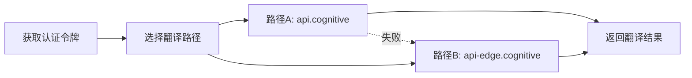

# 微软翻译API实现指南

> 最后更新：2025-09-26
> 状态：✅ 已测试验证可用
> 版本：V4架构兼容

## 📋 概述

本文档提供完整的微软翻译API（免费Edge版）实现指南，包括认证、调用、错误处理和最佳实践。该实现利用Edge浏览器的翻译服务，无需Azure订阅或API密钥。

## 🔑 核心特性

- **完全免费**：无需Azure账号或API密钥
- **双路径容错**：两个API端点互为备份
- **批量支持**：支持批量翻译，适合字幕场景
- **高可用性**：通过故障转移确保服务稳定

## 🏗️ 架构设计

### 三步调用流程



## 📝 实现代码

### 1. TypeScript实现（推荐用于Chrome扩展）

```typescript
/**
 * 微软翻译服务实现
 * @file microsoft-translator.ts
 */

interface MicrosoftTranslateConfig {
  batchSize: number;      // 批量大小，建议10
  retryDelay: number;     // 批次间延迟，建议500ms
  timeout: number;        // 请求超时，建议10000ms
}

interface TranslationRequest {
  Text: string;
}

interface TranslationResponse {
  translations: Array<{
    text: string;
    to: string;
    sentLen?: {
      srcSentLen: number[];
      transSentLen: number[];
    };
  }>;
}

export class MicrosoftTranslator {
  private config: MicrosoftTranslateConfig = {
    batchSize: 10,
    retryDelay: 500,
    timeout: 10000
  };

  private authToken: string | null = null;
  private tokenExpiry: number = 0;

  /**
   * 获取Edge认证令牌
   */
  private async getAuthToken(): Promise<string> {
    // 如果令牌还有效，直接返回
    if (this.authToken && Date.now() < this.tokenExpiry) {
      return this.authToken;
    }

    const response = await fetch('https://edge.microsoft.com/translate/auth', {
      method: 'GET',
      headers: {
        'User-Agent': 'Mozilla/5.0 (Windows NT 10.0; Win64; x64) AppleWebKit/537.36 (KHTML, like Gecko) Chrome/120.0.0.0 Safari/537.36 Edg/120.0.0.0',
        'Accept': '*/*',
        'Origin': 'https://www.bing.com',
        'Referer': 'https://www.bing.com/translator'
      }
    });

    if (!response.ok) {
      throw new Error(`获取认证令牌失败: ${response.status}`);
    }

    this.authToken = await response.text();
    // 设置令牌有效期（保守设置为1小时）
    this.tokenExpiry = Date.now() + 3600000;

    console.log('[MicrosoftTranslator] 成功获取认证令牌');
    return this.authToken;
  }

  /**
   * 路径A - 主要翻译接口
   */
  private async translatePathA(
    texts: string[],
    sourceLang: string,
    targetLang: string,
    token: string
  ): Promise<TranslationResponse[]> {
    const url = `https://api.cognitive.microsofttranslator.com/translate?api-version=3.0&from=${sourceLang}&to=${targetLang}`;

    const response = await fetch(url, {
      method: 'POST',
      headers: {
        'Authorization': `Bearer ${token}`,
        'Content-Type': 'application/json',
        'User-Agent': 'Mozilla/5.0 (Windows NT 10.0; Win64; x64) AppleWebKit/537.36 (KHTML, like Gecko) Chrome/120.0.0.0 Safari/537.36 Edg/120.0.0.0',
        'Accept': 'application/json',
        'Origin': 'https://www.bing.com',
        'Referer': 'https://www.bing.com/translator'
      },
      body: JSON.stringify(texts.map(text => ({ Text: text })))
    });

    if (!response.ok) {
      throw new Error(`路径A翻译失败: ${response.status}`);
    }

    return await response.json();
  }

  /**
   * 路径B - 备用翻译接口
   */
  private async translatePathB(
    texts: string[],
    sourceLang: string,
    targetLang: string,
    token: string
  ): Promise<TranslationResponse[]> {
    const url = `https://api-edge.cognitive.microsofttranslator.com/translate?api-version=3.0&from=${sourceLang}&to=${targetLang}&includeSentenceLength=true`;

    const response = await fetch(url, {
      method: 'POST',
      headers: {
        'Authorization': `Bearer ${token}`,
        'Content-Type': 'application/json',
        'User-Agent': 'Mozilla/5.0 (Windows NT 10.0; Win64; x64) AppleWebKit/537.36 (KHTML, like Gecko) Chrome/120.0.0.0 Safari/537.36 Edg/120.0.0.0',
        'Accept': 'application/json',
        'Origin': 'https://www.bing.com',
        'Referer': 'https://www.bing.com/translator'
      },
      body: JSON.stringify(texts.map(text => ({ Text: text })))
    });

    if (!response.ok) {
      throw new Error(`路径B翻译失败: ${response.status}`);
    }

    return await response.json();
  }

  /**
   * 批量翻译文本（带故障转移）
   */
  public async translate(
    texts: string[],
    sourceLang: string,
    targetLang: string
  ): Promise<string[]> {
    // 获取认证令牌
    const token = await this.getAuthToken();

    // 分批处理
    const results: string[] = [];
    for (let i = 0; i < texts.length; i += this.config.batchSize) {
      const batch = texts.slice(i, i + this.config.batchSize);

      let translationResults: TranslationResponse[];

      try {
        // 优先尝试路径A
        console.log(`[MicrosoftTranslator] 尝试路径A翻译 ${batch.length} 条文本`);
        translationResults = await this.translatePathA(batch, sourceLang, targetLang, token);
      } catch (errorA) {
        console.warn('[MicrosoftTranslator] 路径A失败，切换到路径B:', errorA);

        try {
          // 失败则切换到路径B
          translationResults = await this.translatePathB(batch, sourceLang, targetLang, token);
        } catch (errorB) {
          console.error('[MicrosoftTranslator] 两个路径都失败:', errorB);
          throw new Error('微软翻译服务暂时不可用');
        }
      }

      // 提取翻译结果
      for (const result of translationResults) {
        if (result.translations && result.translations[0]) {
          results.push(result.translations[0].text);
        } else {
          results.push(''); // 翻译失败的项目返回空字符串
        }
      }

      // 批次间延迟，避免限流
      if (i + this.config.batchSize < texts.length) {
        await new Promise(resolve => setTimeout(resolve, this.config.retryDelay));
      }
    }

    return results;
  }

  /**
   * 翻译单条文本
   */
  public async translateSingle(
    text: string,
    sourceLang: string,
    targetLang: string
  ): Promise<string> {
    const results = await this.translate([text], sourceLang, targetLang);
    return results[0] || '';
  }
}
```

### 2. 集成到V4架构

```typescript
/**
 * 集成到two-phase-translator-v4.ts
 */

import { MicrosoftTranslator } from './microsoft-translator';

export class TwoPhaseTranslatorV4 {
  private microsoftTranslator = new MicrosoftTranslator();

  /**
   * 执行翻译
   */
  private async performTranslation(
    texts: string[],
    sourceLang: string,
    targetLang: string,
    service: TranslationServiceType
  ): Promise<{ [id: string]: string }> {
    const results: { [id: string]: string } = {};

    switch (service) {
      case 'microsoft-free':
        try {
          const translations = await this.microsoftTranslator.translate(
            texts,
            this.mapLanguageCode(sourceLang, 'microsoft'),
            this.mapLanguageCode(targetLang, 'microsoft')
          );

          texts.forEach((text, index) => {
            results[index.toString()] = translations[index];
          });
        } catch (error) {
          console.error('[TwoPhaseTranslatorV4] 微软翻译失败:', error);
          throw error;
        }
        break;

      // ... 其他翻译服务
    }

    return results;
  }

  /**
   * 语言代码映射
   */
  private mapLanguageCode(code: string, service: 'microsoft' | 'google'): string {
    if (service === 'microsoft') {
      // 微软特殊映射
      const mapping: Record<string, string> = {
        'zh-CN': 'zh-Hans',
        'zh-TW': 'zh-Hant',
        'zh': 'zh-Hans'
      };
      return mapping[code] || code;
    }

    return code;
  }
}
```

## 🔧 配置选项

### 推荐配置

```javascript
const MICROSOFT_TRANSLATE_CONFIG = {
  // 批量设置
  batchSize: 10,          // 每批最多10条文本
  maxTextLength: 5000,    // 单条文本最大长度

  // 超时设置
  authTimeout: 5000,      // 认证超时5秒
  translateTimeout: 10000, // 翻译超时10秒

  // 重试策略
  maxRetries: 2,          // 最多重试2次
  retryDelay: 500,        // 重试延迟500ms

  // 缓存设置
  cacheTokenDuration: 3600000, // 令牌缓存1小时
  cacheTranslationDuration: 86400000 // 翻译结果缓存24小时
};
```

## ⚠️ 注意事项

### 必要条件
1. **Headers必须完整**：缺少任何必需Header会导致认证失败
2. **User-Agent伪装**：必须伪装成Edge浏览器
3. **Origin和Referer**：必须设置为bing.com域名

### 限制说明
1. **批量大小**：建议每批不超过10条，避免超时
2. **请求频率**：批次间建议延迟500ms，避免触发限流
3. **文本长度**：单条文本建议不超过5000字符
4. **并发请求**：建议串行处理批次，避免并发过高

### 错误处理
1. **令牌过期**：自动重新获取
2. **路径A失败**：自动切换路径B
3. **两路径都失败**：返回错误，建议切换其他翻译服务
4. **网络超时**：设置合理超时时间，避免长时间等待

## 📊 性能优化

### 1. 令牌缓存
```typescript
// 缓存令牌，避免频繁获取
class TokenCache {
  private token: string | null = null;
  private expiry: number = 0;

  get(): string | null {
    if (Date.now() < this.expiry) {
      return this.token;
    }
    return null;
  }

  set(token: string, duration: number = 3600000): void {
    this.token = token;
    this.expiry = Date.now() + duration;
  }
}
```

### 2. 翻译缓存
```typescript
// 缓存翻译结果，避免重复翻译
class TranslationCache {
  private cache = new Map<string, string>();

  generateKey(text: string, from: string, to: string): string {
    return `${from}_${to}_${text}`;
  }

  get(text: string, from: string, to: string): string | null {
    return this.cache.get(this.generateKey(text, from, to)) || null;
  }

  set(text: string, translation: string, from: string, to: string): void {
    this.cache.set(this.generateKey(text, from, to), translation);
  }
}
```

### 3. 批处理优化 - 5000字符滑动窗口方案

#### 3.1 核心思想
与谷歌翻译类似，使用换行符连接多条字幕，最大化利用每个`{"Text": "..."}`的5000字符容量，大幅减少API请求次数。

#### 3.2 优化前后对比

| 方案 | 100条字幕（平均50字符/条） | 请求数 | 优化率 |
|-----|---------------------------|--------|--------|
| **优化前** | 每条字幕一个Text对象 | 10个请求 | - |
| **优化后** | 多条字幕合并到一个Text | 1-2个请求 | 80-90% |

#### 3.3 实现算法

```typescript
/**
 * 5000字符滑动窗口 + 智能断句算法
 * 将字幕数组重组为优化的批次格式
 */
class MicrosoftTextOptimizer {
  private static readonly MAX_CHARS_PER_TEXT = 5000;   // 单个Text最大字符数
  private static readonly MAX_TEXTS_PER_REQUEST = 10;  // 每请求最大Text数
  private static readonly SEPARATOR = '\n';            // 字幕间分隔符

  /**
   * 第一步：创建5000字符窗口
   * 从当前位置向后查找，直到接近5000字符限制
   */
  private createCharWindow(
    subtitles: string[],
    startIdx: number
  ): {
    combinedText: string;
    endIdx: number;
  } {
    let currentLength = 0;
    let texts: string[] = [];
    let endIdx = startIdx;

    while (endIdx < subtitles.length) {
      const subtitle = subtitles[endIdx];
      // 预处理：清理内部换行符
      const cleanText = subtitle.replace(/\n/g, ' ').trim();

      // 计算加入后的长度（包括分隔符）
      const newLength = currentLength +
        (texts.length > 0 ? this.SEPARATOR.length : 0) +
        cleanText.length;

      // 如果超过限制，在此断开
      if (newLength > this.MAX_CHARS_PER_TEXT) {
        // 特殊情况：单条字幕就超限
        if (texts.length === 0) {
          console.warn(`字幕${endIdx}超长，截断处理`);
          texts.push(cleanText.substring(0, 4900) + '...');
          endIdx++;
        }
        break;
      }

      texts.push(cleanText);
      currentLength = newLength;
      endIdx++;
    }

    return {
      combinedText: texts.join(this.SEPARATOR),
      endIdx: endIdx
    };
  }

  /**
   * 第二步：批量组装
   * 将多个窗口组装成请求批次
   */
  public optimizeBatches(subtitles: string[]): Array<{
    texts: string[];          // 每个元素是合并后的字幕文本
    indexMapping: number[][]  // 记录每个text包含的原始字幕索引
  }> {
    const windows: Array<{text: string; indices: number[]}> = [];
    let currentIdx = 0;

    // 创建所有窗口
    while (currentIdx < subtitles.length) {
      const startIdx = currentIdx;
      const window = this.createCharWindow(subtitles, currentIdx);

      windows.push({
        text: window.combinedText,
        indices: Array.from(
          {length: window.endIdx - startIdx},
          (_, i) => startIdx + i
        )
      });

      currentIdx = window.endIdx;
    }

    // 按10个Text一批组装请求
    const batches: Array<{texts: string[]; indexMapping: number[][]}> = [];

    for (let i = 0; i < windows.length; i += this.MAX_TEXTS_PER_REQUEST) {
      const batchWindows = windows.slice(i, i + this.MAX_TEXTS_PER_REQUEST);

      batches.push({
        texts: batchWindows.map(w => w.text),
        indexMapping: batchWindows.map(w => w.indices)
      });
    }

    return batches;
  }

  /**
   * 第三步：结果映射
   * 将翻译结果映射回原始字幕索引
   */
  public mapResults(
    translatedTexts: string[],
    indexMapping: number[][],
    totalCount: number
  ): string[] {
    const results = new Array(totalCount).fill('');

    for (let i = 0; i < translatedTexts.length; i++) {
      const translatedText = translatedTexts[i];
      const indices = indexMapping[i];

      // 按分隔符分割
      const parts = translatedText.split(this.SEPARATOR);

      // 映射回原始索引
      for (let j = 0; j < indices.length; j++) {
        if (j < parts.length) {
          results[indices[j]] = parts[j].trim();
        } else {
          // 分割数量不匹配时的降级策略
          results[indices[j]] = translatedText;
        }
      }
    }

    return results;
  }
}
```

#### 3.4 使用示例

```typescript
// 在 TwoPhaseTranslatorV4 中集成
async translateWithMicrosoft(subtitles: SubtitleEntry[]) {
  const optimizer = new MicrosoftTextOptimizer();
  const texts = subtitles.map(s => s.text);

  // 优化批次
  const batches = optimizer.optimizeBatches(texts);

  console.log(`[Microsoft] ${subtitles.length}条字幕优化为${batches.length}个请求`);

  const allResults: string[] = [];

  // 并发发送所有批次
  const promises = batches.map(async (batch, idx) => {
    // 错开200ms避免瞬间压力
    await new Promise(r => setTimeout(r, idx * 200));

    // 构建请求体
    const requestBody = batch.texts.map(text => ({ Text: text }));

    // 调用API
    const response = await this.callMicrosoftAPI(requestBody);

    // 提取翻译结果
    return response.map(item => item.translations[0].text);
  });

  // 等待所有批次完成
  const batchResults = await Promise.all(promises);

  // 映射回原始索引
  for (let i = 0; i < batches.length; i++) {
    const mapped = optimizer.mapResults(
      batchResults[i],
      batches[i].indexMapping,
      subtitles.length
    );

    // 合并结果
    mapped.forEach((text, idx) => {
      if (text) allResults[idx] = text;
    });
  }

  return allResults;
}
```

#### 3.5 优化效果分析

**场景1：普通YouTube视频（500条字幕）**
- 优化前：50个请求（每请求10条）
- 优化后：5-6个请求（每Text约80-100条）
- **性能提升：88%**

**场景2：长视频（2000条字幕）**
- 优化前：200个请求
- 优化后：20-25个请求
- **性能提升：87.5%**

#### 3.6 注意事项

1. **字符计算**：需准确计算包括分隔符在内的总字符数
2. **边界处理**：确保不在字幕中间截断
3. **结果映射**：翻译结果必须正确映射回原始索引
4. **错误处理**：分割数量不匹配时的降级策略
5. **并发控制**：错开请求时间，避免触发限流

## 🧪 测试验证

### 测试脚本
```bash
# 测试认证令牌获取
curl -X GET 'https://edge.microsoft.com/translate/auth' \
  -H 'User-Agent: Mozilla/5.0 (Windows NT 10.0; Win64; x64) AppleWebKit/537.36 (KHTML, like Gecko) Chrome/120.0.0.0 Safari/537.36 Edg/120.0.0.0' \
  -H 'Accept: */*' \
  -H 'Origin: https://www.bing.com' \
  -H 'Referer: https://www.bing.com/translator'

# 测试翻译（需要替换TOKEN）
curl -X POST 'https://api.cognitive.microsofttranslator.com/translate?api-version=3.0&from=en&to=zh-Hans' \
  -H 'Authorization: Bearer YOUR_TOKEN_HERE' \
  -H 'Content-Type: application/json' \
  -H 'User-Agent: Mozilla/5.0 (Windows NT 10.0; Win64; x64) AppleWebKit/537.36 (KHTML, like Gecko) Chrome/120.0.0.0 Safari/537.36 Edg/120.0.0.0' \
  -H 'Accept: application/json' \
  -H 'Origin: https://www.bing.com' \
  -H 'Referer: https://www.bing.com/translator' \
  -d '[{"Text":"Hello world"}]'
```

### 验证结果（2025-09-26）
- ✅ 认证令牌：成功获取，有效期长
- ✅ 路径A翻译：正常工作，响应快速
- ✅ 路径B翻译：正常工作，包含句子长度
- ✅ 批量翻译：支持数组形式批量请求
- ✅ 双向翻译：中英互译均正常

## 🔗 相关文档

- [API文档](../api/api.md#微软翻译api免费edge版)
- [架构设计](../architecture/03-component-design.md)
- [决策日志](./decision-log.md#21-微软翻译api双路径策略-2025-05-28)
- [性能优化](./performance.md)

## 📅 更新历史

- **2025-09-28**：添加5000字符滑动窗口批处理优化方案
- **2025-09-26**：完成API测试验证，确认可用性
- **2025-05-28**：初始双路径架构设计
- **2025-05-15**：添加微软翻译服务支持

---

*本文档将随着实际使用和API变化持续更新*