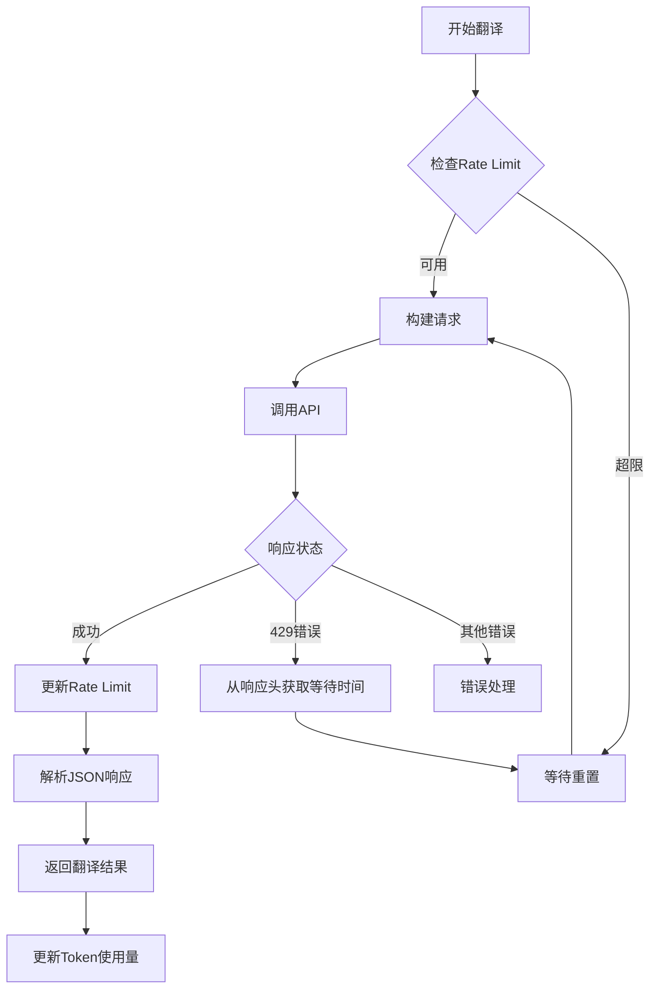

# OpenAI翻译API实现指南

> 最后更新：2025-10-06
> 状态：✅ V4架构优化完成，待实施
> 版本：V4架构兼容

## 📋 概述

本文档提供OpenAI翻译API的完整实现指南，基于项目V4架构规范，复用Google/Microsoft的智能断句和文本处理逻辑，实现与现有翻译服务一致的用户体验。

## 📝 V4架构优化方案（1-13条）

### ✅ 优化1：V4架构完整适配

**实现内容**：
- 添加 `AbortSignal` 支持，可中断翻译
- 区分 `urgent`（紧急）和 `batch`（批量）阶段
- 集成V4超时机制

**代码结构**：
```typescript
public async translate(
  texts: string[],
  sourceLang: string,
  targetLang: string,
  stage: 'urgent' | 'batch',  // 阶段区分
  signal: AbortSignal          // 取消支持
): Promise<string[]>
```

---

### ✅ 优化2：同权多模型支持

**支持模型**：
- `gpt-5`（旗舰，$1.25/$10）
- `gpt-5-mini`（默认，$0.25/$2）
- `gpt-5-nano`（极速，$0.05/$0.40）

**用户偏好配置**：
```typescript
'openai': {
  type: 'openai',
  name: 'OpenAI GPT',
  apiKey: '',
  model: 'gpt-5-mini',                // 默认
  availableModels: ['gpt-5', 'gpt-5-mini', 'gpt-5-nano'],
  customModel: null,
  temperature: 0.3,
  maxTokens: 128000                   // 官方最大输出限制
}
```

---

### ✅ 优化3：批次大小优化（复用IntelligentSegmenter）

**实现方式**：
- 复用项目现有的 `IntelligentSegmenter` 类
- 修改 `MAX_BATCH_SIZE` 为 160
- 完全复用时间间隔智能断句逻辑

**断句规则**：
1. 160条硬断点（强制分批）
2. 强断点：gap > 2秒
3. 弱断点：maxGap - minGap > 400ms
4. 最小批次：10条

**代码**：
```typescript
// intelligent-segmenter.ts
class IntelligentSegmenter {
  private static readonly MAX_BATCH_SIZE = 160;  // 改为160
  // 其他逻辑完全复用
}

// two-phase-translator-v4.ts
const segmenter = new IntelligentSegmenter();
const batches = segmenter.createSmartBatches(subtitles);
```

---

### ✅ 优化4：文本拼接与拆分（复用Google/Microsoft逻辑）

**处理流程**：
```typescript
// 1. 清理单条字幕内的换行符
const cleanedTexts = texts.map(text => text.replace(/\n/g, ' ').trim());

// 2. 用单换行符拼接
const combined = cleanedTexts.join('\n');

// 3. 构建提示词
const messages = [
  {
    role: "system",
    content: `You are a professional subtitle translator.
Translate from ${sourceLang} to ${targetLang}.
Input contains multiple subtitles separated by newlines.
Each line is one subtitle. Keep the same number of lines.
Do not add explanations.`
  },
  {
    role: "user",
    content: combined
  }
];

// 4. 翻译后拆分
const translations = translatedCombined.split(/\r?\n/).map(t => t.trim());

// 5. 验证数量
if (translations.length !== texts.length) {
  throw new Error('翻译数量不匹配');
}
```

**不使用**：
- ❌ `|||SEP|||` 特殊分隔符
- ❌ JSON格式输出
- ❌ 双换行符 `\n\n`

---

### ✅ 优化5：动态超时机制

**超时设置**：
- urgent阶段：5秒
- batch阶段：单批5秒，总超时 = 批数 × 5秒

**实现位置**：
```typescript
// handle-toggle-translate-v4.ts
if (serviceType === 'openai') {
  // 紧急翻译
  timeoutMs: 5000  // 5秒

  // 批量翻译
  estimatedBatches = Math.ceil(subtitleCount / 160);
  perBatchTimeout = 5000;
  batchTotalTimeout = estimatedBatches * 5000;
}

// two-phase-translator-v4.ts
if (service.type === 'openai') {
  perBatchTimeout = 5000;  // 单批5秒
}
```

---

### ❌ 优化6：Rate Limit响应头自动更新

**决定**：暂不实现

**原因**：
- 已有200ms批次间隔
- 已有160条/批限制
- 足够避免限流

**处理**：在本文档中说明Rate Limit策略即可

**Rate Limit策略说明**：
- 批次间隔：200ms（与Google/Microsoft一致）
- 批次大小：160条（避免频繁请求）
- 自然节流：避免触发429错误

---

### ✅ 优化7：Temperature开放给用户

**参数设置**：
- 默认值：0.3（字幕翻译推荐）
- 范围：0-1（用户可调）
- Popup UI显示滑块

**UI实现**：
```html
<div class="setting-item">
  <label>翻译风格:</label>
  <div class="temperature-slider">
    <span class="hint-left">精确</span>
    <input type="range" id="openai-temperature"
           min="0" max="1" step="0.1" value="0.3">
    <span class="hint-right">创意</span>
  </div>
  <div class="temp-value">
    当前: <span id="temp-value">0.3</span>
    <small>（推荐0.2-0.4用于字幕）</small>
  </div>
</div>
```

---

### ✅ 优化8：统一存储架构

**存储位置**：
- API Key存储在 `translationService.apiKey`
- 与DeepSeek保持一致
- 不单独存储

**正确方式**：
```typescript
{
  type: 'openai',
  apiKey: '',           // 存储在这里
  model: 'gpt-5-mini',
  temperature: 0.3
}
```

**错误方式**（不要这样做）：
```typescript
// ❌ 不要单独存储
await chrome.storage.local.set({ openaiApiKey: apiKey });
```

---

### ✅ 优化9：语言代码规范化

**使用YouTube标准代码**：
```typescript
private mapLanguageCode(code: string): string {
  const mapping: Record<string, string> = {
    'zh-CN': 'zh',
    'zh-Hans': 'zh',
    'zh-Hant': 'zh',
    'en': 'en',
    'ja': 'ja',
    'ko': 'ko',
    'es': 'es',
    'fr': 'fr',
    'de': 'de',
    'ru': 'ru',
    'ar': 'ar',
    'pt': 'pt',
    'it': 'it',
    'vi': 'vi',
    'th': 'th',
    'id': 'id'
  };
  return mapping[code] || code;
}
```

**不使用全名**（错误）：
```typescript
// ❌ 不要这样
'zh-Hans': 'Simplified Chinese'
```

---

### ✅ 优化10：错误处理细化

**HTTP状态码细分**：
```typescript
if (!response.ok) {
  switch (response.status) {
    case 401:
    case 403:
      throw new Error('OpenAI API密钥无效，请检查设置');
    case 429:
      throw new Error('OpenAI API速率限制，请稍后重试');
    case 500:
    case 502:
    case 503:
      throw new Error('OpenAI服务暂时不可用');
    default:
      throw new Error(`OpenAI API错误 (${response.status}): ${errorText}`);
  }
}

// AbortError处理
if (error.name === 'AbortError') {
  throw new DOMException('OpenAI API请求被取消', 'AbortError');
}
```

---

### ✅ 优化11：API测试功能

**测试函数**：
```typescript
// service-worker.ts
async function testOpenAIService(
  apiKey: string,
  model: string
): Promise<{success: boolean, message: string}> {
  try {
    const response = await fetch('https://api.openai.com/v1/chat/completions', {
      method: 'POST',
      headers: {
        'Content-Type': 'application/json',
        'Authorization': `Bearer ${apiKey}`
      },
      body: JSON.stringify({
        model: model,
        messages: [{ role: 'user', content: 'Hi' }],
        max_tokens: 10,
        temperature: 0.3
      })
    });

    if (!response.ok) {
      if (response.status === 401) {
        return { success: false, message: 'API Key无效' };
      }
      return { success: false, message: `HTTP ${response.status}` };
    }

    const data = await response.json();
    return {
      success: true,
      message: `测试成功，消耗 ${data.usage.total_tokens} tokens`
    };
  } catch (error) {
    return {
      success: false,
      message: error instanceof Error ? error.message : '测试失败'
    };
  }
}
```

---

### ✅ 优化12：移除流式响应

**简化为非流式**：
```typescript
// 删除约300行流式处理代码
const payload = {
  model: this.model,
  messages: messages,
  temperature: this.temperature,
  max_tokens: 128000,   // 官方最大输出限制
  stream: false         // 非流式
};

const response = await fetch('https://api.openai.com/v1/chat/completions', {
  method: 'POST',
  headers: {
    'Content-Type': 'application/json',
    'Authorization': `Bearer ${this.apiKey}`
  },
  body: JSON.stringify(payload),
  signal  // AbortSignal支持
});

const data = await response.json();
const content = data.choices[0].message.content;
const translations = content.split(/\r?\n/).map(t => t.trim());
```

**删除的内容**：
- ❌ `callOpenAIStreamingAPI` 方法
- ❌ 流式读取逻辑（reader.read()）
- ❌ SSE格式解析（`data: [DONE]`）

---

### ✅ 优化13：模型配置映射表

**配置定义**：
```typescript
const MODEL_CONFIGS: Record<string, {
  contextWindow: number;
  maxOutput: number;
  pricing: {
    input: number;    // $/百万tokens
    output: number;
  };
}> = {
  'gpt-5': {
    contextWindow: 400_000,
    maxOutput: 128_000,
    pricing: { input: 1.25, output: 10.0 }
  },
  'gpt-5-mini': {
    contextWindow: 400_000,
    maxOutput: 128_000,
    pricing: { input: 0.25, output: 2.0 }
  },
  'gpt-5-nano': {
    contextWindow: 400_000,
    maxOutput: 128_000,
    pricing: { input: 0.05, output: 0.40 }
  }
};

// 使用
const config = MODEL_CONFIGS[this.model];
console.log(`[OpenAI] 上下文窗口: ${config.contextWindow} tokens`);
console.log(`[OpenAI] 最大输出: ${config.maxOutput} tokens`);
```

---

## 📊 优化方案汇总

| 编号 | 优化项 | 状态 | 优先级 | 代码改动 |
|------|--------|------|--------|----------|
| 1 | V4架构适配 | ✅ 实现 | P0 | ~50行 |
| 2 | 同权多模型 | ✅ 实现 | P0 | ~30行 |
| 3 | 批次大小优化 | ✅ 实现 | P0 | 修改1常量 |
| 4 | 文本拼接拆分 | ✅ 实现 | P0 | ~20行 |
| 5 | 动态超时机制 | ✅ 实现 | P1 | ~30行 |
| 6 | Rate Limit | ❌ 不实现 | - | 0行 |
| 7 | Temperature开放 | ✅ 实现 | P1 | ~40行 |
| 8 | 统一存储架构 | ✅ 实现 | P1 | ~10行 |
| 9 | 语言代码规范化 | ✅ 实现 | P1 | ~30行 |
| 10 | 错误处理细化 | ✅ 实现 | P1 | ~30行 |
| 11 | API测试功能 | ✅ 实现 | P1 | ~50行 |
| 12 | 移除流式响应 | ✅ 实现 | P0 | 删除300行，新增30行 |
| 13 | 模型配置映射表 | ✅ 实现 | P2 | ~30行 |

**总计**：删除~300行，新增~320行，净增约20行，架构更清晰。

---

## 🎯 核心参数确认

| 参数 | 值 | 说明 |
|------|-----|------|
| **可选模型** | `gpt-5`, `gpt-5-mini`, `gpt-5-nano` | 三个同权模型 |
| **默认模型** | `gpt-5-mini` | 性价比最优 |
| **max_tokens** | `128000` | 官方最大输出限制 |
| **temperature** | `0.3`（默认），0-1可调 | 字幕翻译推荐 |
| **batch_size** | `160` | IntelligentSegmenter |
| **separator** | `\n` | 单换行符 |
| **stream** | `false` | 非流式 |
| **超时（urgent）** | `5秒` | V4规范 |
| **超时（batch单批）** | `5秒` | V4规范 |
| **超时（batch总计）** | `批数 × 5秒` | 动态计算 |

---

## 🎯 设计理念

- **用户体验极简化**：只暴露必要的3个配置项（API Key、Model、Temperature）
- **内部处理智能化**：复用IntelligentSegmenter智能断句，复用Google/Microsoft文本处理逻辑
- **与现有服务一致性**：操作体验与Google/Microsoft翻译保持一致

## 🔑 核心特性

### 用户可见特性
- **API密钥配置**：支持用户自有API Key
- **模型选择**：多种模型可选（详见模型对比表）
- **翻译风格调节**：Temperature滑块（精确↔创意）
- **使用量追踪**：实时显示Token使用量

### 内部自动特性
- **智能批处理**：充分利用 400K 长上下文窗口
- **Rate Limit管理**：从API响应自动获取和调整
- **错误自动重试**：指数退避策略
- **Token优化**：动态计算max_tokens参数

## 📊 可用模型对比（已核实 2025-09-29）

| 模型 | 上下文窗口 | 最大输出 | 价格（入/出，$/百万tokens） | Tier1 限额（RPM / TPM） | 特点 | 推荐场景 |
|------|-----------|---------|--------------------------------|-------------------------|------|---------|
| **gpt-5** | 400K | 128K | $1.25 / $10.00 | 500 / 500K | 旗舰级推理 + Reasoning Token | 严苛质量、术语一致性要求 |
| **gpt-5-mini** | 400K | 128K | $0.25 / $2.00 | 500 / 500K | 默认性价比方案（400K上下文） | ✅ 日常字幕翻译默认选项 |
| **gpt-5-nano** | 400K | 128K | $0.05 / $0.40 | 500 / 200K | 最低成本、最低延迟 | 高频字幕刷新 / 低预算场景 |

> 价格与限额来自 2025-09-29 OpenAI 官方模型页；“Tier1” 指常见付费入门档位。缓存输入价格（如 $0.125/百万）可从对应页面获取并填充到配置表中。

## 🏗️ 架构设计

### 1. 用户配置层（Popup界面）

```typescript
interface OpenAIUserConfig {
  apiKey: string;        // 必需：API密钥
  model: string;         // 必需：模型选择
  temperature: number;   // 可调：翻译风格 (0-1, 默认0.3)
}

// 支持的模型列表（按推荐顺序排序）
const SUPPORTED_MODELS = [
  'gpt-5',
  'gpt-5-mini',
  'gpt-5-nano'
];
```

#### UI界面设计
```html
<!-- 极简的用户界面 -->
<div class="openai-config">
  <!-- API密钥 -->
  <div class="setting-item">
    <label>API密钥:</label>
    <input type="password" id="openai-api-key" placeholder="sk-...">
    <button id="test-openai-key">测试</button>
  </div>

  <!-- 模型选择 -->
  <div class="setting-item">
    <label>模型:</label>
    <select id="openai-model">
      <option value="gpt-5-mini" selected>GPT-5 mini (默认 $0.25/$2)</option>
      <option value="gpt-5">GPT-5 (旗舰 $1.25/$10)</option>
      <option value="gpt-5-nano">GPT-5 nano (极速 $0.05/$0.40)</option>
    </select>
    <div class="model-info" id="model-info">
      <!-- 动态显示模型信息 -->
      <small>上下文: 400K tokens | 最大输出: 128K tokens</small>
    </div>
  </div>

  <!-- Temperature滑块 -->
  <div class="setting-item">
    <label>翻译风格:</label>
    <div class="temperature-slider">
      <span class="temp-hint-left">精确</span>
      <input type="range" id="openai-temperature"
             min="0" max="1" step="0.1" value="0.3">
      <span class="temp-hint-right">创意</span>
    </div>
    <div class="temp-value">当前: <span id="temp-value">0.3</span></div>
  </div>

  <!-- 使用量显示 -->
  <div class="usage-display">
    <span>本次使用:</span>
    <span id="session-tokens">0 tokens</span>
  </div>
</div>
```

### 2. 内部自动管理层

#### 固定参数（最佳实践）
```typescript
const FIXED_PARAMS = {
  top_p: 0.8,                              // 平衡多样性
  presence_penalty: 0,                      // 字幕翻译不需要
  frequency_penalty: 0,                     // 字幕翻译不需要
  response_format: { type: "json_object" }, // 结构化输出
  stream: false                            // 批量处理不需要流
}
```

#### 动态管理参数
```typescript
interface DynamicParams {
  // 从API响应获取（每次调用自动更新）
  rateLimits: {
    maxRPM: number;           // 首次调用获取
    maxTPM: number;           // 首次调用获取
    remainingRequests: number; // 每次调用更新
    remainingTokens: number;   // 每次调用更新
    resetTime: Date;          // 重置时间
  };

  // 根据输入动态计算
  max_tokens: number;         // 基于输入文本长度估算

  // 根据模型自动设置
  modelConfig: {
    contextWindow: number;  // 上下文窗口大小
    maxOutput: number;      // 最大输出tokens
    encoding: string;       // tokenizer编码
  }
}
```

## 📝 实现代码

### 1. OpenAI翻译器核心类

```typescript
// 模型配置映射
const MODEL_CONFIGS: Record<string, {
  contextWindow: number;
  maxOutput: number;
  pricing: {
    input: number;
    cachedInput: number;
    output: number;
  };
  rateLimits: {
    tier1: { rpm: number; tpm: number };
    tier2: { rpm: number; tpm: number };
    tier3: { rpm: number; tpm: number };
  };
  encoding: string;
}> = {
  'gpt-5': {
    contextWindow: 400_000,
    maxOutput: 128_000,
    pricing: { input: 1.25, cachedInput: 0.125, output: 10.0 },
    rateLimits: {
      tier1: { rpm: 500, tpm: 500_000 },
      tier2: { rpm: 5_000, tpm: 1_000_000 },
      tier3: { rpm: 5_000, tpm: 2_000_000 }
    },
    encoding: 'auto'
  },
  'gpt-5-mini': {
    contextWindow: 400_000,
    maxOutput: 128_000,
    pricing: { input: 0.25, cachedInput: 0.025, output: 2.0 },
    rateLimits: {
      tier1: { rpm: 500, tpm: 500_000 },
      tier2: { rpm: 5_000, tpm: 2_000_000 },
      tier3: { rpm: 5_000, tpm: 4_000_000 }
    },
    encoding: 'auto'
  },
  'gpt-5-nano': {
    contextWindow: 400_000,
    maxOutput: 128_000,
    pricing: { input: 0.05, cachedInput: 0.005, output: 0.40 },
    rateLimits: {
      tier1: { rpm: 500, tpm: 200_000 },
      tier2: { rpm: 5_000, tpm: 2_000_000 },
      tier3: { rpm: 5_000, tpm: 4_000_000 }
    },
    encoding: 'auto'
  },
};

export class OpenAITranslator {
  private apiKey: string;
  private model: string;
  private temperature: number;
  private sessionTokens: number = 0;
  private rateLimits: any = null;
  private modelConfig: any;

  constructor(apiKey: string, model: string, temperature: number) {
    this.apiKey = apiKey;
    this.model = model;
    this.temperature = temperature;
    this.modelConfig = MODEL_CONFIGS[model] || MODEL_CONFIGS['gpt-5-mini'];

    console.log(`[OpenAI] 使用模型: ${model}`);
    console.log(`[OpenAI] 上下文窗口: ${this.modelConfig.contextWindow} tokens`);
    console.log(`[OpenAI] 最大输出: ${this.modelConfig.maxOutput} tokens`);
  }

  async translateBatch(
    texts: string[],
    sourceLang: string,
    targetLang: string
  ): Promise<string[]> {
    // 构建请求
    const request = this.buildRequest(texts, sourceLang, targetLang);

    try {
      // 发送请求
      const response = await this.callAPI(request);

      // 自动更新rate limits（内部使用）
      this.updateRateLimits(response.headers);

      // 更新使用量显示（用户可见）
      this.sessionTokens += response.data.usage.total_tokens;
      this.updateUsageDisplay();

      // 解析响应
      return this.parseResponse(response.data);

    } catch (error: any) {
      if (error.status === 429) {
        // 自动处理rate limit，用户无感知
        await this.handleRateLimit(error);
        return this.translateBatch(texts, sourceLang, targetLang);
      }
      throw error;
    }
  }

  private buildRequest(texts: string[], sourceLang: string, targetLang: string) {
    return {
      model: this.model,
      temperature: this.temperature,     // 唯一用户可调参数

      // 固定的最佳实践参数
      top_p: 0.8,
      presence_penalty: 0,
      frequency_penalty: 0,
      response_format: { type: "json_object" },

      // 动态计算的参数
      max_tokens: this.calculateMaxTokens(texts),

      // 消息构建
      messages: [
        {
          role: "system",
          content: `You are a professional subtitle translator.
                   Translate accurately while preserving timing markers.
                   Return JSON format: {"translations": [{"index": 0, "text": "translated text"}]}`
        },
        {
          role: "user",
          content: `Translate from ${sourceLang} to ${targetLang}:\n${
            texts.map((t, i) => `${i}: ${t}`).join('\n')
          }`
        }
      ]
    };
  }

  private async callAPI(request: any): Promise<any> {
    const response = await fetch('https://api.openai.com/v1/chat/completions', {
      method: 'POST',
      headers: {
        'Content-Type': 'application/json',
        'Authorization': `Bearer ${this.apiKey}`
      },
      body: JSON.stringify(request)
    });

    const data = await response.json();

    if (!response.ok) {
      throw { status: response.status, ...data };
    }

    return { headers: response.headers, data };
  }

  private calculateMaxTokens(texts: string[]): number {
    // 基于字符估算输入token（粗略估算）
    const charCount = texts.join(' ').length;
    const estimatedInput = Math.ceil(charCount / 3); // 平均3字符/token

    // 翻译通常是1.5倍长度
    const estimatedOutput = Math.ceil(estimatedInput * 1.5);

    // 确保不超过模型的最大输出限制
    const modelMaxOutput = this.modelConfig.maxOutput;

    // 确保总token不超过上下文窗口
    const contextWindow = this.modelConfig.contextWindow;
    const systemPromptTokens = 100; // 系统提示词估算
    const safeMargin = 100; // 安全边界

    const availableForOutput = contextWindow - estimatedInput - systemPromptTokens - safeMargin;

    return Math.min(estimatedOutput, modelMaxOutput, availableForOutput);
  }

  private parseResponse(data: any): string[] {
    const content = data.choices[0].message.content;
    const parsed = JSON.parse(content);

    if (!parsed.translations || !Array.isArray(parsed.translations)) {
      throw new Error('Invalid response structure');
    }

    return parsed.translations
      .sort((a: any, b: any) => a.index - b.index)
      .map((t: any) => t.text);
  }

  private updateRateLimits(headers: Headers): void {
    this.rateLimits = {
      remainingRequests: parseInt(headers.get('x-ratelimit-remaining-requests') || '0'),
      remainingTokens: parseInt(headers.get('x-ratelimit-remaining-tokens') || '0'),
      resetRequests: new Date(parseInt(headers.get('x-ratelimit-reset-requests') || '0') * 1000),
      resetTokens: new Date(parseInt(headers.get('x-ratelimit-reset-tokens') || '0') * 1000)
    };
  }

  private async handleRateLimit(error: any): Promise<void> {
    const headers = error.headers;
    if (headers) {
      this.updateRateLimits(headers);
      const waitTime = Math.max(
        this.rateLimits.resetRequests.getTime() - Date.now(),
        this.rateLimits.resetTokens.getTime() - Date.now()
      );
      console.log(`[OpenAI] Rate limit hit, waiting ${waitTime}ms`);
      await new Promise(resolve => setTimeout(resolve, waitTime));
    } else {
      // 没有headers信息，使用指数退避
      await new Promise(resolve => setTimeout(resolve, 5000));
    }
  }

  private updateUsageDisplay(): void {
    chrome.runtime.sendMessage({
      type: 'UPDATE_OPENAI_USAGE',
      data: { tokens: this.sessionTokens }
    });
  }
}
```

### 2. API Key测试功能

```typescript
export async function testOpenAIKey(apiKey: string): Promise<boolean> {
  try {
    const response = await fetch('https://api.openai.com/v1/chat/completions', {
      method: 'POST',
      headers: {
        'Content-Type': 'application/json',
        'Authorization': `Bearer ${apiKey}`
      },
      body: JSON.stringify({
        model: 'gpt-5-mini',
        messages: [{ role: 'user', content: 'Hi' }],
        max_tokens: 5
      })
    });

    if (response.ok) {
      const data = await response.json();
      console.log('[OpenAI] API Key有效，测试消耗:', data.usage.total_tokens, 'tokens');
      return true;
    }

    if (response.status === 401) {
      console.error('[OpenAI] API Key无效');
    }

    return false;
  } catch (error) {
    console.error('[OpenAI] API Key测试失败:', error);
    return false;
  }
}
```

### 3. 集成到现有翻译系统

```typescript
// 在 two-phase-translator-v4.ts 中添加
class TwoPhaseTranslatorV4 {
  private openaiTranslator?: OpenAITranslator;

  async translateBatch(
    texts: string[],
    sourceLang: string,
    targetLang: string,
    preferences: any
  ): Promise<string[]> {
    const service = preferences.translationService;

    if (service === 'google-free') {
      return this.translateWithGoogle(texts, sourceLang, targetLang);
    } else if (service === 'microsoft-free') {
      return this.translateWithMicrosoft(texts, sourceLang, targetLang);
    } else if (service === 'openai') {
      // 初始化OpenAI翻译器
      if (!this.openaiTranslator) {
        this.openaiTranslator = new OpenAITranslator(
          preferences.apiKey,
          preferences.model || 'gpt-5-mini',
          preferences.temperature || 0.3
        );
      }
      return this.openaiTranslator.translateBatch(texts, sourceLang, targetLang);
    }
  }
}
```

## 🔄 API调用流程



## ⚡ 批处理优化

### 与其他服务对比

| 服务 | 批处理方式 | 单次限制 | 优化策略 |
|------|-----------|---------|----------|
| **谷歌** | URL参数，`\|SEP\|`分隔 | URL长度（~2000字符） | 小批量多请求 |
| **微软** | JSON数组 | 10条/请求，5000字符/条 | 5000字符窗口 |
| **OpenAI** | 上下文对话 | ≥128K tokens | 大批量少请求 |

### OpenAI批处理优势

为保持与谷歌/微软管线一致，我们在 OpenAI 模型上采用同样的“紧急 → 批量”流程，并加入额外的安全边界：

- **紧急翻译**：沿用现有代码里的前/后范围配置，暂不锁定具体条数，方便调试；紧急请求通常在 40 条以内，直接按估算 token 校验即可。
- **批量翻译断点**：每批最多 160 条字幕，达到上限立即切下一批；在批次内结合 token 预算做智能断句。
- **token 安全线**：按 128K token 预算估算批次，超过模型上下文就拆分下一批。
- **Rate Limit 友好**：利用 `MODEL_CONFIGS` 中的 RPM / TPM，在批次之间加延迟（默认 `60_000 / RPM` 并乘以安全系数），并根据响应头的剩余额度动态调整。

```typescript
interface OpenAIBatch {
  subtitles: Subtitle[];
  tokenBudget: number;
}

interface OpenAIModelConfig {
  contextWindow: number;
  maxOutput: number;
  pricing: {
    input: number;
    cachedInput: number;
    output: number;
  };
  rateLimits: {
    tier1: { rpm: number; tpm: number };
    tier2: { rpm: number; tpm: number };
    tier3: { rpm: number; tpm: number };
  };
  encoding: string;
}

interface RateLimitSnapshot {
  remainingRequests: number;
  remainingTokens: number;
  resetRequestTs?: number;
  resetTokenTs?: number;
}

const SUBTITLE_MAX_PER_BATCH = 160;      // 单批固定上限
const SUBTITLE_HARD_CAP = 160;           // 额外保护（保持一致）

// 批处理优化器
class OpenAIBatchOptimizer {
  optimizeBatch(subtitles: Subtitle[], model: string): OpenAIBatch[] {
    const modelConfig = MODEL_CONFIGS[model];
    const batches: OpenAIBatch[] = [];
    let cursor = 0;

    while (cursor < subtitles.length) {
      const windowEnd = Math.min(cursor + SUBTITLE_MAX_PER_BATCH, subtitles.length);
      const windowSubs = subtitles.slice(cursor, windowEnd);

      const groups = this.splitWithinWindow(windowSubs, modelConfig);
      batches.push(...groups);

      cursor = windowEnd;
    }

    return batches;
  }

  private splitWithinWindow(subtitles: Subtitle[], config: OpenAIModelConfig): OpenAIBatch[] {
    const result: OpenAIBatch[] = [];
    let current: Subtitle[] = [];

    for (const subtitle of subtitles) {
      const exceedsHardCap = current.length >= SUBTITLE_HARD_CAP;

      if (exceedsHardCap) {
        if (current.length > 0) {
          result.push(this.buildBatch(current, config));
          current = [];
        }
      }

      current.push(subtitle);
    }

    if (current.length > 0) {
      result.push(this.buildBatch(current, config));
    }

    return result;
  }

  private buildBatch(subtitles: Subtitle[], config: OpenAIModelConfig): OpenAIBatch {
    const tokensEstimate = this.estimateTokens(subtitles, config);
    return {
      subtitles,
      tokenBudget: Math.min(tokensEstimate, config.maxOutput)
    };
  }

  private estimateTokens(subtitles: Subtitle[], config: OpenAIModelConfig): number {
    const joined = subtitles.map(s => s.text.replace(/\n/g, ' ').trim()).join(' ');
    const charCount = joined.length;
    const estimatedInput = Math.ceil(charCount / 3);  // 平均三字符一 token

    const estimatedOutput = Math.ceil(estimatedInput * 1.5);
    const safeContext = Math.floor(config.contextWindow * 0.6);
    const safeOutput = Math.floor(config.maxOutput * 0.8);

    return Math.min(safeContext, safeOutput, estimatedOutput);
  }
}

// 结合 Rate Limit 计算批次间延迟（保持和谷歌/微软一致的节流策略）
function computeBatchDelayMs(model: string, remainingHeaders?: RateLimitSnapshot): number {
  const config = MODEL_CONFIGS[model];
  const baseDelay = Math.ceil(60_000 / config.rateLimits.tier1.rpm);
  const safetyDelay = Math.max(baseDelay, 200);

  if (!remainingHeaders) {
    return Math.floor(safetyDelay * 1.1);
  }

  const { remainingRequests, resetRequestTs } = remainingHeaders;
  if (remainingRequests <= 1 && resetRequestTs) {
    const wait = Math.max(0, resetRequestTs - Date.now());
    return wait + safetyDelay;
  }

  return Math.floor(safetyDelay * 1.1);
}
```

## 🚨 错误处理

### 错误类型和处理策略

| 错误码 | 含义 | 自动处理 | 用户提示 |
|--------|------|---------|---------|
| 401 | API Key无效 | ❌ | "请检查API密钥" |
| 429 | 超出Rate Limit | ✅ 自动等待重试 | 静默处理 |
| 500 | 服务器错误 | ✅ 指数退避重试 | 静默处理 |
| Token超限 | 输入过长 | ✅ 自动分割批次 | 静默处理 |

## 📊 Rate Limit管理

### 自动获取和更新

```typescript
// 每次API响应都包含最新的限制信息
Response Headers:
{
  'x-ratelimit-limit-requests': '5000',      // 例如：Tier2 gpt-5
  'x-ratelimit-limit-tokens': '1000000',     // TPM 限制
  'x-ratelimit-remaining-requests': '4999',  // 剩余请求
  'x-ratelimit-remaining-tokens': '985000',  // 剩余 tokens
  'x-ratelimit-reset-requests': '1738000000', // 重置时间（Unix 秒）
  'x-ratelimit-reset-tokens': '1738000000'
}

### 常用模型限额速查

| 模型 | Tier1 RPM | Tier1 TPM | Tier2 RPM | Tier2 TPM | 备注 |
|------|-----------|-----------|-----------|-----------|------|
| gpt-5 | 500 | 500K | 5,000 | 1,000K | Tier3 提升至 2,000K |
| gpt-5-mini | 500 | 500K | 5,000 | 2,000K | Tier3 维持 4,000K |
| gpt-5-nano | 500 | 200K | 5,000 | 2,000K | Tier3 同 4,000K |
```

### 动态调整策略

1. **首次调用**：不知道限制，调用后从响应获取
2. **后续调用**：提前检查剩余配额
3. **接近限制**：自动计算等待时间
4. **429错误**：从错误响应获取精确等待时间

## 🎯 Temperature参数说明

| 值 | 风格 | 适用场景 |
|----|------|---------|
| 0.0-0.2 | 精确直译 | 技术文档、法律文本 |
| 0.3-0.4 | 标准翻译 | 字幕、一般内容（推荐） |
| 0.5-0.6 | 自然翻译 | 对话、口语内容 |
| 0.7-1.0 | 创意翻译 | 文学作品、诗歌 |

## 📈 性能优化建议

### 模型选择指南

| 使用场景 | 推荐模型 | 理由 |
|---------|---------|------|
| **旗舰质量 / 高准确度** | gpt-5 | 400K 上下文 + Reasoning Token，适合术语敏感内容 |
| **默认日常字幕翻译** | gpt-5-mini | 400K 上下文 + 中等成本，响应足够快 |
| **高并发 / 低预算** | gpt-5-nano | $0.05/$0.40 定价，可服务快速刷新字幕 |

### 优化建议

1. **批量策略**：
   - gpt-5 / gpt-5-mini：400K 上下文，可一次分配 500~600 条字幕

2. **Token优化**：
   - 使用简洁的系统提示词（<100 tokens）
   - 批量处理减少系统消息开销
   - 避免重复的上下文信息

3. **Temperature设置**：
   - 字幕翻译：0.2-0.3（保持一致性）
   - 创意内容：0.5-0.7（更自然的表达）
   - 技术文档：0.0-0.1（精确翻译）

4. **错误处理**：
   - 实现智能重试机制
   - 根据错误类型自动降级模型
   - 缓存成功的翻译结果

## 🔍 调试和监控

### 日志格式
```javascript
[OpenAI] 模型: gpt-5-mini
[OpenAI] 批次: 50条字幕, 估算1500 tokens
[OpenAI] Rate Limit: 4999/5000 RPM, 449500/450000 TPM
[OpenAI] 响应: 200 OK, 耗时: 1.2s
[OpenAI] 使用: 1650 tokens (输入:1200, 输出:450)
[OpenAI] 会话总计: 3250 tokens
```

### 监控指标
- Token使用量（避免超支）
- 响应时间（优化批次大小）
- 错误率（调整重试策略）
- Rate Limit使用率（优化请求频率）

## ✅ 测试清单

- [ ] API Key验证
- [ ] 单条字幕翻译
- [ ] 批量字幕翻译
- [ ] Rate Limit处理
- [ ] 429错误自动重试
- [ ] Token使用量显示
- [ ] Temperature效果测试
- [ ] 模型切换测试
- [ ] 长字幕分割处理
- [ ] 网络错误恢复

## 📚 参考资源

- [OpenAI API文档](https://platform.openai.com/docs/api-reference)
- [Chat Completions指南](https://platform.openai.com/docs/guides/chat-completions)
- [Rate Limits说明](https://platform.openai.com/docs/guides/rate-limits)
- [Token计算工具](https://platform.openai.com/tokenizer)

## 🚀 下一步计划

1. 实现OpenAITranslator类
2. 集成到two-phase-translator-v4.ts
3. 添加到Popup配置界面
4. 实现Token使用量统计
5. 添加成本预警功能（可选）
6. 支持自定义系统提示词（高级功能）

---

*本文档会随着实现进展持续更新*
