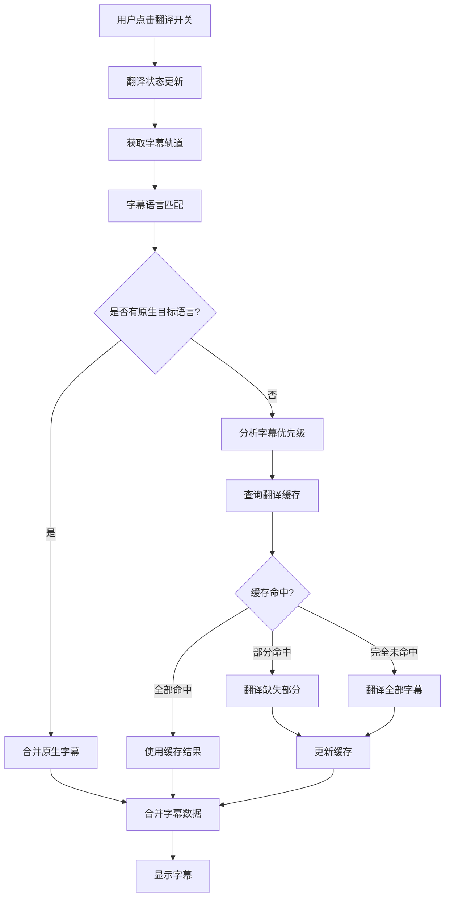
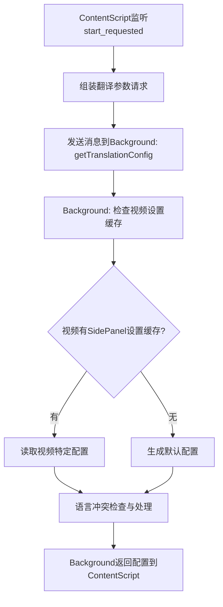
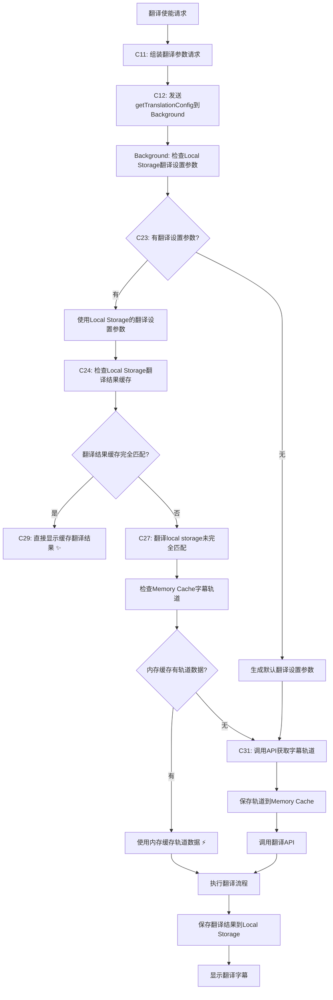

# YouTube字幕翻译流程

本文档详细说明字幕翻译扩展中，从用户点击翻译开关到完成字幕翻译显示的完整流程。

## 概述

字幕翻译流程分为以下几个主要阶段：

1. 翻译开关触发与状态管理
2. 字幕轨道获取与语言匹配
3. 翻译调度与优先级处理
4. 字幕翻译与缓存机制
5. 字幕显示与更新



## 1. 翻译开关触发与状态管理

### 1.1 UI交互触发

- 用户点击YouTube播放器控制栏中的翻译按钮
- `UIManager`类的按钮点击处理函数被触发
- 切换内部`translateActive`状态
- 触发`state:translate_active_changed`事件

```typescript
// 伪代码示例 - UIManager中的翻译按钮点击处理
translateButton.addEventListener('click', () => {
  const newState = !this.state.translateActive;
  this.eventBus.emit('state:translate_active_changed', newState);
});
```

### 1.2 状态更新与持久化

- `UIManager.setTranslateActive()`方法处理状态更新
- 更新按钮图标和提示文本
- 将状态保存到`chrome.storage.local`
- 更新侧边栏显示参数
- 当状态为激活时，触发`translation:start_requested`事件

```typescript
// 伪代码示例 - 设置翻译激活状态
public setTranslateActive(active: boolean): void {
  this.state.translateActive = active;
  this.updateTranslateButtonState(active);
  chrome.storage.local.set({ translateActive: active });
  
  if (active) {
    this.eventBus.emit('translation:start_requested', {});
  } else {
    this.eventBus.emit('translation:stop_requested', {});
  }
}
```

### 1.3 启动翻译流程

- ContentScript监听`translation:start_requested`事件
- 转换为标准化的`TRANSLATION_STARTED`事件
- 包含事件来源、时间戳等元数据
- 通知其他组件开始翻译流程

## 2. 缓存策略与参数配置（集中式Background缓存管理）

### 2.1 翻译配置获取（集中式Background缓存管理）

翻译流程基于**集中式Background缓存管理策略**，所有缓存操作统一在Background Script中处理：



### 2.2 三层缓存检查策略

系统实现了三层缓存架构，按优先级顺序检查：

**优先级顺序**：
1. **Local Storage翻译设置参数检查** → 有设置则使用缓存配置，无设置则生成默认配置
2. **Local Storage翻译结果缓存** → 完全匹配则直接显示 ✨
3. **Memory Cache字幕轨道** → 使用内存缓存轨道数据 ⚡  
4. **API调用获取字幕轨道** → 调用YouTube API获取完整字幕轨道数据
5. **API调用翻译** → 调用翻译API执行翻译流程



### 2.3 字幕轨道获取与处理

- 获取当前YouTube视频ID
- 通过`window.postMessage`向主世界脚本发送请求
- 主世界脚本访问YouTube播放器API获取字幕轨道列表
- 返回字幕轨道数组(`captionTracks`)给ContentScript
- **保存轨道到Background内存缓存** - 实现跨组件复用

### 2.4 语言冲突解决策略

当检测到 `sourceLang = targetLang` 时，系统采用**基于轨道检测 + 智能替换的组合策略**：

**通用冲突降级与用户引导流程**（适用于所有 sourceLang = targetLang 场景）：

1. **初始化与目标语言确定**  
   - targetLang 由 UI 语言或用户选择确定  
   - translateActive 保持可用  

2. **获取并分类轨道**  
   - 从 Content Script 获取 `CaptionTrack[]`，按以下四组分类：  
     - A：非 targetLang & 非 ASR（手动外语或其他语言）  
     - B：非 targetLang & ASR（自动外语或其他语言）  
     - C：targetLang & 非 ASR（手动同语字幕）  
     - D：targetLang & ASR（自动同语字幕）  

3. **自动选取 sourceLang**  
   - 若 A 非空 → 取 A[0]；  
   - 否则若 B 非空 → 取 B[0]；  
   - 否则若 C 非空 → 取 C[0]；  
   - 否则 D 非空 → 取 D[0]；  
   - 若选到 C 或 D，则进入"仅有同语种轨道"降级模式  

4. **Side Panel 目标语言框提示**  
   - 在目标语言输入框显示灰色 placeholder：  
     "仅有 {语言名} 字幕，请先选择目标语"  

5. **视频页面 Overlay 持续提示**  
   - 在字幕覆盖层渲染提示：  
     "【字幕提示】本视频仅有 {语言名} 字幕，打开翻译设置选择目标语言。"  
   - 原文字幕正常显示，翻译文本区保持空白或隐藏  

6. **用户手动切换目标语言**  
   - 用户在侧边栏选择非 targetLang 后：  
     - placeholder 与提示同时消失；  
     - 正常执行翻译并渲染双语或目标语言字幕  

7. **缓存与复用**  
   - 后台缓存 videoId + 最终 targetLang 和 sourceLang，下次直接使用，无需再次触发降级提示

### 2.5 语言匹配与轨道选择

- 从存储中读取用户设置的源语言和目标语言首选项
- 调用`findBestMatchingTrack`查找最匹配源语言的字幕轨道
- 同样检查是否有匹配目标语言的轨道
- 确定是否需要翻译或可以使用原生字幕轨道
- 其中合理匹配像中文、中文简体、中文繁体等的同一语言种类的变种问题（西班牙语、英语等可以后期考虑完善）

```typescript
// 伪代码示例 - 查找最匹配的轨道
function findBestMatchingTrack(tracks, langCode) {
  // 1. 精确匹配
  let track = tracks.find(t => t.languageCode === langCode);
  if (track) return track;
  
  // 2. 基础语言匹配
  const baseLang = langCode.split('-')[0];
  track = tracks.find(t => t.languageCode === baseLang);
  if (track) return track;
  
  // 3. 前缀匹配
  return tracks.find(t => t.languageCode.startsWith(baseLang + '-'));
}
```

### 2.6 统一缓存消息接口

系统定义了标准化的缓存操作消息格式：

```typescript
// 翻译配置获取
{ type: 'getTranslationConfig', data: { videoId: string, payload?: any } }

// 缓存检查  
{ type: 'checkTranslationCache', data: { videoId: string, params: TranslationParams } }

// 缓存保存
{ type: 'saveTrackCache', data: { videoId: string, tracks: CaptionTrack[] } }
{ type: 'saveTranslationCache', data: { videoId: string, params: TranslationParams, result: TranslationResult } }

// 轨道获取（Popup专用）
{ type: 'getAvailableTracks', data: { videoId: string } }
```

### 2.7 字幕数据获取

- 调用`fetchSubtitleData`获取源语言轨道的字幕内容
- 解析XML/JSON格式的字幕数据
- 转换为标准化的字幕事件数组
- 每个字幕事件包含开始时间、结束时间和文本内容
- **通过Background保存到内存缓存** - 提高后续访问效率

## 3. 翻译调度与优先级处理

### 3.1 处理路径分支

如果找到匹配的目标语言轨道：
- 获取目标语言轨道的字幕数据
- 分别显示源语言和目标语言字幕，不进行字幕合并。源语言在上，目标语言在下

如果没找到匹配的目标语言轨道，则进行缓存匹配：
- 获取视频ID、源语言、目标语言、翻译API、翻译模型
- 进行缓存字幕五位一体匹配

如果没有匹配到缓存，需要翻译（无匹配目标语言轨道）：
- 创建翻译上下文(`TranslationContext`)
- 包含视频ID、源事件、源语言、目标语言等信息
- 初始化`TranslationDispatcher`并启动渐进式翻译

### 3.2 渐进式翻译策略

- 获取当前视频播放时间
- 按照优先级分组字幕事件：
  - 高优先级：当前播放位置前后的字幕（默认90秒窗口）
  - 普通优先级：其他字幕
- 先处理高优先级字幕，确保当前观看部分立即显示翻译
- 后台处理普通优先级字幕

```typescript
// 伪代码示例 - 按播放位置的字幕优先级分组
function groupSubtitlesByPriority(subtitles, currentTime, windowSize = 90) {
  const halfWindow = windowSize / 2;
  const windowStart = Math.max(0, currentTime - halfWindow);
  const windowEnd = currentTime + halfWindow;
  
  return {
    highPriority: subtitles.filter(sub => 
      (sub.start >= windowStart && sub.start <= windowEnd) ||
      (sub.end >= windowStart && sub.end <= windowEnd) ||
      (sub.start <= windowStart && sub.end >= windowEnd)
    ),
    normalPriority: subtitles.filter(sub => 
      !(sub.start >= windowStart && sub.start <= windowEnd) &&
      !(sub.end >= windowStart && sub.end <= windowEnd) &&
      !(sub.start <= windowStart && sub.end >= windowEnd)
    )
  };
}
```

### 3.3 翻译请求管理

- 为每个优先级组创建翻译请求
- 生成唯一请求ID
- 将请求添加到`TranslationDispatcher`的请求队列
- 按照优先级和提交时间排序处理请求

## 4. 字幕翻译与缓存机制

### 4.1 缓存查询

- 根据视频ID、目标语言和翻译API类型生成缓存键
- 通过`SubtitleCacheManager`查询缓存
- 检查缓存是否包含所有需要翻译的字幕

缓存查询结果处理：
- 全部命中：直接使用缓存的翻译结果
- 部分命中：只翻译缓存中缺失的部分
- 完全未命中：翻译全部字幕

### 4.2 翻译执行

- `TranslationDispatcher`向后台脚本发送翻译请求
- 后台脚本根据用户设置选择翻译API：
  - Google翻译（双路径实现）
  - 微软/Bing翻译（双路径实现）
  - OpenAI翻译（需用户API密钥）
  - 有道翻译

- 大批量字幕分批处理，避免超出API限制
- 实现请求间隔和故障转移机制
- 返回格式化的翻译结果

```typescript
// 伪代码示例 - 批处理翻译
async function translateInBatches(subtitles, batchSize) {
  const results = {};
  for (let i = 0; i < subtitles.length; i += batchSize) {
    const batch = subtitles.slice(i, i + batchSize);
    const batchResults = await translateBatch(batch);
    Object.assign(results, batchResults);
    
    // 添加间隔，避免API限制
    if (i + batchSize < subtitles.length) {
      await new Promise(resolve => setTimeout(resolve, 500));
    }
  }
  return results;
}
```

### 4.3 缓存更新

- 使用`SubtitleCacheManager`保存翻译结果
- 存储在`chrome.storage.local`中
- 自动管理缓存大小，实现LRU（最近最少使用）策略
- 缓存包含时间戳，支持过期清理

## 5. 字幕显示与更新

### 5.1 字幕数据合并

- 合并源字幕和翻译文本
- 创建`ProcessedSubtitleEvent`对象数组
- 保留时间信息和语言代码
- 准备用于显示的字幕对象

```typescript
// 伪代码示例 - 合并字幕数据
function mergeSubtitleData(sourceEvents, translations, sourceLang, targetLang) {
  return sourceEvents.map(event => ({
    start: event.start,
    end: event.end,
    sourceText: event.text,
    targetText: translations[event.id] || null,
    sourceLangCode: sourceLang,
    targetLangCode: targetLang
  }));
}
```

### 5.2 字幕显示层

- 创建字幕覆盖层（如果尚未创建）
- 定位在YouTube播放器的底部
- 设置适当的样式和z-index确保可见
- 阻止鼠标事件传递（pointerEvents: 'none'）

### 5.3 字幕实时同步

- 添加视频`timeupdate`事件监听器
- 在事件处理函数中筛选当前时间应显示的字幕
- 更新字幕叠加层的内容
- 支持双语显示模式（翻译文本在上，原文在下）

```typescript
// 伪代码示例 - 字幕更新处理
function handleSubtitleUpdate(currentTime) {
  const currentSubtitles = subtitles.filter(
    sub => currentTime >= sub.start && currentTime <= sub.end
  );
  
  if (currentSubtitles.length > 0) {
    displaySubtitles(currentSubtitles);
  } else {
    hideSubtitles();
  }
}
```

### 5.4 字幕样式

- 支持自定义字体大小、颜色和背景
- 区分源语言和目标语言的样式
- 为字幕提供半透明背景，提高可读性
- 适应播放器尺寸变化

## 6. 错误处理

### 6.1 错误检测点

主要错误检测点包括：
- 字幕轨道获取失败
- 字幕数据解析失败
- 源语言或目标语言轨道未找到
- 翻译API请求失败
- 翻译结果处理失败

### 6.2 异常处理策略

- 使用try/catch包装关键流程
- 发送`TRANSLATION_ERROR`事件通知UI
- 提供清晰的错误信息和恢复建议
- 在出现严重错误时自动关闭翻译功能

### 6.3 翻译API故障转移

- 实现翻译API双路径调用机制
- 路径A失败时自动尝试路径B
- 记录详细的失败信息供调试
- 优化重试间隔和批处理大小

## 7. 翻译停止处理

### 7.1 用户触发停止

- 用户再次点击翻译按钮
- 设置`translateActive`为`TranslateActiveState.INACTIVE`
- 发送`translation:stop_requested`消息
- 更新UI状态

### 7.2 资源清理

- 移除字幕覆盖层
- 取消未处理的翻译请求
- 清除事件监听器
- 重置内部状态

### 7.3 自动停止场景

以下情况会自动停止翻译：
- 导航到新视频/页面
- 发生严重错误无法恢复
- 无法找到合适的字幕轨道
- 翻译API持续失败

## 8. 最佳实践和优化

### 8.1 性能优化

- 使用缓存减少重复翻译
- 渐进式翻译提高响应速度
- 限制DOM操作频率
- 异步处理避免阻塞主线程

### 8.2 用户体验优化

- 提供清晰的翻译状态指示
- 显示错误信息但保留原字幕
- 支持自定义字幕样式
- 平滑过渡字幕更新

### 8.3 API使用优化

- 遵守API速率限制
- 实现智能批处理
- 请求间隔和指数退避
- 错误重试机制

---

**📋 文档维护**: 2025-05-28  
**🔄 版本**: v1.1.0-dev  
**📍 状态**: 翻译流程文档完整  
**🔄 流程版本**: 基于三层缓存架构的完整翻译流程 