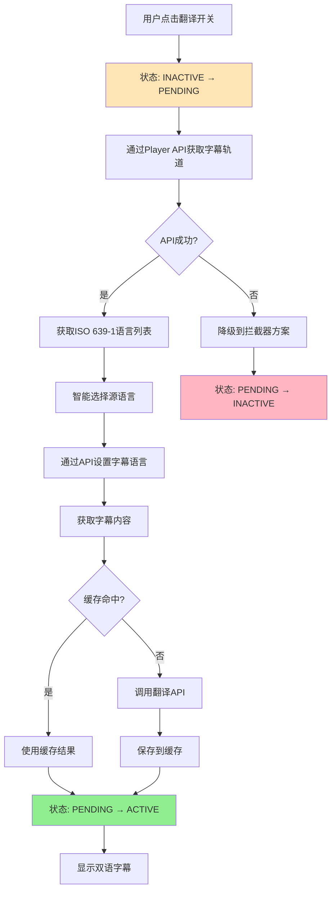
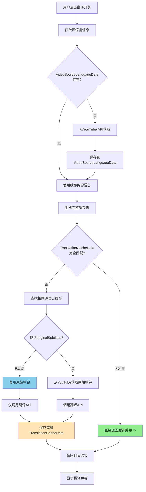

# YouTube字幕翻译流程

本文档详细说明字幕翻译扩展中，从用户点击翻译开关到完成字幕翻译显示的完整流程。

## 概述

字幕翻译流程分为以下几个主要阶段：

1. 翻译开关触发与3状态管理（INACTIVE → PENDING → ACTIVE）
2. YouTube Player API字幕轨道获取（ISO 639-1标准）
3. 智能源语言选择与缓存优先策略
4. 字幕翻译与两层缓存机制
5. 字幕显示与实时更新



## 1. 翻译开关触发与状态管理

### 1.1 UI交互触发

- 用户点击YouTube播放器控制栏中的翻译按钮
- `ControlPanel`通过MessageBus发送`toggleTranslate`消息
- 使用3状态系统管理翻译状态
- 立即设置PENDING状态，防止重复点击

```typescript
// 实际代码 - ControlPanel中的翻译按钮点击处理
private async handleTranslateButtonClick(event: MouseEvent): Promise<void> {
  event.stopPropagation();
  
  // 发送切换消息到Service Worker
  const response = await chrome.runtime.sendMessage({
    type: 'toggleTranslate',
    data: { trigger: 'button_click' }
  });
  
  // UI会通过状态变更消息自动更新
}
```

### 1.2 状态更新与持久化

- `UIManager.setTranslateActive()`方法处理状态更新
- 更新按钮图标和提示文本
- 将状态保存到`chrome.storage.local`
- 更新侧边栏显示参数
- 当状态为激活时，触发`translation:start_requested`事件

```typescript
// 实际代码 - Service Worker中的3状态管理
async function handleToggleTranslate(message: any, sender: any) {
  const currentState = await runtimeStateManager.getTranslateState();
  
  // 3状态转换逻辑
  if (currentState === TranslateActiveState.INACTIVE) {
    // Step 1: 设置PENDING状态
    await runtimeStateManager.setTranslateState(TranslateActiveState.PENDING);
    
    // Step 2-5: 执行翻译流程
    const success = await executeTranslation(sender.tab.id);
    
    // Step 6: 根据结果设置最终状态
    if (success) {
      await runtimeStateManager.setTranslateState(TranslateActiveState.ACTIVE);
    } else {
      await runtimeStateManager.setTranslateState(TranslateActiveState.INACTIVE);
    }
  } else if (currentState === TranslateActiveState.ACTIVE) {
    // 关闭翻译
    await runtimeStateManager.setTranslateState(TranslateActiveState.INACTIVE);
  }
  // PENDING状态下忽略点击
}
```

### 1.3 PENDING状态超时机制

- PENDING状态设置5秒超时保护
- 超时后自动回退到INACTIVE状态
- 防止因异常导致的状态卡死
- 确保系统始终可恢复

```typescript
// 实际代码 - PENDING超时处理
if (translateActive === TranslateActiveState.PENDING) {
  // 设置5秒超时
  setTimeout(async () => {
    const currentState = await runtimeStateManager.getTranslateState();
    if (currentState === TranslateActiveState.PENDING) {
      console.warn('[service-worker] PENDING状态超时，回退到INACTIVE');
      await runtimeStateManager.setTranslateState(TranslateActiveState.INACTIVE);
    }
  }, 5000);
}
```

## 2. YouTube Player API与字幕获取

### 2.1 YouTube Player API集成

系统通过YouTube Player API直接控制字幕，使用ISO 639-1标准语言代码：

```typescript
// main-world.ts中的SubtitleAPIController
class SubtitleAPIController {
  private player: any;
  private captionsModule: string = 'captions';
  
  async getAvailableTracks(): Promise<any[]> {
    const tracks = this.player.getOption(this.captionsModule, 'tracklist');
    return tracks.map(track => ({
      languageCode: track.languageCode,  // ISO 639-1代码
      languageName: track.languageName,
      kind: track.kind,  // 'asr'表示自动生成
      isDefault: track.is_default
    }));
  }
  
  async setSubtitleTrack(langCode: string): Promise<boolean> {
    this.player.setOption(this.captionsModule, 'track', {
      languageCode: langCode  // 使用ISO 639-1
    });
    return true;
  }
}
```

> **备注（v5.24.12+）**  
> - `getAvailableTracks()` 仅作为 Service Worker 兜底调用的实现，主流程优先依赖 `playerResponse.captionTracks`。  
> - `setSubtitleTrack()` 不再同步校验 tracklist，确保与 Service Worker 的“单一验证入口”策略一致；若轨道缺失，YouTube 会静默失败，Service Worker 会在后续阶段走字幕按钮兜底。

### 2.2 优化后的缓存检查策略（基于原始字幕复用）

系统实现了优化的缓存架构，核心优势是**原始字幕只需获取一次**：

**数据获取优先级**：
1. **P0: TranslationCacheData完全命中** → 缓存键完全匹配（包含model/temperature），直接返回
2. **P1: TranslationCacheData部分命中** → 源语言相同但服务参数不同，复用originalSubtitles，仅需翻译
3. **P2: VideoSourceLanguageData命中** → 有源语言选择记录，需获取字幕并翻译  
4. **P3: 完全未命中** → 从YouTube API获取所有数据

**关键优化**：
- **原始字幕复用**：TranslationCacheData包含originalSubtitles，切换服务无需重新获取
- **精确缓存匹配**：缓存键包含service type、model、temperature等所有影响翻译结果的参数
- **智能降级**：从P0到P3逐级降级，最大化利用已有数据



### 2.3 执行流程（Service Worker中的10步骤）

完整的翻译执行流程在 Service Worker 中实现，当前（v5.24.12+）关键步骤如下：

```typescript
// Step 1: 设置 PENDING 状态
await runtimeStateManager.setTranslateState(TranslateActiveState.PENDING);

// Step 2: 读取翻译偏好与缓存
const preferences = await userPreferencesManager.getUserPreferences();
const sourceCache = await videoSourceLanguageCacheManager.get(videoId);

// Step 3: 判断广告状态（新增 Stage 0）
const adStatus = await sendMessageWithSignal(tabId, { type: 'checkPlayerAdState' }, signal);
if (adStatus?.isAdPlaying) {
  throw new Error('ad_playing');
}

// Step 4: 获取字幕轨道（单一入口，带 requestId）
const trackResponse = await session.executeStage('get_tracks', async (signal) => {
  const requestId = `get_tracks_${Date.now()}_${Math.random().toString(36).slice(2, 8)}`;

  // 3.1 首选 playerResponse.captionTracks
  const fromPlayerResponse = await sendMessageWithSignal(tabId, {
    type: 'getVideoTrackData',
    videoId,
    _requestId: requestId
  }, signal);

  if (fromPlayerResponse?.success && fromPlayerResponse.tracks?.length) {
    return { ...fromPlayerResponse, trackSource: 'playerResponse', requestId };
  }

  // 3.2 兜底 Player API tracklist
  const fromPlayerApi = await sendMessageWithSignal(tabId, {
    type: 'getSubtitleTracksAPI',
    _requestId: requestId
  }, signal);

  return { ...(fromPlayerApi ?? fromPlayerResponse ?? {}), requestId, trackSource: 'playerApi' };
}, { timeoutMs: 15000 });

// Step 5: 智能选择源语言 + 缓存写入
const sourceTrack = selectBestSourceLanguage(trackResponse.tracks, preferences.targetLang, sourceCache?.selectedSourceTrack);
await videoSourceLanguageCacheManager.set({ videoId, ...sourceTrackMetadata });

// Step 6: 设置字幕轨道（只负责执行，不再重复校验）
await sendMessageWithSignal(tabId, {
  type: 'setSubtitleTrackAPI',
  langCode: sourceTrack.languageCode,
  kind: sourceTrack.kind
}, session.createStageSignal('set_track', 5000));

// Step 7: 获取字幕内容 → 翻译 → 写入缓存 → 设置 ACTIVE 状态
```

**核心变化（对比 v5.24.10 以前的流程）**

- Service Worker 在真正发起轨道请求前，会先判断广告状态；广告播放中直接抛出 `ad_playing`，翻译按钮保持 inactive。
- Service Worker 是**唯一**获取/验证轨道的层级，先访问 `playerResponse`，不足时再落到 Player API；所有请求共享 `_requestId + videoId`，并受 `AbortController` 统一管理。
- Content Script 在收到响应时会校验 `_requestId` 与当前 `videoId`：若用户已跳到下一条视频，则忽略并向 Service Worker 返回 `video_changed`，避免 “下一条视频吃到上一条轨道”。
- Main World 的 `SubtitleAPIController.setSubtitleTrack` 只负责 `setOption`，不再同步等待 `tracklist` 加载；tracklist 验证已经在 Service Worker 完成。
- 所有轨道与翻译缓存依旧以 Service Worker 为单一写入者，UI/Content Script 仅消费。

### 2.4 语言冲突解决策略

当检测到 `sourceLang = targetLang` 时，系统采用**基于轨道检测 + 智能替换的组合策略**：

**通用冲突降级与用户引导流程**（适用于所有 sourceLang = targetLang 场景）：

1. **初始化与目标语言确定**  
   - targetLang 由 UI 语言或用户选择确定  
   - translateActive 保持可用  

2. **获取并分类轨道**  
   - 从 Content Script 获取 `CaptionTrack[]`，按以下四组分类：  
     - A：非 targetLang & 非 ASR（手动外语或其他语言）  
     - B：非 targetLang & ASR（自动外语或其他语言）  
     - C：targetLang & 非 ASR（手动同语字幕）  
     - D：targetLang & ASR（自动同语字幕）  

3. **自动选取 sourceLang**  
   - 若 A 非空 → 取 A[0]；  
   - 否则若 B 非空 → 取 B[0]；  
   - 否则若 C 非空 → 取 C[0]；  
   - 否则 D 非空 → 取 D[0]；  
   - 若选到 C 或 D，则进入"仅有同语种轨道"降级模式  

4. **Side Panel 目标语言框提示**  
   - 在目标语言输入框显示灰色 placeholder：  
     "仅有 {语言名} 字幕，请先选择目标语"  

5. **视频页面 Overlay 持续提示**  
   - 在字幕覆盖层渲染提示：  
     "【字幕提示】本视频仅有 {语言名} 字幕，打开翻译设置选择目标语言。"  
   - 原文字幕正常显示，翻译文本区保持空白或隐藏  

6. **用户手动切换目标语言**  
   - 用户在侧边栏选择非 targetLang 后：  
     - placeholder 与提示同时消失；  
     - 正常执行翻译并渲染双语或目标语言字幕  

7. **缓存与复用**  
   - 后台缓存 videoId + 最终 targetLang 和 sourceLang，下次直接使用，无需再次触发降级提示

### 2.4 统一的源语言选择规则系统

系统采用统一的源语言选择规则，使用ISO 639-1标准代码：

**规则优先级：**
1. **用户历史选择** - 优先使用用户上次选择的源语言
2. **英语优先原则** - 非英语目标时优先选择英语（en）
3. **手动字幕优先** - kind !== 'asr'的轨道优先
4. **降级策略** - 选择第一个可用轨道

```typescript
// 实际代码 - service-worker.ts中的源语言选择
function selectBestSourceLanguage(
  tracks: Array<{ languageCode: string; kind?: string }>,
  targetLang: string,
  lastSelectedLanguage?: string
): string {
  // 规则1: 用户历史选择
  if (lastSelectedLanguage) {
    const found = tracks.find(t => t.languageCode === lastSelectedLanguage);
    if (found) return lastSelectedLanguage;
  }
  
  // 准备数据
  const manualTracks = tracks.filter(t => t.kind !== 'asr');
  const asrTracks = tracks.filter(t => t.kind === 'asr');
  
  // 规则2+3: 英语优先 + 手动字幕优先
  if (!targetLang.startsWith('en')) {
    // 查找英语轨道
    const englishManual = manualTracks.find(t => 
      t.languageCode === 'en' || t.languageCode === 'en-US'
    );
    if (englishManual) return englishManual.languageCode;
    
    const englishAsr = asrTracks.find(t => 
      t.languageCode === 'en' || t.languageCode === 'en-US'
    );
    if (englishAsr) return englishAsr.languageCode;
  }
  
  // 规则3: 手动字幕优先
  if (manualTracks.length > 0) {
    return manualTracks[0].languageCode;
  }
  
  // 规则4: 降级到第一个可用轨道
  return tracks[0]?.languageCode || 'en';
}
```

#### 2.5.2 目标语言匹配

- 检查是否有匹配目标语言的原生轨道
- 如果有，可以直接使用原生字幕，无需翻译
- 处理语言变体（如 zh-CN、zh-TW 都视为中文）

### 2.6 统一缓存消息接口

系统定义了标准化的缓存操作消息格式：

```typescript
// 翻译配置获取
{ type: 'getTranslationConfig', data: { videoId: string, payload?: any } }

// 缓存检查  
{ type: 'checkTranslationCache', data: { videoId: string, params: TranslationParams } }

// 缓存保存
{ type: 'saveTrackCache', data: { videoId: string, tracks: CaptionTrack[] } }
{ type: 'saveTranslationCache', data: { videoId: string, params: TranslationParams, result: TranslationResult } }

// 轨道获取（Popup专用）
// ⚠️ 注意：v5.24.11+ 已废弃，Popup改用 'getPopupInitData' 消息获取完整上下文数据
{ type: 'getAvailableTracks', data: { videoId: string } }  // @deprecated
```

### 2.7 字幕数据获取

- 调用`fetchSubtitleData`获取源语言轨道的字幕内容
- 解析XML/JSON格式的字幕数据
- 转换为标准化的字幕事件数组
- 每个字幕事件包含开始时间、结束时间和文本内容
- **通过Background保存到内存缓存** - 提高后续访问效率

## 3. 翻译调度与优先级处理

### 3.1 处理路径分支

如果找到匹配的目标语言轨道：
- 获取目标语言轨道的字幕数据
- 分别显示源语言和目标语言字幕，不进行字幕合并。源语言在上，目标语言在下

如果没找到匹配的目标语言轨道，则进行缓存匹配：
- 获取视频ID、源语言、目标语言、翻译API、翻译模型
- 进行缓存字幕五位一体匹配

如果没有匹配到缓存，需要翻译（无匹配目标语言轨道）：
- 创建翻译上下文(`TranslationContext`)
- 包含视频ID、源事件、源语言、目标语言等信息
- 初始化`TranslationDispatcher`并启动渐进式翻译

### 3.2 渐进式翻译策略（2025年9月优化版）

#### 3.2.1 核心原则
- **紧急优先**：当前播放位置上下文（5-10条）立即翻译并显示
- **顺序批量**：剩余字幕按30-50条分批顺序翻译
- **智能断句**：考虑句子边界，避免切断语义
- **渐进更新**：每批完成后立即更新显示
- **延迟存储**：全部完成后才保存到localStorage

#### 3.2.2 优先级分组
```typescript
function getUrgentSubtitles(subtitles, currentTime, count = 7) {
  const currentIndex = subtitles.findIndex(s => 
    currentTime >= s.start && currentTime <= s.end
  );
  
  // 获取当前位置前3条，后4条（共7条）
  const start = Math.max(0, currentIndex - 3);
  const end = Math.min(subtitles.length, currentIndex + 4);
  
  return subtitles.slice(start, end);
}
```

#### 3.2.3 智能断句策略
```typescript
function smartBatchSplit(subtitles, targetSize = 40) {
  const batches = [];
  let currentBatch = [];
  
  for (let i = 0; i < subtitles.length; i++) {
    const subtitle = subtitles[i];
    currentBatch.push(subtitle);
    
    // 判断是否应该结束当前批次
    const shouldSplit = 
      // 句子结束标点（优先级最高）
      subtitle.text.match(/[.!?。！？;；]$/) ||
      // 达到目标大小且下一条是新句子开头
      (currentBatch.length >= targetSize && 
       subtitles[i+1]?.text.match(/^[A-Z\u4e00-\u9fa5]/)) ||
      // 时间间隔大于2秒（可能是话题转换）
      (subtitles[i+1] && subtitles[i+1].start - subtitle.end > 2) ||
      // 超过最大限制（容错）
      currentBatch.length >= targetSize + 5;
    
    // 批次大小在合理范围内才分割
    if (shouldSplit && currentBatch.length >= targetSize - 5) {
      batches.push(currentBatch);
      currentBatch = [];
    }
  }
  
  // 处理剩余
  if (currentBatch.length > 0) {
    batches.push(currentBatch);
  }
  
  return batches;
}
```

### 3.3 翻译请求管理

- 为每个优先级组创建翻译请求
- 生成唯一请求ID
- 将请求添加到`TranslationDispatcher`的请求队列
- 按照优先级和提交时间排序处理请求

## 4. 字幕翻译与缓存机制

### 4.1 缓存查询

- 根据视频ID、目标语言和翻译API类型生成缓存键
- 通过`SubtitleCacheManager`查询缓存
- 检查缓存是否包含所有需要翻译的字幕

缓存查询结果处理：
- 全部命中：直接使用缓存的翻译结果
- 部分命中：只翻译缓存中缺失的部分
- 完全未命中：翻译全部字幕

### 4.2 翻译执行（优化版）

#### 4.2.1 顺序批量翻译流程
```typescript
async function progressiveTranslate(subtitles, currentTime) {
  const translationResults = new Map(); // 临时存储结果
  
  // Step 1: 紧急翻译（前9后30共40条）
  const urgent = getUrgentSubtitles(subtitles, currentTime, 40);
  const urgentBatch = smartBoundary(urgent);
  const urgentResults = await translateBatch(urgentBatch);
  
  // 立即显示紧急翻译结果
  displayImmediately(urgentResults);
  translationResults.set('urgent', urgentResults);
  
  // Step 2: 顺序批量翻译剩余部分
  const remaining = getRemainingSubtitles(subtitles, urgent);
  const batches = smartBatchSplit(remaining, 40); // 40条一批
  
  for (let i = 0; i < batches.length; i++) {
    console.log(`[翻译] 处理批次 ${i+1}/${batches.length}`);
    
    // 翻译当前批次
    const batchResult = await translateBatch(batches[i]);
    
    // 每批完成后立即组合并更新显示（渐进式）
    translationResults.set(`batch_${i}`, batchResult);
    const combined = combineAllResults(translationResults);
    updateSubtitleDisplay(combined);
    
    // 小延迟避免API限流（200ms）
    if (i < batches.length - 1) {
      await sleep(200);
    }
  }
  
  // Step 3: 全部完成后才存储到localStorage
  console.log('[翻译] 所有批次完成，保存到local storage');
  await saveToLocalStorage(translationResults);
}
```

#### 4.2.2 批量翻译API调用

**分隔符问题解决方案**：
- 使用Unicode私有区域字符（`\uE000-\uF8FF`）作为分隔符
- Google API保证不翻译这些字符
- 避免当前`\n---SEPARATOR---\n`被翻译或格式改变的问题

```typescript
async function translateBatch(texts, sourceLang, targetLang) {
  // 使用Unicode私有区域字符作为分隔符（不会被翻译）
  const MAGIC_SEPARATOR = '\uE000\uE001\uE002';
  
  // 合并文本
  const combinedText = texts.join(MAGIC_SEPARATOR);
  
  // 调用Google Translate API
  const params = new URLSearchParams({
    client: 'gtx',
    sl: sourceLang,
    tl: targetLang,
    dt: 't',
    q: combinedText
  });
  
  const response = await fetch(
    `https://translate.googleapis.com/translate_a/single?${params}`
  );
  
  const data = await response.json();
  let translatedText = '';
  
  // 解析翻译结果
  if (data && data[0]) {
    data[0].forEach(item => {
      if (item[0]) translatedText += item[0];
    });
  }
  
  // 使用相同分隔符分割结果
  return translatedText.split(MAGIC_SEPARATOR);
}
```

#### 4.2.3 翻译服务选择
- **Google翻译**：使用Unicode分隔符批量处理
- **OpenAI翻译**：使用`\n---\n`分隔符（API能正确处理）
- **微软翻译**：支持JSON数组格式批量请求
- **其他服务**：根据API特性选择合适方案

### 4.3 缓存更新（优化版）

#### 4.3.1 延迟存储策略
- **不再实时存储**：避免频繁IO操作
- **全部完成后存储**：一次性写入localStorage
- **内存缓存**：翻译过程中使用Map临时存储

```typescript
async function saveToLocalStorage(translationResults) {
  // 组合所有翻译结果
  const fullTranslation = {
    videoId: getCurrentVideoId(),
    timestamp: Date.now(),
    subtitles: combineAllResults(translationResults),
    metadata: {
      sourceLang: detectSourceLang(),
      targetLang: getTargetLang(),
      translationService: getService(),
      totalSubtitles: getTotalCount(),
      batchCount: translationResults.size
    }
  };
  
  // 一次性保存到localStorage
  await chrome.storage.local.set({
    [`translation_${fullTranslation.videoId}`]: fullTranslation
  });
  
  console.log('[缓存] 翻译结果已保存', {
    videoId: fullTranslation.videoId,
    subtitleCount: fullTranslation.subtitles.length
  });
}
```

#### 4.3.2 缓存管理
- 使用`TranslationCacheManager`统一管理
- 实现LRU（最近最少使用）策略
- 缓存键：`videoId + sourceLang + targetLang + service`
- 缓存过期：7天自动清理

## 5. 字幕显示与更新

### 5.1 字幕数据合并

- 合并源字幕和翻译文本
- 创建`ProcessedSubtitleEvent`对象数组
- 保留时间信息和语言代码
- 准备用于显示的字幕对象

```typescript
// 伪代码示例 - 合并字幕数据
function mergeSubtitleData(sourceEvents, translations, sourceLang, targetLang) {
  return sourceEvents.map(event => ({
    start: event.start,
    end: event.end,
    sourceText: event.text,
    targetText: translations[event.id] || null,
    sourceLangCode: sourceLang,
    targetLangCode: targetLang
  }));
}
```

### 5.2 字幕显示层

- 创建字幕覆盖层（如果尚未创建）
- 定位在YouTube播放器的底部
- 设置适当的样式和z-index确保可见
- 阻止鼠标事件传递（pointerEvents: 'none'）

### 5.3 字幕实时同步

- 添加视频`timeupdate`事件监听器
- 在事件处理函数中筛选当前时间应显示的字幕
- 更新字幕叠加层的内容
- 支持双语显示模式（翻译文本在上，原文在下）

```typescript
// 伪代码示例 - 字幕更新处理
function handleSubtitleUpdate(currentTime) {
  const currentSubtitles = subtitles.filter(
    sub => currentTime >= sub.start && currentTime <= sub.end
  );
  
  if (currentSubtitles.length > 0) {
    displaySubtitles(currentSubtitles);
  } else {
    hideSubtitles();
  }
}
```

### 5.4 字幕样式

- 支持自定义字体大小、颜色和背景
- 区分源语言和目标语言的样式
- 为字幕提供半透明背景，提高可读性
- 适应播放器尺寸变化

## 6. 错误处理

### 6.1 错误检测点

主要错误检测点包括：
- 字幕轨道获取失败
- 字幕数据解析失败
- 源语言或目标语言轨道未找到
- 翻译API请求失败
- 翻译结果处理失败

### 6.2 异常处理策略

> 📅 **更新**: 2025-10-07 - 分级失败处理策略

#### 6.2.1 失败处理原则

- **紧急翻译失败**：警告但继续流程
- **批量翻译失败**：立即中断并报错
- **明确反馈**：所有失败都告知用户
- **快速恢复**：按钮立即恢复，可重试

#### 6.2.2 具体实现

```typescript
// 紧急翻译配置（有fallback）
{
  timeoutMs: 30000,
  fallback: []  // 失败返回空，继续批量
}

// 批量翻译配置（无fallback）
{
  timeoutMs: batchTotalTimeout
  // 不设置fallback，让错误向上抛出
}
```

#### 6.2.3 用户提示

- **紧急失败**：显示"快速翻译失败，正在执行完整翻译..."（5秒警告）
- **批量失败**：显示"翻译失败：第X/Y批次 - 原因，请重试"（5秒错误）
- **按钮状态**：失败后自动恢复到INACTIVE，可立即重试

### 6.3 翻译API故障转移

- 实现翻译API双路径调用机制
- 路径A失败时自动尝试路径B
- 记录详细的失败信息供调试
- 不再使用重试机制，采用Fail Fast策略

## 7. 翻译停止处理

### 7.1 用户触发停止

- 用户再次点击翻译按钮
- 设置`translateActive`为`TranslateActiveState.INACTIVE`
- 发送`translation:stop_requested`消息
- 更新UI状态

### 7.2 资源清理

- 移除字幕覆盖层
- 取消未处理的翻译请求
- 清除事件监听器
- 重置内部状态

### 7.3 自动停止场景

以下情况会自动停止翻译：
- 导航到新视频/页面
- 发生严重错误无法恢复
- 无法找到合适的字幕轨道
- 批量翻译任何批次失败（不再有部分成功的情况）

## 8. 最佳实践和优化

### 8.1 性能优化

- 使用缓存减少重复翻译
- 渐进式翻译提高响应速度
- 限制DOM操作频率
- 异步处理避免阻塞主线程

### 8.2 用户体验优化

- 提供清晰的翻译状态指示
- 显示错误信息但保留原字幕
- 支持自定义字幕样式
- 平滑过渡字幕更新

### 8.3 API使用优化

- 遵守API速率限制
- 实现智能批处理
- 请求间隔和指数退避
- 错误重试机制

---

**📋 文档维护**: 2025-09-02  
**🔄 版本**: v3.0.0  
**📍 状态**: 翻译流程文档已更新  
**🔄 流程版本**: 基于3状态系统和YouTube Player API的完整翻译流程  
**✨ 主要更新**:  
- 使用MessageBus替代EventBus
- 集成YouTube Player API (ISO 639-1)
- 3状态系统 (INACTIVE/PENDING/ACTIVE)
- PENDING状态5秒超时机制
- 智能源语言选择规则 
