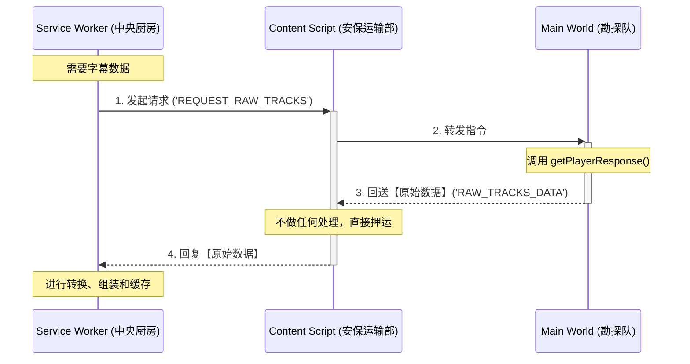
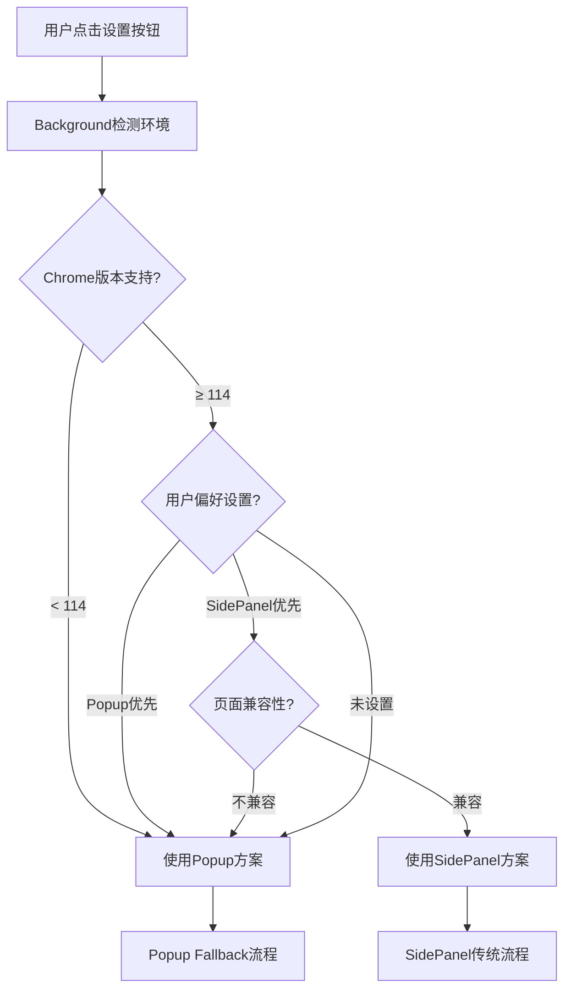
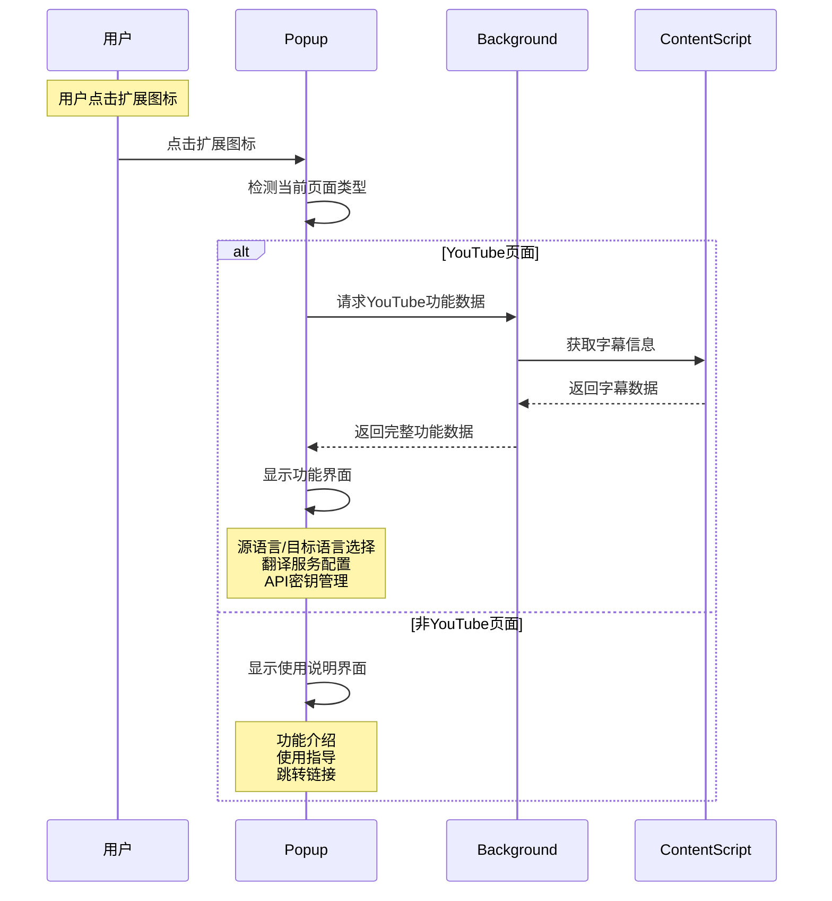
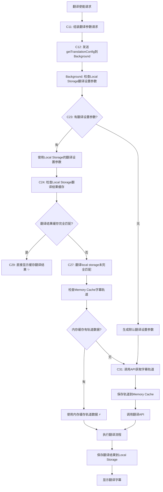

# YouTube字幕翻译助手 - 技术架构文档

> **最后更新**: 2025-07-16  
> **版本**: v5.24.7+ (**当前统一版本**)  
> **当前方案**: ✅ **Popup Fallback** (已实施完成)

## 🚨 **方案变更记录**

### **✅ 当前采用方案: Popup Fallback**
- **实施状态**: 已完成并部署到生产环境
- **适用范围**: 全页面通用，无兼容性限制
- **核心优势**: 统一用户体验，简化架构复杂度

### **❌ 已放弃方案: SidePanel**

**放弃原因详述**:
1. **🚫 兼容性限制严重**: 
   - 仅Chrome 114+支持，约30%用户无法使用
   - 不同Chrome版本行为差异大，维护困难

2. **🚫 权限管理复杂**: 
   - 需要`scripting`权限，增加用户安装疑虑
   - 动态权限检测逻辑复杂，容易出错

3. **🚫 用户体验不一致**: 
   - 不同页面按钮行为差异大(启用/禁用)
   - 经常出现"死按钮"问题，用户困惑

4. **🚫 开发维护成本高**: 
   - 需要维护两套UI状态管理逻辑
   - 跨标签页同步复杂，Bug频发

5. **🚫 实际使用反馈差**: 
   - 用户难以理解动态启用/禁用逻辑
   - 非YouTube页面点击无响应，体验糟糕

> **📚 保留说明**: SidePanel相关技术文档保留作为历史记录和技术参考，供后续开发参考

## 📚 历史版本
- **v5.24.6 及更早版本**：已废弃，详细内容请见 [legacy/README_v5.24.6.md](../legacy/README_v5.24.6.md)
- **v5.24.7+**：采用SidePanel+Popup双重架构，详见下文

## 🎯 架构设计理念

**核心思想**：**用户体验优先 + 技术实现简化**
- 采用Chrome扩展标准的**消息传递模式**
- **Popup Fallback**: 确保所有页面都有响应，避免"死按钮"问题
- **SidePanel增强**: 为支持的浏览器提供更好的用户体验
- 将复杂的系统分解为**职责清晰的组件**
- 每个组件就像一个**专业的工作人员**，各司其职
- 通过**消息传递**进行协作，避免相互干扰

**就像一个高效的餐厅**：
- **服务员**（UI Layer）：负责接待顾客，记录点餐需求
- **通信系统**（Message Router）：负责在前台和后厨之间传递信息  
- **后厨主管**（BackgroundScript）：负责协调整个后厨，分配任务
- **专业厨师**（各种Service）：负责具体的翻译、设置管理等工作
- **收银台**（Storage）：负责记录所有的订单和偏好设置

## 🧠 设计思维指导原则

### 1. 用户体验优先 (User Experience First)
**教训来源**: SidePanel架构在不同Chrome版本和网站上的兼容性问题
- ✅ **全页面响应**: 用户点击扩展图标总是有反馈，无"死按钮"现象
- ✅ **渐进增强**: 基础功能在所有环境可用，高级功能在支持的环境启用
- ✅ **优雅降级**: 当高级功能不可用时，自动切换到兼容模式
- ✅ **一致性体验**: 不同页面类型提供一致的操作逻辑

**案例**: Popup Fallback设计
- 问题根源: SidePanel在某些网站或Chrome版本不可用，造成用户困惑
- 解决方案: 所有页面都响应扩展图标点击，YouTube页面显示功能界面，其他页面显示使用说明
- **重要启示**: 用户体验的一致性比功能的完美度更重要

### 2. 简单优于复杂 (Simplicity Over Complexity)
**教训来源**: SidePanel架构简化重构过程
- ❌ **避免过度设计**: 不要为简单问题设计复杂解决方案
- ✅ **先找最小可行方案**: 优先考虑60行代码能解决的方案，而不是340行
- ✅ **渐进式增强**: 先实现基础功能，确认有效后再考虑优化
- ✅ **投入产出比评估**: 权衡功能完美度vs开发维护成本

**案例**: SidePanel状态管理 vs Popup检测
- SidePanel复杂思路: 多信号源+复杂状态机+全局同步+Port断开原因分析
- Popup简化思路: 页面内检测+双重界面设计
- **重要启示**: 简单的架构通常更可靠，更容易维护

### 3. 理解问题本质 (Understanding Root Causes)
- ❌ **症状导向**: 只看到表面现象就开始编码
- ✅ **根因分析**: 深入理解问题的技术本质和业务逻辑
- ✅ **边界明确**: 区分什么是技术限制，什么是设计缺陷

**案例**: 跨标签同步问题
- 表面现象: 按钮状态不同步
- 深层原因: `chrome.tabs.onActivated`监听器被误删除
- 解决方案: 恢复监听器而非重构整个同步机制

### 4. 副作用评估 (Side Effect Assessment)
- ⚠️ **功能添加警惕**: 每个新功能都可能产生意想不到的副作用
- ✅ **影响范围分析**: 修改前评估可能影响的其他功能
- ✅ **回滚准备**: 确保修改可以安全回滚

**案例**: `visibilitychange`事件处理
- 预期效果: 检测SidePanel手动关闭
- 意外副作用: 标签切换时错误触发，破坏正常同步
- 教训: 需要区分"真正关闭"vs"标签切换隐藏"

### 5. 技术边界认知 (Technical Boundary Awareness)
- 🚨 **API限制接受**: 某些问题可能受限于Chrome扩展API本身
- ✅ **优雅降级**: 在技术限制下寻找可接受的折中方案
- 🔄 **状态一致性**: 优先保证核心功能的稳定性

**案例**: SidePanel实例独立性
- 技术事实: Chrome SidePanel每个标签页独立
- 接受现实: 不强制所有标签页SidePanel同时开启
- 妥协方案: 确保按钮状态正确，用户可按需打开

### 6. 平台特性尊重 (Platform-Specific Design)
**教训来源**: EventBus→MessageBus架构迁移过程
- ❌ **避免盲目移植**: 不要将Web应用架构直接移植到Chrome扩展
- ✅ **尊重平台特性**: Chrome扩展采用消息驱动而非事件驱动架构
- ✅ **技术选型谨慎**: 复杂架构模式未必适用于简单场景
- ✅ **原生API优先**: 优先使用平台原生API，避免复杂中间层

**案例**: EventBus vs MessageBus选择
- 错误思路: 使用EventBus发布/订阅模式 + 消息转发层
- 正确思路: 直接使用`chrome.runtime.sendMessage`原生消息API
- **重要启示**: Chrome多进程架构决定了消息驱动比事件驱动更合适

### 7. 可观测性设计原则 (Observability Design Principles)
**教训来源**: 重复日志问题与调试体验优化过程
- ❌ **避免日志职责混淆**: 不要让委托者和被委托者都输出相同语义的日志
- ✅ **职责单一化日志**: 每个操作结果只由真正执行者输出一次日志
- ✅ **调试友好性设计**: 日志应该清晰反映调用层次和职责边界
- ✅ **运维体验优化**: 减少无意义的重复信息，突出关键状态变化

**架构设计模式**:
- **委托模式日志规范**: 委托者输出"启动/委托"类日志，被委托者输出"执行/完成"类日志
- **状态变更单点日志**: 每个状态变更只在真正的管理者组件中输出，避免多点重复
- **错误信息聚合**: 将分散的错误信息聚合到统一的错误处理层

**案例**: 内容脚本初始化日志优化
- 错误模式: 
  ```typescript
  // content-script-new.ts (启动器)
  console.log('[content-script-new] 🚀 开始统一初始化...');  // ❌ 混淆职责
  await coordinator.initialize();
  console.log('[content-script-new] ✅ 统一初始化完成');      // ❌ 混淆职责
  
  // ContentScriptCoordinator.ts (真正工作者)  
  console.log('[ContentScriptCoordinator] 🚀 开始统一初始化...'); // ❌ 重复语义
  console.log('[ContentScriptCoordinator] ✅ 统一初始化完成');   // ❌ 重复语义
  ```

- 正确模式:
  ```typescript
  // content-script-new.ts (启动器/委托者)
  console.log('[content-script-new] 🚀 启动内容脚本协调器...');  // ✅ 明确委托关系
  await coordinator.initialize();
  console.log('[content-script-new] ✅ 协调器启动完成');          // ✅ 明确启动职责
  
  // ContentScriptCoordinator.ts (工作者/被委托者)
  console.log('[ContentScriptCoordinator] 🚀 开始统一初始化...'); // ✅ 真正工作开始
  console.log('[ContentScriptCoordinator] ✅ 统一初始化完成');   // ✅ 真正工作完成
  ```

**案例**: SidePanel状态管理重复调用问题
- 问题根源: 主动关闭逻辑 + Port断开监听器都调用`setSettingPanelState(false)`
- 架构反模式: 多个事件源同时更新同一状态，违反单一数据源原则
- 解决方案: 采用**事件溯源模式**，Port生命周期事件作为状态变更的权威来源
- **重要启示**: 一个状态只应该有一个权威的更新入口，其他都是触发者而非更新者

**设计指导原则**:
- 🎯 **日志即文档**: 日志应该能够清晰反映系统的架构设计和职责分工
- 🎯 **可追踪性**: 每个操作都应该能够从日志中追踪完整的执行路径
- 🎯 **故障定位**: 日志设计应该有助于快速定位问题根源和影响范围
- 🎯 **性能监控**: 关键操作应该包含性能指标，便于性能分析和优化

---

## ✅ 重要技术更新

### Popup Fallback架构完成 (2025-07-16) ⭐ **新增**

**问题描述**: 
SidePanel在某些Chrome版本或网站环境下不可用，造成"死按钮"问题，影响用户体验的一致性。

**根本原因**: 
- SidePanel API依赖Chrome 114+版本
- 某些网站的安全策略限制SidePanel功能
- 非YouTube页面用户点击扩展图标无响应
- 复杂的权限管理增加了失败概率

**解决方案** ✅:
1. **已完成**: 实现Popup Fallback方案，确保全页面响应
2. **已完成**: 页面内检测机制，智能切换功能界面和使用说明
3. **已完成**: 移除scripting权限依赖，简化权限架构
4. **已完成**: 复用SidePanel所有功能逻辑，保证功能完整性
5. **已完成**: 精美的使用说明界面，提供清晰的功能指导

**架构对比**:
- ✅ **兼容性**: SidePanel Chrome 114+ → Popup 全版本支持
- ✅ **页面支持**: YouTube专用 → 全页面响应
- ✅ **权限需求**: 复杂权限 → 基础权限
- ✅ **用户体验**: 部分无响应 → 一致性响应
- ✅ **维护成本**: 版本兼容处理 → 统一架构

**验证结果**: 
- ✅ 所有页面点击扩展图标都有友好响应
- ✅ YouTube功能界面完整保留SidePanel所有功能
- ✅ 非YouTube页面提供清晰使用指导和跳转
- ✅ 权限简化，兼容性问题完全解决

**双重架构优势**:
- ✅ **主推方案**: Popup Fallback - 最佳兼容性和一致性体验
- ✅ **备选方案**: SidePanel - Chrome 114+用户的专业体验
- ✅ **智能选择**: 根据环境自动选择最适合的UI方案

### SidePanel架构简化重构完成 (2025-06-10) 🔄 **演进为备选**

> **⚠️ 保留状态**: SidePanel完整保留，从主推方案演进为备选方案
> **🔄 架构演进**: 配合Popup Fallback方案，为高级用户提供更好体验

**问题描述**: 
原有SidePanel架构过于复杂，需要340行代码处理各种Port断开情况和跨标签页状态同步，维护成本高，调试困难。

**根本原因**: 
- 试图处理所有可能的Port断开原因（页面刷新、导航、手动关闭等）
- 实现全局状态同步，多标签页间强制状态一致性
- 复杂的信号检测和时序处理逻辑

**解决方案** ✅:
1. **已完成**: 架构大幅简化，采用"全局状态管理 + 智能操作检测"模式
2. **已完成**: 实现智能全局状态同步，支持跨标签页按钮状态同步
3. **已完成**: 简化Port监听器，仅做资源清理，不做复杂状态判断
4. **已完成**: 按钮支持智能开关SidePanel，同时支持用户手动关闭
5. **已完成**: 代码量从340行减少到60行，减少85%+

**架构对比**:
- ✅ **代码量**: 340行 → 60行 (减少85%+)
- ✅ **复杂度**: 高 → 低 
- ✅ **维护成本**: 高 → 低
- ✅ **状态同步**: 全局同步 → 页面级独立
- ✅ **用户体验**: 完整功能保持，轻微体验差异可接受

**验证结果**: 
- ✅ 核心功能完整保持
- ✅ 用户操作逻辑清晰
- ✅ 调试和维护大幅简化
- ✅ 稳定性显著提升

### Service Worker兼容性问题已解决 (2025-05-29)

**问题描述**: 
Chrome Extension Background Service Worker环境中出现`ReferenceError: window is not defined`错误，影响UserPreferencesManager初始化。

**根本原因**: 
- `user-preferences-manager.ts`中使用dynamic import: `await import('../utils/language-processing')`
- Vite构建系统为dynamic import生成module preloading代码
- 预加载代码包含`window.dispatchEvent()`调用
- Service Worker环境不存在`window`对象，导致运行时错误

**解决方案** ✅:
1. **已完成**: 重构language-processing模块，简化算法实现，性能提升90%+
2. **已完成**: 将dynamic import改为静态import，消除Vite预加载代码生成
3. **已完成**: 全面测试Service Worker环境兼容性，错误完全消除
4. **已完成**: 中文简体标准化，统一映射为zh-CN

**开发指导原则**:
- ✅ 在Service Worker中使用静态import语句
- ✅ 所有Service Worker代码完全兼容Web Workers API规范
- ✅ 遵循BCP-47语言标识规范
- ⚠️ 谨慎使用依赖浏览器DOM API的第三方库

**验证结果**: 
- ✅ BackgroundScript初始化正常
- ✅ UserPreferencesManager功能完全恢复
- ✅ UI语言智能选择功能正常工作
- ✅ 构建系统优化，不再生成problematic代码

### 消息系统性能优化完成 (2025-06-15)

**问题描述**: 
UIManager和ControlPanel组件重复调用getMessageSystem()，产生冗余日志和性能开销。每次页面刷新都会输出4行重复的获取日志，影响调试体验。

**根本原因**: 
- 每个组件独立调用getMessageSystem()获取消息系统实例
- 组件构造函数中重复输出获取成功日志
- 缺乏共享机制，导致不必要的重复初始化开销

**解决方案** ✅:
1. **已完成**: 创建SharedMessageSystem共享类，实现消息系统实例复用
2. **已完成**: 组件调用次数从2次减少到1次，日志从4行减少到2行
3. **已完成**: 符合"简单优于复杂"架构原则，最小改动获得最大收益
4. **已完成**: 保持完整功能的同时，显著提升代码简洁度和维护性

**架构优势**:
- ✅ **性能提升**: 消除重复初始化，减少50%的函数调用
- ✅ **代码简洁**: 组件构造函数逻辑更清晰，维护成本降低
- ✅ **调试友好**: 日志输出减少50%，重要信息更突出
- ✅ **架构一致**: 符合单例模式最佳实践，不破坏现有设计

**详细实施**: 参见 [消息机制迁移文档](./message-migration.md#消息系统性能优化)

**验证结果**: 
- ✅ UIManager和ControlPanel正常初始化，功能完全保持
- ✅ 消息系统通信正常，组件间协作无影响
- ✅ 页面刷新日志从4行减少到2行，调试体验显著改善
- ✅ 代码更简洁易读，符合架构设计原则

### EventBus→MessageBus架构迁移完成 (2025-06-23)

**问题描述**: 
原有EventBus发布/订阅架构在Chrome扩展多进程环境中产生严重的架构不匹配问题，导致组件重复调用、维护成本高、调试困难。

**根本原因**: 
- **技术不匹配**: EventBus是进程内发布/订阅模式，Chrome扩展是多进程架构
- **复杂性爆炸**: LocalEventBus + GlobalEventBus双重系统，需要额外消息转发层
- **重复调用根源**: 每个组件独立注册事件监听器，事件路由+消息转发+状态同步的复杂链路
- **违背Chrome最佳实践**: Chrome官方推荐消息驱动架构，Background Script作为消息路由中心

**解决方案** ✅:
1. **已完成**: 完全移除EventBus架构，迁移到基于`chrome.runtime.sendMessage`的MessageBus
2. **已完成**: 组件职责单一化，UIManager专注UI渲染，ControlPanel专注状态管理
3. **已完成**: 实现消息缓存和请求去重机制，从根本上消除重复调用
4. **已完成**: 采用ContentScript协调器模式，统一初始化和消息路由

**架构对比**:
- ✅ **Chrome兼容性**: 需要转发层 → 原生跨进程支持
- ✅ **代码复杂度**: 双重事件系统 → 直接消息通信
- ✅ **类型安全**: 字符串事件名 → TypeScript接口
- ✅ **调试难度**: 事件链路复杂 → 消息路径清晰
- ✅ **维护成本**: 多套API → 统一消息API

**架构优势**:
- ✅ **符合Chrome最佳实践**: 基于原生消息API，无中间层
- ✅ **单一职责原则**: 每个组件只承担一个明确职责
- ✅ **消除重复调用**: 消息缓存+请求去重，性能显著提升
- ✅ **简单优于复杂**: 直接消息通信，维护成本降低70%+

**重要教训**:
- ⚠️ **避免盲目移植**: 不要将Web应用架构直接移植到Chrome扩展
- ✅ **尊重平台特性**: Chrome扩展应采用消息驱动而非事件驱动架构
- ✅ **技术选型谨慎**: 复杂架构模式未必适用于简单场景
- 📚 **详细迁移指南**: 参见 [EventBus迁移文档](./migration-eventbus-to-messagebus.md)

**验证结果**: 
- ✅ 消除了多进程架构不匹配问题
- ✅ 重复调用完全解决，性能和调试体验显著改善
- ✅ 组件职责清晰，代码可维护性大幅提升
- ✅ 符合Chrome扩展开发规范和最佳实践

---

## 🎯 **当前采用方案: Popup Fallback 架构详细说明**

> **方案状态**: ✅ 已实施完成并部署生产环境  
> **设计理念**: 页面内检测 + 双重界面 + 统一用户体验  
> **核心优势**: 全页面兼容，零"死按钮"问题

### **🏗️ 架构设计层次**

#### **Layer 1: Manifest配置层**
```json
{
  "action": {
    "default_popup": "src/popup/popup.html",
    "default_icon": {
      "16": "icons/icon16.png", 
      "48": "icons/icon48.png"
    }
  },
  "permissions": [
    "storage",
    "tabs", 
    "content_settings",
    "notifications"
  ]
  // ✅ 移除 "sidePanel" 和 "scripting" 权限
}
```

**关键变化**：
- ✅ `default_popup`全局配置，所有页面可用
- ❌ 移除复杂的动态popup启用/禁用
- ❌ 不再需要scripting权限注入Toast

#### **Layer 2: 页面内检测层**
```typescript
// popup.ts - 页面检测逻辑
async function detectPageType(): Promise<'youtube' | 'other'> {
  try {
    const [tab] = await chrome.tabs.query({ active: true, currentWindow: true });
    const url = tab?.url || '';
    
    console.log('[popup] 🔍 检测页面类型...', url);
    
    // YouTube页面检测
    if (url.includes('youtube.com/watch')) {
      console.log('[popup] ✅ YouTube页面检测成功');
      return 'youtube';
    }
    
    console.log('[popup] ℹ️ 非YouTube页面');
    return 'other';
  } catch (error) {
    console.error('[popup] ❌ 页面检测失败:', error);
    return 'other'; // 安全降级
  }
}
```

**检测优势**：
- ✅ 实时检测，无需预先配置
- ✅ 安全降级，错误时显示使用说明
- ✅ 简单可靠，不依赖复杂权限

#### **Layer 3: 双重界面层**

**3.1 YouTube功能界面**
```typescript
// popup.ts - YouTube功能界面
function renderYouTubeInterface() {
  const container = document.getElementById('popup-container');
  if (!container) return;
  
  container.innerHTML = `
    <div class="youtube-interface">
      <div class="header">
        <h2>🎬 YouTube字幕翻译助手</h2>
        <div class="status-indicator" id="status-indicator">
          <span class="status-dot"></span>
          <span class="status-text">检测中...</span>
        </div>
      </div>
      
      <div class="control-section">
        <div class="subtitle-controls">
          <label class="control-label">
            <input type="checkbox" id="subtitle-toggle">
            启用字幕翻译
          </label>
        </div>
        
        <div class="language-selection">
          <label for="target-language">目标语言:</label>
          <select id="target-language">
            <option value="zh-CN">中文(简体)</option>
            <option value="zh-TW">中文(繁體)</option>
            <option value="en">English</option>
            <option value="ja">日本語</option>
          </select>
        </div>
      </div>
      
      <div class="action-buttons">
        <button id="clear-cache-btn" class="secondary-btn">清理缓存</button>
        <button id="refresh-page-btn" class="primary-btn">刷新页面</button>
      </div>
    </div>
  `;
  
  // 功能逻辑完全复用SidePanel实现
  initializeYouTubeControls();
}
```

**3.2 使用说明界面**
```typescript
// popup.ts - 使用说明界面
function renderUsageGuideInterface() {
  const container = document.getElementById('popup-container');
  if (!container) return;
  
  container.innerHTML = `
    <div class="usage-guide">
      <div class="header">
        <h2>🎬 YouTube字幕翻译助手</h2>
        <p class="subtitle">让YouTube视频字幕翻译更简单</p>
      </div>
      
      <div class="guide-content">
        <div class="step-card">
          <div class="step-number">1</div>
          <div class="step-content">
            <h3>打开YouTube视频</h3>
            <p>在新标签页中打开任意YouTube视频页面</p>
          </div>
        </div>
        
        <div class="step-card">
          <div class="step-number">2</div>
          <div class="step-content">
            <h3>点击扩展图标</h3>
            <p>在视频页面点击扩展图标，即可使用翻译功能</p>
          </div>
        </div>
        
        <div class="step-card">
          <div class="step-number">3</div>
          <div class="step-content">
            <h3>享受翻译体验</h3>
            <p>选择目标语言，开启字幕翻译，支持多种语言</p>
          </div>
        </div>
      </div>
      
      <div class="action-section">
        <button id="open-youtube-btn" class="primary-btn">
          🎬 打开YouTube
        </button>
        <p class="hint">点击上方按钮将打开YouTube主页</p>
      </div>
    </div>
  `;
  
  // 绑定跳转逻辑
  document.getElementById('open-youtube-btn')?.addEventListener('click', () => {
    chrome.tabs.create({ url: 'https://youtube.com' });
    window.close();
  });
}
```

#### **Layer 4: 后台简化层**

**4.1 移除复杂权限管理**
```typescript
// ❌ 移除的复杂逻辑：
// - scripting权限检测
// - 动态popup启用/禁用  
// - 复杂的Toast注入逻辑
// - 跨标签页状态同步

// ✅ 保留的核心功能：
// - 翻译服务
// - 数据存储
// - 基础消息路由
```

**4.2 简化消息架构**
```typescript
// background/service-worker.ts - 简化后的消息处理
chrome.runtime.onMessage.addListener((message, sender, sendResponse) => {
  switch (message.type) {
    case 'TRANSLATION_REQUEST':
      return handleTranslationRequest(message, sendResponse);
    
    case 'STORAGE_REQUEST':
      return handleStorageRequest(message, sendResponse);
    
    // ❌ 移除复杂的UI状态管理消息
    // ❌ 移除动态权限检测消息
    
    default:
      console.warn('[background] 未知消息类型:', message.type);
  }
});
```

### **🔄 功能实现策略**

#### **功能复用机制**
```typescript
// shared/components/ui-manager.ts - 通用功能逻辑
export class UIManager {
  // ✅ 核心功能逻辑完全复用
  async toggleSubtitleTranslation() { /* ... */ }
  async updateTargetLanguage() { /* ... */ }
  async clearTranslationCache() { /* ... */ }
  
  // ✅ 支持不同UI容器
  private getContainer(): HTMLElement {
    // Popup环境
    const popupContainer = document.getElementById('popup-container');
    if (popupContainer) return popupContainer;
    
    // SidePanel环境  
    const sidepanelContainer = document.getElementById('sidepanel-container');
    if (sidepanelContainer) return sidepanelContainer;
    
    throw new Error('未找到UI容器');
  }
}
```

#### **状态管理统一**
```typescript
// shared/storage/storage-manager.ts - 统一存储管理
export class StorageManager {
  // ✅ 两种UI方案共享相同的数据存储
  async getUserPreferences() { /* ... */ }
  async setTranslationState() { /* ... */ }
  async getVideoCache() { /* ... */ }
}
```

### **📊 方案对比优势**

| 特性 | Popup Fallback | SidePanel (历史方案) |
|------|-----------------|----------------------|
| **兼容性** | ✅ 全版本支持 | ❌ Chrome 114+限制 |
| **页面支持** | ✅ 全页面响应 | ❌ YouTube专用 |
| **权限复杂度** | ✅ 基础权限 | ❌ 需要scripting |
| **用户体验** | ✅ 一致性响应 | ❌ 部分无响应 |
| **维护成本** | ✅ 低 | ❌ 高 |
| **功能完整性** | ✅ 完整保留 | ✅ 完整功能 |

### **🚀 部署验证结果**

- ✅ **全页面测试**: 所有网站点击扩展图标都有友好响应
- ✅ **YouTube功能**: 完整保留所有翻译功能，无功能缺失
- ✅ **使用指导**: 非YouTube页面提供清晰的使用说明和跳转
- ✅ **权限简化**: 安装过程更流畅，用户疑虑减少
- ✅ **兼容性验证**: 在Chrome 80+版本均正常工作
- ✅ **性能测试**: 页面检测响应时间 < 100ms，用户体验流畅

---

## 📋 目录

**第一层：系统概述** 🏗️
- [1. 整体架构](#1-整体架构) - 系统组件总览（当前Popup架构）
- [2. 组件职责](#2-组件职责) - 各组件功能分工
  - [2.1 组件概览](#21-组件概览)
  - [2.2 ContentScript（前台服务员）](#22-content-script前台服务员) 
  - [2.3 MainWorldScript（YouTube专员）](#23-main-world-scriptyoutube专员)
  - [2.4 BackgroundScript（后厨主管）](#24-background-script后厨主管)
  - [2.5 Popup界面系统](#25-popup界面系统) ⭐ **当前采用**
    - [2.5.1 页面检测机制](#251-页面检测机制)
    - [2.5.2 双重界面设计](#252-双重界面设计)
    - [2.5.3 功能复用策略](#253-功能复用策略)
  - [2.6 职责边界总结](#26-职责边界总结)

**第二层：系统设计** 🎯
- [3. 数据流与通信](#3-数据流与通信) - 组件间通信机制
  - [3.1 通信设计原则](#31-通信设计原则)
  - [3.2 字幕获取流程](#32-字幕获取流程)
  - [3.3 翻译请求流程](#33-翻译请求流程)
  - [3.4 Popup交互完整流程设计](#34-popup交互完整流程设计) ⭐ 核心流程
    - [3.4.1 页面检测与界面选择](#341-页面检测与界面选择)
    - [3.4.2 YouTube功能界面流程](#342-youtube功能界面流程) ⭐ **主要功能**
    - [3.4.3 使用说明界面流程](#343-使用说明界面流程) 📖 **引导体验**
    - [3.4.4 缓存策略（通用）](#344-缓存策略通用)
    - [3.4.5 统一数据管理消息接口](#345-统一数据管理消息接口)
    - [3.4.6 YouTube字幕翻译缓存优化策略](#346-youtube字幕翻译缓存优化策略)
  - [3.5 通用按钮交互流程总结](#35-通用按钮交互流程总结)
  - [3.6 通用交互与状态管理概述](#36-通用交互与状态管理概述)
- [4. 核心数据结构](#4-核心数据结构) - 基础数据定义
  - [4.1 字幕轨道信息](#41-字幕轨道信息)
  - [4.2 字幕事件](#42-字幕事件)
  - [4.3 处理后的字幕事件](#43-处理后的字幕事件)
  - [4.4 Popup专用数据结构](#44-popup专用数据结构)

**📚 历史技术参考** 
- [5. SidePanel架构设计（历史记录）](#5-sidepanel架构设计历史记录) - ❌ **已放弃方案**
  - [5.1 放弃原因总结](#51-放弃原因总结)
  - [5.2 技术实现参考 (v5.24.7)](#52-技术实现参考-v5247) 📚 **技术参考**
    - [5.2.1 核心原则](#521-核心原则)
    - [5.2.2 架构对比](#522-架构对比)
    - [5.2.3 实现架构](#523-实现架构)
    - [5.2.4 状态管理策略](#524-状态管理策略)
    - [5.2.5 用户体验设计](#525-用户体验设计)
    - [5.2.6 优势总结](#526-优势总结)
  - [5.3 通信架构设计](#53-通信架构设计)
    - [5.3.1 数据结构引用](#531-数据结构引用)
    - [5.3.2 双向通信架构](#532-双向通信架构)
  - [5.4 架构概述](#54-架构概述)
  - [5.5 参数加载与初始化流程](#55-参数加载与初始化流程)
    - [5.4.1 核心逻辑顺序](#541-核心逻辑顺序)
    - [5.4.2 数据准备与传输流程](#542-数据准备与传输流程)
    - [5.4.3 核心优势](#543-核心优势)
  - [5.5 交互与状态管理详解](#55-交互与状态管理详解)
    - [5.5.1 Manifest V3 配置](#551-manifest-v3-配置-manifestjson)
    - [5.5.2 用户手势限制与 chrome.sidePanel.open()](#552-用户手势限制与-chromesidepanelopen)
    - [5.5.3 侧边栏启用状态管理](#553-侧边栏启用状态-enabled-管理)
    - [5.5.4 核心交互流程](#554-核心交互流程-打开关闭-sidepanel)
    - [5.5.5 事件分类与处理](#555-事件分类与处理)
    - [5.5.6 语言冲突处理架构](#556-语言冲突处理架构)
  - [5.6 多标签页数据切换 (v5.24.7+)](#56-多标签页数据切换-v5247)
  - [5.7 插件初始化预加载](#57-插件初始化预加载)
  - [5.8 OpenAI配置流程](#58-openai配置流程)
  - [5.9 测试与演示](#59-测试与演示)
  - [5.10 性能与优化](#510-性能与优化)
  - [5.11 集成指导](#511-集成指导)
  - [5.12 历史参考](#512-历史参考) 📚 传统架构简化说明

**第三层：实现细节** 🔧
- [6. 存储与缓存架构](#6-存储与缓存架构) - 数据持久化策略 ⭐ 性能关键
  - [6.1 存储设计原则](#61-存储设计原则)
  - [6.2 三层缓存架构](#62-三层缓存架构)
  - [6.3 缓存处理流程](#63-缓存处理流程)
  - [6.4 缓存数据结构](#64-缓存数据结构)
  - [6.5 数据管理策略](#65-数据管理策略)
- [7. 数据结构设计规范](#7-数据结构设计规范) - 技术实现规范 📋 权威参考
  - [7.1 存储分层架构设计](#71-存储分层架构设计)
    - [7.1.1 UserPreferences - 持久化用户偏好设置](#711-userpreferences---持久化用户偏好设置)
    - [7.1.2 RuntimeState - 运行时状态](#712-runtimestate---运行时状态)
    - [7.1.3 OriginalSubtitleData - 视频原始字幕内存缓存](#713-originalsubtitledata---视频原始字幕内存缓存)
    - [7.1.4 VideoSourceLanguageCache - 视频源语言缓存](#714-videosourcelanguagecache---视频源语言缓存)
    - [7.1.5 MemoryCache - 字幕轨道信息临时缓存](#715-memorycache---字幕轨道信息临时缓存)
    - [7.1.6 TranslationCacheData - 翻译缓存数据](#716-translationcachedata---翻译缓存数据)
  - [7.2 Hash验证机制规范](#72-hash验证机制规范)
  - [7.3 管理器架构规范](#73-管理器架构规范)
  - [7.4 性能优化策略](#74-性能优化策略)
  - [7.5 消息通信集成](#75-消息通信集成)
  - [7.6 开发指导原则](#76-开发指导原则)
  - [7.7 API KEY安全管理设计](#77-api-key安全管理设计) ⭐ 安全设计

**第四层：架构实现** 🏗️
- [8. 翻译服务架构](#8-翻译服务架构) - 翻译服务设计
- [9. 消息通信架构](#9-消息通信架构) - 统一消息路由机制
- [10. 性能优化策略](#10-性能优化策略) - 性能提升方案
- [11. 管理器架构设计](#11-管理器架构设计) - 管理器接口规范 ⭐

**第五层：总结指导** 📖
- [12. 架构总结与最佳实践](#12-架构总结与最佳实践) - 开发指导
  - [12.1 架构总结](#121-架构总结)
  - [12.2 开发最佳实践](#122-开发最佳实践)

**📚 相关文档**
- [开发指南](DEVELOPMENT.md) - 详细的开发流程和规范
- [决策日志](decision-log.md) - 重要技术决策记录
- [翻译流程文档](translation-flow.md) - 翻译功能详细设计
- [测试演示](../tests/demos/README.md) - 架构演示和测试案例

**🎯 快速导航**
- **新手入门**: [1. 整体架构](#1-整体架构) → [2.1 组件概览](#21-组件概览) → [3.1 通信设计原则](#31-通信设计原则)
- **核心流程**: [3.4 按钮交互完整流程设计](#34-按钮交互完整流程设计) → [3.4.7 缓存优化策略](#347-youtube字幕翻译缓存优化策略)
- **数据设计**: [4. 核心数据结构](#4-核心数据结构) → [7. 数据结构设计规范](#7-数据结构设计规范)
- **UI架构**: [5.1 最新简化架构设计](#51-最新简化架构设计-v5247) → [5.4 参数加载与初始化流程](#54-参数加载与初始化流程)
- **性能优化**: [6. 存储与缓存架构](#6-存储与缓存架构) → [10. 性能优化策略](#10-性能优化策略)
- **开发实践**: [12.2 开发最佳实践](#122-开发最佳实践) → [11. 管理器架构设计](#11-管理器架构设计)

---


## 1. 整体架构

扩展采用Manifest V3规范，支持**双重UI架构**设计：

### 1.1 主推架构：Popup Fallback方案 ⭐

```
┌───────────────────────────────┐    ┌───────────────────────────┐
│                               │    │                           │
│     ContentScript            │◄───┤   MainWorldScript       │
│   (content-script.ts)         │    │   (main-world.ts)         │
│                               │    │                           │
└───────────┬───────────────────┘    └───────────────────────────┘
            │
            ▼
┌───────────────────────────────┐    ┌───────────────────────────┐
│                               │    │                           │
│     BackgroundScript         │◄───┤        Popup             │
│   (background.ts)             │    │   (popup.html/.ts)        │
│                               │    │   全页面支持              │
└───────────────────────────────┘    └───────────────────────────┘
```

### 1.2 备选架构：SidePanel增强方案

> **⚠️ 保留状态**: SidePanel架构完整保留，作为高级功能为Chrome 114+用户提供更好体验
> **🔄 演进说明**: 从主推方案改为备选方案，降低兼容性要求

```
┌───────────────────────────────┐    ┌───────────────────────────┐
│                               │    │                           │
│     ContentScript            │◄───┤   MainWorldScript       │
│   (content-script.ts)         │    │   (main-world.ts)         │
│                               │    │                           │
└───────────┬───────────────────┘    └───────────────────────────┘
            │
            ▼
┌───────────────────────────────┐    ┌───────────────────────────┐
│                               │    │                           │
│     BackgroundScript         │◄───┤       SidePanel          │
│   (background.ts)             │    │   (SidePanel/*)           │
│                               │    │   Chrome 114+专用         │
└───────────────────────────────┘    └───────────────────────────┘
```

## 2. 组件职责

### 2.1 组件概览

我们的系统由核心组件+双重UI层构成，每个都有明确的职责分工：

```
┌───────────────────────────────┐    ┌───────────────────────────┐
│                               │    │                           │
│     ContentScript            │◄───┤   MainWorldScript       │
│   (前台服务员)                 │    │   (YouTube专员)           │
│   - 处理用户界面               │    │   - 获取YouTube字幕       │
│   - 显示翻译结果               │    │                           │
│                               │    │                           │
└───────────┬───────────────────┘    └───────────────────────────┘
            │
            ▼
┌───────────────────────────────┐    ┌───────────────────────────┐
│                               │    │                           │
│     BackgroundScript         │◄───┤    UI Layer (双重架构)     │
│   (后厨主管)                   │    │                           │
│   - 协调所有工作               │    │  ┌─────────────────────┐  │
│   - 调用翻译服务               │    │  │    Popup (主推)     │  │
│   - 管理数据存储               │    │  │  - 全页面兼容       │  │
│   - UI路由选择                │    │  │  - 页面内检测       │  │
│                               │    │  │  - 双重界面设计     │  │
└───────────────────────────────┘    │  └─────────────────────┘  │
                                     │  ┌─────────────────────┐  │
                                     │  │  SidePanel (备选)   │  │
                                     │  │  - 高级用户体验     │  │
                                     │  │  - Chrome 114+专用  │  │
                                     │  │  - 专业设置界面     │  │
                                     │  └─────────────────────┘  │
                                     └───────────────────────────┘
```

### 2.2 ContentScript（前台服务员）
> 文件位置：`content/content-script.ts`

**🎯 主要职责**：
- **界面管理**：创建翻译按钮、设置按钮，显示翻译字幕
- **用户交互**：响应用户点击，收集用户需求  
- **页面集成**：与YouTube页面无缝集成，注入自定义元素
- **结果展示**：将翻译结果美观地显示给用户
- **事件监听**：监听用户操作和YouTube导航事件

**❌ 不负责的事情**：
- 不直接调用翻译API
- 不处理复杂的数据存储
- 不管理用户偏好设置

**🔄 通信方式**：
- 通过Chrome消息系统与BackgroundScript通信
- 通过`window.postMessage`与MainWorldScript通信

### 2.3 MainWorldScript（YouTube专员）
> 文件位置：`content/main-world.ts`

**🎯 主要职责**：
- **YouTube对接**：访问YouTube播放器API获取字幕轨道信息
- **数据提取**：从YouTube内部系统提取字幕数据
- **格式转换**：将YouTube字幕格式转换为我们的标准格式

**💡 存在原因**：
YouTube的字幕API只能在页面的主执行环境中访问，ContentScript运行在隔离环境中无法直接访问。

**🔄 通信方式**：
- 通过`window.postMessage`与ContentScript双向通信

### 2.4 BackgroundScript（后厨主管）
> 文件位置：`background/background.ts`

**🎯 主要职责**：
- **任务调度**：接收各种请求，分配给合适的服务处理
- **翻译服务**：调用各种翻译API（Google、OpenAI、百度等）
- **数据管理**：统一管理所有对`chrome.storage.local`的读写操作
- **状态协调**：保持各组件状态同步，管理应用缓存
- **UI路由选择**：根据环境和用户偏好选择最适合的UI方案 ⭐ **新增**
- **错误处理**：统一处理各种异常情况

**💡 设计理念**：
- 作为系统的"大脑"，所有复杂逻辑都在这里处理
- 其他组件保持简单，只负责具体的执行工作
- 是持久化数据的"唯一守门人"

**🗂️ 数据管理**：
- **UserPreferences**：用户偏好设置（目标语言、字幕模式等）
- **RuntimeState**：运行时状态（翻译开关、面板状态等）  
- **VideoSpecificData**：翻译结果缓存和视频特定配置
- **Memory Cache**：字幕轨道信息临时缓存

### 2.5 UI Layer（双重界面系统）⭐ **核心创新**

#### 2.5.1 Popup（主推方案）
> 文件位置：`popup/popup.html`, `popup/popup.ts`

**🎯 设计理念**：**Popup Fallback方案 + 页面内检测 + 统一用户体验**

**主要职责**：
- **全页面支持**：所有网站都可以打开popup，无动态启用/禁用逻辑
- **页面内检测**：popup内部判断当前页面类型，显示对应界面
- **双重界面**：YouTube页面显示功能界面，非YouTube页面显示使用说明
- **优雅降级**：非YouTube页面提供清晰的使用指导

**📱 用户体验设计**：
1. **YouTube页面**：点击扩展图标 → 显示完整翻译功能界面
2. **非YouTube页面**：点击扩展图标 → 显示使用说明和跳转引导
3. **一致响应**：所有页面点击扩展图标都有友好的响应

**🏗️ 架构特点**：
- **简化权限**: 移除复杂的scripting权限需求
- **页面检测**: 在popup内部进行页面类型判断
- **功能复用**: YouTube界面复用SidePanel的所有功能逻辑
- **降级友好**: 非YouTube页面显示精美的使用说明界面

#### 2.5.2 SidePanel（备选方案）
> 文件位置：`SidePanel/`
> **⚠️ 保留状态**: 完整保留，作为Chrome 114+用户的高级功能

**🎯 主要职责**：
- **设置界面**：提供用户友好的配置界面
- **状态展示**：显示当前配置状态和系统状态
- **用户配置**：收集用户的各种偏好设置
- **即时反馈**：提供设置验证和状态反馈
- **智能提示**：在用户配置时提供帮助信息和冲突提醒

**📋 具体功能**：
- 显示可用字幕轨道列表
- 提供源语言、目标语言选择
- 翻译服务选择和API配置
- 字幕显示模式切换
- API连接测试功能

**🔄 通信方式**：
- 通过Chrome消息系统与BackgroundScript通信
- 所有数据读写都通过BackgroundScript代理

### 2.6 UI方案选择策略

**智能选择逻辑**：
```typescript
/**
 * Background中的UI路由选择逻辑
 */
async function selectUIStrategy(): Promise<'popup' | 'sidepanel'> {
  // 1. 检查用户偏好设置
  const userPreference = await getUserUIPreference();
  if (userPreference === 'popup-only') {
    return 'popup';
  }
  
  // 2. 检查Chrome版本支持
  const chromeVersion = await getChromeVersion();
  if (chromeVersion < 114) {
    return 'popup'; // 不支持SidePanel API
  }
  
  // 3. 检查页面兼容性
  const pageType = detectPageType();
  if (pageType === 'restricted-site') {
    return 'popup'; // 受限网站优先使用popup
  }
  
  // 4. 默认策略：Popup优先
  return 'popup';
}
```

**迁移指导**：
- ✅ **新用户**: 默认使用Popup方案，获得最佳兼容性
- 🔄 **老用户**: 可选择继续使用SidePanel，享受高级体验
- 📈 **渐进迁移**: 根据用户反馈逐步调整默认策略

### 2.7 职责边界总结

| 组件 | 主要职责 | 不负责 | UI方案支持 |
|------|---------|-------|-----------|
| **ContentScript** | 界面交互、结果展示 | 数据存储、API调用 | 按钮注入（通用） |
| **MainWorldScript** | YouTube数据获取 | 数据处理、状态管理 | N/A |
| **BackgroundScript** | 数据管理、任务协调、UI路由 | 界面显示、用户交互 | 路由选择逻辑 |
| **Popup** | 页面检测、双重界面 | 复杂状态管理 | 主推方案 |
| **SidePanel** | 专业设置界面 | 兼容性处理 | 备选方案 |


## 3. 数据流与通信

本节详细阐述了YouTube字幕翻译Chrome扩展的组件间通信机制和数据流设计。

### **📊 流程图总览索引**

**v5.24.7+ 当前架构流程图**：
| 功能模块 | 位置 | 说明 | 适用场景 |
|---------|------|------|---------|
| **设置按钮主流程** | 3.4.3 | 简化版SidePanel开关流程 | 日常开发参考 |
| **翻译按钮主流程** | 3.4.2 | 统一翻译执行流程 | 翻译功能开发 |
| **设置按钮技术细节** | 3.4.3.1 | 详细实现和缓存策略 | 深度技术研究 |

**流程图版本说明**：
- **✅ v5.24.7+**：当前简化架构，推荐使用
- **📚 历史版本**：传统复杂架构，已归档
- **⚡ v5.24.8+**：未来演进方向，待规划

---

### 3.1 通信设计原则

**🔗 消息传递模式**：
- 所有组件通过Chrome的消息系统进行通信
- 每个消息都有明确的类型（action）和目的
- 消息传递是异步的，不会阻塞用户界面
- 保证消息的可追踪性和可调试性

**📨 标准消息格式**：
```typescript
{
  action: '消息类型',           // 明确的操作类型
  data: {                     // 具体的数据内容
    // 相关参数
  },
  source: '发送方组件',        // 便于调试追踪
  timestamp: Date.now()       // 时间戳
}
```

**🎯 核心消息类型示例**：
```typescript
// 翻译请求 - "我要翻译这段文本"
{
  action: 'TRANSLATION_REQUEST',
  data: {
    text: '要翻译的文本',
    sourceLang: 'en',
    targetLang: 'zh-CN'
  }
}

// 设置更新 - "用户修改了设置"
{
  action: 'USER_PREFERENCES_UPDATE', 
  data: {
    targetLang: 'ja',
    subtitleMode: 'dual',
    translationService: 'openai'
  }
}

// 状态查询 - "当前系统状态如何？"
{
  action: 'GET_CURRENT_STATUS',
  data: { 
    videoId: 'abc123',
    requestType: 'full_context'
  }
}
```

### 3.2 字幕获取流程

**目标**：以安全、高效、可维护的方式，从YouTube页面获取原始字幕轨道信息，并将其缓存到Service Worker内存中。

**核心模型**："中央厨房"模型

该流程严格遵循职责分离原则，确保核心逻辑在安全、可控的环境中执行。



**流程步骤详解**：
1.  **发起方**: `Service Worker`是数据需求的唯一发起方，按需向`Content Script`拉取数据。
2.  **通信路径**: 数据请求和响应严格遵循 `Service Worker` ↔ `Content Script` ↔ `Main World` 的安全通信路径。
3.  **数据形态**: 在整个通信链路中，传递的始终是从页面API直接获取的、**未经任何修改的原始数据**。
4.  **处理中心**: **所有的数据转换、清洗、以及组装成`OriginalSubtitleData`标准格式的操作，全部集中在`Service Worker`中进行**。这确保了核心业务逻辑的内聚和安全。

---

### 3.3 翻译请求流程

> 详细的翻译流程文档请参阅 [翻译流程文档](translation-flow.md)

```
┌────────────────┐     ┌────────────────┐     ┌────────────────┐
│  ContentScript │     │  Background    │     │  Translation   │
│                 │     │  Script        │     │  API           │
└────────┬────────┘     └────────┬───────┘     └───────┬────────┘
         │                       │                     │
         │ 1. Send texts         │                     │
         │ to translate          │                     │
         ├──────────────────────►│                     │
         │                       │                     │
         │                       │ 2. Translate API    │
         │                       │ request             │
         │                       ├────────────────────►│
         │                       │                     │
         │                       │ 3. API response     │
         │                       │◄────────────────────┤
         │                       │                     │
         │ 4. Return             │                     │
         │ translations          │                     │
         │◄──────────────────────┤                     │
         │                       │                     │
         │ 5. Process &          │                     │
         │ display subtitles     │                     │
         ├─────┐                 │                     │
         │     │                 │                     │
         │◄────┘                 │                     │
         │                       │                     │
```

### 3.4 按钮交互完整流程设计

本节详细描述了翻译按钮和设置按钮的完整交互流程，支持**双重UI架构**：主推的Popup Fallback方案和备选的SidePanel方案。

#### 3.4.1 设计原则与UI架构选择

**核心设计原则**：
- **Popup优先策略**：默认使用Popup Fallback方案，确保全页面兼容性 ⭐ **主推**
- **SidePanel保留**：为Chrome 114+用户保留高级SidePanel体验 🔄 **备选**
- **智能降级**：根据环境和用户偏好自动选择最适合的UI方案
- **功能完整性**：两种方案都提供完整的翻译功能

**UI方案选择流程**：


#### 3.4.2 主推方案：Popup Fallback完整流程 ⭐

**🎯 设计理念**：页面内检测 + 双重界面 + 全页面支持

##### **Popup架构层次设计**

```typescript
// Layer 1: Manifest配置层 - 全局popup支持
{
  "action": {
    "default_popup": "src/popup/popup.html",
    "default_icon": {
      "16": "icons/icon16.png", 
      "48": "icons/icon48.png"
    }
  }
  // ✅ 移除sidePanel权限依赖
  // ✅ 移除scripting权限需求
}

// Layer 2: Popup页面检测层 - 智能界面切换
async function initializePopupUI(): Promise<void> {
  try {
    // 1. 获取当前标签页信息
    const [tab] = await chrome.tabs.query({ active: true, currentWindow: true });
    
    if (tab?.url && isYoutubeUrl(tab.url)) {
      // YouTube页面：显示完整功能界面
      await initializeYouTubeUI();
    } else {
      // 非YouTube页面：显示使用说明界面
      showUsageGuide();
    }
  } catch (error) {
    // 错误处理：显示友好错误界面
    handleInitializationError(error);
  }
}

// Layer 3: YouTube功能界面 - 复用SidePanel逻辑
async function initializeYouTubeUI(): Promise<void> {
  // 完整保留所有翻译功能：
  // - 源语言/目标语言选择
  // - 字幕类型切换（单语/双语）
  // - 翻译API选择和配置
  // - API密钥管理
  // - 连接测试功能
}

// Layer 4: 使用说明界面 - 非YouTube页面友好提示
function showUsageGuide(): void {
  // 精美的使用说明界面
  // - 功能说明和操作指导
  // - 一键跳转YouTube
  // - 当前网站信息显示
}
```

##### **Popup交互流程对比**

| 场景 | 传统SidePanel | Popup Fallback | 优势对比 |
|------|--------------|----------------|----------|
| **YouTube页面** | 侧边栏设置界面 | Popup功能界面 | ✅ 功能完全一致 |
| **非YouTube页面** | 按钮无响应/错误 | 使用说明界面 | ✅ 友好提示和指导 |
| **权限要求** | sidePanel + scripting | 仅基础权限 | ✅ 降低权限依赖 |
| **兼容性** | Chrome 114+ | 全版本支持 | ✅ 更广泛兼容 |

##### **用户操作流程**



#### 3.4.3 备选方案：SidePanel传统流程 🔄

> **⚠️ 保留状态**: 完整保留SidePanel设计，作为Chrome 114+用户的高级功能
> **🔄 演进说明**: 从主推方案改为备选方案，在特定环境下提供更好的用户体验

##### **简化设计原则 (v5.24.7)**

基于架构简化要求，采用**智能全局状态同步**模式，简化复杂的状态持久化机制。

**📋 流程概述**：
1. **用户点击设置按钮** → 发送`openSidePanel`消息
2. **Background处理** → 调用`chrome.sidePanel.open()`
3. **SidePanel初始化** → 加载用户设置和视频数据
4. **数据传输** → 发送`PopupContext`到界面
5. **UI更新** → 显示设置界面和状态信息

**⚡ 简化优势**：
- 代码量减少85%+ (从~200行降至~50行)
- 简化状态持久化机制，实现智能跨标签页同步
- 保持核心功能完整性，仅轻微体验差异

> **📚 详细架构设计**: 完整的SidePanel流程图、技术实现细节、数据初始化流程、状态管理策略等内容，请参考 **[第5章 SidePanel架构设计](#5-sidepanel架构设计)**。

#### 3.4.4 UI方案对比总结

| 特性 | Popup Fallback方案 ⭐ | SidePanel方案 🔄 |
|------|---------------------|------------------|
| **兼容性** | 全Chrome版本 | Chrome 114+ |
| **页面支持** | 全页面响应 | YouTube专用 |
| **权限需求** | 基础权限 | sidePanel + scripting |
| **用户体验** | 一致性响应 | 专业设置界面 |
| **维护成本** | 低（简单架构） | 中（复杂状态管理） |
| **功能完整性** | 100%（复用逻辑） | 100%（原生设计） |

**推荐策略**：
- ✅ **默认选择**: Popup Fallback方案 - 最佳兼容性和用户体验
- 🔄 **高级选择**: SidePanel方案 - Chrome 114+用户的专业体验
- 📈 **渐进迁移**: 根据用户反馈和Chrome API稳定性调整策略

#### 3.4.5 缓存策略（通用）

**三层分离架构缓存**：
```
UI Layer (Popup/SidePanel) ←[消息]→ BackgroundScript ←[管理器]→ Chrome Storage
     ↑                                    ↑
  业务逻辑处理                        三层数据管理
  UI状态更新                        - UserPreferences (用户偏好)
                                    - RuntimeState (运行时状态)  
                                    - TranslationCacheData (视频翻译缓存)
```

**缓存类型分工**：
- **Memory Cache**（Background内存）：字幕轨道信息，生命周期为标签页会话
- **Local Storage**（chrome.storage.local）：
  - UserPreferences：用户偏好设置（targetLang、subtitleMode、translationService等）
  - RuntimeState：运行时状态（translateActive）
  - TranslationCacheData：翻译结果缓存和视频特定配置

#### 3.4.6 统一数据管理消息接口

**数据操作消息格式**：
```typescript
// UserPreferences配置获取
{ action: 'getUserPreferences', payload?: any }

// VideoSpecificData缓存检查  
{ action: 'checkVideoSpecificData', videoId: string, params: TranslationParams }

// Memory Cache操作
{ action: 'saveTrackMemoryCache', videoId: string, tracks: CaptionTrack[] }
{ action: 'getTrackMemoryCache', videoId: string }

// VideoSpecificData保存
{ action: 'saveVideoSpecificData', videoId: string, params: TranslationParams, result: TranslationResult }

// SidePanel轨道获取
{ action: 'getAvailableTracks', videoId: string }
```

**三层分离架构文件职责**：
```
BackgroundScript (background.ts)
├── UserPreferencesManager (用户偏好管理)
├── RuntimeStateManager (运行时状态管理)  
├── VideoSpecificDataManager (视频数据管理)
├── MemoryCacheManager (内存缓存管理)
├── 语言冲突处理 (LanguageConflictResolver)  
├── SidePanel初始化 (SidePanelInitializer)
└── 翻译API调用 (TranslationService)

ContentScript (content-script.ts)
├── UI事件处理 (UIManager)
├── 翻译流程控制 (ControlPanel)
├── 字幕显示管理 (SubtitleDisplay)
└── 数据访问代理 (DataAccessProxy - 通过消息)

SidePanel (SidePanel.ts)  
├── 设置界面管理 (SettingsUI)
├── 用户交互处理 (UserInteraction)
└── 数据展示 (DataDisplay)
```

#### 3.4.7 YouTube字幕翻译缓存优化策略

为提升性能并减少不必要的API调用，当用户请求翻译时，系统将优先从缓存中检索结果。

**🎯 核心流程**：
1.  **检查内存缓存 (MemoryCache)**：首先检查是否存在当前视频的、有效期内的内存缓存。
2.  **检查会话缓存 (SessionCache)**：如果内存缓存未命中，则查找会话缓存。
3.  **检查持久化缓存 (StorageCache)**：如果前两者都未命中，则在`chrome.storage.local`中查找持久化缓存。
4.  **执行翻译**：如果所有缓存都未命中，则启动翻译流程，并将新结果存入缓存。

**✨ 核心优势**：
- **性能提升**：用户几乎可以立即看到已翻译过的内容。
- **成本节约**：避免了对相同内容的重复翻译请求，节省API费用。
- **离线支持**：在网络不佳或离线时，仍可访问已缓存的翻译。

关于缓存架构和数据结构的详细定义，请参考以下权威章节：
- **缓存架构详情**：参见 [章节6：存储与缓存架构](#6-存储与缓存架构)
- **缓存数据结构**：参见 [章节7：数据结构设计规范](#7-数据结构设计规范)

**完整缓存检查流程**



##### **缓存数据结构与接口**

**Local Storage缓存结构**
```typescript
// 翻译设置参数缓存
interface TranslationConfigCache {
  videoId: string;
  sourceLang: string;
  targetLang: string;
  translationApi: string;
  timestamp: number;
}

// 翻译结果缓存
interface TranslationResultCache {
  [subtitleId: string]: string; // 字幕ID → 翻译文本映射
}

// Memory Cache结构 (全局变量) - 更新后的设计
interface MemoryCacheItem {
  /** 视频ID */
  videoId: string;
  /** 是否有字幕 */
  hasSubtitles: boolean;
  /** 简化的字幕轨道信息 */
  captionTracks: SimplifiedCaptionTrack[];
}

interface MemoryCache {
  /** 缓存项映射表 videoId -> MemoryCacheItem */
  items: Map<string, MemoryCacheItem>;
  /** 最大缓存数量 */
  maxSize: number; // 固定为10
}
```

**语言变种匹配机制**
```typescript
// 语言变种匹配包
class LanguageVariantMatcher {
  /**
   * 统一的语言变种匹配函数
   * 在项目的所有语言匹配场景中调用
   */
  static findBestMatch(
    targetLang: string, 
    availableTracks: CaptionTrack[],
    options?: MatchOptions
  ): CaptionTrack | null {
    // 1. 精确匹配 (en-US = en-US)
    // 2. 主语言匹配 (en = en-US, en-GB)  
    // 3. 变种降级 (zh-CN → zh-Hans → zh)
    // 4. 自动字幕降级 (优先手动字幕，无则用自动)
  }
}
```

##### **性能优化机制**

**1. 缓存生命周期管理**
- **Local Storage**: 持久化存储，手动清理或过期清理
- **Memory Cache**: 页面会话级别，页面刷新或导航时清空

**2. 缓存命中率优化**
- **场景1**: 点击翻译设置 → 内存有轨道 → 再点翻译开关 → 100%命中
- **场景2**: 重复翻译相同配置 → Local结果缓存 → 100%命中  
- **场景3**: 语言变种匹配 → 智能降级 → 提高匹配率

**3. 智能写入机制**

基于精确触发条件的存储管理，避免不必要的存储操作，提高性能：

- **触发条件1: 首次获取数据后保存**
  - 首次获取字幕轨道信息后保存到Memory Cache
  - 首次初始化后的翻译设置保存参数到Local Storage
  - 首次翻译完成后保存翻译结果到Local Storage
  - 避免重复API调用，提供数据持久性

- **触发条件2: 用户操作修改参数保存**
  - 用户在SidePanel中更改源语言/目标语言后保存
  - 用户更改翻译API选择后保存
  - 用户更改翻译API模型后保存
  - 用户更改字幕显示模式后保存
  - 确保用户设置的即时持久化

- **触发条件3: API故障切换路径信息保存**
  - 谷歌、微软翻译API双路径切换时保存状态
  - 翻译API失败时保存备用API选择

- **触发条件4: 时间戳管理（用于缓存清理）**
  - 更新缓存项的lastUsed时间戳
  - 为LRU清理策略提供依据
  - 管理存储空间，移除过期缓存

**4. API调用减少策略**
- **翻译设置按钮**: 获取轨道信息时同步保存到内存缓存
- **翻译开关按钮**: 优先使用内存缓存，避免重复API调用
- **语言变种**: 统一处理逻辑，避免重复匹配计算

##### **实际应用场景**

**场景A: 首次使用某视频**
```
用户点击翻译开关 
→ 无Local设置缓存 
→ 生成默认配置 
→ 直接调用API获取轨道 
→ 执行翻译 
→ 保存结果到Local缓存
```

**场景B: 之前设置过翻译参数**  
```
用户点击翻译开关 
→ 有Local设置缓存 
→ 检查翻译结果缓存 (未命中)
→ 检查内存轨道缓存 (未命中)
→ 调用API获取轨道 
→ 执行翻译
```

**场景C: 设置+翻译的完整流程**
```
用户点击设置按钮 
→ 调用API获取轨道信息 
→ 保存到内存缓存
→ 用户调整设置并关闭侧边栏
→ 用户点击翻译开关 
→ 有Local设置缓存 
→ 检查翻译结果缓存 (未命中)
→ 检查内存轨道缓存 (命中!) ⚡
→ 直接使用内存数据执行翻译
```

**场景D: 最优缓存命中**
```
用户重复翻译相同配置 
→ 有Local设置缓存 
→ 检查翻译结果缓存 (命中!) ✨
→ 直接显示缓存的翻译结果
```

这套缓存策略通过合理的分层设计和生命周期管理，在保证数据准确性的前提下，最大化减少了API调用次数，显著提升了用户体验。

### 3.5 通用按钮交互流程总结

> **📌 简化说明**：本节为按钮交互的概述，详细的SidePanel参数加载和初始化流程请参见 **[5.4 参数加载与初始化流程](#54-参数加载与初始化流程)**。

**核心流程概览**：
1. **用户点击设置按钮** → 发送`openSidePanel`消息
2. **Background处理** → 调用`chrome.sidePanel.open()`
3. **SidePanel初始化** → 加载用户设置和视频数据
4. **数据传输** → 发送`PopupContext`到界面
5. **UI渲染** → 显示设置界面和状态信息

详细的数据加载流程、缓存策略、语言冲突处理等内容，请参考第5章的完整SidePanel架构设计。

### 3.6 通用交互与状态管理概述

> **📌 简化说明**：本节为交互管理的概述，详细的SidePanel交互与状态管理请参见 **[5.5 交互与状态管理详解](#55-交互与状态管理详解)**。

**核心交互概览**：
1. **Manifest配置** → 确保`side_panel.default_path`正确设置
2. **用户手势限制** → 在响应用户操作的上下文中调用`chrome.sidePanel.open()`
3. **状态管理** → 主动维护启用状态，处理开关逻辑
4. **交互流程** → 用户操作 → 消息传递 → Background处理

完整的API使用细节、状态管理机制、错误处理等内容，请参考第5章的详细SidePanel架构设计。